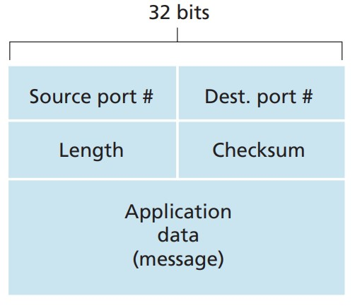

## UDP

UDP 是一种简洁、轻量级的传输协议，只提供最基本的通讯服务。UDP 定义于 [RFC 768]，其功能与传输协议差不多。除了多路复用/解复用功能和一些轻微的错误检查功能外，它没有为 IP 增加任何功能。也就是说，如果一个应用程序开发人员选择 UDP 而不是 TCP 作为传输协议的话，那么该应用程序几乎可以被认为是在直接与 IP 对话而没有任何其他的包装。

UDP 是无连接的，因此在两个进程开始通信之前不需要提前握手。因此，当应用程序通过 UDP 而不是 TCP 运行时，专用于这些特定应用程序的服务器通常可以支持更多的在线客户端。

UDP 提供的是一种不可靠的数据传输服务，也就是说：

- 当一个进程向 UDP 套接字发送信息时，UDP 无法保证该信息会到达接收进程。
- 到达接收进程的报文可能不按顺序到达。

UDP 协议中没有相关的拥塞控制机制，因此 UDP 的发送端理论上可以以任何速度向下层（网络层）发送数据。但要注意的是，由于中间链路的传输能力有限或拥塞，实际的端到端吞吐量可能小于这个速率。

使用例：DNS的请求，流媒体数据、在线游戏等一些不需要准确数据而需要传输效率的实时应用传输。

**UDP 网段结构**（如下图）：

**UDP校验和(checksum)**：
“UDP 校验和 checksum” 一般用于错误检测，以确定 UDP 网段内的传输比特是否在传输或存储在路由器内部时被更改。根据 UDP 网段结构图可知，校验和一般被放在 UDP 网段的头部，与所有数据一同传输。当需要校验时，将所有接收到的 16-bit 二进制数据和 checksum 相加，如果数据包中没有出现错误，那么总和就应该是16个1，即 111111111111111111；一旦出现了0，那么就表明数据包中出现了错误。

checksum 的构造方法比较简单，但是计算比较麻烦：将需要发送的 16-bit 二进制源数据两两相加，取从右往左数共十六位数，如果有多的位数就把该位数移到最低位再相加。如此反复将所有需要发送的数据相加完毕后对它作反码，即将这十六位数的1置0，0置1。具体的计算与校验的方法可以看[这一篇](UDP校验和.md)。

虽然UDP有提供这个校验，但是它实际上也没法对这些出了错的数据进行修复，它一般能够做的，要不然就直接将该错误网段销毁，要不然就加个警告然后继续传给应用。

---
