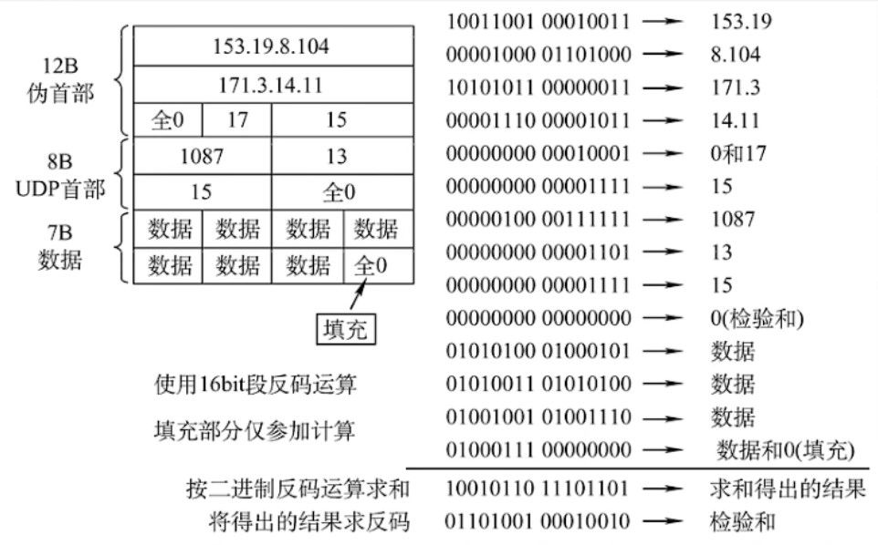

## 如何构造校验和checksum？

checksum 的构造方法比较简单，但是计算比较麻烦：将需要发送的 16-bit 二进制源数据两两相加，取从右往左数共十六位数，如果有多的位数就把该位数移到最低位再相加。如此反复将所有需要发送的数据相加完毕后对它作反码，即将这十六位数的1置0，0置1。

具体需要的数据以下列的表格作为例子：

|--|--|--|--|
| 发送端IP地址||||
| 接收端IP地址||||
| UDP协议对应数(17)|| UDP网段总长度||
| UDP源端口号|| UDP目的端口号||
|UDP网段总长度||**校验和数值(在这里设为0)**||
|数据|数据|数据|数据|
|数据|数据|数据|数据|
|数据|数据|数据|数据|
|数据|数据|数据|数据|
|......||||
|数据|数据|数据|(后置位补零，有需要就加，否则不加)|

计算方式类似于下图。在下图中 UDP 的长度是 15，其中由于 Data 的长度为 **15-8=7**, 因此需要*后置补零*：



代码如下： (使用javascript编译)

```javascript
function checksum(data) {
      let s = 0;
      for (let i = 0; i < data.length; i++) {
        s += data[i];
        s = (s & 0b1111111111111111) + (s >> 16);
      }
      return (~s & 0b1111111111111111);
    }

    let data = [
      0b0010010010011011, // 源地址
      0b1100110010010001, // 源地址
      0b1100000010101000, // 目的地址
      0b0000001010110010, // 目的地址
      0b0000000000010001, // 协议数
      0b0000000000100111, // UDP长度
      0b0001111101000000, // 源端口
      0b1110110010010010, // 目的端口
      0b0000000000100111, // UDP长度
      0b0000000000000000, // 校验和(置零)
      0b0000001000111100, // 数据
      0b0001111100001000, // 数据
      0b0001100101010011, // 数据
      0b0001000000000000, // 数据
      0b0000000000000000, // 数据
      0b0000000000000000, // 数据
      0b0000000000000000, // 数据
      0b1001001110101001, // 数据
      0b1110111000001110, // 数据
      0b0101111101011100, // 数据
      0b1010110100011100, // 数据
      0b0101011111101101, // 数据
      0b1100000001100011, // 数据
      0b1011000001110110, // 数据
      0b1011101000001100, // 数据
      0b0000001100000000, // 数据
    ];

    console.log("checksum: ",checksum(data).toString(2));
```

## 如何对传入的UDP进行校验？

如果需要对传入的UDP进行校验，那么同理，将需要发送的 16-bit 二进制源数据两两相加，取从右往左数共十六位数，如果有多的位数就把该位数移到最低位再相加。如此反复将所有需要发送的数据相加完毕。若总和就是16个1，即 111111111111111111， 那么就可以认为该UDP包没有出错，否则认为有错误。

具体需要的数据以下列的表格作为例子：

|--|--|--|--|
| 发送端IP地址||||
| 接收端IP地址||||
| UDP协议对应数(17)|| UDP网段总长度||
| UDP源端口号|| UDP目的端口号||
|UDP网段总长度||**校验和数值(在这里为传入的校验和)**||
|数据|数据|数据|数据|
|数据|数据|数据|数据|
|数据|数据|数据|数据|
|数据|数据|数据|数据|
|......||||
|数据|数据|数据|(后置位补零，有需要就加，否则不加)|

计算代码如下：(使用JS编译)

```javascript
function checksum(data) {
      let s = 0;
      for (let i = 0; i < data.length; i++) {
        s += data[i];
        s = (s & 0b1111111111111111) + (s >> 16);
      }
      return s;
    }

    let data = [
      0b0010010010011011, // 源地址
      0b1100110010010001, // 源地址
      0b1100000010101000, // 目的地址
      0b0000001010110010, // 目的地址
      0b0000000000010001, // 协议数
      0b0000000000100111, // UDP长度
      0b0001111101000000, // 源端口
      0b1110110010010010, // 目的端口
      0b0000000000100111, // UDP长度
      0b1101111111000001, // 校验和
      0b0000001000111100, // 数据
      0b0001111100001000, // 数据
      0b0001100101010011, // 数据
      0b0001000000000000, // 数据
      0b0000000000000000, // 数据
      0b0000000000000000, // 数据
      0b0000000000000000, // 数据
      0b1001001110101001, // 数据
      0b1110111000001110, // 数据
      0b0101111101011100, // 数据
      0b1010110100011100, // 数据
      0b0101011111101101, // 数据
      0b1100000001100011, // 数据
      0b1011000001110110, // 数据
      0b1011101000001100, // 数据
      0b0000001100000000, // 数据
    ];

    console.log("data: ",checksum(data).toString(2));
```
