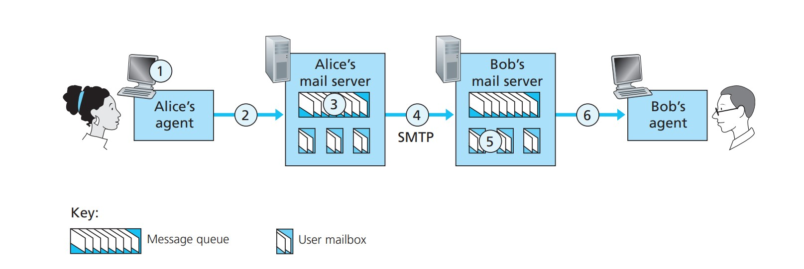
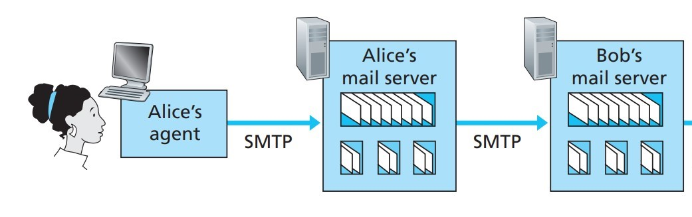
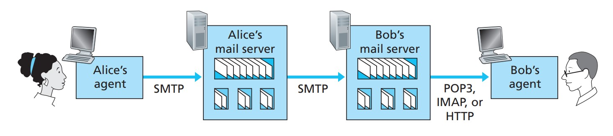

## 介绍

**SMTP(Simple Mail Transfer Protocol, 简单邮件传输协议)** 是一种提供可靠且有效的电子邮件传输的协议，主要用于系统之间的邮件信息传递，并提供有关来信的通知。

## 基本操作

为了说明 SMTP 的基本操作，让我们来假设一个常见的场景。假设 Alice 想要给 Bob 发送一条简单的 ASCII 消息：

1. Alice 调用其电子邮件用户代理，编写邮件，在提供 Bob 的电子邮件地址 (例如<bob@someschool.edu>) 后指示该用户代理发送邮件;
2. Alice 的用户代理将信息发送到她的邮件服务器，该信息会被放入邮件服务器的信息队列中;
3. 在 Alice 的邮件服务器上运行的 SMTP 客户端会发现被提交到该信息队列中的信息。于是这个 SMTP 客户端在找到收件人 Bob 的邮件地址后，尝试与运行在收件人 Bob 邮件服务器上的 SMTP 服务器建立 TCP 连接;
4. 经过一些初始 SMTP 握手后，SMTP 客户端通过 TCP 连接将 Alice 的邮件发送到 Bob 的邮件服务器上;
5. Bob 的 SMTP 服务器端接收到该信息后，邮件服务器会将信息放入 Bob 的邮箱;
6. 最后当 Bob 调用他的用户代理时，他便可以在任意时间阅读邮件了。

整个过程如下图所示：

总言之，在以上的操作中，SMTP 协议将邮件从 Alice 的邮件服务器发送到 Bob 的邮件服务器后，邮件就会被放入 Bob 的邮箱。

在以上的操作与讨论中，我们默认鲍勃是会通过登录服务器主机，然后执行在该主机上运行的邮件阅读器来阅读邮件的。直到 20 世纪 90 年代初，这还是标准的操作方式。

但如今，我们都使用客户端-服务器架构对邮件进行访问：用户们都通过在用户终端系统（如办公室个人电脑、笔记本电脑或智能手机）上执行的客户端，也就是用户代理，来间接阅读电子邮件了。

鉴于收件人在本地 PC 上执行用户代理，我们自然也可以考虑在其本地 PC 上安装邮件服务器。当我们采用这种方法时，发件人的邮件服务器将直接与收件人的个人电脑对话。但是，这种方法存在一个问题：

由于这些用于管理邮箱的邮件服务器运行在 SMTP 的客户端和服务器端，如果收件人的邮件服务器位于他的本地电脑上，那么他的电脑就必须**始终保持开机状态，并时刻与互联网连接**，以便接收随时可能到达的新邮件。很明显这对许多互联网用户来说是不切实际的。

因此取而代之的是，一个用户在本地 PC 上运行一个用户代理以访问自己的邮箱，但该邮箱不再被放在一个单独的服务器里，而是被放在了一个*永远在线的共享邮件服务器*上。该邮件服务器与其他用户共享，通常由用户的 ISP（如大学或公司）进行维护。

现在，让我们重新思考一下电子邮件从 发件人Alice 发送到 收件人 Bob 的路径：

从之前的讨论中我们了解到，在这条路径上的某个时间节点上，电子邮件需要存入鲍勃的邮件服务器。要做到这一点，只需让 Alice 的用户代理将信息直接发送到 Bob 的邮件服务器即可。毕竟事实上，**SMTP 就是为将电子邮件从一台主机推送到另一台主机而设计的**。

不过，发件人的用户代理通常不会直接与收件人的邮件服务器进行对话。相反，如 **下图** 所示，Alice 的用户代理使用 SMTP 将电子邮件推送到她的邮件服务器，然后 Alice 的邮件服务器作为 SMTP 客户端，使用 SMTP 以尝试将电子邮件转发到 Bob 的邮件服务器。

为什么要分两步走？因为如果不通过 Alice 的邮件服务器进行中继，Alice 的用户代理是无法直接将邮件送达收件人 Bob 的邮件服务器的。通过首先让 Alice 将邮件存入自己的邮件服务器再进行邮件的发送，Alice 的邮件服务器就可以作为客户端反复尝试将邮件发送到 Bob 的邮件服务器，比如以每 30 分钟一次的时间间隔发送，直到 Bob 的邮件服务器可以正常运行并接收该邮件为止。

但是，整个路径还缺少一个部分，像 Bob 这样在本地电脑上运行用户代理的收件人要如何获取自己的邮件呢？

我们需要引入一种特殊的邮件访问协议，将邮件从鲍勃的邮件服务器发送到他的本地电脑，才能够完成整条路经。目前有许多流行的邮件访问协议，包括 Post Office Protocol-Version 3 (POP3)、互联网邮件访问协议 (IMAP) 和 HTTP。

::: tip 为什么这里不能使用SMTP了?
用户代理无法使用 SMTP 获取邮件，因为获取邮件是一个“拉取（PULL）”的操作，而 SMTP 是一个“推送（PUSH）”协议，这使得 SMTP 协议无法了解自己所对应的邮件服务器是否收到了新的邮件，而只能将新的邮件推送到对应的邮件服务器。因此这里必须使用其他的邮件访问协议。
:::

整条路经就会变成下图这样：

在上图中， SMTP 用于将邮件从发件人的用户代理传送到发件人的邮件服务器，以及将邮件从发件人的邮件服务器传送到收件人的邮件服务器。而其他特殊的邮件访问协议（如 POP3）用于将邮件从收件人的邮件服务器拉取到收件人的用户代理中。

## 参考书

"Computer Networking:A Top-Down Approach" (James F. Kurose and Keith W. Ross, Seventh Edition, 2017)
