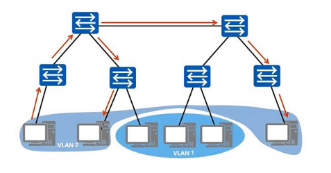
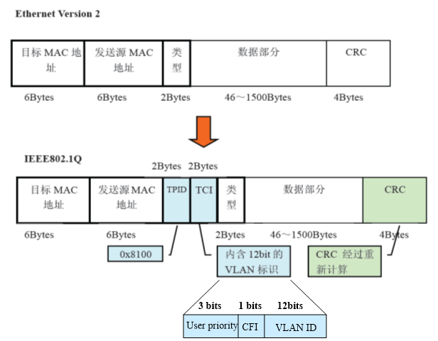
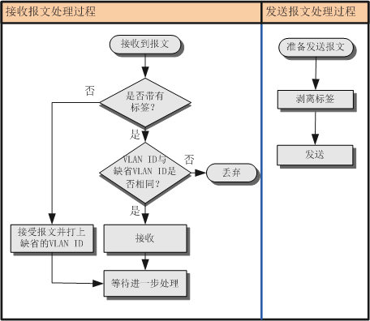
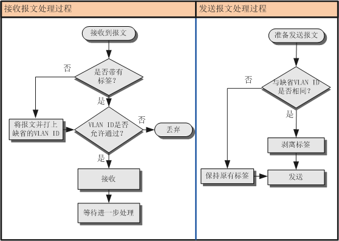
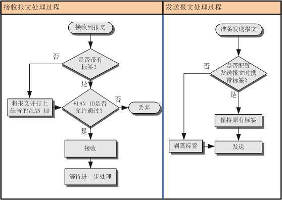
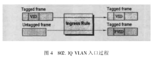

## 五、关于VLAN（3.1-3.3）

### 1、概念（3.1）

VLAN（Virtual Local Area Network）即虚拟局域网，是将一个物理的LAN（局域网）在逻辑上划分成多个广播域的通信技术。VLAN内的主机间可以直接通信，而VLAN间不能直接通信，从而将广播报文限制在一个VLAN内。

换句话说，即使是不同交换机下所属的设备，只要存在于同一个VLAN中，也可以实现在进行设备间通信的同时不产生除有效流量外的垃圾流量的效果。可以优化网络性能，区分相关业务，以及拥有安全性。

### 2、VLAN标签（重要）（3.1）

为了使设备能够通过分辨不同VLAN下所传输数据的报文，实现分辨该数据广播位置的功能，我们需要在报文中添加标识VLAN信息的字段。由此出现了`VLAN 标签`（又称 VLAN Tag，简称Tag）

IEEE 802.1Q协议中对VLAN标签做出了如下规定：

> 在以太网数据帧的目标MAC地址和发送源MAC地址字段之后、协议类型字段之前加入4个字节的VLAN标签（又称 VLAN Tag，简称Tag），用以标识VLAN信息。

具体操作流程如下图：

在图中存在着上下两种以太网数据帧格式，分别为：

- 无标记帧（Untagged帧）：原始的、未加入4字节VLAN标签的帧。如上图上半部分。

- 有标记帧（Tagged帧）：加入了4字节VLAN标签的帧。如上图下半部分。

### 3、VLAN标签的结构（重要）（3.1）

#### I、 TPID (Tag Protocol Identifier，标签协议标识)

TPID包含了一个**固定的值**0x8100，表明这是一个加了802.1Q标签的帧，是一个标识符。

#### II、 TCI (Tag Control Information，标记控制信息)

TCI是包含的是这个数据帧的相关控制信息。它包含了下面的一些元素：

##### ①、User Priority

用于定义这个帧的优先级，共有8个优先级别，<u>最小为0，最大为7</u>，其中0为缺省值（默认值）。IEEE 802.1P 为3比特的用户优先级位定义了操作。

以下是各个优先级的常用位置，可供参考：

> 最高优先级7一般应用于关键性网络流量，如路由选择信息协议（RIP）和开放最短路径优先（OSPF）协议的路由表更新。优先级6和5主要用于延迟敏感（delay-sensitive）应用程序，如交互式视频和语音。优先级4到1主要用于受控负载（controlled-load）应用程序，如流式多媒体（streaming multimedia）和关键性业务流量（business-critical traffic）。

##### ②、CFI(Canonical Format Indicator，规范格式指示器)

CFI指的是规范格式指示器。CFI值为0说明是规范格式，1为非规范格式。它被用在令牌环/源路由FDDI介质访问方法中来指示封装帧中所带地址的比特次序信息。

##### ③、 VLAN ID（VLAN Identifier，VLAN 识别字段，有时简写为 VID）

VLAN ID是对 VLAN 的识别字段，在标准 802.1Q 中常被使用。该字段为12-bit，支持4096个(也就是2的12次方个) VLAN 的识别。在4096个可能的VID 中，<u>VID＝0 用于识别帧优先级</u>。 <u>4095(FFF)作为预留值</u>，所以有效的VLAN ID范围一般为**1-4094**。其中1为缺省值（默认值）。

### 4、以太网链路与VLAN端口（3.2-3.3）

#### I、概念（3.2）^[ [网工必备技术，VLAN端口类型详解——知乎专栏](https://zhuanlan.zhihu.com/p/356170682) ]

已知不同 VLAN 间的主机是不能直接通信的，但是通过设备上的 **`VLAN端口`** ，以及设备之间的 **`以太网链路`** ，我们可以实现 VLAN之间的三层互通（三层：指网络层，具体参考第四节“关于TCP/IP的五层模型” ）。

但是说是这么说，VLAN 端口实际上是一种虚拟接口。它并不是作为物理实体存在于设备上，而是以虚拟形式存在于TCP/IP网络协议模型中的第三层——网络层中。每个VLAN都会对应一个VLAN端口，因此VLAN可以基于端口进行划分，也就是按照设备端口来定义VLAN成员。将指定端口加入到指定VLAN中之后，VLAN端口的IP地址便可作为本VLAN内网络设备的网关地址，且端口就可以对需要跨网段的报文进行基于IP地址的三层转发的相关操作。

而以太网链路比较简单，可以理解为链接两个设备节点的线路。

#### II、链路类型（3.2）

在VLAN中，以太网链路可以被分为两种链路类型，分别为 Access 链路 和 Trunk 链路。

##### ①、接入链路（Access Link）

连接用户主机和交换机的链路称为接入链路。接入链路上通过的帧大部分为不带Tag的VLAN帧，也有少部分带Tag的Vlan帧存在于该链路上。

##### ②、干道链路（Trunk Link）

连接交换机和交换机的链路称为干道链路。干道链路上通过的帧一般为带Tag的VLAN帧。

#### III、端口类型（3.2）^[ [VLAN接口类型_ShaShark0的博客-CSDN博客](https://blog.csdn.net/u011083888/article/details/115679480) ]

VLAN一共有三种接入端口类型，分别为：Access 端口，Trunk 端口，以及Hybrid 端口。

##### ①、Access 端口

- 概念：Access端口是交换机上用来连接用户主机的端口，它只能连接接入链路，并且只能允许唯一的VLAN ID通过本端口。

- 用途：用于和不能识别Tag 的用户终端相连，或者不需要区分不同VLAN成员时使用。常见于用户设备与交换机连接时双方所用端口。

- Access端口收发数据帧的规则如下：(端口所在对象主体为交换机，针对交换机与用户设备之间的交互)
  
  1. 在**接收数据帧**时：

     如果该端口收到对端设备发送的帧是不带VLAN标签的帧（untagged），交换机将强制加上该端口的PVID (Port Default VLAN ID, 也就是缺省VLAN)。

     如果该端口收到对端设备发送的帧是带VLAN标签的帧（tagged），交换机会检查该标签内的VLAN ID：当VLAN ID与该端口的PVID相同时，则接收该报文；当VLAN ID与该端口的PVID不同时，则丢弃该报文。
  
  2. 在**发送数据帧**时：

     先剥离帧的Tag，然后再发送。Access端口发往对端设备的以太网帧永远是不带标签的帧。

     

##### ②、Trunk 端口

- 概念：是交换机上用来连接其他交换机的端口，它只能连接主干链路（中继链路）。它允许多个 VLAN帧 带 Tag 通过，但只允许一个 VLAN 的帧从该类接口上发出时不带Tag（即剥离Tag），这个 VLAN 即为 缺省VLAN （PVID）。

- 用途：用于和其他的交换机相连。

- Trunk 端口收发数据帧的规则如下：(端口所在对象主体为交换机，针对交换机与交换机之间的交互)
  
  1. 在**接收数据帧**时：

     当接收到对端设备发送的不带Tag的数据帧时，会添加该端口的PVID，如果PVID在允许通过的VLAN ID列表中，则接收该报文，否则丢弃该报文；

     当接收到对端设备发送的带Tag的数据帧时，检查VLAN ID是否在允许通过的VLAN ID列表中。如果VLAN ID在接口允许通过的VLAN ID列表中，则接收该报文。否则丢弃该报文。
  
  2. 在**发送数据帧**时：

     当VLAN ID与端口的PVID相同，且是该端口允许通过的VLAN ID时，去掉Tag，发送该报文；

     当VLAN ID与端口的PVID不同，且是该端口允许通过的VLAN ID时，保持原有Tag，发送该报文。

     

##### ③、Hybrid 端口

- 概念：是既可以用来连接其他交换机也可以用来连接用户主机的端口。它既能连接主干链路（中继链路）也可以链接接入链路。它允许多个 VLAN帧 带 Tag 通过，且允许通过配置的方式配置 VLAN 的帧从该类接口上发出时是否带Tag。

- 用途：用于和其他的交换机相连或用户终端相连皆可。

- Trunk 端口收发数据帧的规则如下：(端口所在对象主体为交换机，针对交换机与交换机之间，交换机与用户设备之间的交互)
  
  1. 在**接收数据帧**时：

     当接收到对端设备发送的不带Tag的数据帧时，会添加该端口的PVID，如果PVID在允许通过的VLAN ID列表中，则接收该报文，否则丢弃该报文；

     当接收到对端设备发送的带Tag的数据帧时，检查VLAN ID是否在允许通过的VLAN ID列表中。如果VLAN ID在接口允许通过的VLAN ID列表中，则接收该报文。否则丢弃该报文。
  
  2. 在**发送数据帧**时：

     首先检查该接口是否允许此VLAN-ID数据帧通过。如果允许通过，则可以通过命令，配置这个数据帧在发送时是否携带Tag：

     - 配置 port hybrid tagged vlan vlan-id 命令后，接口发送该vlan-id的数据帧时，不剥离帧中的VLAN Tag，直接发送。该命令一般配置在连接交换机的端口上。

     - 配置 port hybrid untagged vlan vlan-id 命令后，接口在发送vlan-id的数据帧时，会将帧中的VLAN Tag剥离掉再发送出去。该命令一般配置在连接主机的端口上。

     

##### TIPS: 缺省VLAN(PVID) (3.3) ^[ [李德水. “基于IEEE 802．1Q帧标记的VLAN实现原理.” (2006)](http://www.doc88.com/p-793921426875.html) ]

概念：交换机的每一个端口都有一个VID作为该端口的默认VID,这就是PVID(Port VID, 也称为缺省VLAN), 当交换机所接受的数据帧（报文）是 untagged 帧，则交换机会将这个报文添加上PVID进行标记。换言之，它一般会被分配到未标记帧和优先级帧中。

- 对于Access接口，缺省VLAN就是它允许通过的VLAN，修改缺省VLAN即可更改接口允许通过的VLAN。

- 对于Trunk接口，一个接口可以允许多个VLAN通过，但是只能有一个缺省VLAN。接口的缺省VLAN和允许通过的VLAN需要分别配置，但两种VLAN互不影响。
