这篇博客我们将系统介绍有关在**传输层**中实现可靠数据传输 (Reliable Data Transfer) 的原理, 包括 rdt 的各个系列协议，在 rdt3.0 协议的基础上讨论停等协议与流水线协议的区别，并介绍两种流水线协议：GBN 协议与SR协议。

## 从传输层开始

传输层的主要功能是提供端到端的数据传输服务，例如 TCP 协议提供了可靠的、面向连接的数据传输服务。TCP使用序列号、确认应答、重传等机制来确保数据的可靠传输。因此，从**抽象角度**来看，我们可以将传输层之间的特定通讯视为提供了一种相对可靠的通信机制。

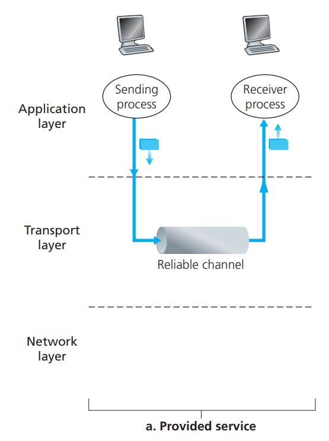

但是在其他层中，例如网络层（IP协议）、链路层（以太网协议等）和物理层这些负责数据包在网络中的传输和转发，以及在物理媒介上传输比特流的层中，它们所面对的通信信道**可能受到各种干扰和不确定性**，如数据包丢失、损坏、重复、延迟等，因此通常被认为是不可靠的。

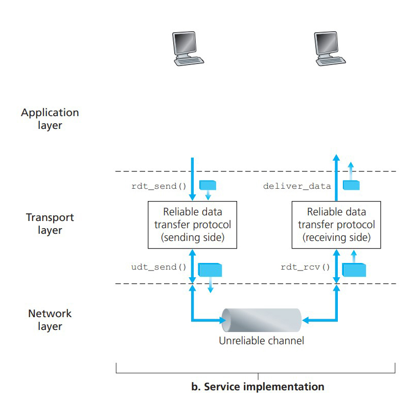

因此，从抽象的角度来看，传输层提供了一种相对可靠的通信机制，而它下面的网络层、链路层和物理层所提供的通信信道则被认为是不可靠的。换句话说，传输层需要向上层传递可靠信息，但是他的下层是不可靠的，这也就是传输层需要实现可靠数据传输的原因。

## 如何实现可靠数据传输？

从这一小节开始，我们会渐进式地开发可靠数据传输协议 (rdt) 的发送方与接收方。并遵从以下几点要求：

- 只考虑“所有数据包都是从发送方流向接收方”的单向数据传输（因为双向传输本质上是两个单向数据传输问题的综合）
-使用有限状态机（FSM）描述发送方与接收方 (如下图)
    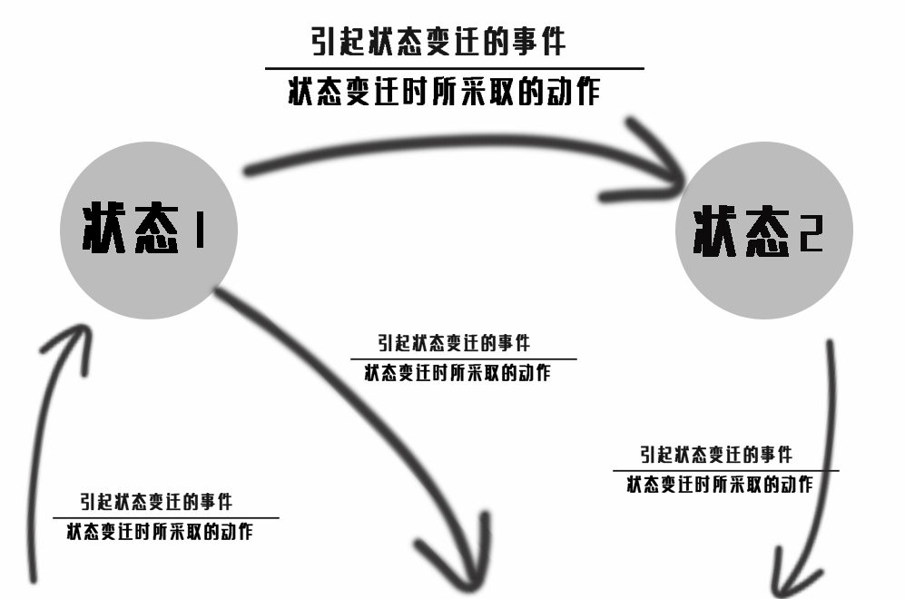

### 循序渐进一、先假设传输层的下层是可靠的（rdt1.0）

我们首先考虑最简单的情况，即底层信道完全可靠，所有发送的数据都是按顺序，不会出现传输丢失的情况。这使得我们能够创建的协议本身并不复杂，我们称之为 **rdt1.0**。

rdt1.0 发送方和接收方的有限状态机（FSM）定义如图所示：

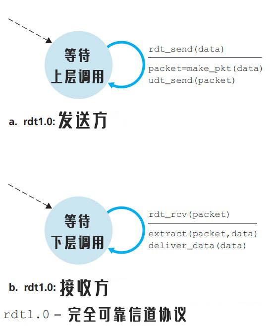

在这个图中：

- rdt 的发送端只需通过 rdt_send(data) 事件**接受**来自上层的数据，通过 make_pkt(data) 操作**创建**一个包含 data 的数据包，然后将数据包**发送**到下层的信道中，就可以了。实际上，rdt_send(data) 事件是上层协议按照内置的步骤调用函数（例如 rdt_send()）的结果；
-而在接收端，rdt 只需通过 rdt_rcv(packet) 事件从底层通道**接收**数据包，从数据包中**解析**出数据（通过操作 extract (packet, data)），并将数据**上传**到上层（通过操作 deliver_data(data)），就可以了。实际上，rdt_rcv(packet) 事件是下层协议按照内置的步骤调用函数（例如调用 rdt_rcv()）的结果。

在 **rdt1.0** 这个简单的协议中，因为有了完全可靠的信道，接收方就没有必要向发送方提供任何反馈。

### 循序渐进二、然后假设传输层的下层开始不可靠了（rdt2.0）

然后我们考虑传输层开始不可靠了的情况，例如**发送端所传输的数据包中的比特出现了可能被损坏的情况**。这种比特错误通常发生在数据包传输、传播或缓冲时的网络物理组件中， 例如在网线中、物理传输硬件中等等。当然我们暂且继续假设所有传输的数据包都能按照发送的顺序被接收。现在的协议会比之前的 rdt1.0 稍微复杂一点，我们称其为 **rdt2.0**。

那么在该协议中，发送端为了了解接收端是否准确地接收相关传输数据，通常会同时使用 ACK（"OK"）和 NAK（"请重复一遍"）两个语句来进行数据的确认。

::: tip 英语时间
 ACK 代表 acknowledgement (了解)， NAK 代表 nagtive acknowledgement (不了解)
:::

通过这些控制信息，接收方可以让发送方知道哪些信息已被正确接收，哪些信息接收有误，而需要重复发送。

::: info ARQ（自动重复请求）协议
    在计算机网络环境中，基于自动确认"控制信息"以判断是否重传的可靠数据传输协议被称为 ARQ（自动重复请求）协议。
:::

因此在该协议中，需要有以下三个功能：

- 错误检测
- 接收端反馈
- 发送端重传

rdt2.0 发送方和接收方的有限状态机（FSM）定义如下列图所示：

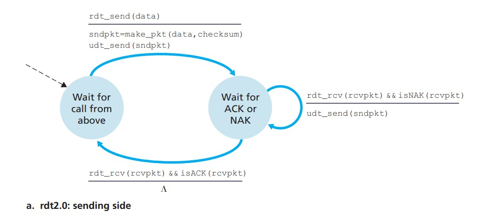

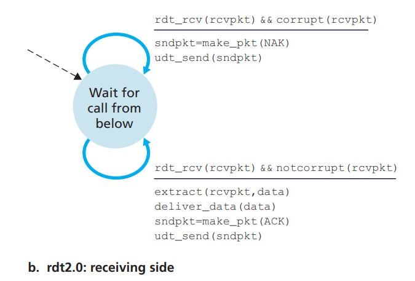

rdt2.0 的发送端有两种状态:

在*最左边的状态*下，发送端协议正在等待上层向下传递数据。当 rdt_send(data) 事件发生时，发送方将创建一个数据包（sndpkt），其中包含要发送的数据以及数据包校验和（它的生成方法与[这里](./UDP校验和.md)所讨论的checksum类似），然后通过 udt_send(sndpkt) 操作发送该数据包。之后发送端协议就进入到了最右边的状态。

在*最右边的状态*中，发送方协议正在等待接收方的 ACK 或 NAK 数据包：

- 如果收到 ACK 数据包（图中的判断语句 *rdt_rcv(rcvpkt) && isACK (rcvpkt)* 与此事件相对应），发送方就知道最近发送的数据包已被正确接收，因此协议返回到等待上层数据的状态。

- 如果收到 NAK，协议会重传最后一个数据包，并继续等待接收方返回 ACK 或 NAK 以回应是否重传数据包，还是进入最左边的状态。

值得注意的是，当发送方处于等待 ACK 或 NAK 状态时，它无法从上层获取更多数据；也就是说，rdt_send() 事件不会发生；只有当发送方收到 ACK 并离开该状态后，才会发生该事件。也就是说，发送方只有在确定接收方已经正确接收当前数据包后，才会继续向上层获取并发送更多的新数据。由于这种行为在rdt2.0以上的协议里都会出现，因此rdt2.0 以上的协议也被称为**停止-等待协议**。

### 循序渐进三、传输层的下层更不可靠了（rdt2.1）

然后我们考虑传输层更不可靠的情况，例如不止发送端所传出的数据包，**ACK 或 NAK 数据包也出现了可能被损坏的情况**。当然我们暂且继续假设所有传输的数据包都能按照发送的顺序被接收。现在的协议会比之前的 rdt2.0 稍微复杂一点，我们称其为 **rdt2.1**。

由于 ACK 或 NAK 数据包也出现了可能被损坏的情况，因此假设发送端所发送的信息是正确的，但是接收端所返回的 ACK 发生了损坏的情况，那么作为一个收到了未知包的发送端，就会进入“不清楚数据包是否正确发送”的迷惑期。

如果发送端自己假设接收端没有正确接收到数据，发送端就会尝试重传，那么可能会出现接收端就会接收到多个相同的包；如果发送端自己假设接收端已经正确接收到数据，发送端就不会会尝试重传，那么可能会出现接收端一直在等待重传的情况。

于是我们需要在每个由发送端所发送的数据包上加一个用于表示发送顺序的序列号。而在接收端那边，就只需要再加一条对序列号的校验：在**接收端发出 ACK** 后，如果下一个收到的新数据包与之前所收到的数据包**序号一样**，那么接收端**判定为发送端重传**，发与*之前数据包序号关联*的 ACK；如果下一个收到的新数据包与之前所收到的数据包**序号不一致**，则接收端判**定为发送端发送了新的数据包**，发与*现在数据包序号关联*的 ACK。

::: tip 用于表示发送顺序的序列号要多少个才合适？
两个序列号(0, 1)就够用: 因为rdt采用的是**停止-等待协议**，因此接收方只需知道发送方正在重传前一个发送的分组，还是一个新的分组。因此总的分组数量为双方都只知道的新的1个和前1个共2个分组。
:::

rdt2.1 发送方和接收方的有限状态机（FSM）定义如下列图所示：

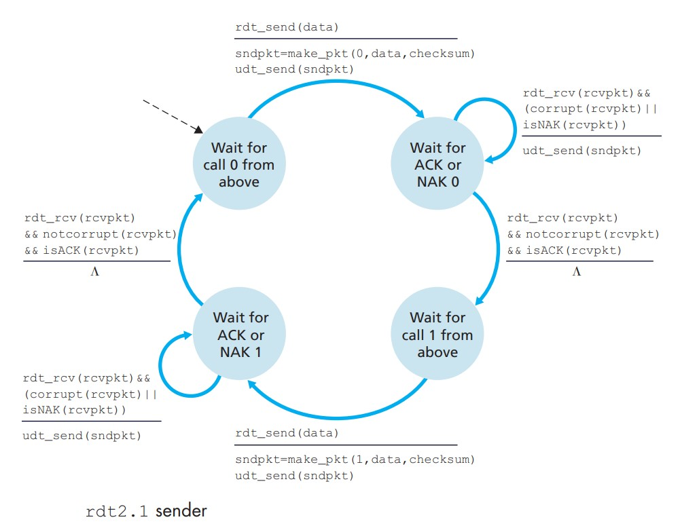

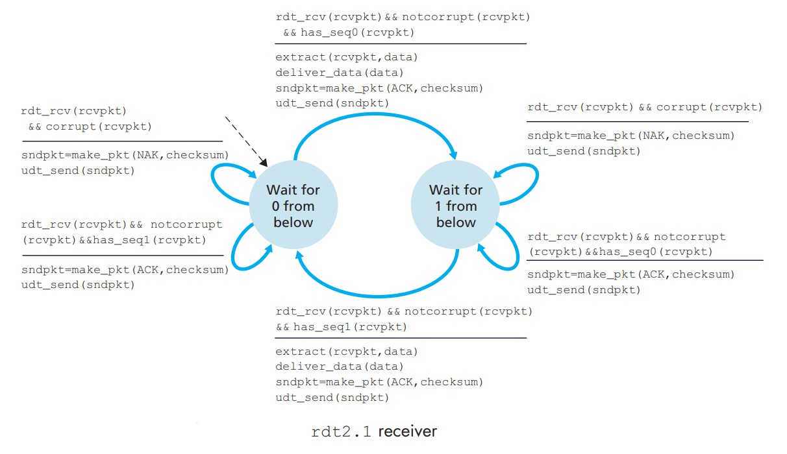

对于发送端：

- “wait for call 0 from above”的状态：收到数据后，将0和数据（带有校验和）打包发送，然后进入到“wait for ACK or NAK 0”的状态。

- “wait for ACK or NAK 0”的状态：收到来自接收方的数据后，若*数据检验出错了或者是 NAK*，则重传序号为0的数据；若*检验没有出错且为ACK*，则直接进入到“wait for call 1 from above”的状态。

- “wait for call 1 from above”的状态：收到数据后，将1和数据（带有校验和）打包发送，然后进入到“wait for ACK or NAK 1”的状态。

- “wait for ACK or NAK 1”的状态：收到来自接收方的数据后，若*数据检验出错了或者是 NAK*，则重传序号为1的数据；若*检验没有出错且为ACK*，则直接进入到“wait for call 0 from above”的状态。

对于接收端：

- “wait for 0 from below”的状态：收到数据后，若*检验没有出错且序号为0*，则拆包并且对所接收的分组发送 ACK（序号为0），进入到“wait for 1 from below”的状态；若*检验出错了*，则对上次接收的分组发送NAK（序号为1）；若*检验没有出错但是序号为1*，则对上次接收的分组发送 ACK（序号为1），以便发送方进入下一个状态实现双方的同步。

- “wait for 1 from below”的状态：收到数据后，若*检验没有出错且序号为1*，则拆包并且对所接收的分组发送 ACK（序号为1），进入到“wait for 0 from below”的状态；若*检验出错了*，则对上次接收的分组发送NAK（序号为0）；若*检验没有出错但是序号为0*，则对上次接收的分组发送 ACK（序号为0），以便发送方进入下一个状态实现双方的同步。

### 循序渐进四、能不能稍微简化下？（rdt2.2）

虽然现在还是与rdt2.1一样糟心的情况，不止发送端所传出的数据包，**ACK 或 NAK 数据包也出现了可能被损坏的情况**。当然我们暂且继续假设所有传输的数据包都能按照发送的顺序被接收。

但是我们会想：
>"发这么多 ACK 0/NAK 0/ACK 1/NAK 1/ACK 0/NAK 0/ACK 1/NAK 1好麻烦！就不能只用 ACK 表示吗？"
>
>"因为在现在这个情况下，作为一个接收端，无论是发送 NAK 1 还是发送 ACK 0 表示的是同一个意思。那么直接发送 ACK 不是比较简洁吗？"

于是现在的协议会比之前的 rdt2.1 稍微简化一点，我们称其为 **rdt2.2**。

rdt2.2 发送方和接收方的有限状态机（FSM）定义如下列图所示：

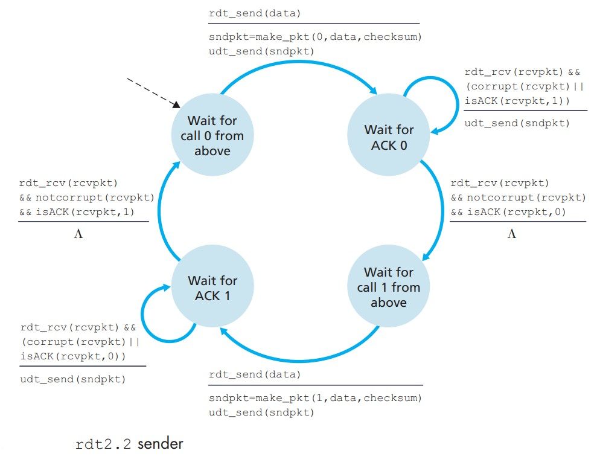

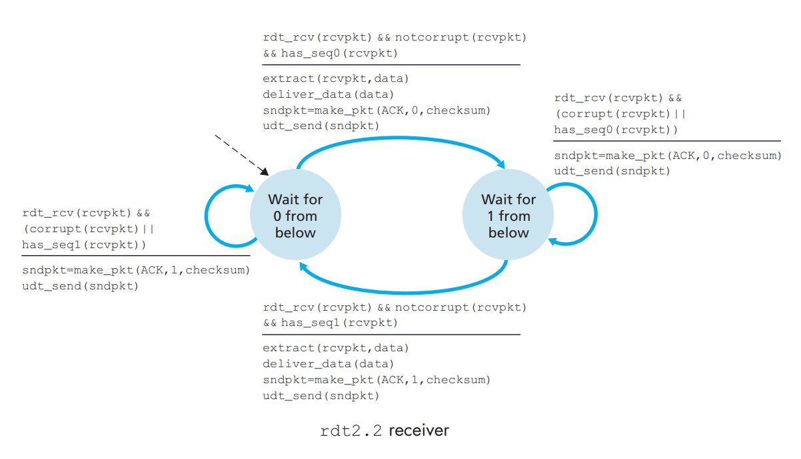

对于发送端：

- “wait for call 0 from above”的状态：收到数据后，将0和数据（带有校验和）打包发送，然后进入到“wait for ACK 0”的状态。

- “wait for ACK 0”的状态：收到来自接收方的数据后，若*数据检验出错了或者是 ACK 1*，则重传序号为0的数据；若*检验没有出错且为ACK 0*，则直接进入到“wait for call 1 from above”的状态。

- “wait for call 1 from above”的状态：收到数据后，将1和数据（带有校验和）打包发送，然后进入到“wait for ACK 1”的状态。

- “wait for ACK 1”的状态：收到来自接收方的数据后，若*数据检验出错了或者是 ACK 0*，则重传序号为1的数据；若*检验没有出错且为ACK*，则直接进入到“wait for call 0 from above”的状态。

对于接收端：

- “wait for 0 from below”的状态：收到数据后，若*检验没有出错且序号为0*，则拆包并且对所接收的分组发送 ACK 0，进入到“wait for 1 from below”的状态；若*检验出错或者序号为1*，则对上次接收的分组发送 ACK 1。

- “wait for 1 from below”的状态：收到数据后，若*检验没有出错且序号为1*，则拆包并且对所接收的分组发送 ACK 1，进入到“wait for 0 from below”的状态；若*检验出错或者序号为0*，则对上次接收的分组发送 ACK 0。

### 循序渐进五、最坏打算（rdt3.0）

然后我们考虑传输层最不可靠的情况，例如不止发送端所传出的数据包、ACK 或 NAK 数据包出现了可能被损坏的情况，还有**这些数据包在传输途中被丢失的情况**。这下我们无法继续假设所有传输的数据包都能按照发送的顺序被接收了，因此现在的协议明显会比之前的 rdt2.1、rdt2.2 复杂许多，我们称其为 **rdt3.0**。

在这种情况下，发送端就没法一直等待接收端所返回的数据包了，因为一旦数据包在传输途中丢失，发送端和接收端就都会进入“等待对方发送下一个数据包”的状态，从而导致死锁。因此我们需要在两端都加入一个定时器。这样当到达了一定的时间，发送端还没有接收到接收端的返回值时，它就会直接认定之前的数据包传输失败，从而重传之前的数据包。

rdt3.0 发送方和接收方的有限状态机（FSM）定义如下列图所示：

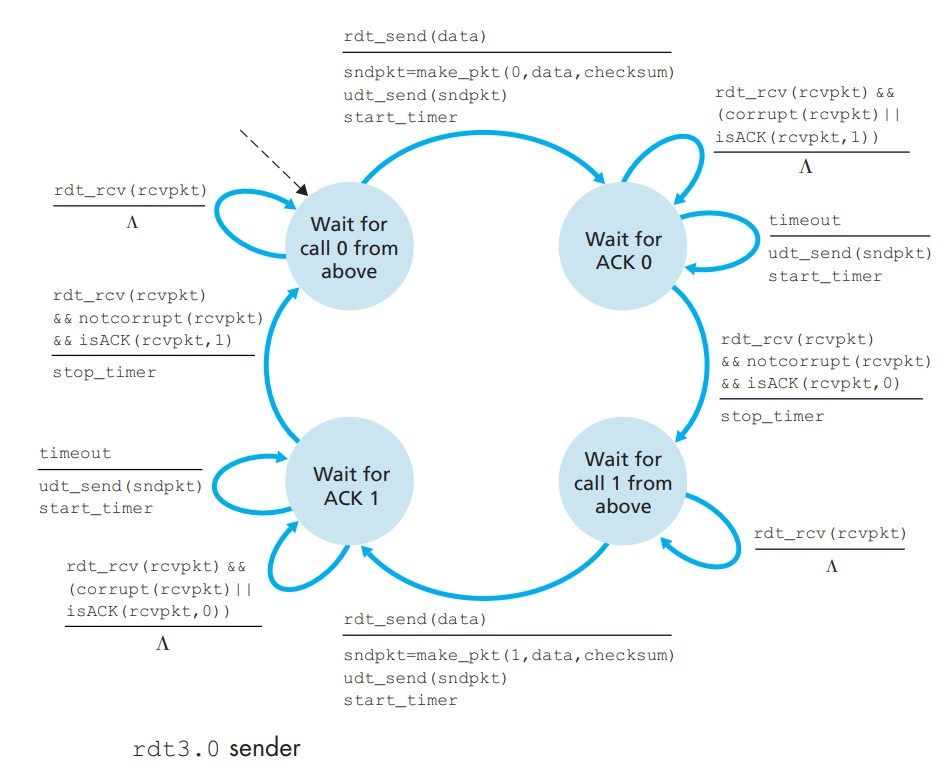

对于发送端：

- “wait for call 0 from above”的状态：收到数据后，将0和数据（带有校验和）打包发送，开启计时，然后进入到 “wait for ACK 0” 的状态；若收到来自接收方的数据，则不做处理;

- “wait for ACK 0”的状态：收到来自接收方的数据后，若*数据检验出错了或者是ACK 1*，则**不做任何处理，直接等待超时**（*因为定时器设置的时间一般都很短，因此直接等待超时可以简化操作*）；若*超时*，则**重新发送序号为0的数据，并重新计时**；若*检验没有出错且为ACK 0*，则**停止计时**，并进入到“wait for call 1 from above”的状态;

- “wait for call 1 from above”的状态：收到数据后，将1和数据（带有校验和）打包发送，开启计时，然后进入到“wait for ACK 1”的状态；若收到来自接收方的数据，则不做处理;

- “wait for ACK 1”的状态：收到来自接收方的数据后，若*数据检验出错了或者是ACK 0*，则**不做任何处理，直接等待超时**（与之前同理）；若*超时*，则**重新发送序号为1的数据，并重新计时**；若*检验没有出错且为ACK 1*，则**停止计时**，并进入到“wait for call 0 from above”的状态。

对于接收端(这里 rdt2.2 的相同)：

- “wait for 0 from below”的状态：收到数据后，若*检验没有出错且序号为0*，则**拆包并且对所接收的分组发送 ACK 0**，进入到“wait for 1 from below”的状态；若*检验出错或者序号为1*，则**对上次接收的分组发送 ACK 1**。

- “wait for 1 from below”的状态：收到数据后，若*检验没有出错且序号为1*，则**拆包并且对所接收的分组发送 ACK 1**，进入到“wait for 0 from below”的状态；若*检验出错或者序号为0*，则**对上次接收的分组发送 ACK 0**。

至此，rdt 应该算是完备了。在rdt 3.0 的加持下，我们可以通过该协议对抗传输数据分组的丢失与出错了。但是它有一个很大的问题：**在信道大小比较大的情况下，它的RTT也会比较大，这就会使得作为停等协议的rdt 3.0 的信道利用率很低。**

换句话说：它的运行效率太低了！

## 停等协议(Stop-and-wait)与流水线协议(pipelined sending)

根据之前我们所描述的相关定义： “发送方只有在确定接收方已经正确接收当前数据包后，才会继续向上层获取并发送更多的新数据。因此rdt2.0 以上的这种**一次只能够发送单个未经确认数据包，且在接收端未确认时，发送端需要停止等待的协议**也被称为**停止-等待协议**”，简称为“停等协议”。

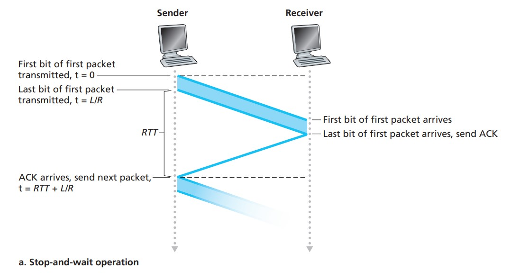

如果我们将需要传输的数据用抽象的表格列举成一行，那么在协议下，需要传输的数据就像是被框选出来一样; 而旧的数据传输成功，新的数据需要传输时，这个框选用的窗口就像是可滑动一般将新的数据框选入内。

所以我们一般也将传输层的协议称为**滑动窗口协议(slide window protocol)**, 并将发送端的滑动窗口称为*发送窗口(Sending Window)*, 接收端的滑动窗口称为*接收窗口(Receiving Window)*。

而当**滑动窗口协议** 的 **发送窗口(Sending Window)** 大小、发送端缓冲区的大小、**接收窗口(Receiving Window)** 大小、接收端缓冲区的大小都为一时，该协议就是我们之前所做的 **停止-等待协议**。

之前我们使用这种协议，原因有两点：

- **一**是因为我们之前无从得知所发送数据包的顺序，也就是序列号，所以必须要等待前一个传输完毕才可以传输后一个；
- **二**是在信道大小未知的情况下，我们假设信道大小为小信道，这就使得使用该协议时传输速度所带来的问题影响比较小。

但是从 rdt2.1 开始，我们已经实现了对所有数据包的序列号定义；在rdt3.0之后，我们也已经实现了在发送数据包时使用定时器识别是否重传了。那么换句话说我们已经可以在定时器所在时间内，*不那么*在意前一个数据包有没有发送成功了。那么在信道大小比较大的情况下，我们何不直接一次性发送多个的数据包呢？

于是与停等协议相对的，**流水线协议**就出现了。

我们定义： **一次能够发送多个未经确认数据包的协议**为**流水线协议**，或者称为管道化协议: pipelined sending protocol。在这种协议中，我们允许发送方在定时器时间内发送多个分组而无需等待确认。这样就可以缩短每个数据包间的发送时间，使得传输的效率提高了。

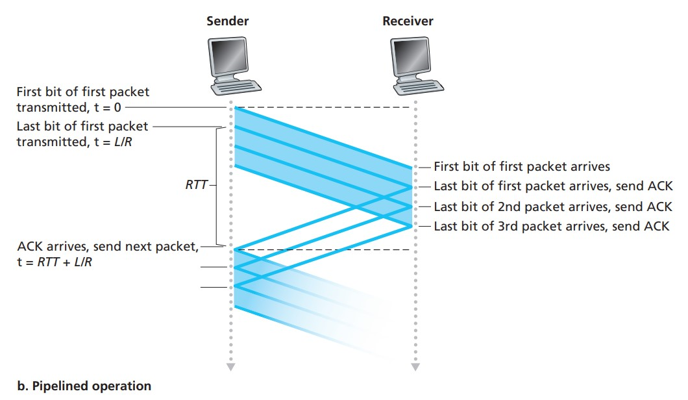

听起来很不错。为了实现流水线协议，我们需要在停等协议的基础上做一些相应的修改：

1. 必须增加序号范围，用多个比特来表示不同的序号。因为每个输送中的分组（不计算重传的）必须有一个唯一的序号，且也许有多个在输送中的未确认报文。
2. 协议的发送方和接收方两端也许不得不使用缓存以存储多个数据包分组。因为发送方需要缓冲那些已发送但没有收到确认的数据包分组，接收方或许也需要缓冲那些已正确接收但还未来得及发送确认/上发的数据包分组。
3. 当然，这一类型的协议所需序号范围和对缓冲的要求取决于这类数据传输协议如何处理丢失、损坏及延时过大的数据包分组。

简单的来说，我们需要将**发送端缓冲区**的大小与**接收端缓冲区**的大小进行扩张，让 **发送窗口(Sending Window)** 与 **接收窗口(Receiving Window)** 可以多框选一些数据，这样就可以让传输效率变高：

- 当**发送端缓冲区**大小扩张至大于一，**接收端缓冲区**大小依然等于一时，

    该协议就是：N步回退(Go-Back-N, GBN)协议

- 当**发送端缓冲区**与**接收端缓冲区**大小都扩张至大于一时，

     该协议就是：选择重传(Selective-Repeat, SR)协议

::: tip 如何通过发送窗口大小判断协议类型是流水线协议还是停等协议？
当 **发送窗口(Sending Window)** 大小可以**大于一**时，该协议就是**流水线协议**；

当**发送窗口(Sending Window)**大小只能**等于一**时，该协议就是**停等协议**。
:::

### 流水线协议一、N步回退(Go-Back-N, GBN)

如同前文所说：
> 当**发送端缓冲区**大小扩张至大于一，**接收端缓冲区**大小依然等于一时，
>
> 该协议就是：N步回退(Go-Back-N, GBN)协议

在这里做出完整定义：

**N步回退(Go-Back-N, GBN)协议**是一个基于滑动窗口的流水线协议。发送端维护一个大于一的滑动窗口，以同时对多个传输数据进行发送。

作为使用**累计确认**的协议，它允许发送方连续甚至同时发送多个数据包而不用先等待头一个数据包的确认后再发送下一数据包。但是如果发送方在一定时间内没有收到某个数据包的确认，那么它会认为该数据包丢失，然后重新发送该数据包以及其后所有的数据包。

我们这里以**意大利卡梅里诺大学**老师所创建的*交互网页*做例子：

::: info
网址：<https://computerscience.unicam.it/marcantoni/reti/applet/GoBackProtocol/goback.html>
:::

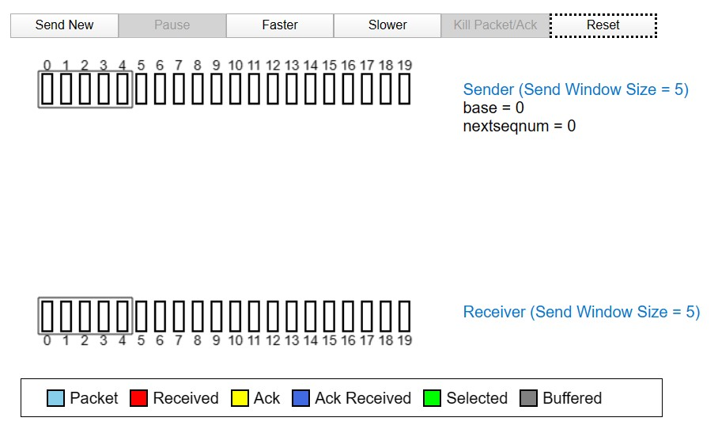

在此图中，上面一行是发送方，下面一行是接收方，我们可以看到一个灰色的矩形框在发送方的五个包上，这个矩形框就是GBN发送方的滑动窗口。

当发送端与接收端之间正常发送时：

当数据包在传输途中丢失：

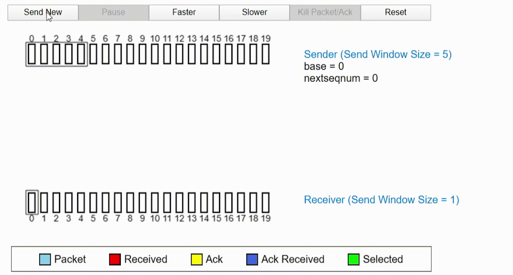

当发送过程中的2号数据包发生丢失时, 因为接收方在接收到数据包0，1后没有接收到数据包2, 于是后面发送的`ACK3`,`ACK4`全部变成了`ACK1`，这代表着接收端向发送端描述：“目前接收到的数据包序号最大值为1”。

经过一段时间后，发送端定时器确认超时且没有收到`ACK3`,`ACK4`，于是发送方将数据包2，3，4重新发送，直到接收方返回`ACK2`才会将滑动窗口从2移动至3。

当ACK在传输途中丢失：

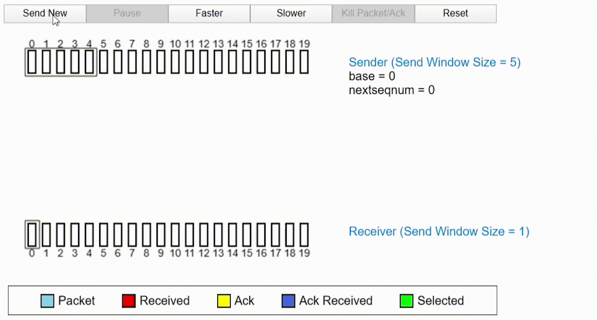

在此例中我们可以看到，当接收方接收到数据包后，向发送方返回`ACK0`,`ACK1`,`ACK2`,`ACK3`,`ACK4`。

当ACK2发生了丢失时，因为之后的ACK3,ACK4有被正常返回，这代表着接收端向发送端描述：“目前接收到的数据包序号最大值为4”，所以发送方可以判断接收方已经接收到“数据包序号最大值”前的所有数据包，便不再针对数据包2进行重复发送。

### 流水线协议二、选择性重传(Selective-Repeat, SR)

如同前文所说：
> 当**发送端缓冲区**与**接收端缓冲区**大小都扩张至大于一时，
>
> 该协议就是：选择性重传(Selective-Repeat, SR)协议

在这里同样做出完整定义：

**选择性重传(Selective-Repeat, SR)协议**是一个基于滑动窗口的流水线协议。发送端与接收端分别维护两个大于一的滑动窗口，以对传输数据进行发送与接收。

作为使用**选择性确认**的协议，它允许发送方连续甚至同时发送多个分组而不用先等待头一个分组的确认后再发送下一分组。但是如果发送方在一定时间内没有收到某个数据包的确认，那么它会认为该数据包丢失，然后**只**重新发送该数据包。

我们这里依然以**意大利卡梅里诺大学**老师所创建的*交互网页*做例子：

::: info
网址：<https://computerscience.unicam.it/marcantoni/reti/applet/SelectiveRepeatProtocol/selRepProt.html>
:::

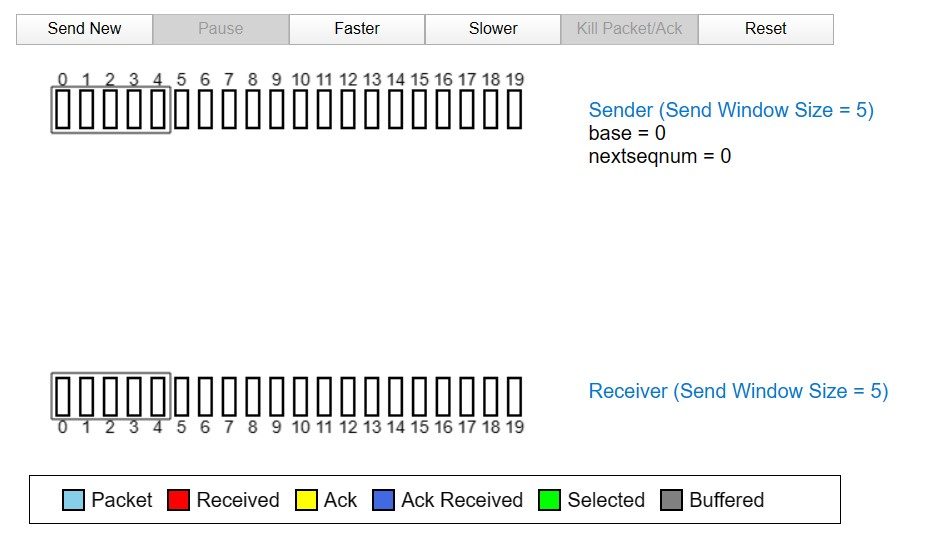

在此图中，上面一行是发送方，下面一行是接收方，我们可以看到一个灰色的矩形框在发送方的五个包上，这个矩形框就是SR发送方的滑动窗口; 一个灰色的矩形框同样在接收方的五个包上，这个矩形框就是SR接收方的滑动窗口。

当发送端与接收端之间正常发送时：

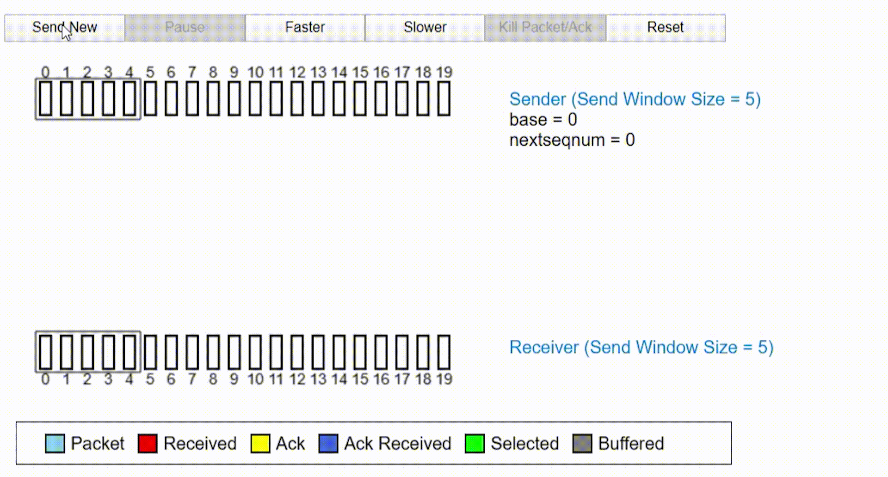

当数据包在传输途中丢失：

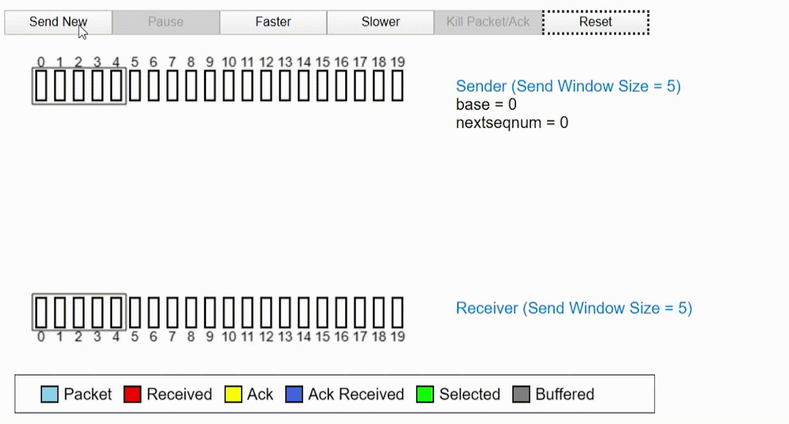

当发送过程中的2号数据包发生丢失时, 接收方在接收到数据包0，1后没有接收到数据包2, 但是依旧接收到了数据包3、数据包4，于是后面发送的`ACK3`,`ACK4`不变，这代表着接收端向发送端描述：“目前已接收到数据包3，4”。

经过一段时间后，发送端定时器确认超时且没有收到`ACK2`，于是发送方将数据包2重新发送，直到接收方返回`ACK2`才会将滑动窗口从2移动至目前序号所在最大值的后一位。

当ACK在传输途中丢失：

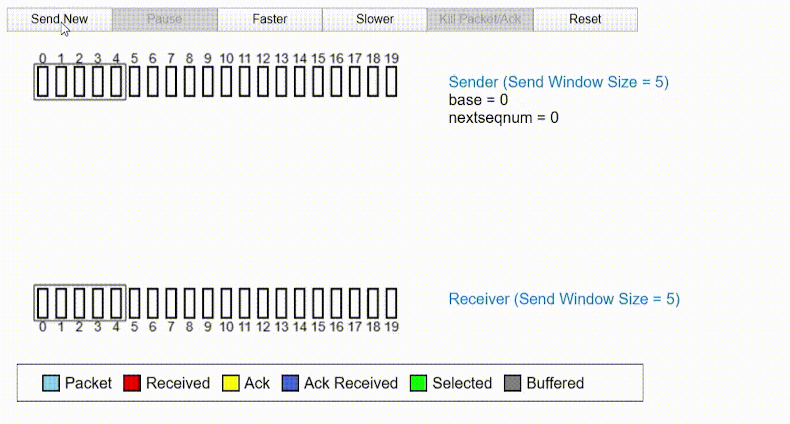

在此例中我们可以看到，当接收方接收到数据包后，向发送方返回`ACK0`,`ACK1`,`ACK2`,`ACK3`,`ACK4`。

当ACK2发生了丢失时，与传输途中相同的，因为之后的ACK3,ACK4有被正常返回，这代表着接收端向发送端描述：“目前已接收到数据包3，4”。所以发送方在定时器确认超时且没有收到`ACK2`后，将数据包2重新发送，直到接收方返回`ACK2`才会将滑动窗口从2移动至目前序号所在最大值的后一位。

## 参考

"Computer Networking:A Top-Down Approach" (James F. Kurose and Keith W. Ross, Seventh Edition, 2017);

[【精选】rdt（可靠数据传输）_花无凋零之时的博客-CSDN博客](https://blog.csdn.net/weixin_55267022/article/details/115200288)

[【动图讲解】计算机网络之回退N步与选择重传_回退n步和选择重传的区别-CSDN博客](https://blog.csdn.net/qq_44807642/article/details/103054914)
