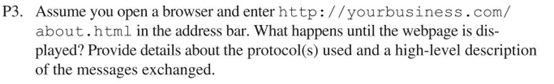

让我们先来看看题目[^first]：

翻译一下就是：

**假设你打开浏览器，并在地址栏中输入 *<http://yourbusiness.com/about.html>*, 请问从你按下回车开始到在显示网页的过程间会发生什么？请提供所使用协议的详细信息以及所交换信息的高级描述。**

解答：

当我们在地址栏中输入 URL 并按下 ENTER 键后，就会进入以下步骤，直到显示出网页：

1. DNS 解析

    - 浏览器首先从 URL 中提取域名，本例中为 "yourbusiness.com"；
    - 然后向 DNS 服务器发送 DNS 查询请求，将域名解析为 IP 地址；
    - DNS 服务器回复与域名相关的 IP 地址。

2. 建立 TCP/IP 连接

    - 浏览器与通过 DNS 查询获得的 IP 地址建立 TCP（传输控制协议）连接；
    - 浏览器和服务器之间进行三方握手，以建立可靠的连接。

3. HTTP 请求

    - 建立 TCP 连接后，浏览器会向服务器发送 HTTP GET 请求，以获取特定资源 "about.html"。

4. 服务器处理

    - 服务器收到 HTTP 请求后，从文件系统中检索所请求的资源 "about.html"。
    - 服务器生成一个 HTTP 响应，其中包含请求的内容以及相关标头和元数据。

5. HTTP 响应

    - 服务器通过已建立的 TCP 连接向浏览器发送 HTTP 响应，其中包括状态代码（如 200 OK 表示请求成功）和响应体中的请求内容（即 "about.html"）。

6. Bowser 渲染

    - 浏览器收到 HTTP 响应后开始处理，解释 HTML 内容，检索 HTML 中引用的 CSS 和 JavaScript 文件等其他资源，并在必要时启动对这些资源的后续请求。
    - 最后，浏览器根据接收到的 HTML、CSS 和 JavaScript 代码渲染网页，将最终结果显示给用户。

在整个过程中，DNS 协议用于域名解析，TCP/IP 用于建立可靠的连接，HTTP 用于发送请求和接收响应。

当然这个过程只是单纯的介绍了从**输入域名→解析域名→获得IP→访问IP→获得响应→解析网页数据**的简单过程，在“解析网页数据”这一块还涉及到了许多与浏览器内核相关的东西，这里不做介绍，感兴趣可以自搜。

[^first]: 题目来自于 **"Computer Networking:A Top-Down Approach" (James F. Kurose and Keith W. Ross, Seventh Edition, 2017)** 中的“Problems” 第三题（201页）
