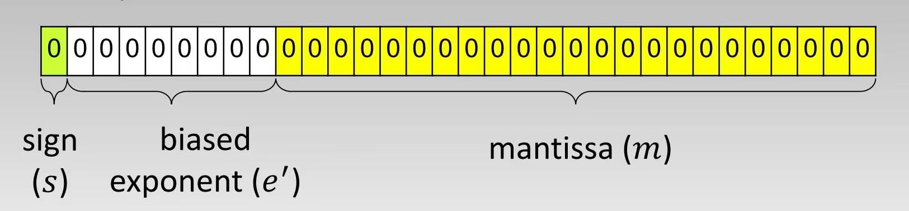
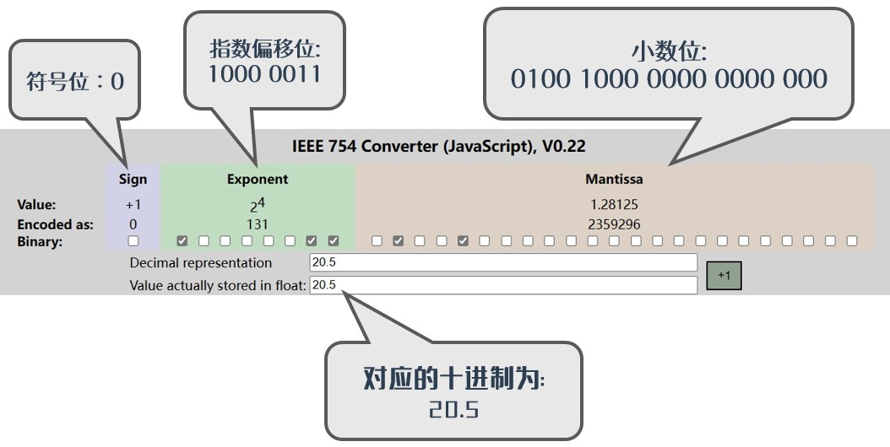
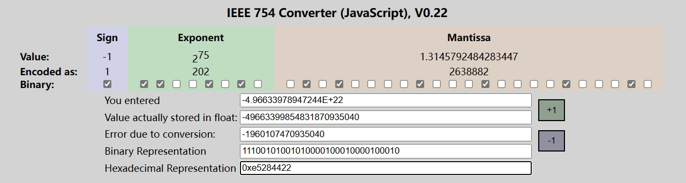
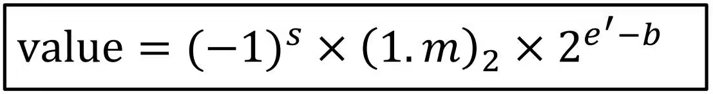

## 简述

在这个文章当中都是有关计算机组成原理相关笔记。如有错误还请帮忙指正！

## 机器数(Machine Number)

### 1.简介

当一个十进制数转换为机器能够识别的二进制数时，能被完美以二进制进行表示而不存在无限不循环小数位的数被称为**机器数(Machine Number)**。

---

### 2.计算标准 --- IEEE-754

IEEE二进制浮点数算术标准（IEEE 754）是20世纪80年代以来最广泛使用的浮点数运算标准，为许多CPU与浮点运算器所采用。这个标准定义了表示浮点数的格式（包括负零-0）与反常值（denormal number）），一些特殊数值（无穷（Inf）与非数值（NaN）），以及这些数值的“浮点数运算符”；它也指明了四种数值舍入规则和五种例外状况（包括例外发生的时机与处理方式）。
IEEE 754规定了四种表示浮点数值的方式：单精确度（32位）、双精确度（64位）、延伸单精确度（43比特以上，很少使用）与延伸双精确度（79比特以上，通常以80位实现）。

在这里先使用**单精度(single precision)**与**双精度(double precision)**进行计算。其中**单精度(single precision)浮点数**的**偏移量(bias)**为**127**，而**双精度(double precision)浮点数**的**偏移量(bias)**为**1023**。这两个偏移量会以字母`b`作表示。

在线转换器网站(仅支持英文): [click](https://www.h-schmidt.net/FloatConverter/IEEE754.html)

IEEE754标准的32位浮点数格式为：

其中：

- 符号位(sign/s) 占据1位，用于表示正负号.`0`表示正数，`1`表示负数.

- 指数偏移位(biased exponent/e') 占据31位至23位共8位，用于表示以2位底的指数.

- 小数位(mantissa/m) 占据剩余的22位至0位共23位. 用于存储尾数.

---

### 3.十进制转机器数(二进制)

#### 针对小数字的普适法

在以二进制格式存储十进制浮点数时, 首先需要**把十进制浮点数表示为二进制格式**, 以十进制数20.5举例，它会被转换为:
**(20.5)~10~ = (10100.1)~2~**

然后, 需要把这个**二进制数转换为以2为底的指数形式**: **10100.1 = 1.01001 * 2^4^**

这里的转换思想为：将小数点移至个位数后，则以2为底的指数值为小数点移动的总位数。在这里小数点移动了4位，则以2为底的指数值为4.

:::info
用 *二进制数* 表示 *十进制浮点数* 时, 表示为 **尾数*指数** 的形式, 并把 **尾数的小数点放在第一位和第二位之间**, 然后 **保证第一位数非0**, 这个处理过程叫做 **规范化(normalized)** 。
:::

在 **1.01001 * 2^4^** 这个值中:

- `1.01001`代表的是**小数位**，我们需要取小数点后的值，即`01001`。当然，因为这些值所占位数只有5位，还没有到达23位，因此我们需要对其进行补齐，即最终被补齐为`0100 1000 0000 0000 000`;

- `4` 是偏移前的指数(unbiased exponent)，一般会被表示为 `e`.

    [上文](./README.md#_2-计算标准-----ieee-754)有提到, 32位单精度浮点数的偏移量(b)为127, 所以这里需要加上偏移量(即`e' = e + b`)。
    此时得到的 **指数偏移位(e')** 就是 `4 + 127 = 131`。

    最后我们将 *131* 转换为二进制，就会得到: **(131)~10~ = (1000 0011)~2~**

由此我们得到了:

- **指数偏移位(biased exponent/e')** = `1000 0011`
- **小数位(mantissa/m)** = `0100 1000 0000 0000 000`
- 并且已知 **(20.5)~10~** 是正数，因此**符号位(sign/s)** = `0`.

将三个部分进行组装后，最终得到的结果就是：`0 1000 0011 0100 1000 0000 0000 000`, 也就是 `0x41A 4000`:

:::tip
在计算的过程中你可能会遇到没法完美地将一个十进制数转为一个机器数的情况，

例如 $({1\over3})_{10} = (0.\overline{01})_2$, 因为这个数是个无限小数，因此无法直接得出该书所对应的机器数。

因此你需要对其进行[舍入](./README.md#_9-舍入规则-rounding-rule)才可以得出该数的机器数。
:::

#### 如果是大数字呢？

理论上在以二进制格式存储十进制浮点数时, 首先需要**把十进制浮点数表示为二进制格式**, 以十进制数20.5举例，它就可以被转换为:**(20.5)~10~ = (10100.1)~2~**。这在数值较小的情况下还是比较好算的。

但是假设我们需要转换的并不是这个数，而是另一个*比较大*的数，例如“**$-4.96633978947244\times 10 ^ {22}$**”呢？

很明显，把这个数从科学计数法的形式转为直接列出的形式是比较麻烦的。那么我们不妨直接在这个数上操作下：

首先，已知 **($-4.96633978947244\times 10 ^ {22}$)~10~** 是负数，因此**符号位(sign/s)** = `1`.

我们需要将 **($4.96633978947244\times 10 ^ {22}$)~10~** 转为 **($\text{1.x}\times 2 ^ {e}$)~10~** 从而算出**指数偏移位(e')**与**小数位(mantissa/m)**(忽略正负号，在前面已经使用符号位表示了)。

那么我们来看如何计算：

- 使用科学计数法表示后，该数的数量级为 $10 ^ {+22}$。
- 由于我们需要**把十进制浮点数表示为二进制格式**，因此我们先将**该数的数量级**化为**二进制表示的该数的数量级**

    $$\because 10 ^ 3 \approx 2 ^ {10}$$

    $$\therefore 10 ^ {+22} \approx 2 ^ {70}$$

- 因此 $4.96633978947244\times 10 ^ {22} \approx a \times 2 ^ {70}$, 其中**a**为未知数
:::tip 化简次方数怎么定？
 先简单化为几十次方就行，不需要很精确，因为在该方法下，越精确该次方数所得到的值反而会越不精确。
:::
- $\Rightarrow a = \frac{4.96633978947244\times 10 ^ {22}}{2 ^ {70}} \approx 42.06653429 = 1.3145791965 \times 2 ^ {5}$
- 所以可得到 **($\text{1.x}\times 2 ^ {e}$)~10~** 即为 **($\text{1.3145791965}\times 2 ^ {70 + 5}$)~10~**，其中`e = 70 + 5 = 75`
- [上文](./README.md#_2-计算标准-----ieee-754)有提到, 32位单精度浮点数的偏移量(b)为127, 所以这里需要加上偏移量(即`e' = e + b`)。
    此时得到的 **指数偏移位(e')** 就是 `75 + 127 = 202`。

    将 *202* 转换为二进制，就会得到: **(202)~10~ = (1100 1010)~2~**

- 接下来，将 $(x)_{10}$ 转为 $(m)_2$ 即可知道 **小数位(mantissa/m)** 的值：

    $(0.3145791965)_{10} = (0.0101 0000 1000 1000 0100 0011)_{2}$

    因为这些值所占位数有24位，已经23位，因此我们需要对其进行舍入，即最终被减为`0101 0000 1000 1000 0100 010`;

:::tip 如何舍入
可以在这里查看有关[舍入规则](./README.md#_9-舍入规则-rounding-rule)的相关概念
:::

由此我们得到了:

- **指数偏移位(biased exponent/e')** = `1100 1010`
- **小数位(mantissa/m)** = `0101 0000 1000 1000 0100 010`
- **符号位(sign/s)** = `1`.

将三个部分进行组装后，最终得到的结果就是：`1 1100 1010 0101 0000 1000 1000 0100 010`, 也就是 `0xE5284422`:

---

### 4.机器数(二进制)转十进制

当我们需要将机器数(二进制)转十进制时，就将上述的步骤反过来。例如有以下例题：
请找出IEEE-754 SP 机器数 0xD1500000 所对应的十进制数。

我们首先需要知道二进制下该机器数的值：**0xD1500000 = (11010001010100000000000000000000)~2~**

然后将其拆分为上文讲过的**符号位s** 、 **指数偏移位e'** 与 **小数位m**：

因此我们可以得出：**e' = 2^7^ + 2^5^ + 2^1^ = 162** → **e = e' - b = 35**

我们有一个公式可以将Z之后的计算过程进行一个概括。如果将十进制的值记为`value`，则：

也就是**value = (-1)^1^ * (1.1010 0000 0000 0000 0000 000)~2~ * 2^35^** → **value = -1 * (1.625)~10~ * 2^35^**

∴最终得到的结果是： **value = -1.625 * 2^35^ = -5.5834574848 * 10^10^**

---

### 5.数值范围

当 **指数偏移位e'** 的二进制数值为 `0` 或者为 `1...1` 时，这个机器数通常会表示一些特殊的数值(±0, ±∞, NaN).

换句话说机器数拥有一个数值的表示范围。

在二进制下，假设 `1 ≤ e' ≤ 1...10`，那么对于不同的精度，机器数会表示不同的范围：

::: tabs#SPDP

@tab:active 单精度表示范围#SP

- 符号位(sign/s) 占据1位

- 指数偏移位(biased exponent/e') 占据8位.

- 小数位(mantissa/m) 占据23位.

→ 1 ≤ e' ≤ 254
∵ b = 127 → -126 ≤ e ≤ 127

∴ 最大机器数值 = (-1)^s^ × (1.1...1)~2~ × 2^127^ ≈ **± 3.4 × 10^38^**

   最小机器数值 = (-1)^s^ × (1.0...0)~2~ × 2^-126^ ≈ **± 1.2 × 10^-38^**

@tab 双精度表示范围#DP

- 符号位(sign/s) 占据1位

- 指数偏移位(biased exponent/e') 占据11位.

- 小数位(mantissa/m) 占据52位.

→ 1 ≤ e' ≤ 2046
∵ b = 1023 → -1022 ≤ e ≤ 1023

∴ 最大机器数值 = (-1)^s^ × (1.1...1)~2~ × 2^1023^ ≈ **± 1.8 × 10^308^**

   最小机器数值 = (-1)^s^ × (1.0...0)~2~ × 2^-1022^ ≈ **± 2.2 × 10^-308^**

:::

---

### 6.溢出错误与下溢错误

如果 *一个机器数的绝对值* 比 **所在精度**所支持的**最大机器数值**的**绝对值** 来得大，则会发生溢出错误(Overflow Error);
如果 *一个机器数的绝对值* 比 **所在精度**所支持的**最小机器数值**的**绝对值** 来得小，则会发生下溢错误(Underflow Error)。

::: tabs#SPDP

@tab:active 单精度#SP

|value| > 最大机器数值 **3.4 × 10^38^**, 则发生溢出错误(Overflow Error)

|value| < 最小机器数值 **1.2 × 10^-38^**, 则发生下溢错误(Underflow Error)

@tab 双精度#DP

|value| > 最大机器数值 **1.8 × 10^308^**, 则发生溢出错误(Overflow Error)

|value| < 最小机器数值 **2.2 × 10^-308^**, 则发生下溢错误(Underflow Error)

:::

---

### 7.机器数的上一位数/下一位数/机器精度(machine epsilon)

很明显的，机器数的上一位数指的是机器数(已知机器数为二进制) *减一* 所得到的值；机器数的下一位数指的是机器数(已知机器数为二进制) *加一* 所得到的值。但是将其从十进制转为二进制，进行在二进制内的计算之后，再转回十进制的过程实在是有些繁琐，因此我们一般采取以下的方法：

:::tip
为了方便计算，这里的机器数全部为十进制，所在精度为单精度，即小数位有23位
:::

首先需要**把十进制浮点数表示为二进制格式**, 以十进制数20.5举例，它会被转换为:
**(20.5)~10~ = (10100.1)~2~**

然后, 需要把这个**二进制数转换为以2为底的指数形式**: **10100.1 = 1.01001 * 2^4^**。

到此所有过程与[前文所述](./README.md#_3十进制转机器数二进制)一致。但以下过程有所不同:

`4` 是偏移前的指数(unbiased exponent)，一般会被表示为 `e`.在此需要保留 **2^e^**，即 **2^4^** 进行相关计算；

由于无论是 加一 还是 减一，相关计算都是在机器数 *小数位(mantissa/m)* 的最后一位 **2^-23^ 位** 上进行操作，因此

下一位机器数值 = 20.5 + 2^4^ × 2^-23^ = 20.5000019073486328125

上一位机器数值 = 20.5 - 2^4^ × 2^-23^ = 20.4999980926513671875

其中，我们一般将 *在该精度条件下，从1到它的下一个机器数之间的距离* 称为 **机器精度**，一般使用 $\epsilon _{mach}$ 表示.

因此在单精度下，机器数的机器精度为：$\epsilon _{mach} = (1 + 2^{-23}) - 1 = 2^{-23} \approx 1.19209 \times 10^-7$

::: tip
一般情况下， $\epsilon _{mach}$ 的值为 2 的 *小数位(mantissa/m)最后一位所代表二进制位数* 次方
:::

---

### 8.真误差(true error)/真实相对误差(true relative error)

:::info
这里的机器数全部为十进制
:::

由于机器数（以下称为本位）与他自己的上一位/下一位机器数值依然有数值差距，因此如果任意十进制数的值出现了介于 *本位机器数值与上一位* 或者 *本位机器数值与下一位* 的情况，则会进行处理：

若位于 (本位机器数值 + 上一位机器数值) / 2 与 (本位机器数值 + 下一位机器数值) / 2 的数值范围之间，则该数字会被估计为本位机器数值所表示的值。

例如 已知上一位机器数值 = 20.4999980926513671875， 本位机器数值 = 20.5. 因此 (本位机器数值 + 上一位机器数值) / 2 = 20.49999904632568359375。那么对于 20.4999991 而言 由于 他在 *(本位机器数值 + 上一位机器数值) / 2 与 (本位机器数值 + 下一位机器数值) / 2 的数值范围之间*，因此它会被估计为 20.5

::: tip
这里的估计法与下文的[舍入规则](./README.md#_9-舍入规则-rounding-rule)相似，可以相互参考
:::

因此在相关的计算当中，会出现真误差与真实相对误差：

真误差 = | 真实值 -  估计值(机器数值) |

真实相对误差 =  | (真实值 -  估计值(机器数值) ) / 真实值 | * 100%

在如上例子中：

真误差 = | 20.4999991 - 20.5 | = 0.0000009

真实相对误差 = | (20.4999991 - 20.5) / 20.4999991| × 100% ≈ 0.00000439%

---

### 9.舍入规则(Rounding Rule)

任意一种浮点数系统都拥有有限的精确度，因此如果一个数无法精确的用二进制转为机器数， 例如这个数转为二进制之后得到了一个无限小数位的数，就无法精确的进行表示了。因此我们有一套舍入规则：

将该数的小数位限制在 **小数位(mantissa/m)** 之内，然后针对之后的一位(MSB)进行判定：

- 如果最后一位为0，则直接舍去所有剩余小数；
- 如果最后一位为1，则将小数位最后一位加一.

::: tip
这里的估计法与上文的[估计法](./README.md#_8-真误差-true-error-真实相对误差-true-relative-error)相似，可以相互参考
:::

举个例子：

给定值 $(9.4)_{10} = (1001.\overline{0110})_2$, 其中后面的小数是循环的。

$(9.4)_{10} = (1001.\overline{0110})_2 = 1.001\overline{0110} \times 2^3$

$\Rightarrow s = 0, e = 3 \rightarrow e' = 3 + 127 = 130 = (10000010)_2, m = (0010 1100 1100 1100 1100 110)$

因此机器数初步为 $\textcolor{#329894}{0} \quad \textcolor{#983232}{10000010} \quad \textcolor{#877e00}{0010 1100 1100 1100 110} \quad \textcolor{#871e00}{01}$

又因为 **小数位(mantissa/m)** `0010 1100 1100 1100 110` 之后 的数值为 `01`，MSB 值为 0，直接舍去所有剩余小数。

因此 $(9.4)_{10} = (1001.\overline{0110})_2 = 0 \quad 10000010 \quad 0010 1100 1100 1100 110$
