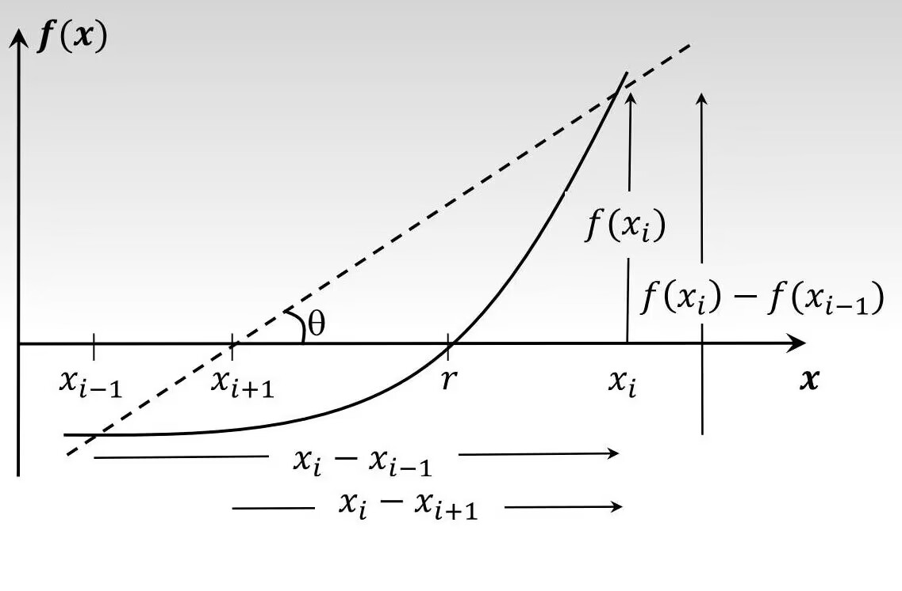

## 简述

在这个文章当中都是有关计算与仿真相关笔记。如有错误还请帮忙指正！

## 机器数(Machine Number)

请参考[这里](./README.md#机器数machine-number)

在该章节中包含了有关**IEEE-754单、双精度**、**十进制与机器数相互转换**、**机器精度(machine epsilon)**、**真误差(true error)/真实相对误差(true relative error)**、**舍入规则(Rounding Rule)**等问题的相关计算。

## 缩小舍入误差

### 1.误差的来源

1. 截断误差(truncation error): 当我们使用一个有限数列去拟合一个无限数列时，就会出现截断误差。举个例：

    有以下无限数列: $\exp ^x = 1 + {x \over 1!} + {x^2 \over 2!} + \dots$

    当我们使用有限数列: $P_3 (x) = 1 + x + {x^2 \over 2!} + {x^3 \over 3!}$进行拟合时，

    则会出现截断误差: $R_3 (x) = \exp ^x - P_3 (x)$

    具体可以看[泰勒理论](./compute_and_simutation.md#泰勒理论)

2. 舍入误差(round-off error): 当我们尝试将一个非机器数存入计算机时，由于计算机自身精度有限，因此会有舍入误差。

3. 数据误差(data error): 所有的真实数据都存在测量误差，在此称其为测量误差。

4. 模型误差(model error): 所有的数学模型都是针对物理现象的拟合，由此会出现模型误差。

5. 操作员误差(blunders): 由于计算机操作员人工输入数据导致的误差。

6. 传播误差(propagated error): 数值方法是迭代的，这意味着第 i 步的解取决于第 i-1 步的解。因此，第 i 步的误差取决于第 i-1 步的误差。随着方法的迭代，传播的误差会越来越大。如果计算出的解越来越大，掩盖了真正的解，那么它就变得毫无意义，我们就会说这种方法不稳定。

---

### 2.霍纳法则(秦九韶算法)

一般地，一元n次多项式的求值需要经过 $(n+1)*n \over 2$次乘法和 `n` 次加法，而秦九韶算法只需要 `n` 次乘法和 `n` 次加法。在人工计算时，一次大大简化了运算过程。

把一个n次多项式 $f(x) = a_nx^n + a_{n-1}x^{n-1} + \dots + a_1x^1 + a_0$
改写成如下形式：

$$f(x)$$

$$= (a_nx^{n-1} + a_{n-1}x^{n-2} + \dots + a_2x^1 + a_1)x + a_0$$

$$= ((a_nx^{n-2} + a_{n-1}x^{n-3} + \dots + a_2)x + a_1)x + a_0$$

$$\vdots$$

$$= ( \dots ((a_nx + a_{n-1})x + a_{n-2})x + \dots + a_1)x + a_0$$

求多项式的值时，首先计算最内层括号内一次多项式的值，即

$$v_1 = a_nx + a_{n-1}$$

然后由内向外逐层计算一次多项式的值，即

$$v_2 = v_1x + a_{n-2}$$

$$v_3 = v_2x + a_{n-3}$$

$$\vdots$$

$$v_n = v_{n-1}x + a_{0}$$

这样，求n次多项式f(x)的值就转化为求n个一次多项式的值。

结论：**对于一个n次多项式，至多做n次乘法和n次加法。**

---

### 3.使用泰勒展开拟合任意函数

对于可以在任意点进行充分多次求导的函数 f(x) 而言，关于其展开点 (a, f(a)) 的泰勒展开式为：

$$f(x) = f(a) + f'(a)(x-a) + {f''(a) \over 2!}(x - a)^2 + {f''(a) \over 3!}(x - a)^3 + \dots$$

$$= \sum_{k=0}^{\infin} {f^{(k)}(a) \over k!}(x - a)^k$$

则我们可以不通过知道函数本身，而只要知道任意点的值以及该值的导数 $(a,f(a))$，就可以通过该公式对该函数进行拟合。

:::info
麦克劳林数列是泰勒数列的一种特殊情况。当一个可以在任意点进行充分多次求导的函数 f(x) 使用泰勒展开进行拟合时取 `a = 0`，即 $(0,f(0))$ 进行展开操作，则展开后的数列被称为麦克劳林数列。他一般被写为如下形式：

$$f(x) = f(0) + f'(0)x + {f''(0) \over 2!}x^2 + {f''(0) \over 3!}x^3 + \dots$$

$$= \sum_{k=0}^{\infin} {f^{(k)}(0) \over k!}x^k$$
:::

## 泰勒理论

**如果函数 f(x) 在包含 a 和 x 的区间上具有 1、2、...、(n + 1) 阶导数，则 f(x) 的值可以表示为：f(x) = (n + 1) 项截断的泰勒级数的总和 + 余项 Rn 。** 用公式可记为：

$$f(x) = \sum_{k=0}^{n}{f^{(k)}(a) \over k!}(x - a)^{k} + R_n$$

而余项我们一般称其为 **截断误差(truncation error)**。用公式表示为：

$$R_n = {f^{(n + 1)}(c) \over (n + 1)!}(x - a)^{n + 1} \space \text{其中 {\it c}} \in \text{包含 a 和 x 的区间}$$

### 中值定理

如果函数 f(x) 是连续的并且它的一阶导数在 (a, b) 区间都存在，则必然存在一个 $c \in (a, b)$ 使得:

$$f'(c) = {f(b) - f(a) \over b-a}$$

根据上文的泰勒理论可看出，中值定理就是泰勒理论中当 `n = 0` 时的特殊情况。其中 `x = b`:

$$f(b) = \sum_{k=0}^{0}{f^{(b)}(a) \over k!}(b - a)^{k} + R_0$$

$$= f(a) + R_0$$

$$= f(a) + f'(c)(b-a)$$

$$\Rightarrow f'(c) = { f(b)-f(a) \over b-a }$$

## 函数的零点与方程的根

函数的零点使函数等于零，如果 $f(z) = 0$，则 `z` 是函数 `f()` 的零点；
方程的根满足方程的要求，如果 `r` 满足方程的要求，它就是方程的根。

设`a`为常数，在上述定义下，方程 $f(z) = a$ 的根不一定是函数 $f(z)$ 的零点，但是当 $a = 0$ 时，函数 $f(z)$ 的零点一定会是方程 $f(z) = a$ 的根。

## 函数的解析解与数值解

函数的解析解只适用于求出少数特殊函数的根。例如对于一个一元二次函数 $f(X) = ax^2 + bx + c = 0$, 他的解析解可以用公式 $x = {-b \plusmn \sqrt{b^2-4ac} \over 2a}$ 求出。

函数的数值解可以用于求出大部分函数的根。当一个函数无法使用通常的方法求出解析解时，我们便需要使用数值方法求解该函数的数值根。例如对于函数 $f(X) = e^x - x = 0$, 我们无法较为简便的求出解析解，因此我们只能求出数值解。

:::tips
对同一个函数而言，其解析解总是优先于数值解。因为解析解是精确值，而数值解是近似值。
:::

## 二分算法

**使用前提:** 与 *二分法* 相似

- `f(x)` 在区间 $[a, b]$ 上连续
- $f(a)f(b) < 0$
- 计算后的绝对真误差小于给定绝对真误差时循环结束

用伪代码可写为：

```txt
设置给定绝对真误差 Etol 值

while (Et > Etol){
    计算中点  m = (a + b)/2

    判断 f(m)
    if (f(a)f(m) < 0) {
        a = m
    } else {
        b = m
    }

    计算绝对真误差 Et
} 
```

## 牛顿-拉弗森法（Newton-Raphson method）

另一种求近似解的方法，通过迭代逼近的方式，寻找函数的根或方程的解。它利用函数的局部线性近似来更新当前的近似解，直到满足预设的精度要求为止。

假设要求解函数$f(x)$的根，并定义一个初始的近似解为$x_0$，则根据该方法可写出求该函数近似解的迭代公式：

$$x_{n+1} = x_n - \frac{f(x_n)}{f'(x_n)}$$

其中，$f'(x_n)$表示函数$f(x)$在点$x_n$的导数。

这种方法求解函数的近似根很快。但是该方法要求被求解的函数自身及其在被计算时需要有以下特征才能够得出近似解：

- 被求解的函数图像曲线应较为平滑而非变化大，否则容易出现初始的近似解取在函数极小点附近而导致在迭代计算后求出极小值而非函数根的情况。
- 函数指定的迭代范围内需要都存在导数，即该函数在指定的迭代范围内都可以求导，否则该方法失灵
- (极端情况)在迭代时不能出现两点被困在拐点附近无限循环的情况，否则该方法失灵

## 割线法 (Secant method)

在函数中，一条连接了该函数上两个点的直线被称为**割线**。

假设在函数$f(x)$ 中定义了两个根的估计值，其中 *现在根的估计值* 为 $x_i$, *前一个根的估计值* 为 $x_{i-1}$, 则连接 $f(x_i)$ 与 $f(x_{i-1})$ 的割线与x轴的交点可以得到该函数 *后一个根的估计值* $x_{i+1}$



$$ tan(\theta) = \frac {f(x_i)} {x_i-x_{i+1}} = \frac {f(x_i)-f(x_{i-1})} {x_i-x_{i-1}} $$

$$ \Rightarrow x_i-x_{i+1} = (\frac {x_i-x_{i-1}} {f(x_i)-f(x_{i-1})}) $$

因此 *后一个根的估计值* 的推导式为：

$$ x_{i+1} = x_i-(\frac {x_i-x_{i-1}} {f(x_i)-f(x_{i-1})}) $$

该方法不需要相应的求导就可以进行计算，相对方便，有以下特征：

- 计算速度比二分法来的快，但是比牛顿拉弗森法来得慢；
- 如果初始猜测的两个估计值并不靠近真正的根，可能会出现算不出的情况；
- 当该等式的分母 $f(x_i)-f(x_{i-1})$为零时无法计算；
- 与牛顿拉弗森法相似，可能出现初始的近似解取在函数极小点附近而导致在迭代计算后求出极小值而非函数根的情况。
