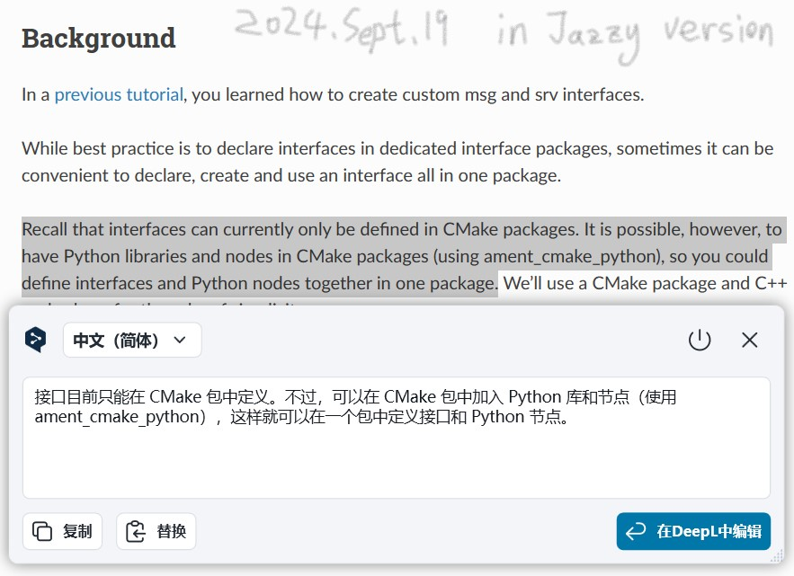

## 简介：什么是接口(interfaces)？

在通信过程中，当节点间需要传输数据时，就必然需要以特定格式传输数据，也就是我们常用的数据载体。在ROS2中，数据载体被称之为**接口(interfaces)**。

## 常用的接口文件

通信时使用的数据载体一般需要使用接口文件定义。常用的接口文件有三种：`msg` 文件、`srv` 文件与 `action` 文件，分别用于对应[前文](./2024_09_18.md#通信模型)所述的**话题通信**、**服务通信**和**动作通信**，并且每种文件都需要按照一定格式定义 *特定数据类型*的 “变量”。

::: tip
参数通信的数据无需定义接口文件，参数通信时数据会被封装为参数对象，参数客户端和服务端操作的都是参数对象。
:::

### 1. msg文件

`msg` 文件是用于定义 **话题通信** 中数据载体的接口文件，而一个典型的 `.msg` 文件示例如下：

```cmake
// .msg
int64 num1
int64 num2
```

在文件中声明了一些被传输的类似于 **C++** 变量的数据。

### 2. srv文件

`srv` 文件是用于定义 **服务通信** 中数据载体的接口文件，一个典型的 `.srv` 文件示例如下：

```cmake
// .srv
int64 num1
int64 num2
---
int64 sum
```

文件中声明的数据被 "---" 分割为两部分，其中 **上半部分** 用于声明请求数据，**下半部分** 用于声明响应数据。

### 3. action文件

`action` 文件是用于定义**动作通信**中数据载体的接口文件，一个典型的 `.action` 文件示例如下：

```cmake
// .action
int64 num1
int64 num2
---
int64 sum
---
float64 progress
```

文件中声明的数据被 "---" 分割为三部分，其中 **上半部分** 用于声明请求数据，**中间部分** 用于声明响应数据，**下半部分** 用于声明连续反馈数据。

## 变量类型

不管是何种接口文件，在文件中每行声明的数据都由**字段类型**和**字段名称**组成，可以使用的**字段类型**有以下几种：

- int8, int16, int32, int64 (或者无符号类型: uint*)
- float32, float64
- string
- time, duration
- 变长数组和定长数组
- 其他msg文件

ROS中还有一种特殊类型：**标头(Header)**，它包含了时间戳和ROS2中常用的坐标帧信息。许多复杂的接口文件会在第一行包含Header标头。

::: tip
这里对接口进行了简单的介绍，仅供参考与了解。并且由于直到目前为止 ROS2 还 **无法** 在 Python 功能包中定义接口文件，以上所有代码都基于 `CMAKE` 。如果有相应更新，请留待之后的记录文章进行讲述。

:::
