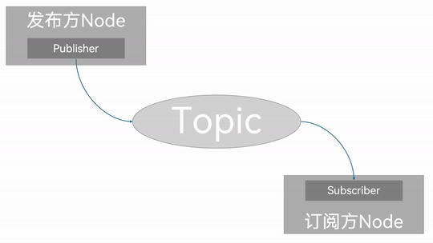
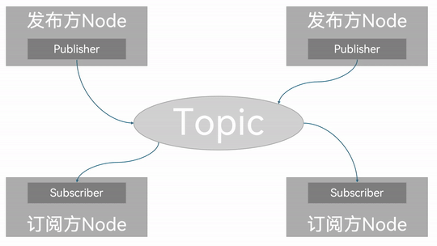
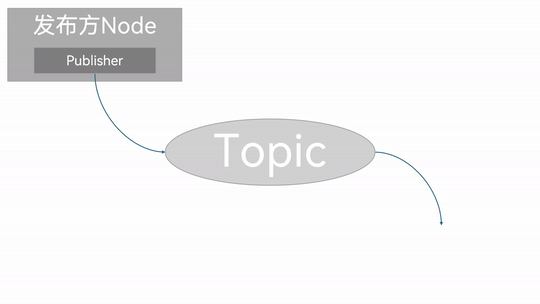

## 简介

**话题通信**是一种以发布 `订阅` 的方式实现不同节点之间数据传输的通信模型。数据发布对象称为发布方，数据订阅对象称之为订阅方，发布方和订阅方通过话题(Topic)相关联，发布方将**消息(Message)**发布在话题上，订阅方则从该话题订阅**消息(Message)**。因此在话题通信中，消息的流向总是单向的。



但是在**话题通信**中发布方与订阅方是一种多对多的关系，也就是说，话题通信的同一话题下可以存在多个发布方，也可以存在多个订阅方，这意味着数据会出现交叉传输的情况。



当然如果没有订阅方，数据传输也会出现丢失的情况。



因此，话题通信一般应用于不断更新的、少逻辑处理的数据传输场景。

## 消息接口

在前文的图中，我们了解到发布/订阅系节点是用**消息(Message)**作为信息载体进行数据传输的。而为了规范格式，消息会使用**消息接口**进行数据的格式定义。关于消息接口的使用有多种方式：

- 在ROS2中，官方通过 `std_msgs` 功能包提前封装了一些原生的数据类型,比如：

  - String
  - Int8
  - Int16
  - Int32
  - Int64
  - Float32
  - Float64
  - Char
  - Bool
  - Empty
  - ......

  虽然依据官方设定，这些原生数据类型也可以各自独自作为话题通信的数据载体，不过只单单使用这些数据一般只会包含一个 `data` 字段，结构会较为简单。而且 `std_msgs` 包中其他的接口文件也比较简单，而结构的单一便意味着功能上的局限性，使得当我们需要传输一些结构复杂的数据时，就会显得力不从心；

- 在 ROS2 中还预定义了许多**标准话题**消息接口，这在实际工作中有着广泛的应用，比如：
  - `sensor_msgs` 包中定义了许多关于**传感器消息**相关的接口（例：雷达、摄像头、点云......）
  - `geometry_msgs` 包中则定义了许多**几何消息**相关的接口（例：坐标点、坐标系、速度指令......）
  - ......

- 如果上述接口文件都不能满足我们的需求，我们也可以自定义接口消息；

因此具体如何选型，可以根据具体情况具体分析。

---

## 话题通信的简单实现

现在，我们通过针对**原生消息接口**与**自定义消息接口**进行分别实现，以更加深入了解话题通信。

::: tip
在下文中为了便利，将**原生消息接口的实现**称为案例1，将**自定义消息接口的实现**称为案例2，统称为**两个案例**。
:::

### 流程简介

两个案例实现的通用主要步骤如下：

1. 编写发布方实现；
2. 编写订阅方实现；
3. 编辑配置文件；
4. 编译；
5. 执行。

当然案例2需要先自定义接口消息，除此之外的实现流程与案例1一致。这两个案例会采用C++和Python分别实现，且二者都遵循上述实现流程。

### 准备工作

终端下创建工作空间：

```shell
mkdir -p ws01_plumbing/src
cd ws01_plumbing/src
colcon build
```

进入工作空间的src目录:

```shell
cd src/
```

调用如下命令创建之后会用到的接口功能包:

```shell
ros2 pkg create --build-type ament_cmake base_interfaces_demo

```

调用如下两条命令分别创建C++功能包和Python功能包:

**C++:**

```shell
ros2 pkg create cpp01_topic --build-type ament_cmake --dependencies rclcpp std_msgs base_interfaces_demo
```

**Python:**

```shell
 ros2 pkg create py01_topic --build-type ament_python --dependencies rclpy std_msgs base_interfaces_demo
```

准备工作到此完毕。

---

接下来你便可以通过 [原生消息接口](./2024_09_22.md) 和 [自定义消息接口](./2024_09_25_002.md) 来分别实现话题通信了。

## 总结

在这一节中，我们系统的阐述了如何依据话题通信相关原理，通过自行操作，依据**原生消息接口**和**自定义消息接口**两种实现方法，实现节点之间简单的话题通信。

::: 在VSCode中设置代码片段
当我们熟悉上述代码编写流程之后，我们会发现，除了自定义类的不同，实际上同个计算机语言内的代码结构基本相同。为了减少重复代码的编写，提升代码编写效率，我们可以在 VSCode 中设置自定义代码片段来自动为我们生成相应自定义片段。具体可参照[这里](../coding_skill/2024_09_23.md)。
:::
