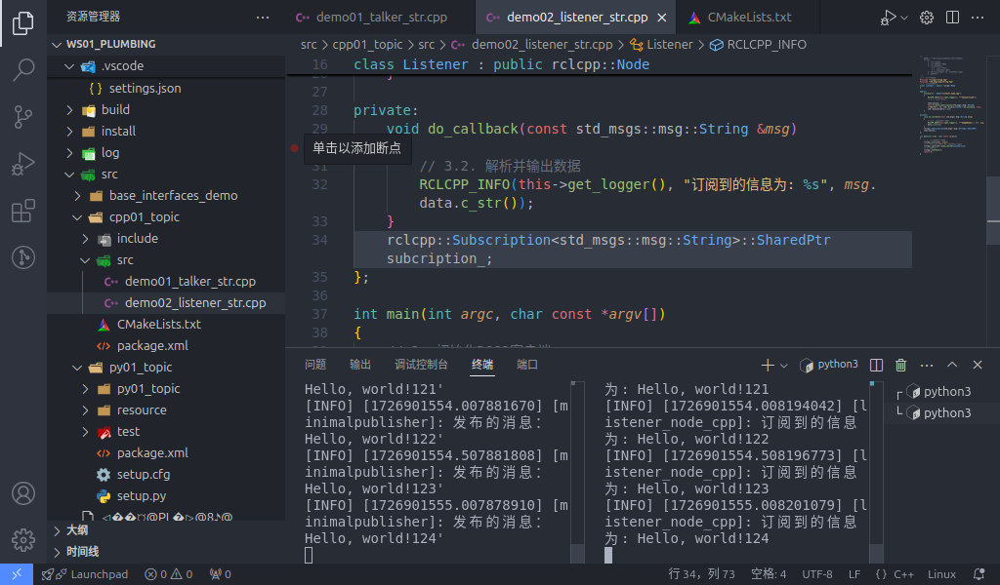

## 简介

**话题通信**是一种以发布 `订阅` 的方式实现不同节点之间数据传输的通信模型。数据发布对象称为发布方，数据订阅对象称之为订阅方，发布方和订阅方通过话题(Topic)相关联，发布方将**消息(Message)**发布在话题上，订阅方则从该话题订阅**消息(Message)**。因此在话题通信中，消息的流向总是单向的。


但是在**话题通信**中发布方与订阅方是一种多对多的关系，也就是说，话题通信的同一话题下可以存在多个发布方，也可以存在多个订阅方，这意味着数据会出现交叉传输的情况。


当然如果没有订阅方，数据传输也会出现丢失的情况。


因此，话题通信一般应用于不断更新的、少逻辑处理的数据传输场景。

## 消息接口

在前文的图中，我们了解到发布/订阅系节点是用**消息(Message)**作为信息载体进行数据传输的。而为了规范格式，消息会使用**消息接口**进行数据的格式定义。关于消息接口的使用有多种方式：

- 在ROS2中，官方通过 `std_msgs` 功能包提前封装了一些原生的数据类型,比如：

  - String
  - Int8
  - Int16
  - Int32
  - Int64
  - Float32
  - Float64
  - Char
  - Bool
  - Empty
  - ......

  虽然依据官方设定，这些原生数据类型也可以各自独自作为话题通信的数据载体，不过只单单使用这些数据一般只会包含一个 `data` 字段，结构会较为简单。而且 `std_msgs` 包中其他的接口文件也比较简单，而结构的单一便意味着功能上的局限性，使得当我们需要传输一些结构复杂的数据时，就会显得力不从心；

- 在 ROS2 中还预定义了许多**标准话题**消息接口，这在实际工作中有着广泛的应用，比如：
  - `sensor_msgs` 包中定义了许多关于**传感器消息**相关的接口（例：雷达、摄像头、点云......）
  - `geometry_msgs` 包中则定义了许多**几何消息**相关的接口（例：坐标点、坐标系、速度指令......）
  - ......

- 如果上述接口文件都不能满足我们的需求，我们也可以自定义接口消息；

因此具体如何选型，可以根据具体情况具体分析。

---

## 话题通信的简单实现

现在，我们通过针对**原生消息接口**与**自定义消息接口**进行分别实现，以更加深入了解话题通信。

::: tip
在下文中为了便利，将**原生消息接口的实现**称为案例1，将**自定义消息接口的实现**称为案例2，统称为**两个案例**。
:::

### 流程简介

两个案例实现的通用主要步骤如下：

1. 编写发布方实现；
2. 编写订阅方实现；
3. 编辑配置文件；
4. 编译；
5. 执行。

当然案例2需要先自定义接口消息，除此之外的实现流程与案例1一致。这两个案例会采用C++和Python分别实现，且二者都遵循上述实现流程。

### 准备工作

终端下创建工作空间：

```shell
mkdir -p ws01_plumbing/src
cd ws01_plumbing/src
colcon build
```

进入工作空间的src目录:

```shell
cd src/
```

调用如下两条命令分别创建C++功能包和Python功能包:

**C++:**

```shell
ros2 pkg create cpp01_topic --build-type ament_cmake --dependencies rclcpp std_msgs base_interfaces_demo
```

**Python:**

```shell
 ros2 pkg create py01_topic --build-type ament_python --dependencies rclpy std_msgs base_interfaces_demo
```

准备工作到此完毕。

---
### 原生消息接口-话题通信实现

#### C++

##### 1. 发布方实现

功能包cpp01_topic的src目录下，新建C++文件demo01_talker_str.cpp，并编辑文件，输入如下内容：

```cpp
/*
    需求：以某个固定频率发送文本“Hello World!”，且文本后缀编号，每次发送一条信息，编号递增1.
    步骤：
        1. 包含头文件；
        2. 初始化 ROS2 客户端
        3. 自定义节点类：
            3-1. 创建发布方；
            3-2. 创建定时器；
            3-3. 组织消息并发布。
        4. 调用spin函数，并传入节点对象指针
        5. 释放资源。
 */

// 1. 包含头文件；
#include "rclcpp/rclcpp.hpp"
#include "std_msgs/msg/string.hpp"

using namespace std::chrono_literals;

// 3. 自定义节点类：
class MinimalPublisher : public rclcpp::Node
{
    public: 
    // count_(0) 的作用是将 count_ 初始化为 0
        MinimalPublisher() : Node("minimalpublisher"), count_(0)
        {
        // 3-1. 创建发布方；

        /*
            模板： 被发布的消息类型
            参数：
                1. 话题名称；
                2. QOS(消息队列长度)；
            返回值：发布对象指针。
         */

        publisher_ = this->create_publisher<std_msgs::msg::String>("topic", 10); 
        // 3-2. 创建定时器；
        /*
            参数：
                1. 时间间隔；
                2. 回调函数；
            返回值：定时器对象指针。
         */
        timer_ = this->create_wall_timer(500ms, stc::bind(&MinimalPublisher::timer_callback, this)) 
        } 
    private: 
        void timer_callback() 
        {
            // 3-3. 组织消息并发布。
            auto message = std_msgs::msg::string();
            message.data = "Hello, world!" + std::to_string(count_++); RCLCPP_INFO(this->get_logger(), "发布的消息： '%s'", message.data.c_str());
            publisher_->publish(message); 

        }
        rclcpp::Publisher<stdmsgs::msg::String>::SharedPtr publisher_;
        rclcpp::TimerBase::SharedPtr timer_;
        size_t count_;
};

int main(int argc, char *argv[])
{
    // 2. 初始化 ROS2 客户端
    rclcpp::init(argc, argv);
    // 4. 调用spin函数，并传入节点对象指针。
    rclcpp::spin(std::make_shared<MinimalPublisher>());
    // 5.释放资源;
    rclcpp::shutdown();
    return 0; 
} 

```

##### 2. 订阅方实现

功能包cpp01_topic的src目录下，新建C++文件demo02_listener_str.cpp，并编辑文件，输入如下内容：

```cpp
/*      

  需求：订阅发布方发布的消息，并输出到终端。    
  步骤：      
      1.包含头文件；        
      2.初始化 ROS2 客户端；        
      3.自定义节点类；            
        3-1.创建订阅方；            
        3-2.处理订阅到的消息。        
      4.调用spin函数，并传入节点对象指针；        
      5.释放资源。 
*/

// 1.包含头文件；
#include "rclcpp/rclcpp.hpp"
#include "std_msgs/msg/string.hpp"
using std::placeholders::_1;
// 3.自定义节点类；

class MinimalSubscriber : public rclcpp::Node 
{
  public:  
    MinimalSubscriber()   
    : Node("minimal_subscriber")    
    {      
     // 3-1.创建订阅方；  
    /*
        模板：消息类型；
        参数：
            1. 话题名称（与发布方应保持一致）
            2. QOS：队列长度；
            3. 回调函数；
        返回值：订阅对象对应的指针
         
     */
     subscription_ = this->create_subscription<std_msgs::msg::String>("topic", 10, std::bind(&MinimalSubscriber::topic_callback, this, _1));    
    }
  private:    
    // 3-2.处理订阅到的消息；    
    void topic_callback(const std_msgs::msg::String & msg) const    
    {      
      RCLCPP_INFO(this->get_logger(), "订阅的消息： '%s'", msg.data.c_str());
    }    
      rclcpp::Subscription<std_msgs::msg::String>::SharedPtr subscription_; 
};

int main(int argc, char *argv[])
{  
  // 2.初始化 ROS2 客户端；  
  rclcpp::init(argc, argv);  
  // 4.调用spin函数，并传入节点对象指针。 
  rclcpp::spin(std::make_shared<MinimalSubscriber>());  
  // 5.释放资源；  
  rclcpp::shutdown();  
  return 0; 
}

```

##### 3. 编辑配置文件
在C++功能包中，配置文件需要关注package.xml与CMakeLists.txt。如果是自建的文件，需要针对各个文件进行附加配置。

###### Ⅰ.package.xml

在创建功能包时，所依赖的功能包已经自动配置了，配置内容如下：

```xml
<!-- package.xml -->
<depend>rclcpp</depend>
<depend>std_msgs</depend>
<depend>base_interfaces_demo</depend>
```

需要说明的是：
1. 在本案例中, `<depend>base_interfaces_demo</depend>` 不是必须的。
2. 如果自建的节点有新引入相关功能包，需要针对各个节点文件进行功能包的附加配置。

###### Ⅱ.CMakeLists.txt

CMakeLists.txt中发布和订阅程序核心配置如下：

```txt
find_package(rclcpp REQUIRED) 
find_package(std_msgs REQUIRED)
find_package(base_interfaces_demo REQUIRED) 

add_executable(demo01_talker_str src/demo01_talker_str.cpp) ament_target_dependencies(  
  demo01_talker_str  
  "rclcpp"  
  "std_msgs" 
) 

add_executable(demo02_listener_str src/demo02_listener_str.cpp) ament_target_dependencies(  
 demo02_listener_str  
 "rclcpp"  
 "std_msgs" 
) 

install(TARGETS  
 demo01_talker_str  
 demo02_listener_str  
 DESTINATION lib/${PROJECT_NAME})
```

需要说明的是：如果有自建的节点被新引入，则需要针对各个节点文件进行以下操作：

1. 如果自建的节点有新引入相关功能包，需要通过设置 `find_package` 针对各个节点进行功能包的附加配置；
2. 自建的节点需要附加配置 `add_executable`、  `ament_target_dependencies` 和 `install` 三个配置项, 其中：

    - `add_executable` 需要添加其节点名和文件所在位置；
    - `ament_target_dependencies` 需要针对各个节点文件添加其节点名和其所引用的功能包名；
    - `install` 内需要添加其节点名

##### 4. 编译

终端中进入当前工作空间，编译功能包：
```shell
colcon build --packages-select cpp01_topic
```

##### 5. 执行

当前工作空间下，启动两个终端，终端1执行发布程序，终端2执行订阅程序。 

终端1输入如下指令：

```shell
. install/setup.bash ros2 run cpp01_topic demo01_talker_str
```

终端2输入如下指令：

```shell
. install/setup.bash ros2 run cpp01_topic demo02_listener_str
```

最终运行结果应与案例1类似。



::: tip spin函数的作用
主函数中执行spin函数会使主程序挂起，通过之前传入的节点对象指针进入该节点对象，并执行其内部的回调函数。因此简言之，spin函数可用于调用节点对象内的回调函数，如果没有spin函数，则该回调函数不会被执行。
:::

#### Python

##### 1. 发布方实现

##### 2. 订阅方实现

##### 3. 编辑配置文件

##### 4. 编译

##### 5. 执行

### 自定义消息接口-话题通信实现

#### C++

##### 1. 发布方实现

##### 2. 订阅方实现

##### 3. 编辑配置文件

##### 4. 编译

##### 5. 执行

#### Python

##### 1. 发布方实现

##### 2. 订阅方实现

##### 3. 编辑配置文件

##### 4. 编译

##### 5. 执行
