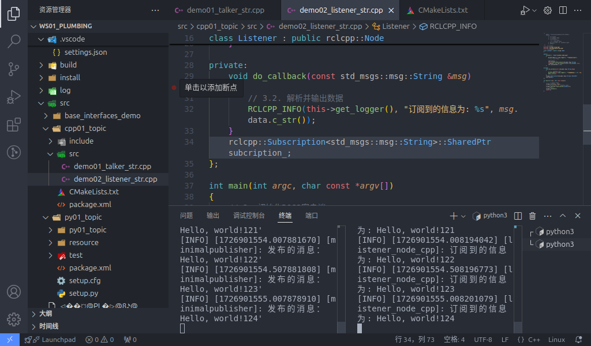
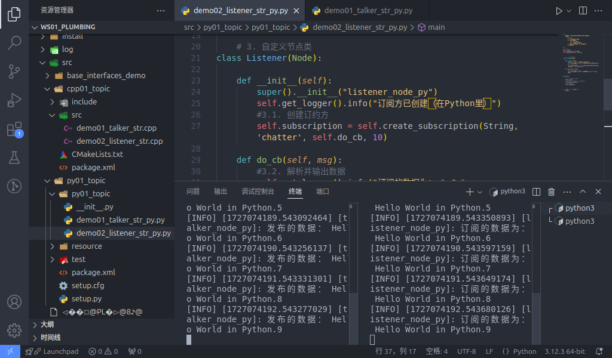

## 原生消息接口-话题通信实现

接下来我们将使用 **原生消息接口** 实现话题通信。如果还没有在Ubuntu中执行准备工作的，可以参考[这里](./2024_09_19_002.md#准备工作)。

### C++

#### 1. 发布方实现

功能包 `cpp01_topic` 的 `src` 目录下，新建 C++ 文件 `demo01_talker_str.cpp`，并编辑文件，输入如下内容：

```cpp
/*
    需求：以某个固定频率发送文本“Hello World!”，且文本后缀编号，每次发送一条信息，编号递增1.
    步骤：
        1. 包含头文件；
        2. 初始化 ROS2 客户端
        3. 自定义节点类：
            3-1. 创建发布方；
            3-2. 创建定时器；
            3-3. 组织消息并发布。
        4. 调用spin函数，并传入节点对象指针
        5. 释放资源。
 */

// 1. 包含头文件；
#include "rclcpp/rclcpp.hpp"
#include "std_msgs/msg/string.hpp"

using namespace std::chrono_literals;

// 3. 自定义节点类：
class MinimalPublisher : public rclcpp::Node
{
    public: 
    // count_(0) 的作用是将 count_ 初始化为 0
        MinimalPublisher() : Node("minimalpublisher"), count_(0)
        {
        // 3-1. 创建发布方；

        /*
            模板： 被发布的消息类型
            参数：
                1. 话题名称；
                2. QOS(消息队列长度)；
            返回值：发布对象指针。
         */

        publisher_ = this->create_publisher<std_msgs::msg::String>("topic", 10); 
        // 3-2. 创建定时器；
        /*
            参数：
                1. 时间间隔；
                2. 回调函数；
            返回值：定时器对象指针。
         */
        timer_ = this->create_wall_timer(500ms, stc::bind(&MinimalPublisher::timer_callback, this)) 
        } 
    private: 
        void timer_callback() 
        {
            // 3-3. 组织消息并发布。
            auto message = std_msgs::msg::string();
            message.data = "Hello, world!" + std::to_string(count_++); RCLCPP_INFO(this->get_logger(), "发布的消息： '%s'", message.data.c_str());
            publisher_->publish(message); 

        }
        rclcpp::Publisher<stdmsgs::msg::String>::SharedPtr publisher_;
        rclcpp::TimerBase::SharedPtr timer_;
        size_t count_;
};

int main(int argc, char *argv[])
{
    // 2. 初始化 ROS2 客户端
    rclcpp::init(argc, argv);
    // 4. 调用spin函数，并传入节点对象指针。
    rclcpp::spin(std::make_shared<MinimalPublisher>());
    // 5.释放资源;
    rclcpp::shutdown();
    return 0; 
} 

```

#### 2. 订阅方实现

功能包 `cpp01_topic` 的 `src` 目录下，新建 C++ 文件 `demo02_listener_str.cpp`，并编辑文件，输入如下内容：

```cpp
/*      

  需求：订阅发布方发布的消息，并输出到终端。    
  步骤：      
      1.包含头文件；        
      2.初始化 ROS2 客户端；        
      3.自定义节点类；            
        3-1.创建订阅方；            
        3-2.处理订阅到的消息。        
      4.调用spin函数，并传入节点对象指针；        
      5.释放资源。 
*/

// 1.包含头文件；
#include "rclcpp/rclcpp.hpp"
#include "std_msgs/msg/string.hpp"
using std::placeholders::_1;
// 3.自定义节点类；

class MinimalSubscriber : public rclcpp::Node 
{
  public:  
    MinimalSubscriber()   
    : Node("minimal_subscriber")    
    {      
     // 3-1.创建订阅方；  
    /*
        模板：消息类型；
        参数：
            1. 话题名称（与发布方应保持一致）
            2. QOS：队列长度；
            3. 回调函数；
        返回值：订阅对象对应的指针
         
     */
     subscription_ = this->create_subscription<std_msgs::msg::String>("topic", 10, std::bind(&MinimalSubscriber::topic_callback, this, _1));    
    }
  private:    
    // 3-2.处理订阅到的消息；    
    void topic_callback(const std_msgs::msg::String & msg) const    
    {      
      RCLCPP_INFO(this->get_logger(), "订阅的消息： '%s'", msg.data.c_str());
    }    
      rclcpp::Subscription<std_msgs::msg::String>::SharedPtr subscription_; 
};

int main(int argc, char *argv[])
{  
  // 2.初始化 ROS2 客户端；  
  rclcpp::init(argc, argv);  
  // 4.调用spin函数，并传入节点对象指针。 
  rclcpp::spin(std::make_shared<MinimalSubscriber>());  
  // 5.释放资源；  
  rclcpp::shutdown();  
  return 0; 
}

```

#### 3. 编辑配置文件
在 C++ 功能包中，配置文件需要关注 `package.xml` 与 `CMakeLists.txt` 。如果是自建的文件，需要针对各个文件进行附加配置。

#### Ⅰ. package.xml

在创建功能包时，所依赖的功能包已经自动配置了，配置内容如下：

```xml
<!-- package.xml -->
<depend>rclcpp</depend>
<depend>std_msgs</depend>
<depend>base_interfaces_demo</depend>
```

需要说明的是：
1. 在本案例中, `<depend>base_interfaces_demo</depend>` 不是必须的。
2. 如果自建的节点有新引入相关功能包，需要针对各个节点文件进行功能包的附加配置。

#### Ⅱ. CMakeLists.txt

CMakeLists.txt中发布和订阅程序核心配置如下：

```txt
find_package(rclcpp REQUIRED) 
find_package(std_msgs REQUIRED)
find_package(base_interfaces_demo REQUIRED) 

add_executable(demo01_talker_str src/demo01_talker_str.cpp) ament_target_dependencies(  
  demo01_talker_str  
  "rclcpp"  
  "std_msgs" 
) 

add_executable(demo02_listener_str src/demo02_listener_str.cpp) ament_target_dependencies(  
 demo02_listener_str  
 "rclcpp"  
 "std_msgs" 
) 

install(TARGETS  
 demo01_talker_str  
 demo02_listener_str  
 DESTINATION lib/${PROJECT_NAME})
```

需要说明的是：如果有自建的节点被新引入，则需要针对各个节点文件进行以下操作：

1. 如果自建的节点有新引入相关功能包，需要通过设置 `find_package` 针对各个节点进行功能包的附加配置；
2. 自建的节点需要附加配置 `add_executable`、  `ament_target_dependencies` 和 `install` 三个配置项, 其中：

    - `add_executable` 需要添加其节点名和文件所在位置；
    - `ament_target_dependencies` 需要针对各个节点文件添加其节点名和其所引用的功能包名；
    - `install` 内需要添加其节点名

#### 4. 编译

终端中进入当前工作空间，编译功能包：
```shell
colcon build --packages-select cpp01_topic
```

#### 5. 执行

当前工作空间下，启动两个终端，终端1执行发布程序，终端2执行订阅程序。 

终端1输入如下指令：

```shell
. install/setup.bash
ros2 run cpp01_topic demo01_talker_str
```

终端2输入如下指令：

```shell
. install/setup.bash
ros2 run cpp01_topic demo02_listener_str
```

最终运行结果应与案例1类似。



::: tip spin函数的作用
主函数中执行 `spin` 函数会使主程序挂起，通过之前传入的节点对象指针进入该节点对象，并执行其内部的回调函数。因此简言之，spin函数可用于调用节点对象内的回调函数，如果没有 `spin` 函数，则该回调函数不会被执行。
:::

### Python

#### 1. 发布方实现

功能包 `py01_topic` 的 `py01_topic` 目录下，新建 Python 文件 `demo01_talker_str_py.py`，并编辑文件，输入如下内容：

``` python
"""      

  需求：以某个固定频率发送文本“hello world!”，文本后缀编号，每发送一条消息，编号递增1。    
  步骤：        
      1.导包；        
      2.初始化 ROS2 客户端；        
      3.定义节点类；            
        3-1.创建发布方；            
        3-2.创建定时器；            
        3-3.组织消息并发布。        
      4.调用spin函数，并传入节点对象；        
      5.释放资源。
"""
# 1.导包；
import rclpy
from rclpy.node import Node
from std_msgs.msg import String

# 3.定义节点类；
class MinimalPublisher(Node):    

  def __init__(self):
    super().__init__('minimal_publisher_py')

    # 3-1.创建发布方；
    """
        参数：
            1. 消息类型
            2. 话题名称
            3. QOS.（队列长度）
        返回值：发布方对象。
    """

    self.publisher_ = self.create_publisher(String, 'topic', 10)

    # 3-2.创建定时器；
    """
        参数：
            1. 时间间隔
            2. 回调函数
        返回值：定时器对象。
    """
    timer_period = 0.5
    self.timer = self.create_timer(timer_period, self.timer_callback)
    # 创建计数器
    self.counter = 0

    # 3-3.组织消息并发布。
    def timer_callback(self):
    msg = String()
    msg.data = 'Hello World(py): count   %d' % self.counter 
    self.publisher_.publish(msg)
    self.get_logger().info('发布的消息: "%s"' % msg.data)        
    self.counter += 1

def main(args=None):    
   # 2.初始化 ROS2 客户端；    
    rclpy.init(args=args)    

   # 4.调用spin函数，并传入节点对象；    
    minimal_publisher = MinimalPublisher()    
    rclpy.spin(minimal_publisher)    

   # 5.释放资源。
    rclpy.shutdown()

if __name__ == '__main__':    
  main()

```

#### 2. 订阅方实现

功能包py01_topic的py01_topic目录下，新建Python文件demo02_listener_str_py.py，并编辑文件，输入如下内容：

```python
"""
  需求：订阅发布方发布的消息，并输出到终端。    
  步骤：      
      1.包含头文件；        
      2.初始化 ROS2 客户端；        
      3.自定义节点类；            
        3-1.创建订阅方；            
        3-2.处理订阅到的消息。        
      4.调用spin函数，并传入节点对象指针；        
      5.释放资源。 

"""

# 1.包含头文件；
import rclpy
from rclpy.node import Node
from std_msgs.msg import String

# 3.自定义节点类；
class MinimalSubscriber(Node):
    
    def __init__(self):
        super().__init__("minimal_subscriber_py")    
    # 3-1.创建订阅方；  
    """
        参数：
            1. 消息类型；
            2. 话题名称（与发布方应保持一致）
            3. 回调函数；
            4. QOS：队列长度；
        返回值：订阅对象

    """

     self.subscription = self.create_subscription(String, "topic", self.listener_callback, 10)
    
    def listener_callback(self, msg):

        # 3-2.处理订阅到的消息；    
        self.get_looger().info("订阅的消息： '%s'", msg.data)


def main():
{  
    # 2.初始化 ROS2 客户端;
    rclpy.init()  

    # 4.调用spin函数，并传入节点对象。
    minimal_subscriber = MinimalSubscriber()
    rclpy.spin(minimal_subscriber);  
    # 5.释放资源;
    rclpy.shutdown()
}

if __name__ == '__main__':    
  main()

```

#### 3. 编辑配置文件
在Python功能包中，配置文件需要关注package.xml与setup.py。如果是自建的文件，需要针对各个文件进行附加配置。

#### Ⅰ. package.xml

在创建功能包时，所依赖的功能包已经自动配置了，配置内容如下：

```xml
<!-- package.xml -->
<depend>rclpy</depend>
<depend>std_msgs</depend>
<depend>base_interfaces_demo</depend>
```

需要说明的是：
1. 在本案例中, `<depend>base_interfaces_demo</depend>` 不是必须的。
2. 如果自建的节点有新引入相关功能包，需要针对各个节点文件进行功能包的附加配置。

#### Ⅱ. setup.py

setup.py中发布和订阅程序核心配置如下：

```py
......
 
setup(
    ......
    entry_points={
        'console_scripts': [
            'demo01_talker_str_py = py01_topic.demo01_talker_str_py:main',
            'demo02_listener_str_py = py01_topic.demo02_listener_str_py:main',
        ],
    },
)
```

需要说明的是：如果有自建的节点被新引入，则需要针对各个节点文件进行以下操作：

1. 自建的节点需要附加配置 `console_scripts` 配置项, 为编译器提供可执行程序位置，格式为：

    - '节点名 = 节点所在包名.节点名:main'

一般直接将原本程序生成的代码复制下来进行修改即可，因此这里的‘节点所在包名’都相同。


#### 4. 编译

终端中进入当前工作空间，编译功能包：
```shell
colcon build --packages-select py01_topic
```

#### 5. 执行

当前工作空间下，启动两个终端，终端1执行发布程序，终端2执行订阅程序。 

终端1输入如下指令：

```shell
. install/setup.bash
ros2 run py01_topic demo01_talker_str_py
```

终端2输入如下指令：

```shell
. install/setup.bash
ros2 run py01_topic demo02_listener_str_py
```

最终运行结果应与案例1类似。



::: tip spin函数的作用
与 [前文c++执行步骤](./2024_09_22.md#5-执行) 中所描述的一致，主函数中执行 `spin` 函数会使主程序挂起，通过之前传入的节点对象指针进入该节点对象，并执行其内部的回调函数。因此简言之，spin函数可用于调用节点对象内的回调函数，如果没有 `spin` 函数，则该回调函数不会被执行。
:::

## 总结

实现 **原生消息接口** 后，你可以接着实现 [自定义消息接口](./2024_09_25_002.md)，或者 回到 [ROS2-004-通信机制：话题通信](./2024_09_19_002.md#总结) 查看本节的总结。