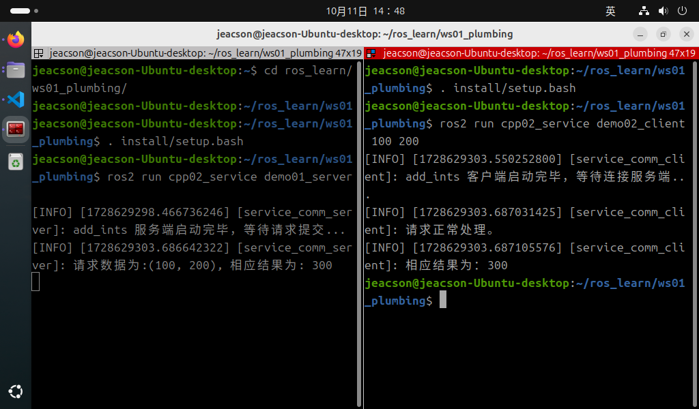

## 简介

现在，我们通过针对以下案例需求进行C++的实现，以更加深入了解服务通信。

### 案例需求&案例分析

需求：编写服务通信，客户端可以提交两个整数到服务端，服务端接收请求并解析两个整数求和，然后将结果响应回客户端。

分析：在上述需求中，我们需要关注以下三个要素：

1. 客户端；
2. 服务端；
3. 消息载体。

### 流程简介

案例实现前需要自定义服务接口。

在接口准备完毕后，服务通信实现的主要步骤如下：

1. 编写服务端实现；
2. 编写客户端实现；
3. 编辑配置文件；
4. 编译；
5. 执行。

### 准备工作

参考[前文](./2024_10_03.md)

---

## 服务通信的 C++ 实现

### 1. 编写服务端实现

功能包 `cpp02_service` 的 `src` 目录下，新建 C++ 文件 `demo01_server.cpp`，并编辑文件，输入如下内容：

```cpp
/*
    需求：编写服务端，接收客户端发送请求，提取其中两个整型数据，相加后将结果响应回客户端。
    步骤：
        1. 包含头文件；
        2. 初始化 ROS2 客户端
        3. 自定义节点类：
            3-1. 创建服务端；
            3-2. 处理请求数据并响应结果。
        4. 调用spin函数，并传入节点对象指针；
        5. 释放资源。
 */

// 1. 包含头文件；
#include "rclcpp/rclcpp.hpp"
#include "base_interfaces_demo/srv/add_ints.hpp"

using base_interfaces_demo::srv::AddInts;

using std::placeholders::_1;
using std::placeholders::_2;

// 3. 自定义节点类：
class MinimalService : public rclcpp::Node
{
    public: 
        MinimalService() : Node("minimal_service"){

        // 3-1. 创建服务端；

        /*
            参数：
                1. 话题名称；
                2. 回调函数；
            返回值：服务端对象指针。
         */

        server_ = this->create_service<AddInts>("add_ints", std::bind(&MinimalService::add, this, _1, _2)); 
        RCLCPP_INFO(this->get_logger(),"add_ints 服务端启动完毕，等待请求提交..."); 

        } 

    private: 
        rclcpp::Service<AddInts>::SharedPtr server_;    

        // 3-2.处理请求数据并响应结果。   
        void add(const AddInts::Request::SharedPtr req,const AddInts::Response::SharedPtr res){

            res->sum = req->num1 + req->num2;      
            RCLCPP_INFO(this->get_logger(),"请求数据:(%d,%d),响应结果:%d", req->num1, req->num2, res->sum);
        }
};

int main(int argc, char *argv[])
{
    // 2. 初始化 ROS2 客户端
    rclcpp::init(argc, argv);

    // 4. 调用spin函数，并传入节点对象指针。
    auto server = std::make_shared<MinimalService>();
    rclcpp::spin(server);

    // 5.释放资源;
    rclcpp::shutdown();
    return 0; 
} 

```

### 2. 编写客户端实现

功能包 `cpp02_service` 的 `src` 目录下，新建 C++ 文件 `demo02_client.cpp`，并编辑文件，输入如下内容：

```cpp
/*

  需求：编写客户端，发送两个整型变量作为请求数据，并处理响应结果。   
  步骤：
      1. 包含头文件；
      2. 初始化 ROS2 客户端；
      3. 自定义节点类；
        3-1. 创建客户端；
        3-2. 等待服务连接。
        3-3. 组织请求数据并发送。
      4. 创建对象指针调用其功能，并处理响应结果；
      5. 释放资源。 
*/

// 1.包含头文件；
#include "rclcpp/rclcpp.hpp"
#include "base_interfaces_demo/srv/add_ints.hpp"

using base_interfaces_demo::srv::AddInts;

using namespace std::chrono_literals;

// 3.自定义节点类；

class MinimalClient : public rclcpp::Node 
{

  public:  
    MinimalClient():Node("minimal_client"){      
     // 3-1. 创建客户端；  
    /*
        模板：消息类型；
        参数：
            1. 话题名称（与发布方应保持一致）

        返回值：客户端对象指针
         
     */
        client_ = this->create_client<AddInts>("add_ints");
        RCLCPP_INFO(this->get_logger(),"add_ints 客户端已创建，等待连接服务端..."); 

    }

    // 3-2. 等待服务链接；    
    bool connect_server() {
        while (!client_->wait_for_service(1s))
        {
            if (!rclcpp::ok())
            {
                RCLCPP_INFO(rclcpp::get_logger("rclcpp"),"强制退出！"); 
                return false;
            }

            RCLCPP_INFO(this->get_logger(),"add_ints 服务端连接中，请稍候..."); 
        }
        return true;
    }

    // 3-2. 组织请求数据并发送；
    rclcpp::Client<AddInts>::FutureAndRequestId send_request(int23_t num1, int23_t num2) {
        auto request_ = std::make_shared<AddInts::Request>();
        request_->num1 = num1;
        request_->num2 = num2;

        return client_->async_send_request(request);
    }

  private:
      rclcpp::Client<AddInts>::SharedPtr client_; 

};

int main(int argc, char *argv[])
{  
    if (argc != 3) {
        RCLCPP_INFO(rclcpp::get_logger("rclcpp"),"请提交两个整型数据！"); 
        return 1;
    }

    // 2. 初始化 ROS2 客户端；  
    rclcpp::init(argc, argv);  

    // 4. 创建对象指针调用其功能； 
    auto client = std::make_shared<MinimalClient>();   
    bool flag = client->connect_server();

    if (!flag) {
        RCLCPP_INFO(rclcpp::get_logger("rclcpp"),"服务连接失败！"); 
        return 0;
    }   

    auto response = client->send_request(atoi(argv[1]),atoi(argv[2]));

    // 4. 处理响应结果；  
    if (rclcpp::spin_unitl_future_complete(client, response) == rclcpp::FutureReturnCode::SUCCESS){
        RCLCPP_INFO(client->get_logger(),"请求正常处理。")
        RCLCPP_INFO(client->get_logger(),"响应结果为：%d!", response.get()->sum);
    } else {
        RCLCPP_INFO(client->get_logger(),"请求异常")
    }

    // 5. 释放资源；  
    rclcpp::shutdown();  
    return 0; 
}

```

### 3. 编辑配置文件

在 C++ 功能包中，配置文件需要关注 `package.xml` 与 `CMakeLists.txt` 。如果是自建的文件，需要针对各个文件进行附加配置。

#### Ⅰ. package.xml

在创建功能包时，所依赖的功能包已经自动配置了，配置内容如下：

```xml
<!-- package.xml -->
<depend>rclcpp</depend>
<depend>base_interfaces_demo</depend>
```

需要说明的是：

1. 如果自建的节点有新引入相关功能包，需要针对各个节点文件进行功能包的附加配置。

#### Ⅱ. CMakeLists.txt

CMakeLists.txt中发布和订阅程序核心配置如下：

```txt
find_package(rclcpp REQUIRED)
find_package(base_interfaces_demo REQUIRED) 

add_executable(demo01_server src/demo01_server.cpp) ament_target_dependencies(  
  demo01_server  
  "rclcpp"  
  "base_interfaces_demo" 
) 

add_executable(demo02_client src/demo02_client.cpp) ament_target_dependencies(  
 demo02_client  
 "rclcpp"  
 "base_interfaces_demo" 
) 

install(TARGETS  
 demo01_server  
 demo02_client  
 DESTINATION lib/${PROJECT_NAME})
```

需要说明的是：如果有自建的节点被新引入，则需要针对各个节点文件进行以下操作：

1. 如果自建的节点有新引入相关功能包，需要通过设置 `find_package` 针对各个节点进行功能包的附加配置；
2. 自建的节点需要附加配置 `add_executable`、  `ament_target_dependencies` 和 `install` 三个配置项, 其中：

    - `add_executable` 需要添加其节点名和文件所在位置；
    - `ament_target_dependencies` 需要针对各个节点文件添加其节点名和其所引用的功能包名；
    - `install` 内需要添加其节点名

### 4. 编译

终端中进入当前工作空间，编译功能包：

```shell
colcon build --packages-select cpp02_service
```

### 5. 执行

当前工作空间下，启动两个终端，终端1执行发布程序，终端2执行订阅程序。

终端1输入如下指令：

```shell
. install/setup.bash
ros2 run cpp02_service demo01_server
```

终端2输入如下指令：

```shell
. install/setup.bash
ros2 run cpp02_service demo02_client
```

最终运行结果应与下图类似。



::: tip spin函数的作用
主函数中执行 `spin` 函数会使主程序挂起，通过之前传入的节点对象指针进入该节点对象，并执行其内部的回调函数。因此简言之，spin函数可用于调用节点对象内的回调函数，如果没有 `spin` 函数，则该回调函数不会被执行。
:::

## 总结

尝试使用 C++ 实现 **服务通信** 后，你可以尝试 [使用Python 实现服务通信](./2024_10_03_004.md)，或者 回到 [ROS2-005-通信机制：服务通信](./2024_09_19_002.md#总结) 以查看本节的总结。
