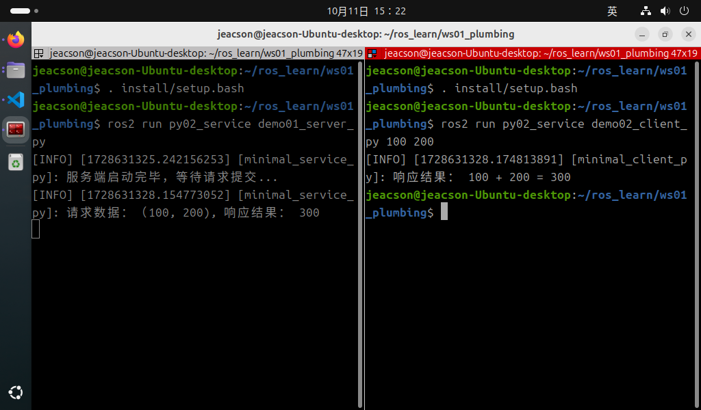

## 服务通信的Python实现

现在，我们通过针对以下案例需求进行Python的实现，以更加深入了解服务通信。

### 案例需求&案例分析

需求：编写服务通信，客户端可以提交两个整数到服务端，服务端接收请求并解析两个整数求和，然后将结果响应回客户端。

分析：在上述需求中，我们需要关注以下三个要素：

1. 客户端；
2. 服务端；
3. 消息载体。

### 流程简介

案例实现前需要自定义服务接口。

在接口准备完毕后，服务通信实现的主要步骤如下：

1. 编写服务端实现；
2. 编写客户端实现；
3. 编辑配置文件；
4. 编译；
5. 执行。

### 准备工作

参考[前文](./2024_10_03.md)

---

## 服务通信的 Python 实现

### 1. 编写服务端实现

功能包 `py02_service` 的 `py02_service` 目录下，新建 Python 文件 `demo01_server_py.py`，并编辑文件，输入如下内容：

``` python
"""      

  需求：编写服务端，接收客户端发送请求，提取其中两个整型数据，相加后将结果响应回客户端。
  步骤：        
      1.导包；        
      2.初始化 ROS2 客户端；        
      3. 自定义节点类：
        3-1. 创建服务端；
        3-2. 处理请求数据并响应结果；        
      4.调用spin函数，并传入节点对象；        
      5.释放资源。
"""
# 1.导包；
import rclpy
from rclpy.node import Node
from base_interfaces_demo.srv import AddInts

# 3.定义节点类；
class MinimalService(Node):
    
    def __init__(self):
        super().__init__('minimal_service_py')

        # 3-1.创建服务端；
        """
            参数：
                1. 消息类型
                2. 话题名称
                3. QOS.（队列长度）
            返回值：发布方对象。
        """

        self.srv_ = self.create_service(AddInts, 'add_ints', self.add_two_ints_callback)
    self.get_logger().info("服务端启动完毕，等待请求提交...")

    # 3-2.处理请求数据并响应结果；
    """
        参数：
            1. 时间间隔
            2. 回调函数
        返回值：定时器对象。
    """
    def add_two_ints_callback(self, request, response):             

        response.sum = request.num1 + request.num2
        self.get_logger().info('请求数据:(%d,%d),响应结果:%d' % (request.num1, request.num2, response.sum))
        return response

def main(args=None):    
   # 2.初始化 ROS2 客户端；    
    rclpy.init(args=args)    

   # 4.调用spin函数，并传入节点对象；    
    minimal_service = MinimalService()    
    rclpy.spin(minimal_service)    

   # 5.释放资源。
    rclpy.shutdown()

if __name__ == '__main__':    
  main()

```

编写完服务端之后，我们可以使用以下方法对其进行调试，测试其是否可以使用：

在该工作空间内编译完功能包后，开启该服务端：

```shell
colcon build --packages-select py02_service
. install/setup.bash
ros2 run py02_service demo01_server
```

新建另一个终端，cd进入该工作空间后：

```shell
. install/setup.bash
ros2 service call add_ints base_interfaces_demo/srv/AddInts "{'num1': 10, 'num2': 30}"
```

关键指令 `ros2 service call add_ints base_interfaces_demo/srv/AddInts "{'num1': 10, 'num2': 30}"` 中的相关参数含义如下：

1. **add_ints** 为该服务端内的话题名称；
2. **base_interfaces_demo/srv/AddInts** 为声明（指定）需要提交的数据的类型；
3. **"{'num1': 10, 'num2': 30}"** 为一个JSON格式的、使用英文双引号包裹的`字符串`，其中需要包含需要提交给服务端的相关数据，在这里为两个整型数据。

### 2. 编写客户端实现

功能包 `py02_service` 的 `py02_service` 目录下，新建 `Python` 文件 `demo02_client_py.py` ，并编辑文件，输入如下内容：

```python
"""
  需求：编写客户端，在校验个数后，发送两个整型变量作为请求数据，并处理响应结果。     
  步骤：      
      1. 导包；        
      2. 初始化 ROS2 客户端；        
      3. 自定义节点类；            
        3-1. 创建客户端；
        3-2. 等待服务连接。
        3-3. 组织请求数据并发送。    
      4. 创建对象并调用其功能，并处理响应结果；
      5. 释放资源。 

"""

# 1.导包；
import sys
import rclpy
from rclpy.node import Node
from rclpy.logging import get_logger
from base_interfaces_demo.srv import AddInts

# 3.自定义节点类；
class MinimalClients(Node):
    
    def __init__(self):
        super().__init__("minimal_client_py")  
          
    # 3-1.创建客户端；  
    """
        参数：
            1. 消息类型；
            2. 话题名称（与发布方应保持一致）
            3. 回调函数；
            4. QOS：队列长度；
        返回值：订阅对象

    """
     self.cli_ = self.create_client(AddInts, "add_ints")
    # 3-2. 等待服务连接。
    while not self.cli_.wait_for_service(timeout_sec=1.0):
        self.get_logger().info("服务连接中，请稍后。。。")
    self.req = AddInts.Request()

    # 3-3. 组织请求数据并发送。
    def send_request(self):
   
        self.req.num1 = int(sys.argv[1])
        self.req.num2 = int(sys.argv[2])
        self.future = self.cli_.call_async(self.req)


def main():
{  
    # 校验操作
    if len(sys.argv) != 3:
        get_logger("rclpy").info("请提交两个整型数据！")
        return

    # 2. 初始化 ROS2 客户端;
    rclpy.init()  

    # 4. 创建对象并调用其功能;
    minimal_client = MinimalClient()
    minimal_client.send_request()

    # 4. 处理响应结果;
    rclpy.spin_until_future_complete(minimal_client, minimal_client.future)
    try:
        response = minimal_client.future.result()
    except Exception as e:
        minimal_client.get_logger().info("服务请求失败：%r" % (e, ))
    else:
        minimal_client.get_logger().info("响应结果：%d + %d = %d" % (minimal_client.req.num1, minimal_client.req.num2, response.sum))

    # 5. 释放资源;
    rclpy.shutdown()
}

if __name__ == '__main__':    
  main()

```

以下有多个注意事项，还请了解：

::: tip ①、如何在节点对象外获取日志对象？

在上述代码中，由于运行逻辑的限制以及出于对性能优化的考虑，我们需要在初始化节点对象前先对用户所输入的对象进行参数校验。一旦发现参数校验失败，需要通过日志对象对用户进行提示。而由于日志对象是节点对象内的一个内置函数，我们需要通过其他的方式访问该日志对象。

除通过节点对象调用日志函数外，我们可以在使用：

```python

    from rclpy.logging import get_logger

```

导入相关函数之后，直接使用 `get_logger()` 进行函数的获取。其中 `get_logger()` 需要传入字符串类型的变量名，例如上述代码中所用到的 `get_logger("rclpy")` 内的 `"rclpy"`。

这种方法一般会在没有创建节点对象，或者在节点对象已被销毁的情况下使用。

:::

::: tip ②、为什么这里的客户端不使用spin函数进行之前的挂起操作了？

在本节**这个**服务通信的案例中，客户端针对相关请求只需发送一次，因此在这执行逻辑上，再次挂起客户端意义不大。并且该客户端没有在自定义类中定义相关需要使用 `spin()` 函数进行操作的回调函数，实现中也并不需要使用除 `spin_unitl_future_complete()` 函数外的其他回调函数进行数据处理，因此在这里不必要再在请求结束后继续使用spin函数进行之前的挂起操作。这会与之前的相关操作有些不同，还请注意。

:::

### 3. 编辑配置文件

在 `Python` 功能包中，配置文件需要关注 `package.xml` 与 `setup.py` 。如果是自建的文件，需要针对各个文件进行附加配置。

#### Ⅰ. package.xml

在创建功能包时，所依赖的功能包已经自动配置了，配置内容如下：

```xml
<!-- package.xml -->
<depend>rclpy</depend>
<depend>base_interfaces_demo</depend>
```

需要说明的是：

1. 如果自建的节点有新引入相关功能包，需要针对各个节点文件进行功能包的附加配置。

#### Ⅱ. setup.py

setup.py中发布和订阅程序核心配置如下：

```py
......
 
setup(
    ......
    entry_points={
        'console_scripts': [
            'demo01_server_py = py02_service.demo01_server_py:main',
            'demo02_client_py = py02_service.demo02_client_py:main',
        ],
    },
)
```

需要说明的是：如果有自建的节点被新引入，则需要针对各个节点文件进行以下操作：

1. 自建的节点需要附加配置 `console_scripts` 配置项, 为编译器提供可执行程序位置，格式为：

    - '节点名 = 节点所在包名.节点名:main'

一般直接将原本程序生成的代码复制下来进行修改即可，因此这里的‘节点所在包名’都相同。

### 4. 编译

终端中进入当前工作空间，编译功能包：

```shell
colcon build --packages-select py02_service
```

### 5. 执行

当前工作空间下，分别启动两个终端，先在终端1执行服务端，然后在终端2执行客户端。

终端1输入如下指令：

```shell
. install/setup.bash
ros2 run py02_service demo01_server_py
```

终端2输入如下指令：

```shell
. install/setup.bash
ros2 run py02_service demo02_client_py 100 200 
```

最终运行结果应与下图类似。



::: tip 必须要先开启服务端！
在进行服务通信时必须保证客户端能够正常连接到服务端，才能够使得客户端在发送请求时相关数据不会丢失。因此必须先开启服务端，再开启客户端。
:::

## 总结

尝试使用 Python 实现 **服务通信** 后，你可以尝试 [使用 C++ 实现服务通信](./2024_10_03_003.md)，或者 回到 [ROS2-005-通信机制：服务通信](./2024_10_03.md#总结) 以查看本节的总结。
