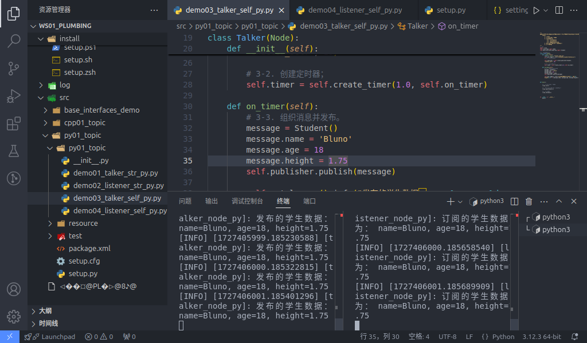

## 服务通信的Python实现

现在，我们通过针对以下案例需求进行Python的实现，以更加深入了解服务通信。

### 案例需求&案例分析

需求：编写服务通信，客户端可以提交两个整数到服务端，服务端接收请求并解析两个整数求和，然后将结果响应回客户端。

分析：在上述需求中，我们需要关注以下三个要素：

1. 客户端；
2. 服务端；
3. 消息载体。

### 流程简介

案例实现前需要自定义服务接口。

在接口准备完毕后，服务通信实现的主要步骤如下：

1. 编写服务端实现；
2. 编写客户端实现；
3. 编辑配置文件；
4. 编译；
5. 执行。

### 准备工作


参考[前文](./2024_10_03.md)

---

## 服务通信的 Python 实现

::: tip 后续还在修改！
下文还未修改！！！！
:::

### 1. 编写服务端实现

功能包 `py01_topic` 的 `py01_topic` 目录下，新建 Python 文件 `demo03_talker_self_py.py`，并编辑文件，输入如下内容：

``` python
"""      

  需求：以某个固定频率发送文本“学生信息”，其包括学生的年龄、姓名、身高等数据。  
  步骤：        
      1.导包；        
      2.初始化 ROS2 客户端；        
      3.定义节点类；            
        3-1.创建发布方；            
        3-2.创建定时器；            
        3-3.组织消息并发布。        
      4.调用spin函数，并传入节点对象；        
      5.释放资源。
"""
# 1.导包；
import rclpy
from rclpy.node import Node
from base_interfaces_demo.msg import Student

# 3.定义节点类；
class MinimalPublisher(Node):    

  def __init__(self):
    super().__init__('minimal_publisher_py')

    # 3-1.创建发布方；
    """
        参数：
            1. 消息类型
            2. 话题名称
            3. QOS.（队列长度）
        返回值：发布方对象。
    """

    self.publisher_ = self.create_publisher(Student, 'topic_self', 10)

    # 3-2.创建定时器；
    """
        参数：
            1. 时间间隔
            2. 回调函数
        返回值：定时器对象。
    """
    timer_period = 0.5
    self.timer = self.create_timer(timer_period, self.timer_callback)
    # 创建计数器
    self.counter = 0

    # 3-3.组织消息并发布。
    def timer_callback(self):
    msg = Student()
    msg.name = 'Ankh';
    msg.age = 18 + self.counter;
    msg.height = 1.65;
    self.publisher_.publish(msg)
    self.get_logger().info('发布的消息: name=%s, age=%d, height=%.2f', % (msg.name, msg.age, msg.height))    
    self.counter += 1

def main(args=None):    
   # 2.初始化 ROS2 客户端；    
    rclpy.init(args=args)    

   # 4.调用spin函数，并传入节点对象；    
    minimal_publisher = MinimalPublisher()    
    rclpy.spin(minimal_publisher)    

   # 5.释放资源。
    rclpy.shutdown()

if __name__ == '__main__':    
  main()

```

### 2. 编写客户端实现

功能包 `py01_topic` 的 `py01_topic` 目录下，新建 `Python` 文件 `demo04_listener_self_py.py` ，并编辑文件，输入如下内容：

```python
"""
  需求：订阅发布方发布的学生消息，并输出到终端。    
  步骤：      
      1.包含头文件；        
      2.初始化 ROS2 客户端；        
      3.自定义节点类；            
        3-1.创建订阅方；            
        3-2.处理订阅到的消息。        
      4.调用spin函数，并传入节点对象指针；        
      5.释放资源。 

"""

# 1.包含头文件；
import rclpy
from rclpy.node import Node
from base_interfaces_demo.msg import Student

# 3.自定义节点类；
class MinimalSubscriber(Node):
    
    def __init__(self):
        super().__init__("minimal_subscriber_py")    
    # 3-1.创建订阅方；  
    """
        参数：
            1. 消息类型；
            2. 话题名称（与发布方应保持一致）
            3. 回调函数；
            4. QOS：队列长度；
        返回值：订阅对象

    """

     self.subscription = self.create_subscription(Student, "topic_self", self.listener_callback, 10)
    
    def listener_callback(self, msg):

        # 3-2.处理订阅到的消息；    
        self.get_looger().info("订阅的消息: name=%s, age=%d, height=%.2f", % (msg.name, msg.age, msg.height)) 


def main():
{  
    # 2.初始化 ROS2 客户端;
    rclpy.init()  

    # 4.调用spin函数，并传入节点对象。
    minimal_subscriber = MinimalSubscriber()
    rclpy.spin(minimal_subscriber);  
    # 5.释放资源;
    rclpy.shutdown()
}

if __name__ == '__main__':    
  main()

```

### 3. 编辑配置文件

在 `Python` 功能包中，配置文件需要关注 `package.xml` 与 `setup.py` 。如果是自建的文件，需要针对各个文件进行附加配置。

#### Ⅰ. package.xml

在创建功能包时，所依赖的功能包已经自动配置了，配置内容如下：

```xml
<!-- package.xml -->
<depend>rclpy</depend>
<depend>std_msgs</depend>
<depend>base_interfaces_demo</depend>
```

需要说明的是：
1. 在本案例中, `<depend>std_msgs</depend>` 不是必须的。
2. 如果自建的节点有新引入相关功能包，需要针对各个节点文件进行功能包的附加配置。

#### Ⅱ. setup.py

setup.py中发布和订阅程序核心配置如下：

```py
......
 
setup(
    ......
    entry_points={
        'console_scripts': [
            'demo03_talker_self_py = py01_topic.demo03_talker_self_py:main',
            'demo04_listener_self_py = py01_topic.demo04_listener_self_py:main',
        ],
    },
)
```

需要说明的是：如果有自建的节点被新引入，则需要针对各个节点文件进行以下操作：

1. 自建的节点需要附加配置 `console_scripts` 配置项, 为编译器提供可执行程序位置，格式为：

    - '节点名 = 节点所在包名.节点名:main'

一般直接将原本程序生成的代码复制下来进行修改即可，因此这里的‘节点所在包名’都相同。

### 4. 编译

终端中进入当前工作空间，编译功能包：
```shell
colcon build --packages-select py01_topic
```

### 5. 执行

当前工作空间下，启动两个终端，终端1执行发布程序，终端2执行订阅程序。 

终端1输入如下指令：

```shell
. install/setup.bash
ros2 run py01_topic demo03_talker_self_py
```

终端2输入如下指令：

```shell
. install/setup.bash
ros2 run py01_topic demo04_listener_self_py
```

最终运行结果应与下图类似。



## 总结

尝试使用 Python 实现 **服务通信** 后，你可以尝试 [使用 C++ 实现服务通信](./2024_10_03_003.md)，或者 回到 [ROS2-005-通信机制：服务通信](./2024_09_19_002.md#总结) 以查看本节的总结。

