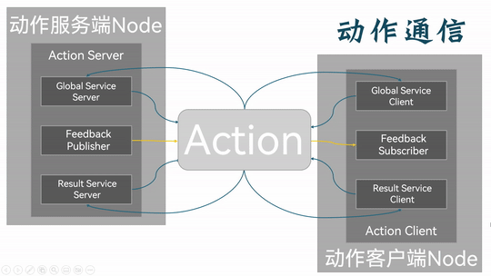

## 简介

**动作通信** (Action Communication) 同样是一种基于 `请求响应` 的方式，以实现不同节点之间数据传输的通信模式。其中发送请求数据的对象称为 **客户端**，接受请求并发送数据相应的对象称之为 **服务端**。为了与前文的 [服务通信](./2024_10_03.md) 相区分，将这里的客户端称为动作客户端，服务端称为动作服务端。

在结构上，动作通信由目标、反馈和结果三个部分组成,因此和 **服务通信** 不同的是，**动作通信** 可以在请求响应过程中获取连续反馈，并且也可以向动作服务端发送任务取消请求。

在底层实现上，动作通信是建立在话题通信和服务通信之上的，目标的发送与结果的获取是通过对服务通信封装来实现的，而连续反馈则是通过对话题通信的封装来实现的，动作通信本质上是话题通信和服务通信的结合体。因此与前两种通信一样，动作客户端和动作服务端通过话题(Topic)相关联，动作客户端和动作服务端可以互相进行数据传输交互。在服务通信中，消息的流向也是双向的。

对于两个使用动作通信进行交流的节点（以下称为A、B）而言，这两个节点的动作通信整体流程如下：

1. 节点A的动作客户端发送 **目标请求**（即动作目标）至节点B的动作服务端。动作服务端会基于当前状态、资源是否可用等条件，决定该目标是否可以被节点B自身接受。若可以，节点B的动作服务端返回 **目标接受响应** 至节点A的动作客户端，并生成一个 **Goal ID** 作为唯一标识符，以标识该任务。

    

2. 节点A的动作客户端发送目标执行请求至节点B的动作服务端。节点B开始执行相关请求，并且节点B的动作服务端在执行过程中返回连续的处理结果给节点A的动作客户端作为实时反馈。

    

3. 节点B执行相关请求完毕，将最终结果通过节点B的动作服务端返回至节点A的动作客户端。流程结束。

    

其中，在节点B执行相关请求的场合下，节点A的动作客户端可以通过对节点B的动作服务端发送 **取消目标请求** 取消正在执行的任务，并在节点B的动作服务端检查当前任务的状态，决定可以取消任务后，取消相关任务并结束相关动作通信。

因此，动作通信一般更适用于长时间运行的任务以及相对耗时的请求响应场景，用以获取连续的状态反馈信息。

## 动作通信的简单实现

现在，我们通过针对以下案例需求进行C++与Python的分别实现，以更加深入了解动作通信。

### 案例需求&案例分析

需求：编写动作通信，动作客户端提交一个整型数据N，动作服务端接收请求数据并累加1-N之间的所有整数，将最终结果返回给动作客户端，且每累加一次都需要计算当前运算进度并反馈给动作客户端。

分析：在上述需求中，我们需要关注以下三个要素：

1. 动作客户端；
2. 动作服务端；
3. 消息载体。

### 流程简介

案例实现前需要自定动作接口。

在接口准备完毕后，动作通信实现的主要步骤如下：

1. 编写动作服务端实现；
2. 编写动作客户端实现；
3. 编辑配置文件；
4. 编译；
5. 执行。

案例会采用C++和Python分别实现，且二者都遵循上述实现流程。

### 准备工作

终端下创建工作空间：

```shell
mkdir -p ws01_plumbing/src
cd ws01_plumbing/src
colcon build
```

进入工作空间的src目录:

```shell
cd src/
```

调用如下命令创建之后会用到的接口功能包:

```shell
ros2 pkg create --build-type ament_cmake base_interfaces_demo

```

调用如下两条命令分别创建C++功能包、Python功能包及其所需服务端节点:

**C++:**

```shell
ros2 pkg create cpp03_action --build-type ament_cmake --dependencies rclcpp rclcpp_action base_interfaces_demo --node-name demo01_action_server
```

**Python:**

```shell
 ros2 pkg create py03_action --build-type ament_python --dependencies rclpy base_interfaces_demo --node-name demo01_action_server_py
```

在接口功能包中自定义服务接口消息文件：

具体实现请参考[这里](./2024_10_15_002.md)

准备工作到此完毕。

---

接下来你便可以通过 [C++](./2024_10_16.md) 和 [Python](./2024_10_16_002.md) 来分别实现服务通信了。

## 总结

在这一节中，我们系统的阐述了如何依据服务通信相关原理，通过自行操作，实现节点之间简单的服务通信。
