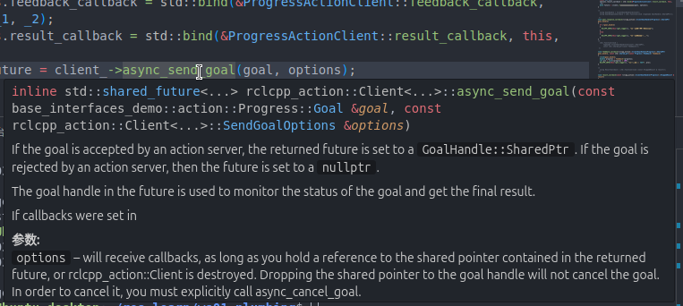
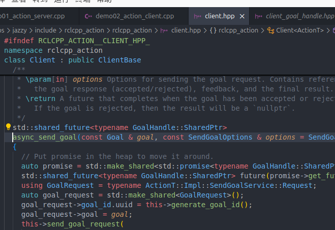
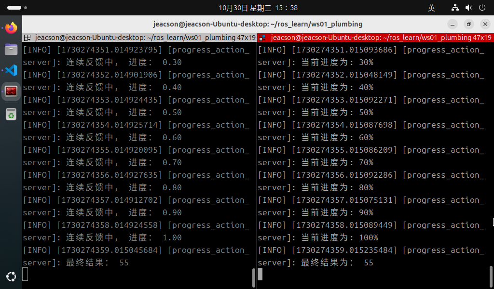

## 简介

现在，我们通过针对以下案例需求进行C++的实现，以更加深入了解动作通信。

### 案例需求&案例分析

需求：编写动作通信，动作客户端提交一个整型数据N，动作服务端接收请求数据并累加1-N之间的所有整数，将最终结果返回给动作客户端，且每累加一次都需要计算当前运算进度并反馈给动作客户端。

分析：在上述需求中，我们需要关注以下三个要素：

1. 动作客户端；
2. 动作服务端；
3. 消息载体。

### 流程简介

案例实现前需要自定义动作接口。

在接口准备完毕后，动作通信实现的主要步骤如下：

1. 编写动作服务端实现；
2. 编写动作客户端实现；
3. 编辑配置文件；
4. 编译；
5. 执行。

### 准备工作

参考[前文](./2024_10_15.md)

---

## 动作通信的 C++ 实现

### 1. 编写动作服务端实现

功能包 `cpp03_action` 的 `src` 目录下，新建 C++ 文件 `demo01_action_server.cpp`，并编辑文件，输入如下内容：

```cpp
/*
    需求：编写动作服务端，需要解析客户端提交的整型数字，遍历该数字并累加求和，
         最终结果需要响应会客户端。且请求响应过程中需要生成连续反馈。
    分析：
        1. 创建动作服务端对象；
        2. 处理动作客户端所提交的目标值；
        3. 生成连续反馈；
        4. 响应最终结果；
        5. 处理取消请求。
    步骤：
        1. 包含头文件；
        2. 初始化 ROS2 客户端
        3. 自定义节点类：
            3-1. 创建动作服务端对象；
            3-2. 处理动作客户端所提交的目标值 (通过专门的回调函数实现)；
            3-3. 处理取消请求 (通过专门的回调函数实现)。
            3-4. 生成连续反馈并响应最终结果 (通过专门的回调函数实现)；
        4. 调用spin函数，并传入节点对象指针；
        5. 释放资源。
 */

// 1. 包含头文件；
#include "rclcpp/rclcpp.hpp"
#include "rclcpp_action/rclcpp_action.hpp"
#include "base_interfaces_demo/action/progress.hpp"

using std::placeholders::_1;
using std::placeholders::_2;

// 3. 自定义节点类：
class ProgressActionServer : public rclcpp::Node
{
    public: 
        ProgressActionServer() : Node("progress_action_server"){
            RCLCPP_INFO(this->get_logger(),"action 服务端已创建！");
            // 3-1. 创建动作服务端对象；
            /*
                参数：
                    1. 话题名称；
                    2. 回调函数；
                        2-1. 处理提交目标的回调函数；
                        2-2. 处理取消请求的回调函数；
                        2-3. 生成连续反馈并响应最终结果的回调函数；
                返回值：动作服务端对象指针。
            
            */
            server_ = rclcpp_action::create_server<Progress>(
                this,
                "get_sum",
                std::bind(&ProgressActionServer::handler_goal, this, _1, _2),
                std::bind(&ProgressActionServer::handler_cancel, this, _1),
                std::bind(&ProgressActionServer::handler_accept, this, _1),
            );

        } 

            // 3-2. 处理动作客户端所提交的目标值 (通过专门的回调函数实现)；
            /*
                std::function<
                    GoalResponse(
                        const GoalUUID &, 
                        std::shared_ptr<const typename ActionT::Goal>
                    )
                >

                return GoalResponse::
             */

             rclcpp_action::GoalResponse handler_goal(
                    const rclcpp_action::GoalUUID &uuid, 
                    std::shared_ptr<const typename Progress::Goal> goal
                ) {
                    (void)uuid;
                    // 业务逻辑：判断提交的数字是否大于一，是则接收目标，否则拒绝
                    if (goal->num <= 1) {
                        RCLCPP_INFO(this->get_logger(), "提交的目标必须大于一！")；
                        return rclcpp_action::GoalResponse::REJECT;
                    }
                    RCLCPP_INFO(this->get_logger(), "提交的目标值合法！")；
                    return rclcpp_action::GoalResponse::ACCEPT_AND_EXECUTE;
                };

            // 3-3. 处理取消请求 (通过专门的回调函数实现)。
            /*
                std::function<
                    CancelResponse(
                        std::shared_ptr<ServerGoalHandle<ActionT>>
                    )
                >

                return CancelResponse::
             */
            rclcpp_action::CancelResponse handler_cancel(
                std::shared_ptr<rclcpp_action::ServerGoalHandle<Progress>> cancel_goal_handler
            ) {
                // 一般状况下，需要使用该 cancel_goal_handler 进行是否可以取消任务的判断。在该案例下就不做相关判断了。
                (void)cancel_goal_handler;
                RCLCPP_INFO(this->get_logger(), "接收任务取消请求！")； 
                return rclcpp_action::CancelResponse::ACCEPT;
            };

            // 3-4. 生成连续反馈并响应最终结果 (通过专门的回调函数实现)；
            void execute(
                std::shared_ptr<rclcpp_action::ServerGoalHandle<Progress>> accept_goal_handler) {
                    //  1. 需要生成连续反馈信息返回至客户端
                    // 相关 API:
                    /*
                        void rclcpp_action::ServerGoalHandle<base_interfaces_demo::action::Progress>::publish_feedback(std::shared_ptr<rclcpp_action::ServerGoalHandle<base_interfaces_demo::action::Progress Feesback> feedback_msg)

                        accept_goal_handler->publish_feedback();
                     */
                    //  首先获取目标值
                    int num = accept_goal_handler->get_goal()->num;
                    int sum = 0;
                    auto feedback = std::make_shared<Progress::Feedback>(); 
                    // 设置休眠
                    rclcpp::Rate rate(1.0); // 这里单位是Hz
                    // 然后遍历，在遍历中进行累加，每循环一次就计算进度，并将其作为连续反馈发布
                    for (int i = 1; i<= num; i++) {
                        sum += i;
                        double progress = i / (double)num; // 计算进度
                        feedback->progress = progress;
                        accept_goal_handler->publish_feedback(feedback);
                        RCLCPP_INFO(this->get_logger(), " 进度反馈中， 进度: %.2f", progress); 

                        // 判断是否接受到了取消请求
                        if (accept_goal_handler->is_canceling()) {
                            // 若有，则终止程序
                            result->sum = sum;
                            accept_goal_handler->canceled(result);
                            return; 
                        }
                        rate.sleep();
                    }

                    //  2. 需要生成最终响应结果
                    //  相关 API:
                    /*
                        void rclcpp_action::ServerGoalHandle<base_interfaces_demo::action::progress>::succeed(std::shared_ptr<base_interfaces_demo::action::progress Result> result_msg)
                        accept_goal_handler->succeed();
                     */
                      if (rclcpp::ok()) { // 以防万一，判断服务端是否还开启
                        // 在服务端开启状况下
                        auto result = std::make_shared<Progress::Result>();
                        result->sum = sum;
                        RCLCPP_INFO(this->get_logger(), "最终结果: %d", sum)； 
                        accept_goal_handler->succeed(result);
                      }

            };

            /*
                std::function<
                    void (
                        std::shared_ptr<ServerGoalHandle<ActionT>>
                    )
                >
             */
            void handler_accept(
                std::shared_ptr<rclcpp_action::ServerGoalHandle<Progress>> accept_goal_handler) {
                    //  新建子线程以处理耗时主逻辑实现
                    // 在这里使用匿名线程
                    std::thread(std::bind(&ProgressActionServer::execute, accept_goal_handler)).detach();
            }; 

    private: 
        rclcpp_action::Server<Process>::SharedPtr server_;

};

int main(int argc, char *argv[])
{
    // 2. 初始化 ROS2 客户端
    rclcpp::init(argc, argv);

    // 4. 调用spin函数，并传入节点对象指针。
    auto server = std::make_shared<ProgressActionServer>();
    rclcpp::spin(server);

    // 5.释放资源;
    rclcpp::shutdown();
    return 0; 
} 

```

::: tip 编码规范以避免编译警告或报错
在上述代码中，你可能会注意到许多函数里拥有类似于 `(void)xxxx;` 的片段。

``` cpp
    rclcpp_action::CancelResponse handler_cancel(
        std::shared_ptr<rclcpp_action::ServerGoalHandle<Progress>> cancel_goal_handler
    ) {

        // 这里↓
        (void)cancel_goal_handler;
        // 这里↑

        RCLCPP_INFO(this->get_logger(), "接收任务取消请求！")； 
        return rclcpp_action::CancelResponse::ACCEPT;
    };
```

该片段实际上是一种编码规范，在相关函数的传入参数未被使用的情况下，使用该代码片段进行声明，可以向编译器等说明该传入参数并未被使用，以避免编译警告或报错。这实际上也是代码规范的一部分。
:::

编写完服务端之后，我们可以使用以下方法对其进行调试，测试其是否可以使用：

在该工作空间内编译完功能包后，开启该服务端：

```shell
colcon build --packages-select cpp03_action
. install/setup.bash
ros2 run cpp03_action demo01_action_server
```

新建另一个终端，cd进入该工作空间后：

```shell
. install/setup.bash
ros2 action send_goal /get_sum base_interfaces_demo/action/Progress "{'num': 10" --feedback
```

关键指令 `ros2 action send_goal /get_sum base_interfaces_demo/action/Progress "{'num': 10}" --feedback` 中的相关参数含义如下：

1. **send_goal** 为指定发送目标请求；
2. **/get_sum** 为该服务端内的话题名称；
3. **base_interfaces_demo/action/Progress** 为声明（指定）需要提交的数据的类型；
4. **"{'num1': 10}"** 为一个JSON格式的、使用英文双引号包裹的`字符串`，其中需要包含需要提交给服务端的相关数据，在这里为一个整型数据。
5. **--feedback** 也可以写作 **-f**，声明该指令需要连续反馈信息。

::: tip 关于连续反馈与最终响应的生成
连续反馈与最终响应的生成是一个耗时操作，为了避免主线程逻辑受到阻塞，一般会单独开启另一个线程进行处理。
:::

### 2. 编写动作客户端实现

功能包 `cpp02_service` 的 `src` 目录下，新建 C++ 文件 `demo02_action_client.cpp`，并编辑文件，输入如下内容：

```cpp
/*

  需求：编写动作客户端，可以发送一个整型数据到服务端，并处理服务端的连续反馈与最终响应结果。
流程：
    前提：可以解析终端下动态函数的参数（一个整数）。
  步骤：
      1. 包含头文件；
      2. 初始化 ROS2 客户端；
      3. 自定义节点类；
        3-1. 创建动作客户端；
        3-2. 发送请求；
        3-3. 处理关于目标值的服务端响应（通过回调函数实现）；
        3-4. 处理连续反馈（通过回调函数实现）；
        3-5. 处理最终响应结果（通过回调函数实现）。
      4. 创建对象指针调用其功能；
      5. 释放资源。 
*/

// 1.包含头文件；
#include "rclcpp/rclcpp.hpp"
#include "rclcpp_action/rclcpp_action.hpp"
#include "base_interfaces_demo/action/progress.hpp"

using base_interfaces_demo::action::Progress;
using namespace std::chrono_literals;

// 3.自定义节点类；

class ProgressActionClient : public rclcpp::Node 
{

  public:  
    ProgressActionClient():Node("progress_action_client_node_cpp"){      
        RCLCPP_INFO(this->get_logger(),"action 客户端已创建，等待连接服务端..."); 
         // 3-1. 创建动作客户端；  
        /*
            rclcpp_action::Client<ActionT>::SharedPtr create_client<ActionT, NodeT>(
            NodeT node, 
            const std::string &name, 
            rclcpp::CallbackGroup::SharedPtr group = nullptr, 
            const rcl_action_client_options_t &options = rcl_action_client_get_default_options()
            )
            
        */
        client_ = rclcpp_action::create_client<Progress>("get_sum");

    }

    // 3-2. 发送请求；
    void send_goal(int num) {
        // 1. 确保服务端已连接
        if(!client_wait_for_action_server(10s)) {
            RCLCPP_ERROR(this->get_logger(), "服务端连接失败！");
            return;
        }
        // 2. 发送具体请求

        auto goal = Progress::Goal();
        goal.num = num;

        rclcpp_action::Client<Progress>::SendGoalOptions options;
        options.goal_response_callback = std:bind(&ProgressActionClient::goal_response_callback, this, _1);
        options.feedback_callback = std:bind(&ProgressActionClient::feedback_callback, this, _1, _2);
        options.result_callback = std:bind(&ProgressActionClient::result_callback, this, _1);

        /* std::shared_future<rclcpp_action::Client<Progress>::GoalHandle::SharedPtr> 
        rclcpp_action::Client<Progress>::async_send_goal
        (   const Progress::Goal &goal, 
            const rclcpp_action::Client<Progress>::SendGoalOptions &options 
            = rclcpp_action::Client<Progress>::SendGoalOptions()
        )
        */

        auto future = client_->async_send_goal(goal, options);
        return true;
    }

    // 3-3. 处理关于目标值的服务端响应（通过回调函数实现）；
    /*
        using GoalHandle = rclcpp_action::ClientGoalHandle<Progress>;
        std::function<void (typename GoalHandle::Sharedptr)> goal_response_callback

     */
    void goal_response_callback(rclcpp_action::ClientGoalHandle<Progress>::Sharedptr goal_handle) {
        if (!goal_handle) {
            RCLCPP_INFO(this->get_logger(), "目标请求被服务端拒绝！");
        } else {
            RCLCPP_INFO(this->get_logger(), "目标请求处理中...");
        }
    }

    // 3-4. 处理连续反馈（通过回调函数实现）；
    /*
        using GoalHandle = rclcpp_action::ClientGoalHandle<Progress>;
        std::function<void (
            typename GoalHandle::Sharedptr,
            const std::shared_ptr<const Feedback>
            )> 
     */
    void feedback_callback(
        rclcpp_action::ClientGoalHandle<Progress>::Sharedptr goal_handle, 
        const std::shared_ptr<const Progress::Feedback> feedback
    ) {
      (void)goal_handle;
      double progress = feedback->progress;
      int pro = (int)(progress * 100);
      RCLCPP_INFO(this->get_logger(), "当前的进度为： %d%%", pro);  
    }

    // 3-5. 处理最终响应结果（通过回调函数实现）。
    /*
        using ResultCallback = std::function<void (
        const rclcpp_action::ClientGoalHandle<Progress>::WrappedResult &result)>
     */
    void result_callback(const rclcpp_action::ClientGoalHandle<Progress>::WrappedResult &result) {
        // 通过状态码 return.code 判断最终结果状态
        
        if (return.code == rclcpp_action::ResultCode::SUCCEED) {
            RCLCPP_INFO(this->get_logger(), "最终结果为: %ld", result.result->sum);
        } else if (result.code == rclcpp_action::ResultCode::ABORTED) {
            RCLCPP_INFO(this->get_logger(), "被中断。");

        } else if (result.code == rclcpp_action::ResultCode::CANCELED) {
            RCLCPP_INFO(this->get_logger(), "被取消。");

        } else {
            RCLCPP_INFO(this->get_logger(), "未知异常。。");
        }
    }

  private:
      rclcpp_action::Client<Progress>::SharedPtr client_; 

};

int main(int argc, char *argv[])
{  
    if (argc != 2) {
        RCLCPP_ERROR(rclcpp::get_logger("rclcpp"),"请提交‘一个’整型数据！"); 
        return 1;
    }

    // 2. 初始化 ROS2 客户端；  
    rclcpp::init(argc, argv);  

    // 4. 创建对象指针调用其功能； 
    auto client = std::make_shared<ProgressActionClient>();   
    client->send_goal(atoi(argv[1]));
    rclcpp::spin(client);

    // 5. 释放资源；  
    rclcpp::shutdown();  
    return 0; 
}

```

以下有多个注意事项，还请了解：

::: tip ①、如何在节点对象外获取日志对象？

在上述代码中，由于运行逻辑的限制以及出于对性能优化的考虑，我们需要在初始化节点对象前先对用户所输入的对象进行参数校验。一旦发现参数校验失败，需要通过日志对象对用户进行提示。而由于日志对象是节点对象内的一个内置函数，我们需要通过其他的方式访问该日志对象。

除通过节点对象调用日志函数外，我们可以使用 `rclcpp::get_logger()` 进行 `get_logger()` 函数的获取。其中 `get_logger()` 需要传入字符串类型的变量名，例如上述代码中所用到的 `get_logger("rclcpp")` 内的 `"rclcpp"`。

这种方法一般会在没有创建节点对象，或者在节点对象已被销毁的情况下使用。

:::

::: tip ②、通过查看源码的方式，针对各个函数的指定传参进行代码定义工作

上述代码中有多个回调用函数以及相关主要函数需要传入ros指定类型的参数。例如以下代码：

```cpp
    ...
    auto future = client_->async_send_goal(goal, options);
    ...
```

这里的 `async_send_goal` 函数就是一个已经被ROS定义相关传参，需要确认传入参数类型的函数。初学 ROS 时，如果在之前并没有书写过 C++ ，那么这里的理解上可能会较为吃力。在这里推荐使用  VSCode 中与 C++ 相关的插件，这样可以在正确引用该函数之后，通过将鼠标移动到该函数上，或者按住 `cntl` 之后左键单击该函数进行相关源码的检索。





:::

::: tip ③、使用"rclcpp_action::ResultCode"间接进行状态码检索

在通过回调函数实现处理最终响应结果时，我们通过状态码 `return.code` 判断最终结果的状态。在这里的状态码一共有四个，存在于一个枚举类中。它们分别为:

- ABORTED 被强行终止
- CANCELED 被取消
- SUCCEEDED 成功
- UNKNOWN 未知异常

这几个状态码需要与 `rclcpp_action::ResultCode` 进行比较，方可执行下一步操作，因此可以在 `rclcpp_action::ResultCode` 下进行相关状态码的检索。这样会更加方便。

:::

### 3. 编辑配置文件

在 C++ 功能包中，配置文件需要关注 `package.xml` 与 `CMakeLists.txt` 。如果是自建的文件，需要针对各个文件进行附加配置。

#### Ⅰ. package.xml

在创建功能包时，所依赖的功能包已经自动配置了，配置内容如下：

```xml
<!-- package.xml -->
<depend>rclcpp</depend>
<depend>base_interfaces_demo</depend>
```

需要说明的是：

1. 如果自建的节点有新引入相关功能包，需要针对各个节点文件进行功能包的附加配置。

#### Ⅱ. CMakeLists.txt

CMakeLists.txt中发布和订阅程序核心配置如下：

```txt
find_package(rclcpp REQUIRED)
find_package(base_interfaces_demo REQUIRED) 

add_executable(demo01_action_server src/demo01_action_server.cpp) ament_target_dependencies(  
  demo01_action_server  
  "rclcpp"  
  "base_interfaces_demo" 
) 

add_executable(demo02_action_client src/demo02_action_client.cpp) ament_target_dependencies(  
 demo02_action_client  
 "rclcpp"  
 "base_interfaces_demo" 
) 

install(TARGETS  
 demo01_action_server  
 demo02_action_client  
 DESTINATION lib/${PROJECT_NAME})
```

需要说明的是：如果有自建的节点被新引入，则需要针对各个节点文件进行以下操作：

1. 如果自建的节点有新引入相关功能包，需要通过设置 `find_package` 针对各个节点进行功能包的附加配置；
2. 自建的节点需要附加配置 `add_executable`、  `ament_target_dependencies` 和 `install` 三个配置项, 其中：

    - `add_executable` 需要添加其节点名和文件所在位置；
    - `ament_target_dependencies` 需要针对各个节点文件添加其节点名和其所引用的功能包名；
    - `install` 内需要添加其节点名

### 4. 编译

终端中进入当前工作空间，编译功能包：

```shell
colcon build --packages-select cpp03_action
```

### 5. 执行

当前工作空间下，分别启动两个终端，先在终端1执行服务端，然后在终端2执行客户端。

终端1输入如下指令：

```shell
. install/setup.bash
ros2 run cpp03_action demo01_action_server
```

终端2输入如下指令：

```shell
. install/setup.bash
ros2 run cpp03_action demo02_action_client
```

最终运行结果应与下图类似。



::: tip 必须要先开启服务端！
在进行动作通信时必须保证客户端能够正常连接到服务端，才能够使得客户端在发送请求时相关数据不会丢失。因此必须先开启服务端，再开启客户端。
:::

## 总结

尝试使用 C++ 实现 **动作通信** 后，你可以尝试 [使用Python 实现动作通信](./2024_10_16_002.md)，或者 回到 [ROS2-005-通信机制：动作通信](./2024_10_15.md#总结) 以查看本节的总结。
