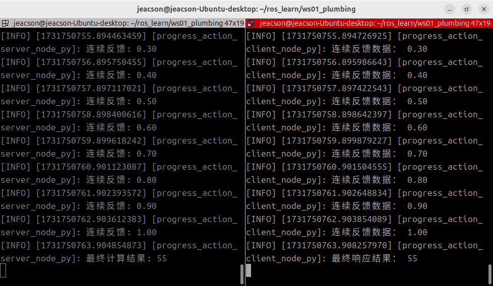

## 动作通信的Python实现

现在，我们通过针对以下案例需求进行Python的实现，以更加深入了解动作通信。

### 案例需求&案例分析

需求：编写动作服务端，动作客户端提交一个整型数据N，动作服务端接收请求数据并累加1-N之间的所有整数，将最终结果返回给动作客户端，且每累加一次都需要计算当前运算进度并反馈给动作客户端。

分析：在上述需求中，我们需要关注以下三个要素：

1. 动作客户端；
2. 动作服务端；
3. 消息载体。

### 流程简介

案例实现前需要自定义动作接口。

在接口准备完毕后，动作通信实现的主要步骤如下：

1. 编写服务端实现；
2. 编写客户端实现；
3. 编辑配置文件；
4. 编译；
5. 执行。

### 准备工作

参考[前文](./2024_10_15.md)

---

## 动作通信的 Python 实现

### 1. 编写服务端实现

功能包 `py03_action` 的 `py03_action` 目录下，新建 Python 文件 `demo01_action_server_py.py`，并编辑文件，输入如下内容：

``` python
"""      

  需求：编写动作通信，动作客户端提交一个整型数据N，动作服务端接收请求数据并累加1-N之间的所有整数，将最终结果返回给动作客户端，且每累加一次都需要计算当前运算进度并反馈给动作客户端。

  步骤：        
      1.导包；        
      2.初始化 ROS2 客户端；        
      3. 自定义节点类：
            3-1. 创建动作服务端对象；
            3-2. 处理动作客户端所提交的目标值 (通过专门的回调函数实现) --- 默认已经实现，但是可以覆写;
            3-3. 处理取消请求 (通过专门的回调函数实现) --- 默认已经实现，但是可以覆写;
            3-4. 生成连续反馈并响应最终结果 (通过专门的回调函数实现);
      4.调用spin函数，并传入节点对象；        
      5.释放资源。
""" 
# 1.导包；
import rclpy
import time
from rclpy.node import Node
from rclpy.action import ActionServer
from base_interfaces_demo.action import Progress

# 3.定义节点类；
class ProgressActionServer(Node):
    
    def __init__(self):
        super().__init__('progress_action_server_node_py')
        self.get_logger().info("动作服务端已创建！")

        # 3-1.创建动作服务端对象；
        """
            参数：
                1. 依赖的节点(self)
                2. 自定义的模板类型
                3. 话题名称
                4. 主逻辑回调函数名称(即3-4)
            返回值：动作服务端对象。
        """

        self.server = ActionServer(
            self, 
            Progress, 
            "get_num", 
            self.execute_callback，
            goal_callback=self.goal_callback,
            cancel_callback=self.cancel_callback
        )

        # 3-2. 处理动作客户端所提交的目标值 (通过专门的回调函数实现);
        def goal_callback(self, goal_request):
            if goal_request.num <= 1:
                self.get_logger().info("提交的目标值必须大于一！")
                return GoalResponse.REJECT
                
            self.get_logger().info("提交的目标值合法。")
            return GoalResponse.ACCEPT


        # 3-3. 处理取消请求 (通过专门的回调函数实现);
        def cancel_callback(self, cancel_request):
            self.get_logger().info("任务取消请求已接收。")
            return CancelResponse.ACCEPT

        # 3-4. 生成连续反馈并响应最终结果 (通过专门的回调函数实现);
    def execute_callback(self, goal_callback):
        # 1. 生成连续反馈
        num = goal_handle.request.num
        sum = 0

        for i in range(1, num+1):
            # 判断请求是否已经被取消
            if goal_handle.is_cancel_requested:
                goal_handle.canceled()
                self.get_logger().info("进程已经被取消。")
                return Progress.Result()

            sum += i
            feedback = Progress.Feedback()
            feedback.progress = i / num
            goal_handle.publish_feedback(geedback)
            self.get_logger().info("连续反馈: %.2f" % feedback.progress)
            time.sleep(1.0)
         
        # 2. 响应最终结果
        goal_handle.succeed()
        result = Progress.Result()
        result.sum = sum
        self.get_logger().info("最终计算结果: %d" % result.sum)

        return result 

def main(args=None):    
   # 2.初始化 ROS2 客户端；    
    rclpy.init(args=args)    

   # 4.调用spin函数，并传入节点对象；    
    rclpy.spin(ProgressActionServer())    

   # 5.释放资源。
    rclpy.shutdown()

if __name__ == '__main__':    
  main()

```

编写完服务端之后，我们可以使用以下方法对其进行调试，测试其是否可以使用：

在该工作空间内编译完功能包后，开启该服务端：

```shell
colcon build --packages-select py03_action
. install/setup.bash
ros2 run py03_action demo01_action_server
```

新建另一个终端，cd进入该工作空间后：

```shell
. install/setup.bash
ros2 action send_goal /get_sum base_interfaces_demo/action/Progress "{'num': 10}" --feedback
```

关键指令 `ros2 action send_goal /get_sum base_interfaces_demo/action/Progress "{'num': 10}" --feedback` 中的相关参数含义如下：

1. **send_goal** 为指定发送目标请求；
2. **/get_sum** 为该服务端内的话题名称；
3. **base_interfaces_demo/action/Progress** 为声明（指定）需要提交的数据的类型；
4. **"{'num1': 10}"** 为一个JSON格式的、使用英文双引号包裹的`字符串`，其中需要包含需要提交给服务端的相关数据，在这里为一个整型数据。
5. **--feedback** 也可以写作 **-f**，声明该指令需要连续反馈信息。

::: warning 并非取消
因为未知原因（指使用 CTRL+C 无法在停止上述的 ros2 action send_goal 指令之后，让动作服务端接收到取消请求信息），在这里还无法针对取消请求进行测试，你可以等到客户端实现后再针对取消请求进行测试。
:::

### 2. 编写客户端实现

功能包 `py03_action` 的 `py03_action` 目录下，新建 `Python` 文件 `demo02_action_client_py.py` ，并编辑文件，输入如下内容：

```python
"""
  需求：编写动作客户端，可以发送一个整型数据到服务端，并处理服务端的连续反馈与最终响应结果。
  前提：可以解析终端下动态函数的参数（一个整数）。
  步骤：      
      1. 导包；
      2. 初始化 ROS2 客户端；        
      3. 自定义节点类；            
        3-1. 创建动作客户端；
        3-2. 发送请求；
        3-3. 处理关于目标值的服务端响应（通过回调函数实现）；
        3-4. 处理连续反馈（通过回调函数实现）；
        3-5. 处理最终响应结果（通过回调函数实现）。
      4. 创建对象指针调用其功能；
      5. 释放资源。 

"""

# 1.导包；
import sys
import rclpy
from rclpy.node import Node
from rclpy.logging import get_logger
from rclpy.action import ActionClient

from base_interfaces_demo.action import Progress

# 3.自定义节点类；
class ProgressActionClient(Node):
    
    def __init__(self):
        super().__init__("progress_action_client_node_py")  
          
        # 3-1.创建客户端；  
        """
            参数：
                1. 节点；
                2. 动作接口类型；
                3. 话题名称（与发布方应保持一致）
            返回值：动作客户端

        """
        self.client_ = ActionClient(self, Progress, "get_sum")
        self.get_logger().info("动作客户端已创建！")
    
    # 3-2. 发送请求；
    def send_goal(self):
        # 连接服务端
        self.client_.wait_for_server(timeout_sec=1.0)
        self.get_logger().info("服务连接中，请稍后...")

        goal = Progress.Goal()
        goal.num = num
        """
            goal, feedback_callback, goal_uuid默认
        """
        self.future_ = self.client_.send_goal_async(goal, self.feedback_callback)
        self.future_.add_done_callback(self.goal_response_callback)  

    # 3-4. 处理连续反馈（通过回调函数实现）；
    def feedback_callback(self, fb_msg):
        progress_ = fb_msg.feedbaCK.progress
        self.get_logger().info("连续反馈数据： %.2f" % progress_)

    def goal_response_callback(self, future):
        # 获取目标句柄
        goal_handle = future.result()
        # 判断目标是否支持正常接收
        if not goal_handle.accepted:
            self.get_logger(),error("目标被拒绝。")
            return
            
        self.get_logger().info("目标被接收，正在处理中...")

        # 处理最终响应结果
        self.result_future = goal_handle.get_result_async()
        self.result_future.add_done_callback(self.get_result_callback)

    # 3-5. 处理最终响应结果（通过回调函数实现）。
    def get_result_callback(self, future):
         


def main():
{  
    # 校验操作
    if len(sys.argv) != 2:
        get_logger("rclpy").info("请提交一个整型数据！")
        return

    # 2. 初始化 ROS2 客户端;
    rclpy.init()  

    # 4. 创建对象并调用其功能;
    client = ProgressActionClient()
    client.send_goal(int(sys.argv[1]))
    rclpy.spin(client)

    # 5. 释放资源;
    rclpy.shutdown()
}

if __name__ == '__main__':    
  main()

```

::: tip ①、如何在节点对象外获取日志对象？

在上述代码中，由于运行逻辑的限制以及出于对性能优化的考虑，我们需要在初始化节点对象前先对用户所输入的对象进行参数校验。一旦发现参数校验失败，需要通过日志对象对用户进行提示。而由于日志对象是节点对象内的一个内置函数，我们需要通过其他的方式访问该日志对象。

除通过节点对象调用日志函数外，我们可以在使用：

```python

    from rclpy.logging import get_logger

```

导入相关函数之后，直接使用 `get_logger()` 进行函数的获取。其中 `get_logger()` 需要传入字符串类型的变量名，例如上述代码中所用到的 `get_logger("rclpy")` 内的 `"rclpy"`。

这种方法一般会在没有创建节点对象，或者在节点对象已被销毁的情况下使用。

:::

### 3. 编辑配置文件

在 `Python` 功能包中，配置文件需要关注 `package.xml` 与 `setup.py` 。如果是自建的文件，需要针对各个文件进行附加配置。

#### Ⅰ. package.xml

在创建功能包时，所依赖的功能包已经自动配置了，配置内容如下：

```xml
<!-- package.xml -->
<depend>rclpy</depend>
<depend>base_interfaces_demo</depend>
```

需要说明的是：

1. 如果自建的节点有新引入相关功能包，需要针对各个节点文件进行功能包的附加配置。

#### Ⅱ. setup.py

setup.py中发布和订阅程序核心配置如下：

```py
......
 
setup(
    ......
    entry_points={
        'console_scripts': [
            'demo01_action_server_py = py03_action.demo01_action_server_py:main',
            'demo02_action_client_py = py03_action.demo02_action_client_py:main',
        ],
    },
)
```

需要说明的是：如果有自建的节点被新引入，则需要针对各个节点文件进行以下操作：

1. 自建的节点需要附加配置 `console_scripts` 配置项, 为编译器提供可执行程序位置，格式为：

    - '节点名 = 节点所在包名.节点名:main'

一般直接将原本程序生成的代码复制下来进行修改即可，因此这里的‘节点所在包名’都相同。

### 4. 编译

终端中进入当前工作空间，编译功能包：

```shell
colcon build --packages-select py03_action
```

### 5. 执行

当前工作空间下，分别启动两个终端，先在终端1执行服务端，然后在终端2执行客户端。

终端1输入如下指令：

```shell
. install/setup.bash
ros2 run py03_action demo01_action_server_py
```

终端2输入如下指令：

```shell
. install/setup.bash
ros2 run py03_action demo02_action_client_py 10
```

最终运行结果应与下图类似。



::: tip 必须要先开启服务端
与服务通信同理，在进行动作通信时必须保证动作客户端能够正常连接到动作服务端，才能够使得动作客户端在发送请求时相关数据不会丢失。因此必须先开启动作服务端，再开启动作客户端。
:::

## 总结

在本小节中，我们尝试使用 Python 实现了 **动作通信**。如果在这之前你已经尝试过 [使用 C++ 实现动作通信](./2024_10_16.md)，或者即使没有，在经历这么多计算机语言上的切换，你也应该会发现一些与 c++ 相比，在书写 python 时比较麻烦的地方:
ROS2 在针对 python 书写时，并没能够提供完整的相关代码提示，因为在许多回调函数中， python 并不了解你所传入的参数是什么类型。换句话说：

> ROS2 官方貌似没有给 Python 提供 .pyi 类型注解存根文件 ——来自视频 [赵虚左—— 2.4.4_动作通信_Python实现_03客户端_05补充](https://www.bilibili.com/video/BV1tt4y1w75i)下用户 *muzing_* (UID:439812477) 的评论

因此在编写相关代码时，你需要参照官方所给示例以及多种相关资料，才能够更加顺畅的进行代码书写。祝你好运！

在尝试实现 **动作通信** 后，你可以 回到 [ROS2-005-通信机制：动作通信](./2024_10_15.md#总结) 以查看本节的总结。
