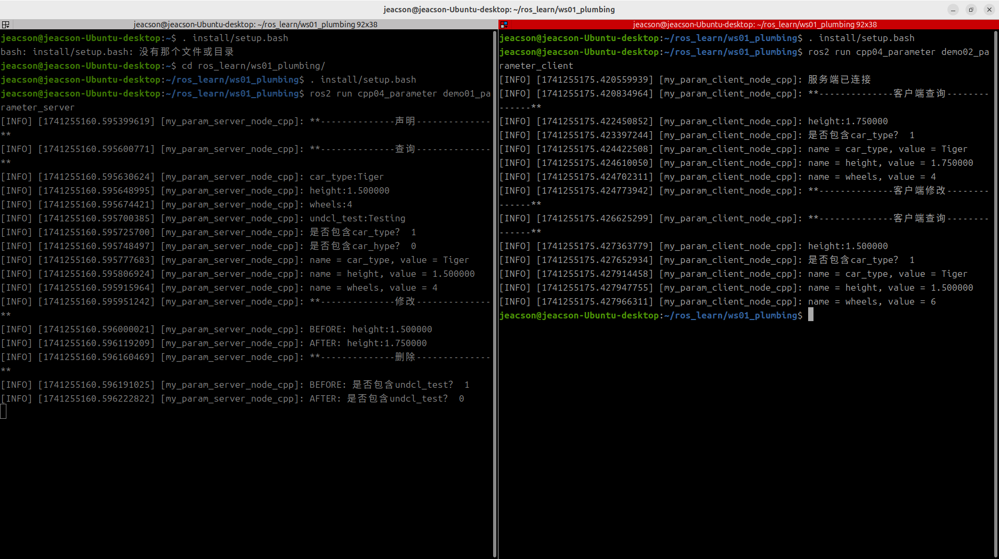

## 简介

现在，我们通过针对以下案例需求进行 C++ 的实现，以更加深入了解参数服务。

### 案例需求&案例分析

需求：有两个节点，请编写参数服务，在参数服务端（节点A）中设置一些参数，使参数客户端（节点B）可以通过访问参数服务端（节点A）对这些参数实现查看与修改，并且参数服务端（节点A）自身可以对此进行增删改查。

分析：在上述需求中，我们需要关注以下三个要素：

1. 参数服务端；
2. 参数客户端；
3. 参数本身。

### 流程简介

案例实现前需要先了解ROS2中参数的相关API，无论是客户端还是服务端都会使用到参数，而参数服务案例实现主要步骤如下：

1. 编写参数服务端实现；
2. 编写参数客户端实现；
3. 编辑配置文件；
4. 编译；
5. 执行。

### 准备工作

参考[前文](./2024_11_27.md)

---

## 参数服务的 C++ 实现

### 1. 编写参数服务端实现

功能包 `cpp04_parameter` 的 `src` 目录下，新建 C++ 文件 `demo01_parameter_server.cpp`，并编辑文件，输入如下内容：

```cpp
/*
    需求：编写参数服务端，设置并操作参数。
    步骤：
        1. 包含头文件；
        2. 初始化 ROS2 客户端
        3. 自定义节点类：
            3-1. 声明参数
            3-2. 查询参数
            3-3. 修改参数
            3-4. 删除参数
        4. 调用spin函数，并传入节点对象指针；
        5. 释放资源。
 */

// 1. 包含头文件；
#include "rclcpp/rclcpp.hpp"

// 3. 自定义节点类：
class MyParamServer : public rclcpp::Node
{
    public: 
        MyParamServer() : Node("my_param_server_node_cpp", 
        rclcpp::NodeOptions().allow_undeclared_parameters(true)){
        }
            
    // 3-1. 声明参数
    void declare_param(){
        RCLCPP_INFO(this->get_logger(), "**--------------声明--------------**");
        // 声明参数并设置默认值
        this->declare_parameter("car_type", "Tiger");
        this->declare_parameter("height", 1.50);
        this->declare_parameter("wheels", 4);

        // 需要 rclcpp::NodeOptions().allow_undeclared_parameters(true)
        this->set_parameter(rclcpp::Parameter("undcl_test", "Testing"));
    }

    // 3-2. 查询参数
    void get_param(){
        RCLCPP_INFO(this->get_logger(), "**--------------查询--------------**");
        // 1. 获取指定参数
        // 1.1 先存储后调用
        rclcpp::Parameter car_type = this->get_parameter("car_type");
        RCLCPP_INFO(this->get_logger(), "car_type:%s", car_type.as_string().c_str());
        // 1.2 直接调用 (针对不同类型)
        RCLCPP_INFO(this->get_logger(), "height:%f", this->get_parameter("height").as_double());
        RCLCPP_INFO(this->get_logger(), "wheels:%ld", this->get_parameter("wheels").as_int());
        RCLCPP_INFO(this->get_logger(), "undcl_test:%s", this->get_parameter("undcl_test").as_string().c_str());

        // 2. 判断是否包含指定 Parameters
        RCLCPP_INFO(this->get_logger(), "是否包含car_type？ %s", this->has_parameter("car_type").as_string().c_str());
        RCLCPP_INFO(this->get_logger(), "是否包含car_hype？ %s", this->has_parameter("car_hype").as_string().c_str());
        
        // 3. 获取所有参数
        auto params = this->get_parameters({"car_type", "height", "wheels"});
        for (auto &param : params)
        {
            RCLCPP_INFO(this->get_logger(), "name = %s, value = %s", param.get_name().c_str(), param.value_to_string().c_str());

        }
    }

    // 3-3. 修改参数
    void update_param() {
        RCLCPP_INFO(this->get_logger(), "**--------------修改--------------**");
        RCLCPP_INFO(this->get_logger(), "BEFORE: height:%f", this->get_parameter("height").as_double());
        this->set_parameter(rclcpp::Parameter("height", 1.75));
        RCLCPP_INFO(this->get_logger(), "AFTER: height:%f", this->get_parameter("height").as_double());
    }

    // 3-4. 删除参数
    void del_param() {
        RCLCPP_INFO(this->get_logger(), "**--------------删除--------------**");
        RCLCPP_INFO(this->get_logger(), "BEFORE: 是否包含undcl_test？ %s", this->has_parameter("undcl_test"));
        // 无法删除声明的 Parameter，因此这里使用 "undcl_test" 进行操作
        // 即只能删除 undeclared Parameter。设置 undeclared Parameter
        // 需要 rclcpp::NodeOptions().allow_undeclared_parameters(true)
        this->undeclare_parameter("undcl_test");

        RCLCPP_INFO(this->get_logger(), "AFTER: 是否包含undcl_test？ %s", this->has_parameter("undcl_test"));

    }

};

int main(int argc, char *argv[])
{
    // 2. 初始化 ROS2 客户端
    rclcpp::init(argc, argv);

    // 4. 调用spin函数，并传入节点对象指针。
    auto server = std::make_shared<MyParamServer>();
    server->declare_param();
    server->get_param();
    server->update_param();
    server->del_param();
    rclcpp::spin(server);

    // 5.释放资源;
    rclcpp::shutdown();
    return 0; 
} 

```

编写完服务端之后，我们可以使用[前文](./2024_11_27.md#参数服务的命令行访问)所述的相应方法在命令行窗口对其进行调试，测试其是否可以使用。

例如在该工作空间内编译完功能包后，开启该服务端：

```shell
colcon build --packages-select cpp04_parameter
. install/setup.bash
ros2 run cpp04_parameter demo01_action_server
```

新建另一个终端，cd进入该工作空间后便可以使用以下代码进行 height 的查询操作：

```shell
. install/setup.bash
ros2 param get /my_param_server_node_cpp height
```

### 2. 编写参数客户端实现

功能包 `cpp04_parameter` 的 `src` 目录下，新建 C++ 文件 `demo02_parameter_client.cpp`，并编辑文件，输入如下内容：

```cpp
/*

  需求：编写参数客户端，获取或者修改参数。
流程：
    前提：可以解析终端下动态函数的参数（一个整数）。
  步骤：
      1. 包含头文件；
      2. 初始化 ROS2 客户端；
      3. 自定义节点类；
        3-1. 查询参数；
        3-2. 修改参数。
      4. 创建对象指针调用其功能；
      5. 释放资源。 
*/

// 1.包含头文件；
#include "rclcpp/rclcpp.hpp"

using namespace std::chrono_literals;

// 3.自定义节点类；

class MyParamClient : public rclcpp::Node 
{

  public:  
    MyParamClient():Node("my_param_client_node_cpp"){      
        paramClient = std::make_shared<rclcpp::SyncParametersClient>(this, "my_param_server_node_cpp");

    }

    bool connect_server(){
        // 等待服务链接；  
        while (!paramClient->wait_for_service (1s))
        {
            if(!rclcpp::ok())
            {
                RCLCPP_ERROR(this->get_logger(), "服务端连接失败。");
                return false;
            }
            RCLCPP_ERROR(this->get_logger(), "服务端连接中。。");
        }
        RCLCPP_ERROR(this->get_logger(), "服务端已连接");
        return true;
    }

    // 3-1. 查询参数
    void get_param(){
        RCLCPP_INFO(this->get_logger(), "**--------------客户端查询--------------**");
        // 1. 获取指定参数
        double height = paramClient->get_parameter<double>("height");
        RCLCPP_INFO(this->get_logger(), "height:%f", height);

        // 2. 判断是否包含指定 Parameters
        RCLCPP_INFO(this->get_logger(), "是否包含car_type？ %d", paramClient->has_parameter("car_type"));

        // 3. 获取所有参数
        auto params = paramClient->get_parameters({"car_type", "height", "wheels"});
        for (auto &param : params)
        {
            RCLCPP_INFO(this->get_logger(), "name = %s, value = %s", param.get_name().c_str(), param.value_to_string().c_str());

        }
    }

    // 3-2. 修改参数
    void update_param() {
        RCLCPP_INFO(this->get_logger(), "**--------------客户端修改--------------**");
        paramClient->set_parameters({
            rclcpp::Parameter("height", 1.5),
            rclcpp::Parameter("wheels", 6),

            // 这是一个服务端不存在的 Parameter
            // 当且仅当服务端进行了如下设置：
            // rclcpp::NodeOptions().allow_undeclared_parameters(true)
            // 该参数才会被成功设置
            rclcpp::Parameter("width", 1.05)
        });
    }

  private:
      rclcpp::SyncParametersClient::SharedPtr paramClient; 

};

int main(int argc, char *argv[])
{  
    // 2. 初始化 ROS2 客户端；  
    rclcpp::init(argc, argv);  

    // 4. 创建对象指针调用其功能； 
    auto paramClient = std::make_shared<MyParamClient>(); 
    bool flag = paramClient->connect_server();
    if(!flag) {
        return 0;
    }

    paramClient->get_param();
    paramClient->update_param();
    paramClient->get_param();
    // rclcpp::spin(paramClient);

    // 5. 释放资源；  
    rclcpp::shutdown();  
    return 0; 
}

```

### 3. 编辑配置文件

在 C++ 功能包中，配置文件需要关注 `package.xml` 与 `CMakeLists.txt` 。如果是自建的文件，需要针对各个文件进行附加配置。

#### Ⅰ. package.xml

在创建功能包时，所依赖的功能包已经自动配置了，配置内容如下：

```xml
<!-- package.xml -->
<depend>rclcpp</depend>
<depend>base_interfaces_demo</depend>
```

需要说明的是：

1. 如果自建的节点有新引入相关功能包，需要针对各个节点文件进行功能包的附加配置。

#### Ⅱ. CMakeLists.txt

CMakeLists.txt中发布和订阅程序核心配置如下：

```txt
find_package(rclcpp REQUIRED)
find_package(base_interfaces_demo REQUIRED) 

add_executable(demo01_parameter_server src/demo01_parameter_server.cpp) ament_target_dependencies(  
  demo01_parameter_server  
  "rclcpp"  
  "base_interfaces_demo" 
) 

add_executable(demo02_parameter_client src/demo02_parameter_client.cpp) ament_target_dependencies(  
demo02_parameter_client  
 "rclcpp"  
 "base_interfaces_demo" 
) 

install(TARGETS  
demo01_parameter_server  
demo02_parameter_client  
 DESTINATION lib/${PROJECT_NAME})
```

需要说明的是：如果有自建的节点被新引入，则需要针对各个节点文件进行以下操作：

1. 如果自建的节点有新引入相关功能包，需要通过设置 `find_package` 针对各个节点进行功能包的附加配置；
2. 自建的节点需要附加配置 `add_executable`、  `ament_target_dependencies` 和 `install` 三个配置项, 其中：

    - `add_executable` 需要添加其节点名和文件所在位置；
    - `ament_target_dependencies` 需要针对各个节点文件添加其节点名和其所引用的功能包名；
    - `install` 内需要添加其节点名

### 4. 编译

终端中进入当前工作空间，编译功能包：

```shell
colcon build --packages-select cpp04_parameter
```

### 5. 执行

当前工作空间下，分别启动两个终端，先在终端1执行服务端，然后在终端2执行客户端。

终端1输入如下指令：

```shell
. install/setup.bash
ros2 run cpp04_parameter demo01_parameter_server
```

终端2输入如下指令：

```shell
. install/setup.bash
ros2 run cpp04_parameter demo02_parameter_client
```

最终运行结果应与下图类似。



::: tip 必须要先开启服务端
与服务通信同理，在进行参数服务时必须保证参数客户端能够正常连接到参数服务端，才能够使得参数客户端在发送请求时相关数据不会丢失。因此必须先开启参数服务端，再开启参数客户端。
:::

## 总结

在本小节中，我们尝试使用 C++ 实现了 **参数服务**。在这之后你可以尝试 [使用 Python 实现参数服务](./2025_03_07.md)，或者你可以回到 [ROS2-007-通信机制：参数服务](./2024_11_27.md#总结) 以查看本节的总结。
