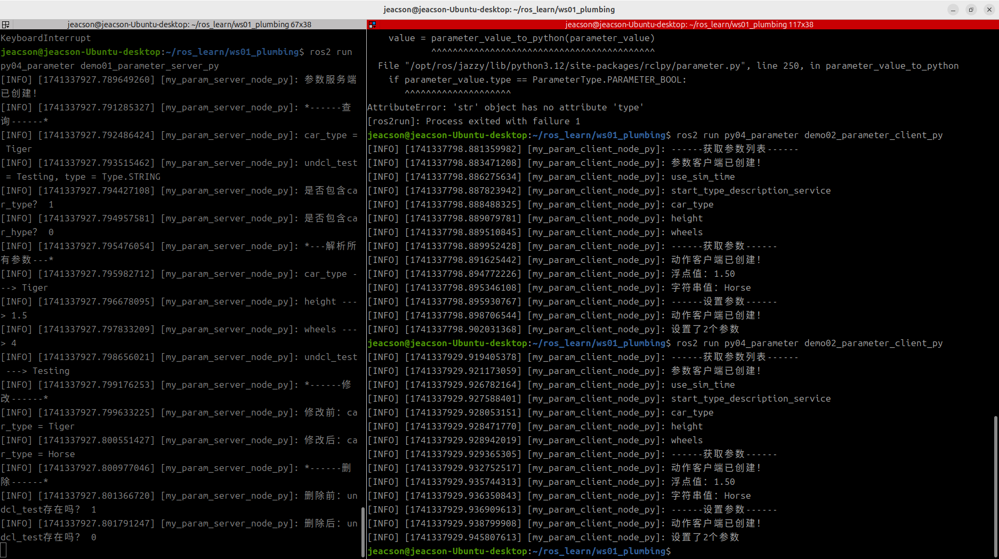

## 动作通信的Python实现

现在，我们通过针对以下案例需求进行 Python 的实现，以更加深入了解参数服务。

### 案例需求&案例分析

需求：有两个节点，请编写参数服务，在参数服务端（节点A）中设置一些参数，使参数客户端（节点B）可以通过访问参数服务端（节点A）对这些参数实现查看与修改，并且参数服务端（节点A）自身可以对此进行增删改查。

分析：在上述需求中，我们需要关注以下三个要素：

1. 参数服务端；
2. 参数客户端；
3. 参数本身。

### 流程简介

案例实现前需要先了解ROS2中参数的相关API，无论是客户端还是服务端都会使用到参数，而参数服务案例实现主要步骤如下：

1. 编写参数服务端实现；
2. 编写参数客户端实现；
3. 编辑配置文件；
4. 编译；
5. 执行。

### 准备工作

参考[前文](./2024_11_27.md)

---

## 参数服务的 Python 实现

### 1. 编写服务端实现

功能包 `py04_parameter` 的 `py04_parameter` 目录下，新建 Python 文件 `demo01_parameter_server_py.py`，并编辑文件，输入如下内容：

``` python
"""      

    需求：编写参数服务端，设置并操作参数。
    步骤：        
        1.导包；        
        2. 初始化 ROS2 客户端
        3. 自定义节点类：
            3-1. 声明参数
            3-2. 查询参数
            3-3. 修改参数
            3-4. 删除参数
        4. 调用spin函数，并传入节点对象指针；
        5. 释放资源。
""" 
# 1.导包；
import rclpy
from rclpy.node import Node

# 3.定义节点类；
class MyParamServer(Node):
    
    def __init__(self):
        # 为了使用 undeclared Parameter， 需要将
        # allow_undeclared_parameters = True
        super().__init__('my_param_server_node_py',
                        allow_undeclared_parameters=True)
        self.get_logger().info("参数服务端已创建！")

    # 3-1. 声明参数
    def declare_param(self):
        # 声明参数并设置默认值
        self.declare_parameter("car_type", "Tiger")
        self.declare_parameter("height", 1.50)
        self.declare_parameter("wheels", 4)
        # 以下是 undeclared Parameter。
        self.p1 = rclpy.Parameter("undcl_test", value = "Testing")
        # 如果你希望提供其类型，可以使用 “type_” 变量。
        # 其介于 “name” 和 “value” 之间。 例如：
        # self.p1 = rclpy.Parameter("undcl_test", type_ = Parameter.Type.STRING, value = "Testing")
        # 注意：此需要 “from rclpy.parameter import Parameter”

        self.set_parameters([self.p1])

    # 3-2. 查询参数
    def get_param(self):
        self.get_logger().info("*------查询------*")
        # 1. 获取指定参数
        car_type = self.get_parameter("car_type")
        self.get_logger().info("%s = %s" % (car_type.name, car_type.value))

        # 2. 判断是否包含指定 Parameters
        self.get_logger().info("是否包含car_type？ %d", self.has_parameter("car_type"))
        self.get_logger().info("是否包含car_hype？ %d", self.has_parameter("car_hype"))

        # 3. 获取所有参数
        params = self.get_parameters(["car_type", "height", "wheels"])
        self.get_logger().info("*---解析所有参数---*")
        for param in params:
            self.get_logger().info("%s ---> %s" % (param.name, param.value))

    # 3-3. 修改参数
    def update_params(self):
        self.get_logger().info("*------修改------*")
        param_BEFORE = self.get_parameter("car_type")
        self.get_logger().info("修改前：car_type = %s" % param_BEFORE.value)
        self.set_parameters([rclpy.Parameter("car_type", value = "Horse")])
        param_AFTER = self.get_parameter("car_type")
        self.get_logger().info("修改后：car_type = %s" % param_AFTER.value)

    # 3-4. 删除参数
    def del_param(self):
        self.get_logger().info("*------删除------*")
        self.get_logger().info("删除前：undcl_test存在吗？ %d" % self.has_parameter("undcl_test"))
        self.undeclare_parameter("undcl_test")
        self.get_logger().info("删除后：undcl_test存在吗？ %d" % self.has_parameter("undcl_test"))
        

def main(args=None):
    # 2.初始化 ROS2 客户端；    
    rclpy.init(args=args)    

    # 4.调用spin函数，并传入节点对象；
    param_server = MyParamServer()
    param_server.declare_param()
    param_server.get_param()
    param_server.update_params()
    param_server.del_param()

    rclpy.spin(param_server)

    # 5.释放资源。
    rclpy.shutdown()

if __name__ == '__main__':    
  main()

```

编写完服务端之后，我们可以使用[前文](./2024_11_27.md#参数服务的命令行访问)所述的相应方法在命令行窗口对其进行调试，测试其是否可以使用。

例如在该工作空间内编译完功能包后，开启该服务端：

```shell
colcon build --packages-select py04_parameter
. install/setup.bash
ros2 run py04_parameter demo01_parameter_server_py
```

新建另一个终端，cd进入该工作空间后便可以使用以下代码进行 height 的查询操作：

```shell
. install/setup.bash
ros2 param get /my_param_server_node_py height
```

::: info 关于删除，这里比较奇怪
在 C++ 中，如果你想要删除一个 Parameter，首先这个 Parameter 必须得是 Undeclared Parameter；但是在 Python 中，好像不需要必须得是 Undeclared Parameter 就可以被删除。即使在节点被创建时，不使用“allow_undeclared_parameters=True”，也可以删除指定的 Parameter。只能说有待更深入的源码研究。
:::

### 2. 编写客户端实现(并不)

::: tip well,actually☝🤓
ROS2 的 Python 客户端暂时还没有提供参数客户端专用的 API (也可能是我没找着), 但是参数服务的底层是基于服务通信的，所以在这里我们通过 **服务通信（Services）** 操作参数服务端的参数。你可以只看看就可以，不一定实操。
:::

功能包 `py04_parameter` 的 `py04_parameter` 目录下，新建 `Python` 文件 `demo02_parameter_client_py.py` ，并编辑文件，输入如下内容：

```python


# 1.导包；
import sys
import rclpy
from rclpy.node import Node
from rcl_interfaces.srv import ListParameters
from rcl_interfaces.srv import GetParameters
from rcl_interfaces.srv import SetParameters
from rcl_interfaces.msg import ParameterType
from rcl_interfaces.msg import Parameter
from rcl_interfaces.msg import ParameterValue

# 3.自定义节点类；
class MyParamClient(Node):
   
    def __init__(self):
        super().__init__("my_param_client_node_py")  
         
    def list_params(self):
        # 3-1.创建客户端；  
        self.cli_list = self.create_client(ListParameters, "/my_param_server_node_py/list_parameters")
        self.get_logger().info("参数客户端已创建！")
        # 3-2. 等待服务连接。
        while not self.cli_list.wait_for_service(timeout_sec = 1.0):
            self.get_logger().info("列出参数服务连接中，请稍后。。。")
        self.req = ListParameters.Request()
        self.future = self.cli_list.call_async(self.req)
        rclpy.spin_until_future_complete(self, self.future)
        return self.future.result()

    def get_params(self, names):
        # 3-1.创建客户端；  
        self.cli_get = self.create_client(GetParameters, "/my_param_server_node_py/get_parameters")
        self.get_logger().info("动作客户端已创建！")
        # 3-2. 等待服务连接。
        while not self.cli_get.wait_for_service(timeout_sec = 1.0):
            self.get_logger().info("列出参数服务连接中，请稍后。。。")
        self.req = GetParameters.Request()
        self.req.names = names
        self.future = self.cli_get.call_async(self.req)
        rclpy.spin_until_future_complete(self, self.future)
        return self.future.result()

    def set_params(self):
        # 3-1.创建客户端；  
        self.cli_set = self.create_client(SetParameters, "/my_param_server_node_py/set_parameters")
        self.get_logger().info("动作客户端已创建！")
        # 3-2. 等待服务连接。
        while not self.cli_set.wait_for_service(timeout_sec = 1.0):
            self.get_logger().info("列出参数服务连接中，请稍后。。。")
        self.req = SetParameters.Request()

        self.p1 = Parameter()
        self.p1.name = "car_type"
        self.v1 = ParameterValue()
        self.v1.type = ParameterType.PARAMETER_STRING
        self.v1.string_value = "Rat"
        self.p1.value = self.v1

        self.p2 = Parameter()
        self.p2.name = "height"
        self.v2 = ParameterValue()
        self.v2.type = ParameterType.PARAMETER_DOUBLE
        self.v2.double_value = 0.3
        self.p2.value = self.v2

        self.req.parameters = [self.p1, self.p2]
        self.future = self.cli_set.call_async(self.req)
        rclpy.spin_until_future_complete(self, self.future)
        return self.future.result()

         


def main():
    # 2. 初始化 ROS2 客户端;
    rclpy.init();

    # 4. 创建对象并调用其功能;
    client = MyParamClient();

    # 获取参数列表
    client.get_logger().info("------获取参数列表------");
    response = client.list_params();
    
    for name in response.result.names:
        client.get_logger().info(name)

    client.get_logger().info("------获取参数------")
    response = client.get_params(["height", "car_type"])
    values = response.values
    for value in values:
        if value.type == ParameterType.PARAMETER_STRING:
            client.get_logger().info("字符串值：%s" % value.string_value)
        elif value.type == ParameterType.PARAMETER_DOUBLE:
            client.get_logger().info("浮点值：%.2f" % value.double_value)

    client.get_logger().info("------设置参数------")
    response = client.set_params()
    results = response.results
    client.get_logger().info("设置了%d个参数" % len(results))

    for result in results:
        if not result.successful:
            client.get_logger().info("设置参数失败")

    # 5. 释放资源;
    rclpy.shutdown()

if __name__ == '__main__':    
  main()

```

::: tip well，WELL actually☝🤓
这本质上只是一个代替参数客户端的测试用程序，你不一定非要照着这个来做相关的操作，指不定什么时候 API 就更新了，所以你可以就看看（主要是我没尝试出来）。
:::

### 3. 编辑配置文件

在 `Python` 功能包中，配置文件需要关注 `package.xml` 与 `setup.py` 。如果是自建的文件，需要针对各个文件进行附加配置。

#### Ⅰ. package.xml

在创建功能包时，所依赖的功能包已经自动配置了，配置内容如下：

```xml
<!-- package.xml -->
<depend>rclpy</depend>
<depend>base_interfaces_demo</depend>
```

需要说明的是：

1. 如果自建的节点有新引入相关功能包，需要针对各个节点文件进行功能包的附加配置。

#### Ⅱ. setup.py

setup.py中发布和订阅程序核心配置如下：

```py
......
 
setup(
    ......
    entry_points={
        'console_scripts': [
            'demo01_parameter_server_py = py04_parameter.demo01_parameter_server_py:main',
            'demo02_parameter_client_py = py04_parameter.demo02_parameter_client_py:main',
        ],
    },
)
```

需要说明的是：如果有自建的节点被新引入，则需要针对各个节点文件进行以下操作：

1. 自建的节点需要附加配置 `console_scripts` 配置项, 为编译器提供可执行程序位置，格式为：

    - '节点名 = 节点所在包名.节点名:main'

一般直接将原本程序生成的代码复制下来进行修改即可，因此这里的‘节点所在包名’都相同。

### 4. 编译

终端中进入当前工作空间，编译功能包：

```shell
colcon build --packages-select py04_parameter
```

### 5. 执行

当前工作空间下，分别启动两个终端，先在终端1执行服务端，然后在终端2执行客户端。

终端1输入如下指令：

```shell
. install/setup.bash
ros2 run py04_parameter demo01_parameter_server_py
```

终端2输入如下指令：

```shell
. install/setup.bash
ros2 run py04_parameter demo02_parameter_client_py
```

最终运行结果应与下图类似。



::: tip 必须要先开启服务端
与服务通信同理，在进行参数服务时必须保证参数客户端（？）能够正常连接到参数服务端，才能够使得参数客户端（？）在发送请求时相关数据不会丢失。因此必须先开启参数服务端，再开启参数客户端（？）。
:::

## 总结

在本小节中，我们尝试使用 Python 实现了 **参数服务**。在这之后你可以尝试 [使用 C++ 实现参数服务](./2025_03_06.md)，或者你可以回到 [ROS2-007-通信机制：参数服务](./2024_11_27.md#总结) 以查看本节的总结。
