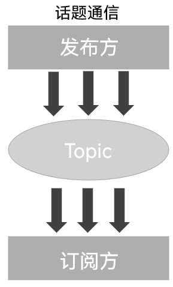
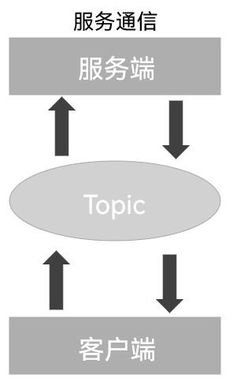
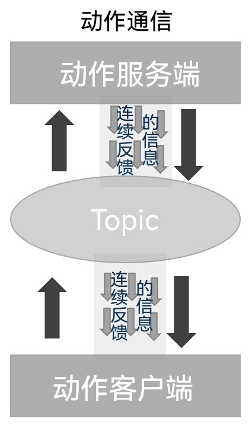
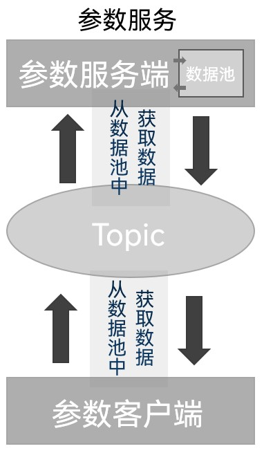

## 简介

作为一种高度复杂的系统性实现，在机器人中，一个完整的机器人应用程序一般会由若干功能模块组成，其中每个功能模块可能又包含若干功能点，而不同功能模块、不同功能点之间通常需要频繁的进行数据交互。
比如以导航中的路径规划模块为例：

- 路径规划模块需要其他功能模块将各种数据输入，并输出相应处理后的数据以便被其他模块调用；
- 输入的数据有地图服务提供的地图数据、定位模块提供的机器人位姿数据、人机交互模块提供的目标点数据等；
- 而输出的处理后的数据，即路径信息等则会被运动控制订阅或是回显在人机交互界面上。

因此要在这些相对独立的功能模块或功能点之间实现数据交互，就需要ROS2提供的各种通信机制。这些通信机制的组成要素是类似的，例如：各种通信机制中的通信是双方或多方行为、通信时都需要将不同的通信对象关联、各种通信机制都有各自的模型、各种通信机制交互数据时必然涉及到数据载体等。

## 节点与话题

### 节点

在各种通信机制中，通信对象的构建会依赖于节点(Node)，在ROS2中，一般情况下每个节点都对应着单一的功能模块：

- 雷达驱动节点用于发布雷达信息；
- 摄像头驱动节点用于发布图像信息；
- ……

一个完整的机器人系统一般会由多个协同工作的节点组成，而ROS2中的单个可执行文件(例如C++程序或者Python程序)中则可以包含一个或多个节点。

### 话题

话题(Topic)是ROS2中节点之间进行**异步**消息通信的机制，它用于将各种具有相同话题的节点关联在一起。虽然ROS2是跨计算机语言的(例如使用C++程序或者Python程序分别实现不同的节点)，但是只要二者使用了相同的话题，就可以实现节点间的数据交互。

话题基于发布/订阅模式，一个节点可以通过话题发布消息（发布者），另一个节点可以通过订阅话题接收这些消息（订阅者）。

话题一般用于节点间的一对多或多对多通信，因为在话题中数据是持续流动的，因此话题更适合于不需要立即响应的通信场景。

## 通信模型

在ROS2中，**常用的**通信模型有四种：

1. 话题通信(Topics)
2. 服务通信(Services)
3. 动作通信(Actions)
4. 参数服务(Parameters)

### 话题通信(Topics)

话题通信是一种单向通信模型，在通信双方中，发布方发布数据，订阅方订阅数据，数据流单向的由发布方传输到订阅方。

因此该通信机制的特点为：**单向数据流**

### 服务通信(Services)

服务通信是一种基于请求响应的通信模型，在通信双方中，客户端发送请求数据到服务端，服务端响应结果给客户端。

因此该通信机制的特点为：**请求响应模式**

### 动作通信(Actions)

动作通信是一种带有连续反馈的通信模型，在通信双方中，客户端发送请求数据到服务端，服务端响应结果给客户端，但是在服务端接收到请求到产生最终响应的过程中，服务端会发送连续的反馈信息到客户端。

因此该通信机制的特点为：**带有连续的信息反馈**

### 参数服务(Parameters)

参数服务是一种基于共享的通信模型，在通信双方中，服务端可以设置数据，而客户端可以连接服务端并操作服务端数据。因此该通信模型有些类似于后端向数据库作数据增删改查等的操作，在学习理解上可以如此等价。它在具体访问时一般基于服务通信的通信模型进行进阶处理。

该通信机制的特点为：**数据共享**
