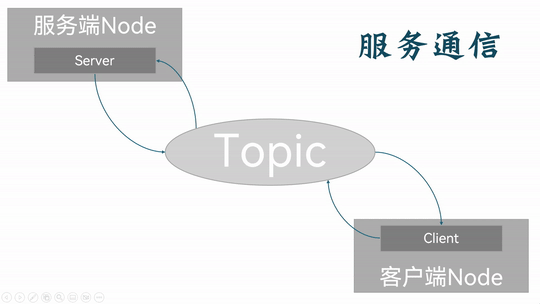
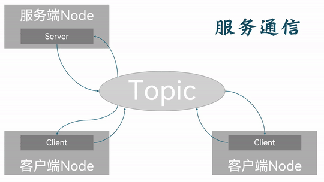

## 简介

**服务通信(Services)**是一种基于 `请求响应` 的方式实现不同节点之间数据传输的通信模模式。发送请求数据的对象称为**客户端**，接受请求并发送数据相应的对象称之为**服务端**，与话题通信一样，客户端和服务端也通过话题(Topic)相关联，但是客户端和服务端可以互相进行数据传输交互。因此在服务通信中，消息的流向是双向的。



在**服务通信**中，服务端与客户端是一种一对多的关系。也就是说，在同一服务话题下，可以存在多个客户端，但只能存在一个服务端。每个客户端都可以向服务端发送请求，也即与该单个服务端之间建立独立的相互通信。



因此，话题通信一般更适用于偶然的、对实时性有要求、且需要具有一定逻辑处理的数据传输场景。

---

## 服务通信的简单实现

现在，我们通过针对以下案例需求进行C++与Python的分别实现，以更加深入了解服务通信。

### 案例需求&案例分析

需求：编写服务通信，客户端可以提交两个整数到服务端，服务端接收请求并解析两个整数求和，然后将结果响应回客户端。

分析：在上述需求中，我们需要关注以下三个要素：

1. 客户端；
2. 服务端；
3. 消息载体。

### 流程简介

案例实现前需要自定义服务接口。

在接口准备完毕后，服务通信实现的主要步骤如下：

1. 编写服务端实现；
2. 编写客户端实现；
3. 编辑配置文件；
4. 编译；
5. 执行。

案例会采用C++和Python分别实现，且二者都遵循上述实现流程。

### 准备工作

终端下创建工作空间：

```shell
mkdir -p ws01_plumbing/src
cd ws01_plumbing/src
colcon build
```

进入工作空间的src目录:

```shell
cd src/
```

调用如下命令创建之后会用到的接口功能包:

```shell
ros2 pkg create --build-type ament_cmake base_interfaces_demo

```

调用如下两条命令分别创建C++功能包、Python功能包及其所需服务端节点:

**C++:**

```shell
ros2 pkg create cpp01_topic --build-type ament_cmake --dependencies rclcpp std_msgs base_interfaces_demo --node-name demo01_server
```

**Python:**

```shell
 ros2 pkg create py01_topic --build-type ament_python --dependencies rclpy std_msgs base_interfaces_demo --node-name demo01_server_py
```

在接口功能包中自定义服务接口消息文件：

具体实现请参考[这里](./2024_10_03_002.md)

准备工作到此完毕。

---

接下来你便可以通过 [C++](./2024_10_03_003.md) 和 [Python](./2024_10_03_004.md) 来分别实现服务通信了。

## 总结

在这一节中，我们系统的阐述了如何依据服务通信相关原理，通过自行操作，实现节点之间简单的服务通信。
