上半部分见[ROS2-014-通信机制补完：通信机制工具（一）综述与命令行工具](2025_04_12.md)

---

## 二、图形化工具（RQt）

### 简述

**RQt** 是一个基于 **Qt 框架** 开发的 GUI 框架。它通过应用各种 “以插件形式存在的工具与接口” 实现在单个页面开发、调试与监控机器人系统，其允许用户通过配置插件灵活地与 ROS2 系统进行交互。作为通信机制工具只是其中的一种功能，在这里仅会做一些简要的入门介绍。

::: info 拓展信息 | In case you want to know
**Qt 框架** 是1991年由 *Qt Company* 开发的跨平台 C++ 图形用户界面应用程序开发框架，可构建高性能的桌面、移动及Web应用程序。

如果你希望更加了解其信息，你可以通过其官网进行深入了解与学习。在他官网上有专门针对初学者所设立的 [Qt Academy](https://www.qt.io/academy) 可供免费在线学习。
:::

### 安装

在一般情况下，只要在安装 ROS2 时使用的是 desktop 版本，则 ROS2 会默认安装 RQt 工具箱。如果你需要另外安装，你可以使用如下安装方式：

```bash
sudo apt install ros-jazzy-rqt*
```

::: info
这里使用的 ROS2 版本为 Jazzy Jalisco LTS，若需要其他版本，请查阅 ROS2 官方文档。
:::

### 启动

当你正在运行 ros2 节点 时，你可以在新控制台中使用以下命令进行 RQt 的启动：

- `rqt`
- `ros2 run rqt_gui rqt_gui`

你将会得到以下 GUI 界面:

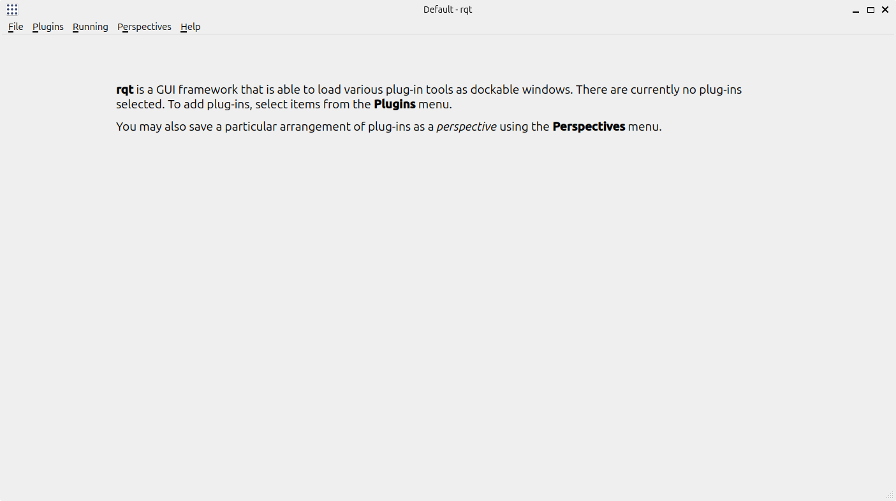

---

### 使用

作为通信机制工具，你可以在 `plugins` 选项卡中选择你所需要的插件工具。

#### 1. 节点表

例如，你可以通过以下方式打开节点表：

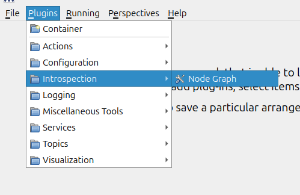

::: info
当然如果你熟悉 命令行工具， 也可以直接通过：

```bash
rqt_graph
```

或者

```bash
ros2 run rqt_graph rqt_graph
```

打开该节点表。
:::

在 RQt 界面会出现以下内容：

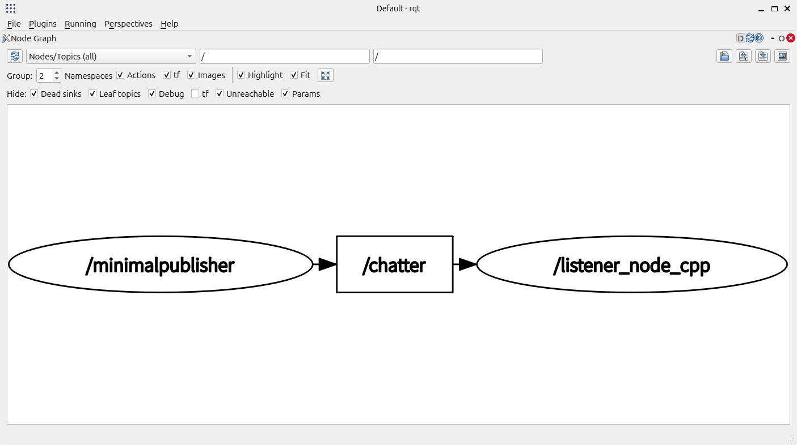

在该节点表中会展示目前正在运行的节点信息，以及它们是如何通过 topic 等通信机制连接彼此以实现相互交流。

#### 2. 消息发布器

例如，你可以通过以下方法开启 消息发布器：

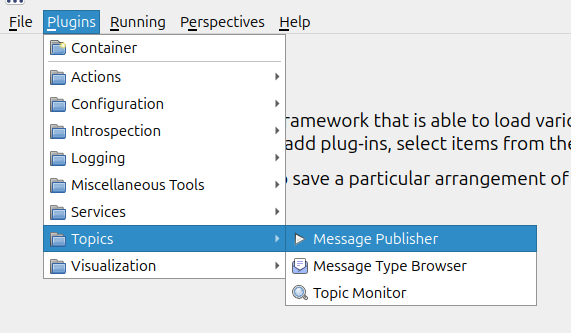

该页面的内容如下：

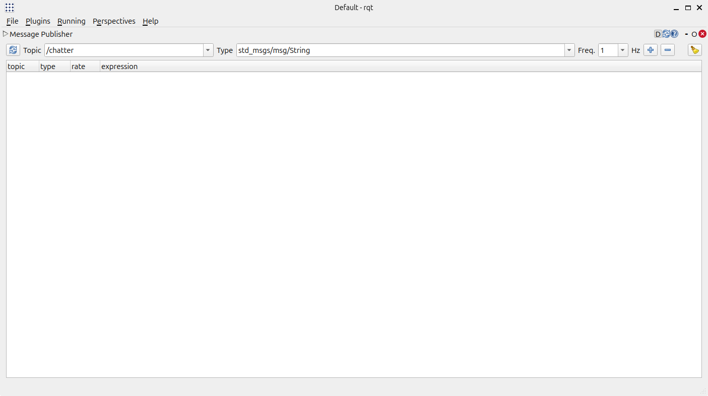

你可以通过针对某个 topic 添加相应的 publisher：

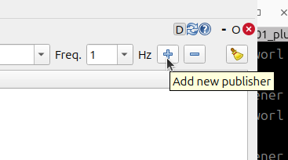

以实现对应 topic 的调试。

我们以[ROS2-004-通信机制：话题通信-分支壹-原生消息接口](../co_me/2024_09_22.md)内所使用的示例为例子。当启动订阅方之后，我们在这里针对名为 */chatter* 的 topic 进行调试：

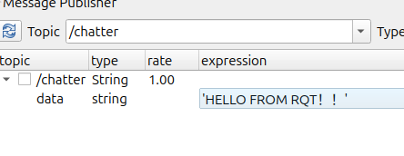

通过勾选前方的方框开启 message 的发送：

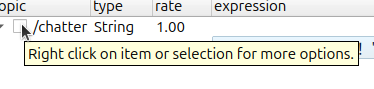

你就可以在订阅方启动时所属控制台接收到相应的信息：

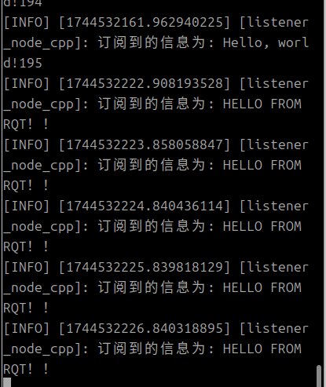

#### 3. service 调用器

例如，你可以通过以下方法开启 service 调用器：

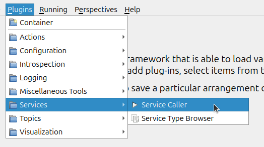

该页面的内容如下：

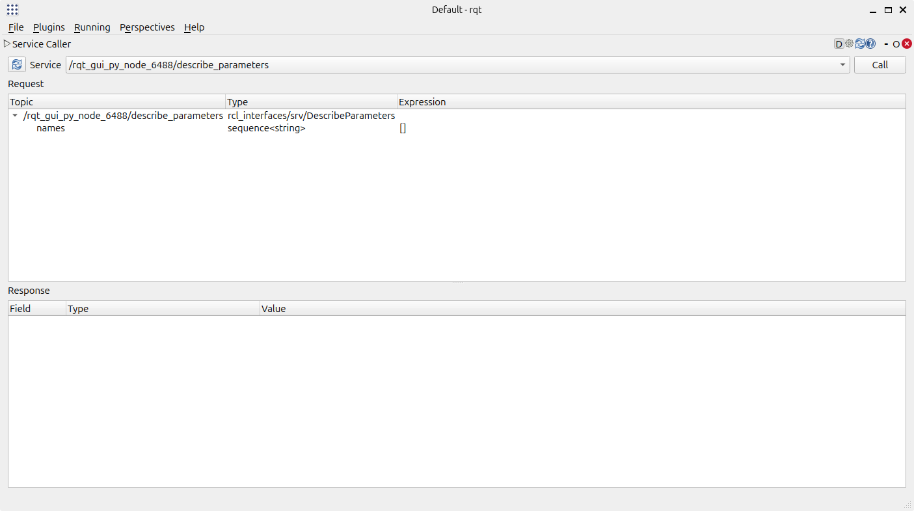

你可以在上方选择对应的 service 回调函数：

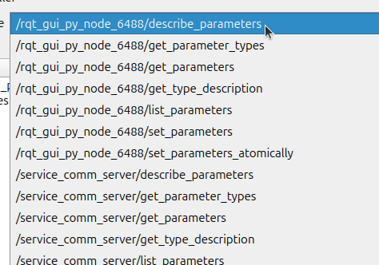

后进行相应调用，以实现其调试。

## 总结

本小节针对命令行工具与图形化工具两种通信机制工具进行了相对简单的阐述。在 ros2 节点间通信时，这两种工具都可以在调试相关功能上发挥重要作用。是学习 ROS2 是不得不品尝的一环🤣
