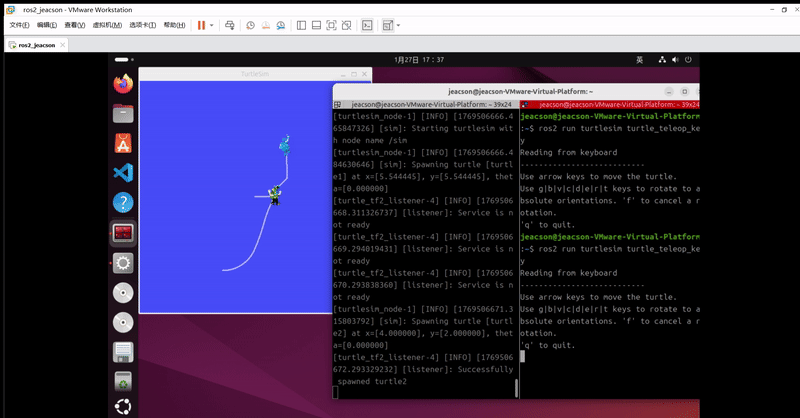

## 简介

我们在操作机器人时，通常会使用各种传感器感知机器人周围的物体与机器人的相对位置。不过在未针对传感器进行配置的情况下，传感器只能够返回其自身与物体的相对位置。因此我们需要通过某些特定的转换工程，才可以将该传感器的方位信息，变换物体相对于机器人系统或机器人其它组件的方位信息。在 ROS 中直接封装了相关的模块，其名称为 `tf(TransForm Frame)`

## 概念

该模块允许用户随时间跟踪多个坐标系。它在拥有 **时间缓冲** 的 *树状结构* 中维护坐标帧之间的关系，并让用户在 *任何* 所需的时间点在 *任意* 两个坐标帧之间变换点、向量等。在ROS中已经提供了同名的库实现，并且随着ROS的迭代，该库升级为了tf2，也即第二代坐标变换库。

完整的坐标变换实现由 **坐标变换广播方** 结构和 **坐标变换监听方** 结构两部分组成。坐标变换广播方会发布 **坐标系相对关系** 的数据，而坐标变换监听方会订阅多个广播方发布的数据。

每个坐标变换广播方一般只负责发布 `一组` 坐标系相对关系，而坐标变换监听方则会将 `多组` 坐标系相对关系组织为一棵坐标树（该坐标树有且仅有一个根坐标系），以实现任意坐标帧之间坐标点或者向量的变换。但是坐标变换时，需要参考消息数据的时间戳，以保证参与变换的两个坐标帧的时间差在特定的时间范围内，否则坐标变换后所获取的坐标在时间上没有参考性，出现误差。

::: info
ROS中的坐标变换是基于右手坐标系的。
:::

## 案例尝试

接下来我们会尝试使用官方网站上所提供的[相关案例](https://docs.ros.org/en/jazzy/Tutorials/Intermediate/Tf2/Introduction-To-Tf2.html)，以对 `tf2` 有一个初步的了解。

首先确认是否安装了该案例的功能包与依赖项，没有就使用以下指令在 bash 中安装：

```bash
sudo apt-get install ros-jazzy-rviz2 ros-jazzy-turtle-tf2-py ros-jazzy-tf2-ros ros-jazzy-tf2-tools ros-jazzy-turtlesim
```

或者直接克隆源码在构建也行：

```bash
git clone https://github.com/ros/geometry_tutorials.git -b ros2
```

接下来只需要在两个独立终端内，分别启动 `turtle_tf2_demo.launch.py` 文件与之前使用过的 `键盘控制` 节点：

```bash 第一个终端A内
ros2 launch turtle_tf2_py turtle_tf2_demo.launch.py
```

```bash 第二个终端B内
ros2 run turtlesim turtle_teleop_key
```

在 `终端B` 内 通过键盘 操控小海龟，此时就会看到如下效果：


