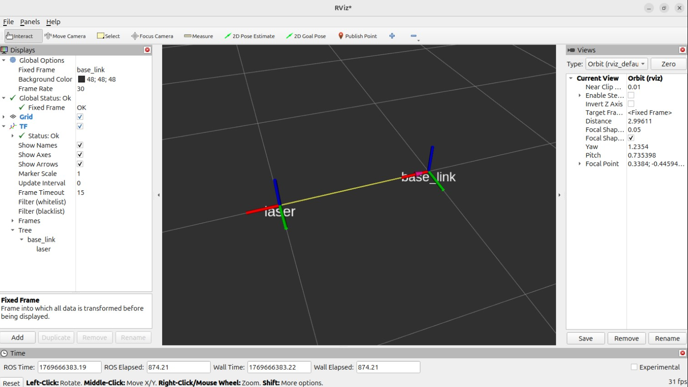
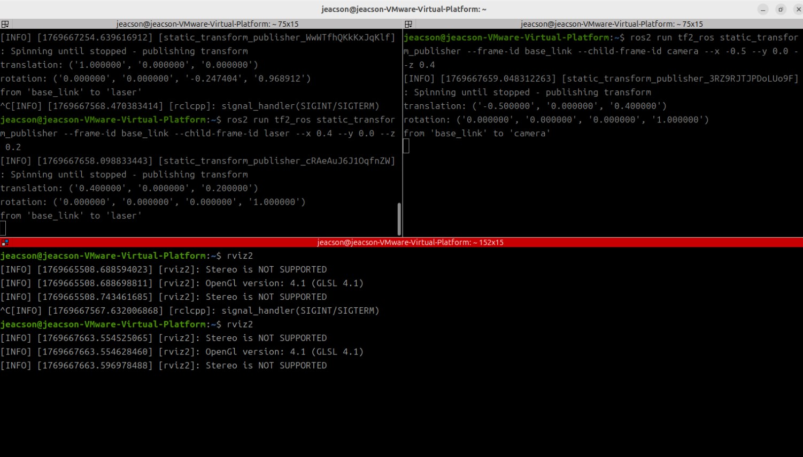
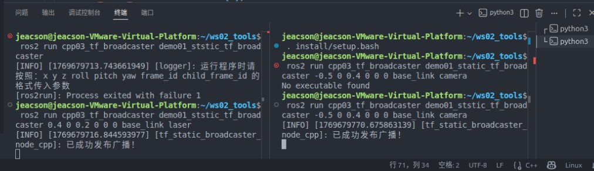
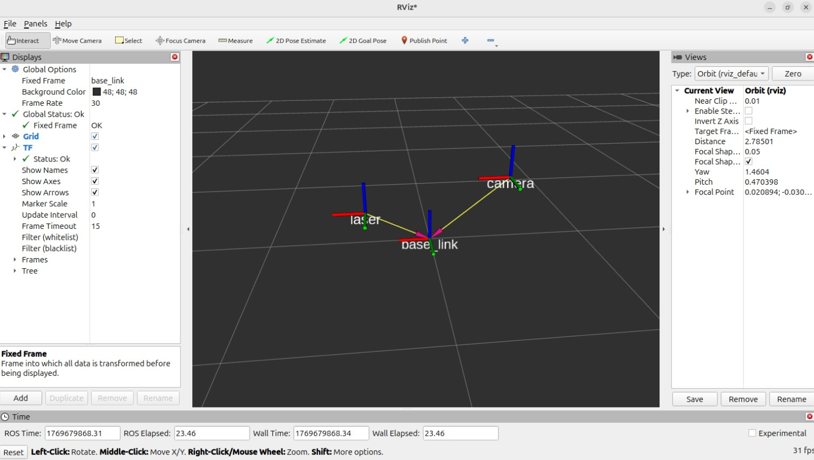

## 简介

坐标系相对关系主要有两种：静态坐标系相对关系与动态坐标系相对关系：

- `静态坐标系相对关系` 是指两个坐标系之间的相对位置是 **固定不变** 的，比如：车辆上的雷达、摄像头等组件一般是固定式的，那么雷达坐标系相对于车辆底盘坐标系或摄像头坐标系相对于车辆底盘坐标系就是一种静态关系。

- `动态坐标系相对关系` 是指两个坐标系之间的相对位置关系是 **动态改变** 的，比如：车辆上机械臂的关节或夹爪、多车编队中不同车辆等都是可以运动的，那么机械臂的关节或夹爪坐标系相对车辆底盘坐标系或不同车辆坐标系的相对关系就是一种动态关系。

本章会主要介绍如何实现静态坐标变换广播与动态坐标变换广播。在此基础上，还会演示如何发布坐标点消息。

## 案例梳理

以下有两个案例需求：

1. 有一无人车，在无人车底盘上装有 **固定式** 的雷达与摄像头。车辆底盘、雷达与摄像头各对应一坐标系，且各坐标系的原点取其几何中心。现已知*雷达坐标系*相对于*底盘坐标系*的三维平移量分别为：`x方向0.4米，y方向0米，z方向0.2米，无旋转`。*摄像头坐标系*相对于*底盘坐标系*的三维平移量分别为：`x方向-0.5米，y方向0米，z方向0.4米，无旋转`。请 *静态广播* **雷达与底盘的坐标系相对关系**与**摄像头与底盘的坐标系相对关系**，并在 `rviz2` 中查看广播的结果。
2. 启动 turtlesim_node，设该节点中**窗体为一个世界坐标系**(左下角为坐标系原点)，**乌龟是另一个坐标系**(乌龟可以通过键盘控制运动)，请 *动态广播* **乌龟坐标系与世界坐标系的相对关系**。

在上述案例中，**案例1**需要使用到*静态坐标变换*，**案例2**则需要使用*动态坐标变换*，不论何种实现其关注的要素都有两个：

1. 如何广播坐标系相对关系；
2. 如何使用 rviz2 显示坐标系相对关系。

这两种实现的通用主要步骤如下：

1. 编写广播实现原文件；
2. 编辑配置文件；
3. 编译；
4. 运行；
5. 在 rviz2 中查看坐标系关系。

以编码方式实现静态坐标变换的流程与实现动态坐标变换的流程相类似，这两个案例我们会采用 `C++` 和 `Python` 分别实现，二者都遵循上述实现流程。

::: note 静态广播不止编码

需要说明的是，*静态广播器* 除了可以以编码的方式实现外，在 `tf2` 中还内置了相关工具，可以**无需编码**，**直接执行**节点并传入表示坐标系相对关系的参数，实现静态坐标系关系的发布。对于静态广播而言也比较建议直接使用该方法。

而*动态广播器* 没有提供类似的工具。

:::

## 准备工作

终端下进入工作空间的src目录，调用如下两条命令分别创建C++功能包和Python功能包。

```bash
ros2 pkg create cpp03_tf_broadcaster --build-type ament_cmake --dependencies rclcpp tf2 tf2_ros geometry_msgs turtlesim
ros2 pkg create py03_tf_broadcaster --build-type ament_python --dependencies rclpy tf_transformations tf2_ros geometry_msgs turtlesim
```

## 静态广播

### 1. 使用命令方式

在 tf2_ros功能包中提供了一个名为static_transform_publisher的可执行文件，通过该文件可以直接广播静态坐标系关系，其使用语法如下。

::: tabs#grammer

@tab:active 格式1#grammer1

使用以**米**为单位的 `x/y/z` 偏移量和以**弧度**为单位的`roll/pitch/yaw`（可直译为滚动/俯仰/偏航，分别指的是围绕 x/y/z 轴的旋转）向 tf2 发布静态坐标变换。

```bash
ros2 run tf2_ros static_transform_publisher --x x --y y --z z --yaw yaw --pitch pitch --roll roll --frame-id frame_id --child-frame-id child_frame_id
```

例如使用：

```bash
ros2 run tf2_ros static_transform_publisher --frame-id base_link --child-frame-id laser --x 1.0
```

则会创建两个坐标系:



@tab:active 格式2#grammer2

使用以**米**为单位的 `x/y/z` 偏移量和 `qx/qy/qz/qw` 四元数向 tf2 发布静态坐标变换。

```bash
ros2 run tf2_ros static_transform_publisher --x x --y y --z z --qx qx --qy qy --qz qz --qw qw --frame-id frame_id --child-frame-id child_frame_id
```

例如使用：

```bash
ros2 run tf2_ros static_transform_publisher --frame-id base_link --child-frame-id laser --x 1.0 --qz -0.247404 --qw 0.968912
```

则会创建两个坐标系:


:::

::: note

① 在父子坐标系有偏移关系时，一般会**生成一个箭头**，由子级坐标系原点指向父级坐标系原点。其中生成的箭头为黄色箭体，粉色箭头。


② 在上述两种格式中除了用于表示父级坐标系的--frame-id和用于表示子级坐标系的--child-frame-id之外，其他参数都是可选的，如果未指定特定选项，那么将**直接使用默认值**。

例如，假设除 `id` 之外其他参数都使用默认值，

```bash
ros2 run tf2_ros static_transform_publisher --frame-id base_link --child-frame-id laser
```

则会创建两个原点和轴都重叠的坐标系:

 {id="ref-keypoint"}

③ **如何使用 Rviz2 查看坐标系关系?** 👈

新建终端，通过命令 `rviz2` 打开 Rviz2 并配置相关插件查看坐标变换消息：

- 将 `Global Options` 中的 `Fixed Frame` 设置为 `base_link`；
- 点击 `add` 按钮添加 `TF` 插件；
- 勾选 `TF` 插件中的 `show names`。

之后右侧的 `Grid` 窗口中将以图形化的方式显示坐标变换关系。


:::

在此基于 `案例1`，我们可以使用如下指令实现：

```bash
ros2 run tf2_ros static_transform_publisher --frame-id base_link --child-frame-id laser --x 0.4 --y 0.0 --z 0.2
ros2 run tf2_ros static_transform_publisher --frame-id base_link --child-frame-id camera --x -0.5 --y 0.0 --z 0.4
```

如下图：



则会创建如下三个坐标系：


### 2. 使用编码方式

#### Ⅰ.编写广播实现原文件

::: tabs#CP

@tab:active C++

功能包 `cpp03_tf_broadcaster` 的 `src` 目录下，新建 `C++` 文件 `demo01_static_tf_broadcaster.cpp`，并编辑文件，输入如下内容：

```cpp
/*  
  需求：编写静态坐标变换广播器，执行该程序时需传入两个坐标系的相对位姿关系以及父子级坐标系id，
       ros2 run 包 可执行程序 x y z roll pitch yaw frame_id child_frame_id
  步骤：
    1.包含头文件；
    2.判断终端传入的参数是否合法；
    3.初始化 ROS 客户端；
    4.定义节点类；
      4-1.创建静态坐标变换广播对象；
      4-2.从传入参数中组织并发布消息。
    5.调用 spin 函数，并传入对象指针；
    6.释放资源。

*/

// 1.包含头文件；
#include <geometry_msgs/msg/transform_stamped.hpp>

#include <rclcpp/rclcpp.hpp>
// 四元数转换用的库
#include <tf2/LinearMath/Quaternion.h>
#include <tf2_ros/static_transform_broadcaster.h>

using std::placeholders::_1;

// 4.定义节点类；
class TFStaticBroadcaster : public rclcpp::Node
{
public:
  explicit TFStaticBroadcaster(char * transformation[]): Node("tf_static_broadcaster_node_cpp")
  {
    // 4-1.创建静态坐标变换发布方；
    tf_publisher_ = std::make_shared<tf2_ros::StaticTransformBroadcaster>(this);
    // 4-2.组织并发布消息。（这边推荐另创建一函数）
    this->make_transforms(transformation);
  }

private:
  // 4-2.组织并发布消息。
  void make_transforms(char * transformation[])
  {
    // 组织消息
    geometry_msgs::msg::TransformStamped t;

    t.header.stamp = this->now(); // 时间戳
    t.header.frame_id = transformation[7]; // 父级坐标系
    t.child_frame_id = transformation[8]; // 子级坐标系

    t.transform.translation.x = atof(transformation[1]);
    t.transform.translation.y = atof(transformation[2]);
    t.transform.translation.z = atof(transformation[3]);

    // 创建四元数对象
    tf2::Quaternion q;
    q.setRPY(
      atof(transformation[4]),
      atof(transformation[5]),
      atof(transformation[6]));
    t.transform.rotation.x = q.x();
    t.transform.rotation.y = q.y();
    t.transform.rotation.z = q.z();
    t.transform.rotation.w = q.w();

    // 发布消息
    tf_publisher_->sendTransform(t);
    RCLCPP_INFO(get_logger(), "已成功发布广播！");
  }
  std::shared_ptr<tf2_ros::StaticTransformBroadcaster> tf_publisher_;
};

int main(int argc, char * argv[])
{
  // 2.判断终端传入的参数是否合法；
  auto logger = rclcpp::get_logger("logger");

  if (argc != 9) {
    RCLCPP_INFO(
      logger, "运行程序时请按照：x y z roll pitch yaw frame_id child_frame_id 的格式传入参数");
    return 1;
  }

  // 3.初始化 ROS 客户端；
  rclcpp::init(argc, argv);
  // 5.调用 spin 函数，并传入对象指针；
  rclcpp::spin(std::make_shared<TFStaticBroadcaster>(argv));
  // 6.释放资源。
  rclcpp::shutdown();
  return 0;
}
```

@tab Python

:::

#### Ⅱ.编辑配置文件

::: tabs#CP

@tab:active C++

在 `CMakeLists.txt` 中发布和订阅程序核心配置如下：

```txt
find_package(ament_cmake REQUIRED)
find_package(rclcpp REQUIRED)
find_package(tf2 REQUIRED)
find_package(tf2_ros REQUIRED)
find_package(geometry_msgs REQUIRED)
find_package(turtlesim REQUIRED)

add_executable(demo01_static_tf_broadcaster src/demo01_static_tf_broadcaster.cpp)
ament_target_dependencies(
  demo01_static_tf_broadcaster
  "rclcpp"
  "tf2"
  "tf2_ros"
  "geometry_msgs"
  "turtlesim"
)

install(TARGETS demo01_static_tf_broadcaster
  DESTINATION lib/${PROJECT_NAME})
```

@tab Python

:::

#### Ⅲ.编译

终端中进入当前工作空间，编译功能包：

::: tabs#CP

@tab:active C++

```bash
colcon build --packages-select cpp03_tf_broadcaster
```

@tab Python

:::

#### Ⅳ.运行

当前工作空间下，启动两个终端，终端1输入如下命令发布雷达（laser）相对于底盘（base_link）的静态坐标变换：

::: tabs#CP

@tab:active C++

```bash
. install/setup.bash 
ros2 run cpp03_tf_broadcaster demo01_static_tf_broadcaster 0.4 0 0.2 0 0 0 base_link laser
```

终端2输入如下命令发布摄像头（camera）相对于底盘（base_link）的静态坐标变换：

```bash
. install/setup.bash
ros2 run cpp03_tf_broadcaster demo01_static_tf_broadcaster -0.5 0 0.4 0 0 0 base_link camera
```

此时就可以看到：



@tab Python

:::

#### Ⅴ.在 Rviz2 中查看坐标系关系

你可以参考 [前文注释](./2026_01_29.md#ref-keypoint) 中的相关内容以打开 `Rviz2`。



::: tip 所以，不用自己做话题的生成吗?
虽然咱之前提到过说，“坐标变换底层上就是话题通信”，但是 **我们不需要自己设置话题**，其会帮我们自己生成。
他的默认值为 `/tf_static`，你也可以通过查看 `tf2_ros::StaticTransformBroadcaster` 下构造函数的源码
:::

::: tip 节点也不用吗？
确实，虽然“无论创建何种通信对象，都需要依赖于一个节点”，但是以 `c++` 为例子：

```cpp
...
    // 4-1.创建静态坐标变换发布方；
    tf_publisher_ = std::make_shared<tf2_ros::StaticTransformBroadcaster>(this);

```

这里只需要传入 `this` 即可。

:::

## 动态广播
