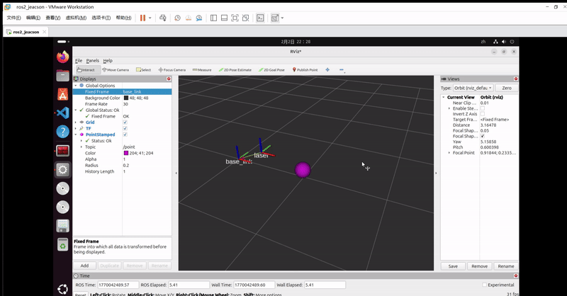

## 简介

在 [上一个章节](./2026_01_29.md)里，我们介绍了**静态广播** 和 **动态广播**。本章会主要介绍如何发布坐标点消息。

## 案例梳理

以下有一案例需求：

有一无人车，在无人车底盘上装有 **固定式** 的激光雷达。车辆底盘、雷达各对应一坐标系，且各坐标系的原点取其几何中心。现该激光雷达扫描到一 *点状障碍物* 且可以定位到障碍物的坐标，请在 **雷达坐标系下** 发布障碍坐标点数据，并在Rviz2 中查看结果。

上述案例是一个简单的 `话题发布程序`，在了解用于发布坐标点信息的 `geometry_msgs/msg/PointStamped` 接口消息之后，直接通过 **话题发布方** 按照一定逻辑发布消息即可。

实现的主要步骤如下：

1. 编写话题发布实现；
2. 编辑配置文件；
3. 编译；
4. 运行；
5. 在 rviz2 中查看坐标系关系。

该案例会采用 `C++` 和 `Python` 分别实现，二者都遵循上述实现流程。

## 准备工作

终端下进入工作空间的src目录，调用如下两条命令分别创建C++功能包和Python功能包。

```bash
ros2 pkg create cpp03_tf_broadcaster --build-type ament_cmake --dependencies rclcpp tf2 tf2_ros geometry_msgs turtlesim
ros2 pkg create py03_tf_broadcaster --build-type ament_python --dependencies rclpy tf_transformations tf2_ros geometry_msgs turtlesim
```

### Ⅰ.编写话题发布实现

::: tabs#CP

@tab:active C++

功能包 `cpp03_tf_broadcaster` 的 `src` 目录下，新建 `C++` 文件 `demo03_point_tf_broadcaster.cpp`，并编辑文件，输入如下内容：

```cpp
 /*
    需求： 发布一个相对于激光雷达坐标系的坐标点数据
    步骤：
        1. 包含头文件；
        2. 初始化 ROS2 客户端
        3. 自定义节点类：
            3-1. 创建发布方
            3-2. 创建定时器
            3-3. 回调函数中组织并发布消息
        4. 调用spin函数，并传入节点对象指针
        5. 释放资源。
 */

// 1. 包含头文件；
#include "rclcpp/rclcpp.hpp"
#include "geometry_msgs/msg/point_stamped.hpp"

using namespace std::chrono_literals;
// 3. 自定义节点类：
class PointBroadcaster: public rclcpp::Node{
    public:
        PointBroadcaster() : Node("point_broadcaster_node_cpp"), x(0.0){
            // 3-1. 创建发布方
            point_pub_ = this->create_publisher<geometry_msgs::msg::PointStamped>("point", 10);
            // 3-2. 创建定时器
            timer_ = this->create_timer(0.1s, std::bind(&PointBroadcaster::timer_callback, this));
        }

    private:
        // 3-3. 回调函数中组织并发布消息
        void timer_callback(){
            // 组织消息
            geometry_msgs::msg::PointStamped point;
            point.header.frame_id = "laser";
            point.header.stamp = this->now();

            // 使坐标点移动
            x += 0.005;
            point.point.x = x;
            point.point.y = 0.0;
            point.point.z = -0.1;        
            // 发布消息
            point_pub_->publish(point);
        }   

        rclcpp::Publisher<geometry_msgs::msg::PointStamped>::SharedPtr point_pub_;
        rclcpp::TimerBase::SharedPtr timer_;
        double_t x;
};

int main(int argc, char *argv[])
{
    // 2. 初始化 ROS2 客户端
    rclcpp::init(argc, argv);
    // 4. 调用spin函数，并传入节点对象指针。
    rclcpp::spin(std::make_shared<PointBroadcaster>());
    // 5.释放资源;
    rclcpp::shutdown();
    return 0; 
} 
```

@tab Python

功能包 `py03_tf_broadcaster` 的 `py03_tf_broadcaster` 目录下，新建 `Python` 文件 `demo01_static_tf_broadcaster_py.py`，并编辑文件，输入如下内容：

```python
"""  
    需求： 发布一个相对于激光雷达坐标系的坐标点数据
    流程：
        1.导包；
        2.初始化ROS2客户端；
        3.自定义节点类；
            3-1. 创建发布方
            3-2. 创建定时器
            3-3. 回调函数中组织并发布消息                        
        4.调用spin函数，并传入节点对象；
        5.资源释放。 


"""
# 1.导包；
import rclpy
from rclpy.node import Node
from geometry_msgs.msg import PointStamped

# 3.自定义节点类；
class PointBroadcasterPy(Node):
    def __init__(self):
        super().__init__("point_broadcaster_py_node_py")
        self.point_pub_ = self.create_publisher(PointStamped,"point",10)
        self.x = 0.0
        self.timer_ = self.create_timer(0.1, self.timer_callback())
    
    def timer_callback(self):
        # 组织信息
        point = PointStamped()
        point.header.frame_id = "laser"
        point.header.stamp = self.get_clock().now().to_msg()
        self.x += 0.005
        point.point.x = self.x
        point.point.y = 0.0
        point.point.z = 0.2
        # 发布信息
        self.point_pub_.publish(point)

def main():
    # 2.初始化ROS2客户端；
    rclpy.init()
    # 4.调用spain函数，并传入节点对象；
    rclpy.spin(PointBroadcasterPy())
    # 5.资源释放。 
    rclpy.shutdown()

if __name__ == '__main__':
    main()
```

:::

### Ⅱ.编辑配置文件

::: tabs#CP

@tab:active C++

在 `CMakeLists.txt` 中发布和订阅程序核心配置如下：

```txt
find_package(ament_cmake REQUIRED)
find_package(rclcpp REQUIRED)
find_package(tf2 REQUIRED)
find_package(tf2_ros REQUIRED)
find_package(geometry_msgs REQUIRED)
find_package(turtlesim REQUIRED)

add_executable(demo03_point_tf_broadcaster src/demo03_point_tf_broadcaster.cpp)
ament_target_dependencies(
  demo03_point_tf_broadcaster
  "rclcpp"
  "tf2"
  "tf2_ros"
  "geometry_msgs"
  "turtlesim"
)

install(TARGETS demo03_point_tf_broadcaster
  DESTINATION lib/${PROJECT_NAME})
```

@tab Python

在 `setup.py` 中针对 `entry_points` 字段的 `console_scripts` 添加如下内容：

```python
...
entry_points={
    'console_scripts': [
        'demo03_point_tf_broadcaster_py = py03_tf_broadcaster.demo03_point_tf_broadcaster_py:main'
    ],
},
...
```

:::

### Ⅲ.编译

终端中进入当前工作空间，编译功能包：

::: tabs#CP

@tab:active C++

```bash
colcon build --packages-select cpp03_tf_broadcaster
```

@tab Python

```bash
colcon build --packages-select py03_tf_broadcaster
```

:::

### Ⅳ.运行

当前工作空间下，启动两个终端，终端1输入如下命令发布雷达（laser）相对于底盘（base_link）的静态坐标变换（用上一章节所使用的[命令方式](./2026_01_29.md#1-使用命令方式)发布）：

```bash
. install/setup.bash 
ros2 run tf2_ros static_transform_publisher --frame-id base_link --child-frame-id laser --x 0.4 --y 0.0 --z 0.2
```

而在终端2中输入如下命令运行代码：

::: tabs#CP

@tab:active C++

```bash
. install/setup.bash
ros2 run cpp03_tf_broadcaster demo03_point_tf_broadcaster 
```

@tab Python

```bash
. install/setup.bash
ros2 run py03_tf_broadcaster demo03_point_tf_broadcaster_py

```

:::

### Ⅴ.在 Rviz2 中查看坐标系关系

新建终端，通过命令 `rviz2` 打开 Rviz2 并配置相关插件查看坐标变换消息：

- 将 `Global Options` 中的 `Fixed Frame` 设置为 `base_link`；
- 点击 `add` 按钮添加 `TF` 插件；
- 勾选 `TF` 插件中的 `show names`。

之后右侧的 `Grid` 窗口中将以图形化的方式显示**两个坐标系**之间的变换关系。

- 再次点击 `add` 按钮添加 `PointedStamped` 插件；
- 在 `PointedStamped` 插件中修改 `topic` 字段为 **“/point”**。

之后右侧的 `Grid` 窗口中将以图形化的方式显示**坐标点与坐标系**之间的变换关系。


