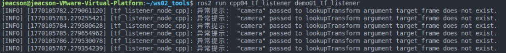
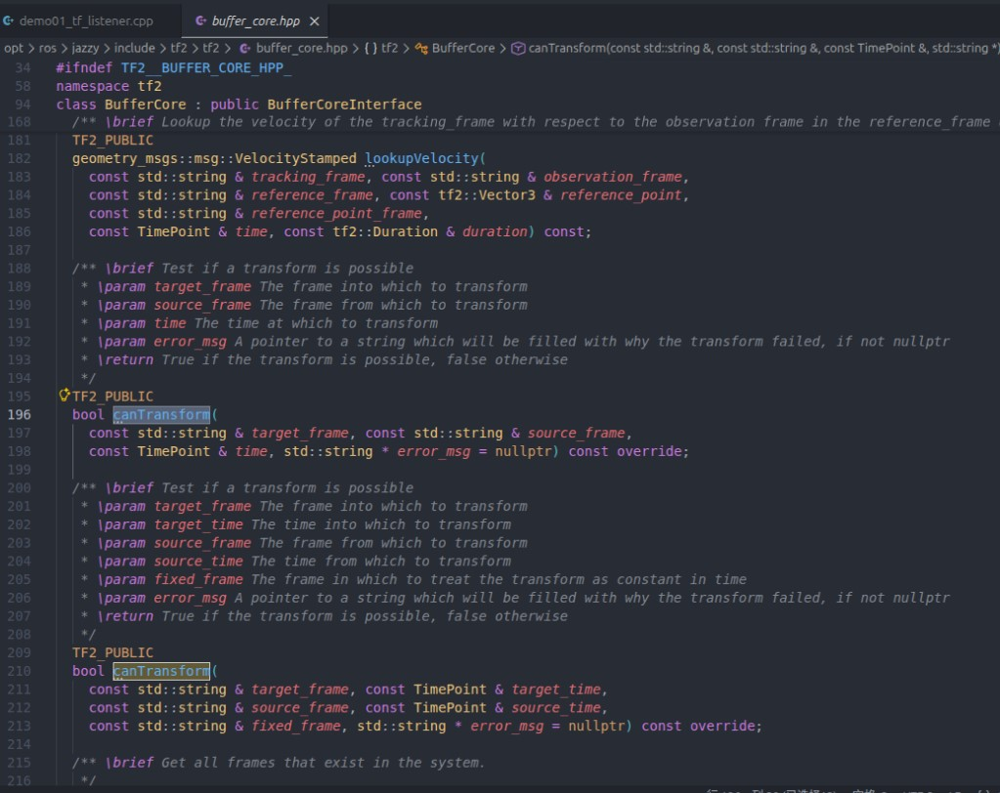
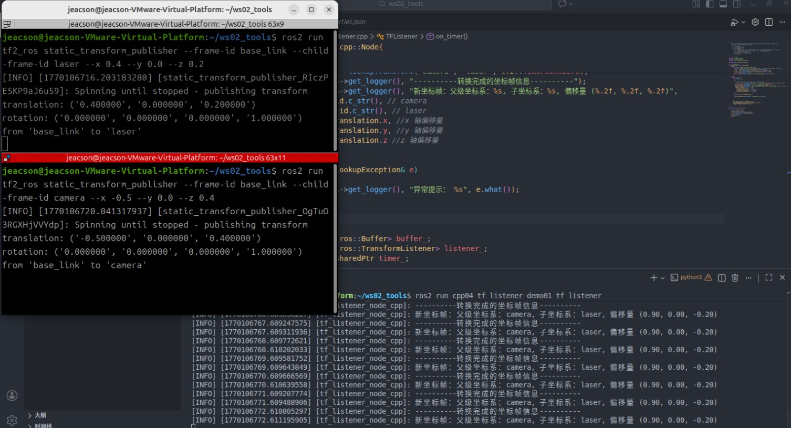
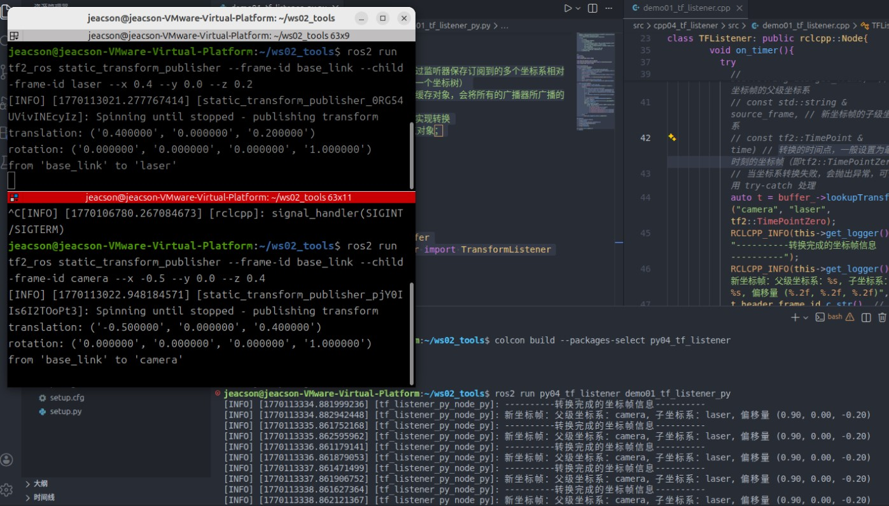

## 简介

**坐标变换监听** 可以实现坐标点在不同坐标系之间的变换，或者不同的多个坐标系之间的变换。
针对坐标变换进行监听的前提，是必须**已有不同的多个坐标系相对关系**的广播，而至于是静态广播或动态广播则无要求。因为监听获取的坐标系相对关系皆为某一时刻或某一时间点。

## 案例梳理

以下有两个案例：

1. 在[前两章（ROS2-022-ROS2工具：坐标变换（三）坐标变换广播）的案例一](./2026_01_29.md#案例梳理)中，我们发布了 `laser` 相对于 `base_link`，和 `camra` 相对于 `base_link` 的坐标系关系，请基于此求解 **`laser` 相对于 `camera`** 的坐标系关系。
2. 在[前一章（ROS2-023-ROS2工具：坐标变换（四）发布坐标点消息）的案例](./2026_02_02.md#案例梳理)中，我们发布了 `laser` 相对于 `base_link`的坐标系关系 和 `laser` 坐标系下一 *点状障碍物* 的坐标点数据，请基于此求解在 `base_link` 坐标系下 **该点状障碍物** 的坐标。

在上述案例中，案例1是**多坐标系**的场景下实现**不同坐标系**之间的变换，案例2则是要实现**同一坐标点**在**不同坐标系**下的变换，虽然需求不同，但是相关算法都被封装好了，我们只需要调用相关 API 即可。

两个案例实现的流程类似，其主要步骤如下：

1. 编写坐标变换程序实现；
2. 编辑配置文件；
3. 编译；
4. 执行。

这两个案例我们会采用 `C++` 和 `Python` 分别实现，二者都遵循上述实现流程。

## 准备工作

终端下进入工作空间的src目录，调用如下两条命令分别创建C++功能包和Python功能包。

```bash
ros2 pkg create cpp04_tf_listener --build-type ament_cmake --dependencies rclcpp tf2 tf2_ros geometry_msgs --node-name demo01_tf_listener
ros2 pkg create py04_tf_listener --build-type ament_python --dependencies rclpy tf_transformations tf2_ros geometry_msgs --node-name demo01_tf_listener_py
```

### Ⅰ.编写坐标变换程序实现

::: tabs#CP

@tab:active C++

功能包 `cpp04_tf_listener` 的 `src` 目录下，编辑 `C++` 文件 `demo01_tf_listener.cpp`，输入如下内容：

```cpp
  /*
    需求： 在外部发布了“laser至base_link的坐标相对关系”与“camera至base_link的坐标相对关系” 后，
          求解 “laser至camera的坐标相对关系”
    步骤：
        1. 包含头文件；
        2. 初始化 ROS2 客户端
        3. 自定义节点类：
          3-1. 创建缓存对象（通过监听器保存订阅到的多个坐标系相对关系数据，并将其组合为一个坐标树）
          3-2. 创建监听器（绑定缓存对象，会将所有的广播器所广播的数据写入缓存）
          3-3. 编写定时器，循环实现转换
        4. 调用spin函数，并传入节点对象指针
        5. 释放资源。
 */

// 1. 包含头文件；
#include "rclcpp/rclcpp.hpp"
#include "tf2_ros/buffer.h"
#include "tf2_ros/transform_listener.h"

using namespace std::chrono_literals;

// 3. 自定义节点类：
class TFListener: public rclcpp::Node{
    public:
        TFListener() : Node("tf_listener_node_cpp"){
          // 3-1. 创建缓存对象（通过监听器保存订阅到的多个坐标系相对关系数据，并将其组合为一个坐标树）
          buffer_ = std::make_unique<tf2_ros::Buffer>(this->get_clock());
          // 3-2. 创建监听器（绑定缓存对象，会将所有的广播器所广播的数据写入缓存）
          listener_ = std::make_shared<tf2_ros::TransformListener>(*buffer_, this);
          // 3-3. 编写定时器，循环实现转换
          timer_ = this->create_wall_timer(1s, std::bind(&TFListener::on_timer, this));
        }

    private:
        void on_timer(){
          // 实现坐标系转换
          // 当坐标系转换失败，会抛出异常，可使用 try-catch 处理
          try
          {
            // geometry_msgs::msg::TransformStamped // 返回一个新的坐标帧
            // lookupTransform( const std::string &target_frame,  // 新坐标帧的父级坐标系
            // const std::string &source_frame, // 新坐标帧的子级坐标系
            // const tf2::TimePoint &time) // 转换的时间点，一般设置为最新时刻的坐标帧（即tf2::TimePointZero）
            auto t = buffer_->lookupTransform("camera", "laser", tf2::TimePointZero);
            RCLCPP_INFO(this->get_logger(), "----------转换完成的坐标帧信息----------");
            RCLCPP_INFO(this->get_logger(), "新坐标帧：父级坐标系：%s, 子坐标系：%s, 偏移量 (%.2f, %.2f, %.2f)", 
            t.header.frame_id.c_str(), // camera
              t.child_frame_id.c_str(), // laser
              t.transform.translation.x, //x 轴偏移量
              t.transform.translation.y, //y 轴偏移量
              t.transform.translation.z //z 轴偏移量
            );
          }
          catch(const tf2::LookupException& e)
          {
            RCLCPP_INFO(this->get_logger(), "异常提示： %s", e.what());
          }
          
        }

        std::unique_ptr<tf2_ros::Buffer> buffer_;
        std::shared_ptr<tf2_ros::TransformListener> listener_; 
        rclcpp::TimerBase::SharedPtr timer_;

};

int main(int argc, char *argv[])
{
    // 2. 初始化 ROS2 客户端
    rclcpp::init(argc, argv);
    // 4. 调用spin函数，并传入节点对象指针。
    rclcpp::spin(std::make_shared<TFListener>());
    // 5.释放资源;
    rclcpp::shutdown();
    return 0; 
} 
```

@tab Python

功能包 `py04_tf_listener` 的 `py04_tf_listener` 目录下，编辑 `Python` 文件 `demo01_tf_listener_py.py`，输入如下内容：

```python
"""  
    需求： 在外部发布了“laser至base_link的坐标相对关系”与“camera至base_link的坐标相对关系” 后，
          求解 “laser至camera的坐标相对关系”
    流程：
        1.导包；
        2.初始化ROS2客户端；
        3.自定义节点类；
            3-1. 创建缓存对象（通过监听器保存订阅到的多个坐标系相对关系数据，并将其组合为一个坐标树）
            3-2. 创建监听器（绑定缓存对象，会将所有的广播器所广播的数据写入缓存）
            3-3. 编写定时器，循环实现转换
        4.调用spin函数，并传入节点对象；
        5.资源释放。 


"""
# 1.导包；
import rclpy
from rclpy.node import Node

from tf2_ros.buffer import Buffer
from tf2_ros.transform_listener import TransformListener
from rclpy.time import Time

# 3.自定义节点类；
class TFListenerPy(Node):
    def __init__(self):
        super().__init__("tf_listener_py_node_py")
        # 3-1. 创建缓存对象（通过监听器保存订阅到的多个坐标系相对关系数据，并将其组合为一个坐标树）
        self.buffer_ = Buffer()
        # 3-2. 创建监听器（绑定缓存对象，会将所有的广播器所广播的数据写入缓存）
        self.listener_ = TransformListener(self.buffer_, self)
        # 3-3. 编写定时器，循环实现转换
        self.timer_ = self.create_timer(1.0, self.on_timer)

    def on_timer(self):
        # 判断是否可以进行坐标系转换
        if self.buffer_.can_transform("camera", "laser", Time()):
            # (method) def lookup_transform(
            #     target_frame: str, # 新坐标帧的父级坐标系
            #     source_frame: str, # 新坐标帧的子级坐标系
            #     time: Time, # 转换的时间点，一般设置为最新时刻的坐标帧
            #     timeout: Duration = Duration() # 使用默认值
            # ) -> TransformStamped
            t = self.buffer_.lookup_transform("camera", "laser", Time())
            self.get_logger().info("----------转换完成的坐标帧信息----------")
            self.get_logger().info(
                "新坐标帧：父级坐标系：%s, 子坐标系：%s, 偏移量 (%.2f, %.2f, %.2f)" 
                    %(t.header.frame_id, # camera
                    t.child_frame_id,  # laser
                    t.transform.translation.x, # x 轴偏移量
                    t.transform.translation.y, # y 轴偏移量
                    t.transform.translation.z) # z 轴偏移量
                )
        else:
            self.get_logger().info("转换失败XD")

def main():
    # 2.初始化ROS2客户端；
    rclpy.init()
    # 4.调用spin函数，并传入节点对象；
    rclpy.spin(TFListenerPy())
    # 5.资源释放。 
    rclpy.shutdown()

if __name__ == '__main__':
    main()
```

:::

::: note 提示信息

在 `c++` 的例子里，如果在未发布 `camera` 或者 `laser` 坐标系相对于 `base_link` 坐标系的相对位置关系时就运行了该程序，就会出现以下信息：



该异常信息是我们当时编写代码时使用 `try-catch` 所抓取到的。关于该 `excepetion` 的相关描述为(以 `c++` 为例)：

> class tf2::LookupException
> An exception class to notify of bad frame number
> This is an exception class to be thrown in the case that a frame not in the graph has been attempted to be accessed. The most common reason for this is that the frame is not being published, or a parent frame was not set correctly causing the tree to be broken. (当尝试访问图中不存在的帧时，将抛出此异常类。最常见的原因是该帧未被发布，或父帧设置不正确导致树结构断裂。)

其实针对该异常还有另一种处理方式，就是**在转换之前先针对`buffer`进行判断**，判断其是否可以进行转换。

以C++为例，在 `buffer_` 下还有另一函数为 `canTransform()`:



其返回一个 `bool` 值。因此你亦可以将之前的 `try-catch` 代码改写为类似于：

```cpp
...
if (buffer_->canTransform("camera", "laser", tf2::TimePointZero)) {
    auto t = buffer_->lookupTransform("camera", "laser", tf2::TimePointZero);
} else {
    RCLCPP_INFO(this->get_logger(), "异常提示: 可能为坐标系位置关系未发布");
}
```

你可以参考 `python` 那边在针对上述异常时的处理方法。

:::

### Ⅱ.编辑配置文件

::: tabs#CP

@tab:active C++

在 `CMakeLists.txt` 中发布和订阅程序核心配置如下：

```txt
find_package(ament_cmake REQUIRED)
find_package(rclcpp REQUIRED)
find_package(tf2 REQUIRED)
find_package(tf2_ros REQUIRED)
find_package(geometry_msgs REQUIRED)
find_package(turtlesim REQUIRED)

add_executable(demo01_tf_listener src/demo01_tf_listener.cpp)
ament_target_dependencies(
  demo01_tf_listener
  "rclcpp"
  "tf2"
  "tf2_ros"
  "geometry_msgs"
  "turtlesim"
)

install(TARGETS demo01_tf_listener
  DESTINATION lib/${PROJECT_NAME})
```

@tab Python

在 `setup.py` 中针对 `entry_points` 字段的 `console_scripts` 添加如下内容：

```python
...
entry_points={
    'console_scripts': [
        'demo01_tf_listener_py = py03_tf_broadcaster.demo01_tf_listener_py:main'
    ],
},
...
```

:::

### Ⅲ.编译

终端中进入当前工作空间，编译功能包：

::: tabs#CP

@tab:active C++

```bash
colcon build --packages-select cpp04_tf_listener
```

@tab Python

```bash
colcon build --packages-select py04_tf_listener
```

:::

### Ⅳ.运行

当前工作空间下，启动两个终端，终端1输入如下命令发布雷达（laser）相对于底盘（base_link）的静态坐标变换（使用*坐标变换（三）*章节所使用的[命令方式](./2026_01_29.md#1-使用命令方式)发布）：

```bash
. install/setup.bash 
ros2 run tf2_ros static_transform_publisher --frame-id base_link --child-frame-id laser --x 0.4 --y 0.0 --z 0.2
```

终端2输入如下命令发布摄像头（camera）相对于底盘（base_link）的静态坐标变换（同样使用*坐标变换（三）*章节所使用的[命令方式](./2026_01_29.md#1-使用命令方式)发布）：

```bash
. install/setup.bash
ros2 run tf2_ros static_transform_publisher --frame-id base_link --child-frame-id camera --x -0.5 --y 0.0 --z 0.4

```

新建一终端3，输入如下命令运行代码：

::: tabs#CP

@tab:active C++

```bash
. install/setup.bash
ros2 run cpp04_tf_listener demo01_tf_listener 
```

在该终端中便会输出如下信息：



@tab Python

```bash
. install/setup.bash
ros2 run py04_tf_listener demo01_tf_listener_py

```

在该终端中便会输出如下信息：



:::
