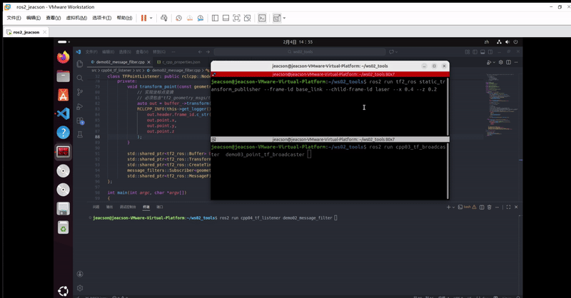
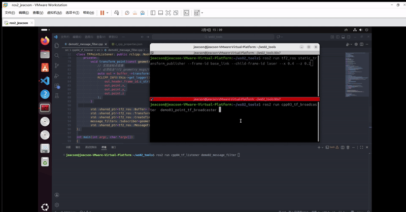

## 简介

**坐标变换监听** 可以实现坐标点在不同坐标系之间的变换，或者不同的多个坐标系之间的变换。
针对坐标变换进行监听的前提，是必须**已有不同的多个坐标系相对关系**的广播，而至于是静态广播或动态广播则无要求。因为监听获取的坐标系相对关系皆为某一时刻或某一时间点。

在[上一章节](./2026_02_03.md#案例一)中，我们经由案例一实现了**多坐标系**的场景下实现**不同坐标系**之间的变换。在这一章节中，我们会实现案例二，即**同一坐标点**在**不同坐标系**下的变换。虽然两个案例的需求不同，但是相关算法都被封装好了，我们只需要调用相关 API 即可。

## 案例梳理

案例二为：

- 在[前两章（ROS2-023-ROS2工具：坐标变换（四）发布坐标点消息）的案例](./2026_02_02.md#案例梳理)中，我们发布了 `laser` 相对于 `base_link`的坐标系关系 和 `laser` 坐标系下一 *点状障碍物* 的坐标点数据，请基于此求解在 `base_link` 坐标系下 **该点状障碍物** 的坐标。

两个案例实现的流程类似，其主要步骤如下：

1. 编写坐标变换程序实现；
2. 编辑配置文件；
3. 编译；
4. 执行。

这个案例我们会采用 `C++` 实现，遵循上述实现流程。

::: info 针对 Python
在 `ROS2 Jazzy` 版本中，可以使用 `Python` 实现核心功能，但是 `Python` 中 **并没有实现 `tf2_ros::MessageFilter` 功能模块**。因此需要手动处理 `等待 TF 就绪` 的逻辑，而无法像 `C++` 那样使用 `MessageFilter` 的自动回调机制。

不过 `C++` 在数据处理这一块性能比较好,因此建议直接使用 `C++` 版本的就行。
:::

::: tip 该程序是如何实现的？

针对坐标点与坐标系之间的相对转换，坐标变换程序的实现步骤如下：

1. 订阅数据；
    1. 创建监听器对象A，订阅坐标系变换；
    2. 创建缓存B，存储坐标系变换数据；
    3. 再创建一个新的监听器对象C（专用订阅方），订阅坐标点数据；
2. 求解。
    1. 创建过滤器，获取*缓存B内存储的坐标系变换数据*与*对象C内订阅的坐标点数据*；
    2. 使用过滤器整合数据，计算出坐标点相对坐标系的变换数据。

:::

## 准备工作

终端下进入工作空间的 `src` 目录，调用如下命令创建 `C++` 功能包。因为依赖包有所增加，如[上一章节](./2026_02_03.md#案例一)已经创建过，则需要编辑 `package.xml`、`CMakeLists.txt` （在 `C++` 中）。你可以通过[下方的编辑配置文件](#ⅱ编辑配置文件)进行查找。

```bash
ros2 pkg create cpp04_tf_listener --build-type ament_cmake --dependencies rclcpp tf2 tf2_ros geometry_msgs tf2_geometry_msgs message_filters --node-name demo01_tf_listener
```

### Ⅰ.编写坐标变换程序实现

功能包 `cpp04_tf_listener` 的 `src` 目录下，新建 `C++` 文件 `demo02_message_filter.cpp`，并编辑文件，输入如下内容：

```cpp
   /*
    需求： 在外部"广播 laser->base_link 的坐标系相对关系"，并"发布 point->laser 坐标系的坐标"后
            求解 point->base_link 的坐标
    步骤：
        1. 包含头文件；
        2. 初始化 ROS2 客户端
        3. 自定义节点类：
            3-1. 创建坐标变换的监听器;
            3-2. 创建坐标点消息订阅方;
            3-3. 创建过滤器以解析数据;
        4. 调用spin函数，并传入节点对象指针
        5. 释放资源。
 */

// 1. 包含头文件；
#include "rclcpp/rclcpp.hpp"
# include "tf2_ros/buffer.h"
# include "tf2_ros/transform_listener.h"

#include "tf2_ros/create_timer_ros.h"

#include "message_filters/subscriber.h"
#include "geometry_msgs/msg/point_stamped.hpp"

#include "tf2_ros/message_filter.h"

#include "tf2_geometry_msgs/tf2_geometry_msgs.hpp"

using namespace std::chrono_literals;

// 3. 自定义节点类：
class TFPointListener: public rclcpp::Node{
    public:
        TFPointListener() : Node("tf_point_listener_node_cpp"){
            // 3-1. 创建坐标变换的监听器;
            buffer_ = std::make_shared<tf2_ros::Buffer>(this->get_clock());
            // CreateTimerROS(
            // rclcpp::node_interfaces::NodeBaseInterface::SharedPtr node_base,
            // rclcpp::node_interfaces::NodeTimersInterface::SharedPtr node_timers, 
            // rclcpp::CallbackGroup::SharedPtr callback_group = nullptr)
            timer_ = std::make_shared<tf2_ros::CreateTimerROS>(
                this->get_node_base_interface(),
                this->get_node_timers_interface()
            );

            buffer_->setCreateTimerInterface(timer_);
            listener_ = std::make_shared<tf2_ros::TransformListener>(*buffer_);

            // 3-2. 创建坐标点消息订阅方;
            // 使用无参构造
            point_sub.subscribe(this, "point");

            // 3-3. 创建过滤器以解析数据;

            // 创建过滤器
            //   MessageFilter(
            // F & f, // 订阅对象
            //  BufferT & buffer, // 坐标监听缓存
            // const std::string & target_frame, // 目标坐标系 (这里指base_link)
            // uint32_t queue_size, // 队列长度 （信息处理队列长度，可以使用 10）
            // const rclcpp::node_interfaces::NodeLoggingInterface::SharedPtr & node_logging, // 获取日志接口
            // const rclcpp::node_interfaces::NodeClockInterface::SharedPtr & node_clock, // 获取时间接口
            // std::chrono::duration<TimeRepT, TimeT> buffer_timeout =  // 超时时间 
            // std::chrono::duration<TimeRepT, TimeT>::max())
            filter_ = std::make_shared<tf2_ros::MessageFilter<geometry_msgs::msg::PointStamped>>(
                point_sub, 
                *buffer_,
                "base_link",
                20,
                this->get_node_logging_interface(),
                this->get_node_clock_interface(),
                1s
            );
            // 解析数据
            filter_->registerCallback(&TFPointListener::transform_point, this);
        }

    private:
        void transform_point(const geometry_msgs::msg::PointStamped & ps){
            // 实现坐标点变换
            // 必须包含"tf2_geometry_msgs/tf2_geometry_msgs.hpp"头文件，否则报错
            auto out = buffer_->transform(ps, "base_link");
            RCLCPP_INFO(this->get_logger(),"父级坐标系: %s, 坐标：(%.2f,%.2f,%.2f)",
                out.header.frame_id.c_str(),
                out.point.x,
                out.point.y,
                out.point.z
            );
        }

        std::shared_ptr<tf2_ros::Buffer> buffer_;
        std::shared_ptr<tf2_ros::TransformListener> listener_;
        std::shared_ptr<tf2_ros::CreateTimerROS> timer_;
        message_filters::Subscriber<geometry_msgs::msg::PointStamped> point_sub;
        std::shared_ptr<tf2_ros::MessageFilter<geometry_msgs::msg::PointStamped>> filter_;
};

int main(int argc, char *argv[])
{
    // 2. 初始化 ROS2 客户端
    rclcpp::init(argc, argv);
    // 4. 调用spin函数，并传入节点对象指针。
    rclcpp::spin(std::make_shared<TFPointListener>());
    // 5.释放资源;
    rclcpp::shutdown();
    return 0; 
} 
```

### Ⅱ.编辑配置文件

在 `package.xml` 中需要使用的配置如下：

```xml

<depend>rclcpp</depend>
<depend>tf2</depend>
<depend>tf2_ros</depend>
<depend>geometry_msgs</depend>

<depend>tf2_geometry_msgs</depend> 
<!--  👆     NEW!!!     👇  -->
<depend>message_filters</depend>

```

在 `CMakeLists.txt` 中发布和订阅程序核心配置如下：

```txt
find_package(ament_cmake REQUIRED)
find_package(rclcpp REQUIRED)
find_package(tf2 REQUIRED)
find_package(tf2_ros REQUIRED)
find_package(geometry_msgs REQUIRED)
find_package(tf2_geometry_msgs REQUIRED)
find_package(message_filters REQUIRED)

add_executable(demo02_message_filter  src/demo02_message_filter.cpp)
ament_target_dependencies(
  demo02_message_filter 
  "rclcpp"
  "tf2"
  "tf2_ros"
  "geometry_msgs"
  "tf2_geometry_msgs"
  "message_filters"
)

install(TARGETS demo02_message_filter
  DESTINATION lib/${PROJECT_NAME})
```

### Ⅲ.编译

终端中进入当前工作空间，编译功能包：

```bash
colcon build --packages-select cpp04_tf_listener
```

### Ⅳ.运行

当前工作空间下，启动两个终端，终端1输入如下命令发布雷达（laser）相对于底盘（base_link）的静态坐标变换（使用[*坐标变换（三）*章节所使用的命令方式](./2026_01_29.md#1-使用命令方式)发布）：

```bash
. install/setup.bash 
ros2 run tf2_ros static_transform_publisher --frame-id base_link --child-frame-id laser --x 0.4 --y 0.0 --z 0.2
```

终端2输入如下命令发布雷达（laser）坐标系下障碍坐标点的数据（使用[*坐标变换（四）*章节所使用的方式](./2026_02_02.md)发布）：

```bash
. install/setup.bash
ros2 run cpp03_tf_broadcaster  demo03_point_tf_broadcaster

```

新建一终端3，输入如下命令运行代码：

```bash
. install/setup.bash
ros2 run cpp04_tf_listener demo02_message_filter 
```

在该终端中便会输出如下信息：



> ...
> [INFO] [1770188992.320459424] [tf_point_listener_node_cpp]: 父级坐标系: base_link, 坐标：(0.98,0.00,0.10)
> ...

::: warning 如果在 *仅发布坐标点消息的场合* 即开始运行的话
会报错：



>[INFO] [1770188988.520952225] [tf_point_listener_node_cpp]: Message Filter dropping message: frame 'laser' at time 1770188987.520 for reason 'the timestamp on the message is earlier than all the data in the transform cache'

以上报错是通过调用官方内置的报错函数实现的,理论上在代码书写时,你应该实现自定义的报错 `try-catch`

但如果是反过来,即 *仅发布坐标系相对关系的场合* 即开始运行的话,**什么都不会返回**...所以建议还是实现下自定义的报错 `try-catch`吧

:::
