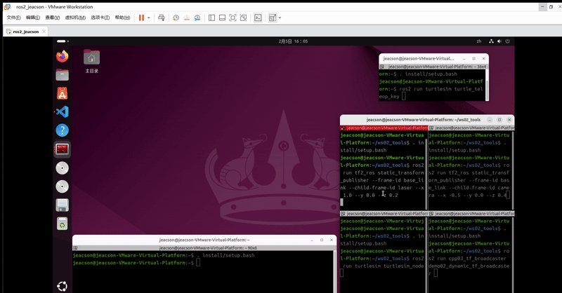
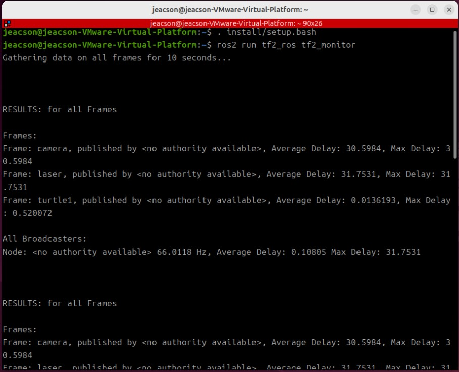
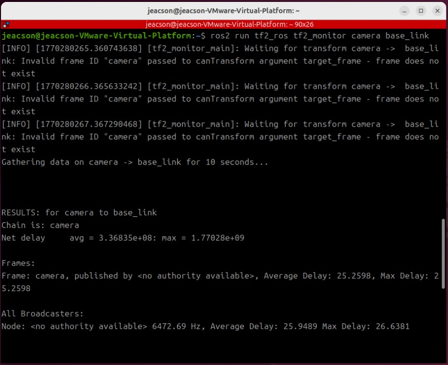
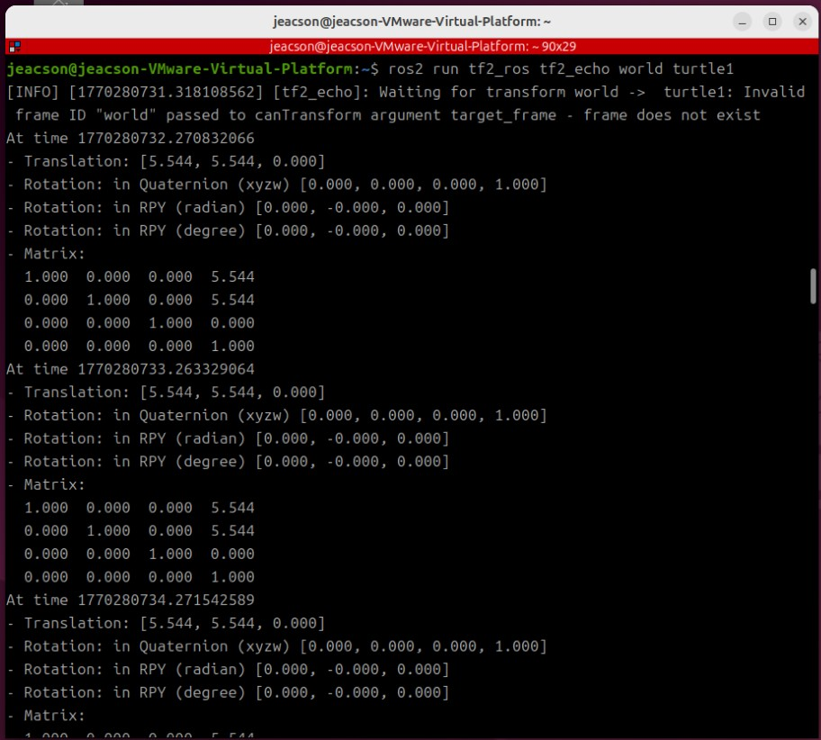
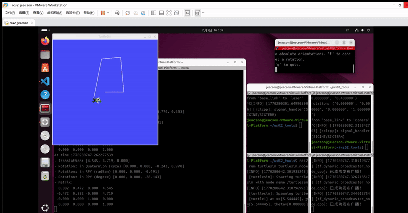
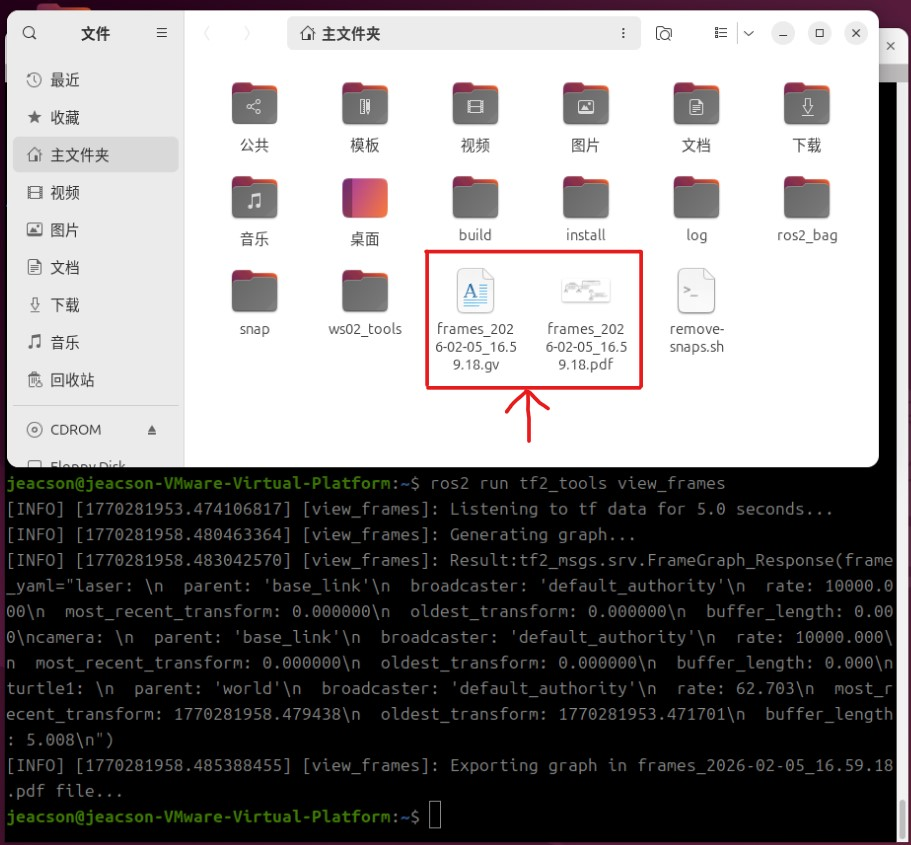
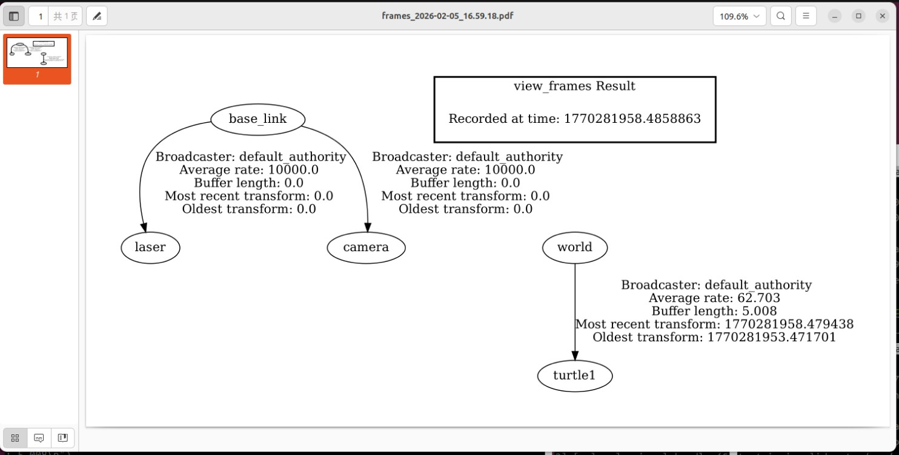

## 简介

在 `TF` 框架中，`ROS2` 除了封装了 **坐标广播与监听** 功能外，还提供了一些可以帮助我们提高开发、调试效率的工具。本章节主要介绍这些工具的使用。

这些工具主要涉及到两个功能包：`tf2_ros` 和 `tf2_tools`。

## 功能包介绍

`tf2_ros` 包中提供的常用节点如下：

- `static_transform_publisher`：该节点用于广播静态坐标变换，在 **[ROS2-022-ROS2工具：坐标变换（三）坐标变换广播](./2026_01_29.md#1-使用命令方式)** 章节中已有详细说明，不再介绍；

- `tf2_monitor`：该节点用于打印所有或特定坐标系的发布频率与网络延迟；

- `tf2_echo`：该节点用于打印特定坐标系的平移旋转关系。

`tf2_tools` 包中提供的节点如下：

- `view_frames`：该节点可以生成显示坐标系关系的 **pdf** 文件，该文件包含树形结构的坐标系图谱。

## 准备工作

首先启动多个坐标系广播节点。这里以 **坐标变换（三）坐标变换广播** 章节中的静态变换以及动态变换为例：

### 静态变换

在工作空间下启动两个终端A&B，终端A 输入如下命令：

```bash
. install/setup.bash
ros2 run tf2_ros static_transform_publisher --frame-id base_link --child-frame-id laser --x 1.0 --y 0.0 --z 0.2
```

终端B 输入如下命令：

```bash
. install/setup.bash
ros2 run tf2_ros static_transform_publisher --frame-id base_link --child-frame-id camera --x -0.5 --y 0.0 --z 0.4
```

### 动态变换

在工作空间下启动两个终端 C&D，终端C 输入如下命令：

```bash
. install/setup.bash
ros2 run turtlesim turtlesim_node
```

终端D 输入如下命令：

```bash
. install/setup.bash
ros2 run cpp03_tf_broadcaster demo02_dynamic_tf_broadcaster 
```

另开一个新终端E，在终端E中输入如下命令：

```bash
. install/setup.bash
ros2 run turtlesim turtle_teleop_key
```

整体操作会类似于：



---

## 工具常用节点示例

另开一个新终端F，用于输入新指令。

### Ⅰ.tf2_monitor

该节点用于打印*在规定时间（默认为十秒钟的组测时间）内* 坐标系的发布频率与网络延迟。

在终端F中输入如下命令：

```bash
ros2 run tf2_ros tf2_monitor
```

在终端中你可以看到如下输出：



其打印了在规定时间内 **所有** 坐标系的发布频率与网络延迟。

你也可以在终端F中输入如下命令：

```bash
ros2 run tf2_ros tf2_monitor camera base_link

```

以查看 `camera` 坐标系相对于 `base_link` 坐标系的发布频率与网络延迟。



> 前面的几次异常抛出是还没从缓存中找到指定坐标系所引起，是正常现象

### Ⅱ.tf2_echo

该节点用于打印两个特定坐标系之间的相对位姿关系。

在终端F中输入如下命令：

```bash
ros2 run tf2_ros tf2_echo world turtle1
```

就可以打印 `world` 与 `turtle1` 两个特定坐标系之间的相对位姿关系。



其默认的输出间隔为1s左右：



### Ⅲ.view_frames

该节点可以以**图形化**的方式显示坐标系关系。

在终端F中输入如下命令：

```bash
ros2 run tf2_tools view_frames
```

该节点会在开启后，通过订阅 `/tf` 和 `/tf_static` 话题 **5秒**，监听并记录在 **该时段内** *所有* 发布的`坐标变换数据`以及每个坐标系之间的`父子关系`。

之后会在该终端所在的当前目录下生成多个文件：



这两个文件的相关说明如下：

| 文件扩展名 | 相关说明 |
| ------ | ------ |
| `.gv` | Graphviz DOT 格式的文本文件，描述图结构，可以理解为是下面的 `.pdf` 文件的一个描述文件 |
| `.pdf` | 渲染好的 PDF 图表，显示 TF 树的层次结构，该文件为主要查看用的文件 |

该 `.pdf` 在开启后会呈现以下内容：



为了之后能够更直观的显示机器人系统中各个节点的相对状态关系，该方法会经常的被使用到。
