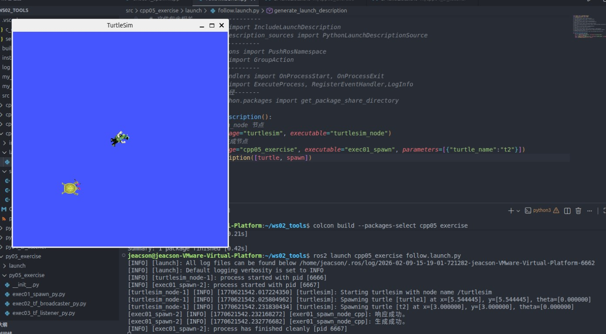
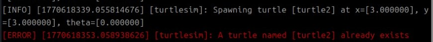

## 简介

本章节主要介绍如何实现 “乌龟跟随” 案例。

## 案例需求&分析

**需求：** 编写程序实现，程序运行后会启动 `turtlesim_node` 节点，该节点会生成一个窗口，窗口中有一只原生乌龟（`turtle1`），紧接着再生成一只新的乌龟（`turtle2`）。要求在 `turtle1` 无论是静止或是被键盘控制运动时，`turtle2` 都会以 `turtle1` 为目标并向其几何中心运动。

**分析：** “乌龟跟随” 案例的核心是如何确定 `turtle1` 相对 `turtle2` 的位置，只要该位置确定就可以把其作为目标点并控制 `turtle2` 向其运动。相对位置的确定可以通过坐标变换实现，大致思路是先分别广播 `turtle1` 相对于 `world` 和 `turtle2` 相对于 `world` 的坐标系关系，然后再通过监听坐标系关系进一步获取 `turtle1` 相对于 `turtle2` 的坐标系关系。

## 流程简介

案例实现主要步骤如下：

1. 编写程序调用 `/spawn` 服务生成一只新乌龟；
2. 编写坐标变换广播实现，通过该实现可以广播 `turtle1` 相对于 `world` 和 `turtle2` 相对于 `world` 的坐标系关系；
3. 编写坐标变换监听实现，获取 `turtle1` 相对于 `turtle2` 的坐标系关系并生成控制 `turtle2` 运动的速度指令；
4. 编写 `launch` 文件集成相关节点；
5. 编辑配置文件；
6. 编译；
7. 执行。

案例我们会采用 `C++` 和 `Python` 分别实现，二者都遵循上述实现流程。

## 准备工作

### 1.新建功能包

终端下进入工作空间的src目录，调用如下两条命令分别创建C++功能包和Python功能包。

```bash
ros2 pkg create cpp05_exercise --build-type ament_cmake --dependencies rclcpp tf2 tf2_ros geometry_msgs turtlesim
ros2 pkg create py05_exercise --build-type ament_python --dependencies rclpy tf_transformations tf2_ros geometry_msgs turtlesim
```

### 2.创建launch目录

功能包 `cpp05_exercise` 和 `py05_exercise` 下分别新建 `launch` 文件，并编辑配置文件。

在功能包 `cpp05_exercise` 的 `CMakeLists.txt` 文件内添加如下内容：

```txt
...
install(DIRECTORY launch
  DESTINATION share/${PROJECT_NAME}
)

```

在功能包 `py05_exercise` 的 `setup.py` 文件中,需要修改 `data_files` 属性，修改后的内容如下：

```python
data_files=[
    ('share/ament_index/resource_index/packages',
        ['resource/' + package_name]),
    ('share/' + package_name, ['package.xml'],),
    ('share/' + package_name, glob("launch/*.launch.xml")),
    ('share/' + package_name, glob("launch/*.launch.py")),
    ('share/' + package_name, glob("launch/*.launch.yaml")),
],
```

## 案例实现

### 1. 编写程序调用 `/spawn` 服务生成一只新乌龟

::: tabs

@tab:active C++

功能包 `cpp05_exercise` 的 `src` 目录下，新建 `C++` 文件 `execr01_spawn.cpp`，并编辑文件，输入如下内容：

```cpp
 /*
    需求： 编写客户端实现，发送请求，生成一直新的乌龟
    步骤：
        1. 包含头文件；
        2. 初始化 ROS2 客户端
        3. 自定义节点类：
            3-1. 使用参数服务，声明新的乌龟信息；
            3-2. 创建服务客户端；
            3-3. 连接服务端； 
            3-4. 组织并发送数据；

        4. 创建自定义节点类对象，组织函数，处理响应结果
        5. 释放资源。
 */

// 1. 包含头文件；
#include "rclcpp/rclcpp.hpp"
#include "turtlesim/srv/spawn.hpp"

using namespace std::chrono_literals;
// 3. 自定义节点类：
class Exer01Spawn: public rclcpp::Node{
    public:
        Exer01Spawn() : Node("exer01_spawn_node_cpp"){
            // 3-1. 使用参数服务，声明新的乌龟信息；
            this->declare_parameter("x", 3.0);
            this->declare_parameter("y", 3.0);
            this->declare_parameter("theta", 0.0);
            this->declare_parameter("turtle_name", "turtle2");

            x = this->get_parameter("x").as_double();
            y = this->get_parameter("y").as_double();
            theta = this->get_parameter("theta").as_double();
            turtle_name = this->get_parameter("turtle_name").as_string();

            // 3-2. 创建服务客户端；
            spawn_client_ = this->create_client<turtlesim::srv::Spawn>("/spawn");

        }

        
        // 3-3. 连接服务端； 
        bool connect_server(){
            while (!spawn_client_->wait_for_service(2s)){
                if (!rclcpp::ok())
                {   
                    RCLCPP_INFO(rclcpp::get_logger("rclcpp"), "已强制退出。");
                    return false;
                }
                
                RCLCPP_INFO(this->get_logger(), "服务连接中。。。");
            }
            return true;
        }
        // 3-4. 组织并发送数据；
        rclcpp::Client<turtlesim::srv::Spawn>::FutureAndRequestId request(){
            // rclcpp::Client<turtlesim::srv::Spawn>::FutureAndRequestId 
            auto req = std::make_shared<turtlesim::srv::Spawn::Request>();
            req->x = x;
            req->y = y;
            req->theta = theta;
            req->name = turtle_name;

            // async_send_request(std::shared_ptr<turtlesim::srv::Spawn_Request> request)
            return spawn_client_->async_send_request(req);
        }

    private:
        double_t x,y,theta;
        std::string turtle_name;
        rclcpp::Client<turtlesim::srv::Spawn>::SharedPtr spawn_client_;
};

int main(int argc, char *argv[])
{
    // 2. 初始化 ROS2 客户端
    rclcpp::init(argc, argv);
    // 4. 创建自定义节点类对象，组织函数，处理响应结果
    auto client_ = std::make_shared<Exer01Spawn>();
    bool flag = client_->connect_server();
    if (!flag)
    {
        RCLCPP_INFO(rclcpp::get_logger("rclcpp"), "服务连接失败");
        return 1;
    }
    // 发送请求
    auto response = client_->request();
    // 处理响应
    if (rclcpp::spin_until_future_complete(client_,response) == rclcpp::FutureReturnCode::SUCCESS)
    {
        RCLCPP_INFO(client_->get_logger(), "响应成功。");
        // 判断是否有重名，有重名会返回空，否则为请求的乌龟名称
        std::string name = response.get()->name;
        if (name.empty()) {
            RCLCPP_INFO(client_->get_logger(), "生成的乌龟重名，生成失败！");
        } else {
            RCLCPP_INFO(client_->get_logger(), "生成成功。");
        }

    } else {
        RCLCPP_INFO(client_->get_logger(), "响应失败。");
    }
    
    // 5.释放资源;
    rclcpp::shutdown();
    return 0; 
} 
```

之后我们着手生成 `launch` 文件的初步架构。功能包 `cpp05_exercise` 的 `launch` 目录下，新建 `python` 文件 `follow.launch.py`，并编辑文件，输入如下内容：

``` python
from launch import LaunchDescription
from launch_ros.actions import Node
# 封装终端指令相关类--------------
# from launch.actions import ExecuteProcess
# from launch.substitutions import FindExecutable
# 参数声明与获取-----------------
# from launch.actions import DeclareLaunchArgument
# from launch.substitutions import LaunchConfiguration
# 文件包含相关-------------------
# from launch.actions import IncludeLaunchDescription
# from launch.launch_description_sources import PythonLaunchDescriptionSource
# 分组相关----------------------
# from launch_ros.actions import PushRosNamespace
# from launch.actions import GroupAction
# 事件相关----------------------
# from launch.event_handlers import OnProcessStart, OnProcessExit
# from launch.actions import ExecuteProcess, RegisterEventHandler,LogInfo
# 获取功能包下share目录路径-------
# from ament_index_python.packages import get_package_share_directory

def generate_launch_description():
    # 1. 启动 turtlesim_node 节点
    turtle = Node(package="turtlesim", executable="turtlesim_node")
    # 2. 启动自定义乌龟生成节点
    spawn = Node(package="cpp05_exercise", executable="exec01_spawn", parameters=[{"turtle_name":"t2"}])
    return LaunchDescription([turtle, spawn])
```

使用launch文件进行节点的生成结果如下：



@tab Python

:::

::: note 生成乌龟节点时需先判断该乌龟是否重名

有重名会返回空，否则为请求的乌龟名称。



需要判断是否有重名。

:::

### 2. 编写坐标变换广播实现，通过该实现可以广播 `turtle1` 相对于 `world` 和 `turtle2` 相对于 `world` 的坐标系关系

::: tabs

功能包 `cpp05_exercise` 的 `src` 目录下，新建 `C++` 文件 `exec02_tf_broadcaster.cpp`，并编辑文件，输入如下内容：

@tab:active C++

```cpp
 /*
    需求： 广播不同乌龟相对于 world 的坐标系相对关系。
    步骤：
        1. 包含头文件；
        2. 初始化 ROS2 客户端
        3. 自定义节点类：
            3-1.创建动态坐标变换广播对象；
            3-2.创建一个乌龟位姿订阅方
            3-3.回调函数中获取乌龟位姿，生成相对信息并发布。
        4. 调用spin函数，并传入节点对象指针
        5. 释放资源。
 */

// 1. 包含头文件；
#include <geometry_msgs/msg/transform_stamped.hpp>
#include <turtlesim/msg/pose.hpp>

#include <rclcpp/rclcpp.hpp>
// 四元数转换用的库
#include <tf2/LinearMath/Quaternion.h>
#include <tf2_ros/transform_broadcaster.h>

using std::placeholders::_1;

// 3. 自定义节点类：
class Exec02TFBroadcaster: public rclcpp::Node{
    public:
        Exec02TFBroadcaster() : Node("exec02_tf_broadcaster_node_cpp"){
            // 与之前的 demo02_dynamic_tf_broadcaster 相比
            // 将 turtle 变为了动态的数据进行传参
            this->declare_parameter("turtle", "turtle1");
            turtle = this->get_parameter("turtle").as_string();
            // 3-1.创建动态坐标变换广播对象；
            tf_broadcaster_ = std::make_shared<tf2_ros::TransformBroadcaster>(this);

            // 3-2.创建一个乌龟位姿订阅方
            pose_sub_ = this->create_subscription<turtlesim::msg::Pose>("/" + turtle + "/pose", 10, 
            std::bind(&Exec02TFBroadcaster::do_pose, this, std::placeholders::_1)
            );
        }

    
    private:
        
        // 3-3.回调函数中获取乌龟位姿，生成相对信息并发布。
        void do_pose(const turtlesim::msg::Pose & pose)
        {  
            // 组织消息
            geometry_msgs::msg::TransformStamped ts;
            ts.header.stamp = this->now();
            ts.header.frame_id = "world";
            ts.child_frame_id = turtle;

            ts.transform.translation.x = pose.x;
            ts.transform.translation.y = pose.y;
            ts.transform.translation.z = 0.0;

            // 从欧拉角转换出四元数
            // 但是作为 2D 乌龟，只有 yaw，没有 pitch 和 row （定为0）
            tf2::Quaternion q;
            q.setRPY(0, 0, pose.theta);

            ts.transform.rotation.x = q.x();
            ts.transform.rotation.y = q.y();
            ts.transform.rotation.z = q.z();
            ts.transform.rotation.w = q.w();

            // 发布消息
            tf_broadcaster_->sendTransform(ts);
            // RCLCPP_INFO(get_logger(), "已成功发布广播！");
        }
        
        std::string turtle;
        std::shared_ptr<tf2_ros::TransformBroadcaster> tf_broadcaster_;
        rclcpp::Subscription<turtlesim::msg::Pose>::SharedPtr pose_sub_;
};

int main(int argc, char *argv[])
{
    // 2. 初始化 ROS2 客户端
    rclcpp::init(argc, argv);
    // 4. 调用spin函数，并传入节点对象指针。
    rclcpp::spin(std::make_shared<Exec02TFBroadcaster>());
    // 5.释放资源;
    rclcpp::shutdown();
    return 0; 
} 
```

之后我们继续完善 `launch` 文件的相关架构。在功能包 `cpp05_exercise` 的 `launch` 目录下，编辑`python` 文件 `follow.launch.py`，输入如下内容：

```python
from launch import LaunchDescription
from launch_ros.actions import Node
# 封装终端指令相关类--------------
# from launch.actions import ExecuteProcess
# from launch.substitutions import FindExecutable
# 参数声明与获取-----------------
from launch.actions import DeclareLaunchArgument
from launch.substitutions import LaunchConfiguration
# 文件包含相关-------------------
# from launch.actions import IncludeLaunchDescription
# from launch.launch_description_sources import PythonLaunchDescriptionSource
# 分组相关----------------------
# from launch_ros.actions import PushRosNamespace
# from launch.actions import GroupAction
# 事件相关----------------------
# from launch.event_handlers import OnProcessStart, OnProcessExit
# from launch.actions import ExecuteProcess, RegisterEventHandler,LogInfo
# 获取功能包下share目录路径-------
# from ament_index_python.packages import get_package_share_directory

def generate_launch_description():
    t2 = DeclareLaunchArgument(name="t2_name", default_value="t2") #      👈NEW!!
    # 1. 启动 turtlesim_node 节点
    turtle = Node(package="turtlesim", executable="turtlesim_node")
    # 2. 启动自定义乌龟生成节点
    spawn = Node(package="cpp05_exercise", executable="exec01_spawn", parameters=[{"turtle_name":LaunchConfiguration("t2_name")}]) #      👈NEW!!
    
    # 3. 分别广播两只乌龟相对于 world 的坐标变换     👈NEW!!
    broadcaster1 = Node(package="cpp05_exercise", executable="exec02_tf_broadcaster", name="broa1")
    broadcaster2 = Node(package="cpp05_exercise", executable="exec02_tf_broadcaster", name="broa2", parameters=[{"turtle": LaunchConfiguration("t2_name")}])

    return LaunchDescription([t2, turtle, spawn, broadcaster1, broadcaster2])
```

@tab Python

:::

### 3. 编写坐标变换监听实现，获取 `turtle1` 相对于 `turtle2` 的坐标系关系并生成控制 `turtle2` 运动的速度指令

::: tabs

@tab:active C++

功能包 `cpp05_exercise` 的 `src` 目录下，新建 `C++` 文件 `exec03_tf_listener.cpp`，并编辑文件，输入如下内容：

```cpp
 /*
    需求： 监听坐标变换广播数据，并生成 turtle1 相对于 t2 的 坐标数据。
          之后依据该坐标数据生成控制 t2 运动的速度指令
    步骤：
        1. 包含头文件；
        2. 初始化 ROS2 客户端
        3. 自定义节点类：
            3-1. 声明参数服务
            3-2. 创建缓存
            3-3. 创建监听器
            3-4. 创建速度发布方
            3-5. 创建定时器，在其内部实现坐标变换。生成速度指令并发布

        4. 调用spin函数，并传入节点对象指针
        5. 释放资源。
 */

// 1. 包含头文件；
#include "rclcpp/rclcpp.hpp"
#include "tf2_ros/buffer.h"
#include "tf2_ros/transform_listener.hpp"
#include "geometry_msgs/msg/twist.hpp"

using namespace std::chrono_literals;
// 3. 自定义节点类：
class Exec03TFListener: public rclcpp::Node{
    public:
        Exec03TFListener() : Node("exec03_tf_listener_node_cpp"){
            // 3-1. 声明参数服务
            this->declare_parameter("father_frame", "t2");
            this->declare_parameter("child_frame", "turtle1");
            father_frame = this->get_parameter("father_frame").as_string();
            child_frame = this->get_parameter("child_frame").as_string();
            // 3-2. 创建缓存
            buffer_ = std::make_shared<tf2_ros::Buffer>(this->get_clock());
            // 3-3. 创建监听器
            listener_ = std::make_shared<tf2_ros::TransformListener>(*buffer_);
            // 3-4. 创建速度发布方
            cmd_pub_ = this->create_publisher<geometry_msgs::msg::Twist>("/" + father_frame + "/cmd_vel",10);
            // 3-5. 创建定时器，在其内部实现坐标变换。生成速度指令并发布
            timer_ = this->create_wall_timer(1s, std::bind(&Exec03TFListener::on_timer, this));
        }
    
    private:
        void on_timer(){
            // 1. 实现坐标变换
            try
            {
                auto ts = buffer_->lookupTransform(father_frame, child_frame, tf2::TimePointZero);

                geometry_msgs::msg::Twist twist;
                // 2. 组织并发布速度指令
                // 2-1. 明确设置字段
                // 线速度 x 与角速度 z
                // 2-2. 确认线速度角速度的计算规则
                // ts 中包含两个坐标系的 x 距离与 y 距离
                // 线速度 = 系数 * sqrt(x^2 + y^2)
                // 角速度 = 系数 * 反正切(y/x)
                twist.linear.x = 0.5 * sqrt(pow(ts.transform.translation.x,2) + pow(ts.transform.translation.y,2));
                twist.angular.z = 1.0 * atan2(ts.transform.translation.y, ts.transform.translation.x);

                cmd_pub_->publish(twist);

            }
            catch(const tf2::LookupException& e)
            {
                RCLCPP_INFO(this->get_logger(), "异常提示：%s", e.what());
            }
        }

        std::string father_frame;
        std::string child_frame;
        std::shared_ptr<tf2_ros::Buffer> buffer_;
        std::shared_ptr<tf2_ros::TransformListener> listener_;
        rclcpp::Publisher<geometry_msgs::msg::Twist>::SharedPtr cmd_pub_;
        rclcpp::TimerBase::SharedPtr timer_;
};

int main(int argc, char *argv[])
{
    // 2. 初始化 ROS2 客户端
    rclcpp::init(argc, argv);
    // 4. 调用spin函数，并传入节点对象指针。
    rclcpp::spin(std::make_shared<Exec03TFListener>());
    // 5.释放资源;
    rclcpp::shutdown();
    return 0; 
} 
```

之后我们继续完善 `launch` 文件的相关架构。在功能包 `cpp05_exercise` 的 `launch` 目录下，编辑`python` 文件 `follow.launch.py`，输入如下内容：

```python
from launch import LaunchDescription
from launch_ros.actions import Node
# 封装终端指令相关类--------------
# from launch.actions import ExecuteProcess
# from launch.substitutions import FindExecutable
# 参数声明与获取-----------------
from launch.actions import DeclareLaunchArgument
from launch.substitutions import LaunchConfiguration
# 文件包含相关-------------------
# from launch.actions import IncludeLaunchDescription
# from launch.launch_description_sources import PythonLaunchDescriptionSource
# 分组相关----------------------
# from launch_ros.actions import PushRosNamespace
# from launch.actions import GroupAction
# 事件相关----------------------
# from launch.event_handlers import OnProcessStart, OnProcessExit
# from launch.actions import ExecuteProcess, RegisterEventHandler,LogInfo
# 获取功能包下share目录路径-------
# from ament_index_python.packages import get_package_share_directory

def generate_launch_description():
    t2 = DeclareLaunchArgument(name="t2_name", default_value="t2")
    # 1. 启动 turtlesim_node 节点
    turtle = Node(package="turtlesim", executable="turtlesim_node")
    # 2. 启动自定义乌龟生成节点
    spawn = Node(package="cpp05_exercise", executable="exec01_spawn", parameters=[{"turtle_name":LaunchConfiguration("t2_name")}])
    
    # 3. 分别广播两只乌龟相对于 world 的坐标变换
    broadcaster1 = Node(package="cpp05_exercise", executable="exec02_tf_broadcaster", name="broa1")
    broadcaster2 = Node(package="cpp05_exercise", executable="exec02_tf_broadcaster", name="broa2", parameters=[{"turtle": LaunchConfiguration("t2_name")}])

    # 4. 创建监听节点
    listener = Node(package="cpp05_exercise", executable="exec03_tf_listener", parameters=[{"father_frame": LaunchConfiguration("t2_name"), "child_frame": "turtle1"}])
    return LaunchDescription([t2, turtle, spawn, broadcaster1, broadcaster2, listener])
```

@tab Python

:::

### 4. 编写 `launch` 文件集成相关节点

::: tabs

@tab:active C++

如前文步骤所述，相关 `launch` 文件如下：

```python
from launch import LaunchDescription
from launch_ros.actions import Node
# 封装终端指令相关类--------------
# from launch.actions import ExecuteProcess
# from launch.substitutions import FindExecutable
# 参数声明与获取-----------------
from launch.actions import DeclareLaunchArgument
from launch.substitutions import LaunchConfiguration
# 文件包含相关-------------------
# from launch.actions import IncludeLaunchDescription
# from launch.launch_description_sources import PythonLaunchDescriptionSource
# 分组相关----------------------
# from launch_ros.actions import PushRosNamespace
# from launch.actions import GroupAction
# 事件相关----------------------
# from launch.event_handlers import OnProcessStart, OnProcessExit
# from launch.actions import ExecuteProcess, RegisterEventHandler,LogInfo
# 获取功能包下share目录路径-------
# from ament_index_python.packages import get_package_share_directory

def generate_launch_description():
    t2 = DeclareLaunchArgument(name="t2_name", default_value="t2")
    
    # 1. 启动 turtlesim_node 节点
    turtle = Node(package="turtlesim", executable="turtlesim_node")
    # 2. 启动自定义乌龟生成节点
    spawn = Node(package="cpp05_exercise", executable="exec01_spawn", parameters=[{"turtle_name":LaunchConfiguration("t2_name")}])
    
    # 3. 分别广播两只乌龟相对于 world 的坐标变换
    broadcaster1 = Node(package="cpp05_exercise", executable="exec02_tf_broadcaster", name="broa1")
    broadcaster2 = Node(package="cpp05_exercise", executable="exec02_tf_broadcaster", name="broa2", parameters=[{"turtle": LaunchConfiguration("t2_name")}])

    # 4. 创建监听节点
    listener = Node(package="cpp05_exercise", executable="exec03_tf_listener", parameters=[{"father_frame": LaunchConfiguration("t2_name"), "child_frame": "turtle1"}])
    return LaunchDescription([t2, turtle, spawn, broadcaster1, broadcaster2, listener])

```

@tab Python

:::

### 5. 编辑配置文件

::: tabs

@tab:active C++

`CMakeLists.txt` 配置如下：

```txt
cmake_minimum_required(VERSION 3.8)
project(cpp05_exercise)

if(CMAKE_COMPILER_IS_GNUCXX OR CMAKE_CXX_COMPILER_ID MATCHES "Clang")
  add_compile_options(-Wall -Wextra -Wpedantic)
endif()

# find dependencies
find_package(ament_cmake REQUIRED)
find_package(rclcpp REQUIRED)
find_package(tf2 REQUIRED)
find_package(tf2_ros REQUIRED)
find_package(geometry_msgs REQUIRED)
find_package(turtlesim REQUIRED)

add_executable(exec01_spawn src/exec01_spawn.cpp)
add_executable(exec02_tf_broadcaster src/exec02_tf_broadcaster.cpp)
add_executable(exec03_tf_listener src/exec03_tf_listener.cpp)

target_include_directories(exec01_spawn PUBLIC
  $<BUILD_INTERFACE:${CMAKE_CURRENT_SOURCE_DIR}/include>
  $<INSTALL_INTERFACE:include/${PROJECT_NAME}>)

target_include_directories(exec02_tf_broadcaster PUBLIC
  $<BUILD_INTERFACE:${CMAKE_CURRENT_SOURCE_DIR}/include>
  $<INSTALL_INTERFACE:include/${PROJECT_NAME}>)

target_include_directories(exec03_tf_listener PUBLIC
  $<BUILD_INTERFACE:${CMAKE_CURRENT_SOURCE_DIR}/include>
  $<INSTALL_INTERFACE:include/${PROJECT_NAME}>)

target_compile_features(exec01_spawn PUBLIC c_std_99 cxx_std_17)  # Require C99 and C++17
target_compile_features(exec02_tf_broadcaster PUBLIC c_std_99 cxx_std_17)  # Require C99 and C++17
target_compile_features(exec03_tf_listener PUBLIC c_std_99 cxx_std_17)  # Require C99 and C++17

ament_target_dependencies(
  exec01_spawn
  "rclcpp"
  "tf2"
  "tf2_ros"
  "geometry_msgs"
  "turtlesim"
)

ament_target_dependencies(
  exec02_tf_broadcaster
  "rclcpp"
  "tf2"
  "tf2_ros"
  "geometry_msgs"
  "turtlesim"
)

ament_target_dependencies(
  exec03_tf_listener
  "rclcpp"
  "tf2"
  "tf2_ros"
  "geometry_msgs"
)

install(TARGETS exec01_spawn exec02_tf_broadcaster exec03_tf_listener
  DESTINATION lib/${PROJECT_NAME}
)

# NEW
install(DIRECTORY launch
  DESTINATION share/${PROJECT_NAME}
)

if(BUILD_TESTING)
  find_package(ament_lint_auto REQUIRED)
  # the following line skips the linter which checks for copyrights
  # comment the line when a copyright and license is added to all source files
  set(ament_cmake_copyright_FOUND TRUE)
  # the following line skips cpplint (only works in a git repo)
  # comment the line when this package is in a git repo and when
  # a copyright and license is added to all source files
  set(ament_cmake_cpplint_FOUND TRUE)
  ament_lint_auto_find_test_dependencies()
endif()

ament_package()

```

`package.xml` 配置如下：

```xml
<?xml version="1.0"?>
<?xml-model href="http://download.ros.org/schema/package_format3.xsd" schematypens="http://www.w3.org/2001/XMLSchema"?>
<package format="3">
  <name>cpp05_exercise</name>
  <version>0.0.0</version>
  <description>TODO: Package description</description>
  <maintainer email="jeacson@todo.todo">jeacson</maintainer>
  <license>TODO: License declaration</license>

  <buildtool_depend>ament_cmake</buildtool_depend>

  <depend>rclcpp</depend>
  <depend>tf2</depend>
  <depend>tf2_ros</depend>
  <depend>geometry_msgs</depend>
  <depend>turtlesim</depend>

  <!-- NEW -->
  <exec_depend>ros2launch</exec_depend> 
  <!-- NEW -->

  <test_depend>ament_lint_auto</test_depend>
  <test_depend>ament_lint_common</test_depend>

  <export>
    <build_type>ament_cmake</build_type>
  </export>
</package>

```

@tab Python

:::

### 6. 编译

::: tabs

终端中进入当前工作空间，编译功能包：

@tab:active C++

```bash
colcon build --packages-select cpp05_exercise
```

@tab Python

:::

### 7. 执行

当前工作空间下启动终端，输入如下命令运行launch文件：

::: tabs

@tab:active C++

```bash
. install/setup.bash
ros2 launch cpp05_exercise follow.launch.py 
```

@tab Python

:::

再另外新建一终端，启动 `turtlesim` 键盘控制节点：

```bash
ros2 run turtlesim turtle_teleop_key
```

该终端下可以通过键盘控制 `turtle1` 运动，并且 `turtle2` 会跟随 `turtle1` 运动。最终的运行结果如下：


