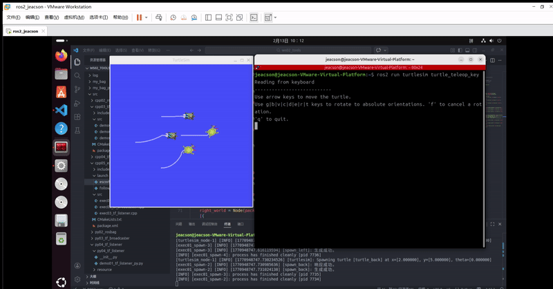
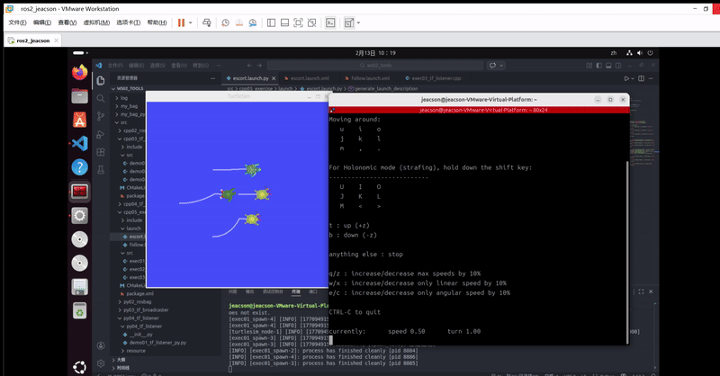

## 简介

本章节主要介绍如何实现 “乌龟护航” 案例。里面的大部分代码会沿用[上一章节，即ROS2-Z01-ROS2工具：坐标变换（EXEC1）乌龟跟随案例实战](../coor_trans/2026_02_09.md)内的相关代码内容。因此建议先尝试实现上一章节的效果，再来进行本章节的实战。

## 案例需求&分析

**需求：** 基于上一章节要求编写程序实现，以 `turtlesim_node` 节点的原生乌龟（`turtle1`）为几何中心，生成多只新的乌龟（以三只为例，即`turtle2`、`turtle3`、`turtle4`）。要求在 `turtle1` 无论是静止或是被键盘控制运动时，`turtle2` 都会以 `turtle1` 的几何中心为目标并以某种队形对其进行护航。

**分析：** 上一章节中，“乌龟跟随” 案例的核心是如何确定 `turtle1` 相对 `turtle2` 的位置，只要该位置确定就可以把其作为目标点并控制 `turtle2` 向其运动。而在这一章节中，案例的核心就变成了如何确定原生乌龟 `turtle1` 所制定的各个点位相对于其他 `turtle` 的位置。这些相对位置的确定同样可以通过坐标变换实现，其中：

1. 队列的各个点位相对于原生乌龟 `turtle1` 的坐标系静止，就可以通过静态广播的方式发布这些 **静态坐标点** 相对于原生乌龟的位置关系。
2. 而针对乌龟，是先分别广播各个乌龟 相对于 `world` 的坐标系关系，然后再通过监听坐标系关系进一步获取 **静态坐标点** 相对于 `turtle` 的坐标系关系。

这样就可以在换算出坐标关系后，通过计算、发布相应的速度指令控制多个乌龟的护航了。

## 流程简介

案例中关于“生成新乌龟”、“乌龟坐标系变换广播与监听”都已经实现，因此这里仅需编写launch文件组织节点即可。主要步骤如下：

1. 编写 `launch` 文件集成相关节点；
2. 编译；
3. 执行。

案例我们依然会采用 `C++` 和 `Python` 分别实现，二者都遵循上述实现流程。

## 准备工作

参考[上一章节，即ROS2-Z01-ROS2工具：坐标变换（EXEC1）乌龟跟随案例实战](../coor_trans/2026_02_09.md)。特别推荐先实现该实战再来做本实战。

## 案例实现

### 1. 编写 `launch` 文件集成相关节点

::: tabs

@tab:active C++

我们可以先实现 `一只` 乌龟的护航，要求其最终位置在原生乌龟附近特定位置：

功能包 `cpp05_exercise` 的 `launch` 目录下，新建 `python` 文件 `escort.launch.py`，并编辑文件，输入如下内容：

```python
from launch import LaunchDescription
from launch_ros.actions import Node

# 参数声明与获取-----------------
from launch.actions import DeclareLaunchArgument
from launch.substitutions import LaunchConfiguration


"""
    需求：实现乌龟护航案例
    -----------------------------
         先实现一只乌龟护航，要求其最终位置在原生乌龟附近特定位置
    思路：
         1. 发布目标点相对于原生乌龟的坐标变换
         2. 监听 该乌龟 与目标点相对于坐标系的关系
    实现流程：
         1. 抽取参数；
         2. 创建 turtlesim_node 节点，并生成新乌龟;
         3. 发布坐标变换；
         4. 监听坐标变换。
"""

def generate_launch_description():
    

    # 1. 抽取参数；
    escort_back = DeclareLaunchArgument(name="turtle_back", default_value="turtle_back")
    # 2. 创建 turtlesim_node 节点，并生成新乌龟E1;
    master = Node(package="turtlesim", executable="turtlesim_node")
    spawn_back = Node(package="cpp05_exercise", executable="exec01_spawn", name="spawn_back", parameters=[{
        "x": 2.0,
        "y": 5.0,
        "turtle_name": LaunchConfiguration("turtle_back")
    }])
    # 3. 发布坐标变换；
    # 3.1 乌龟坐标系广播
    turtle1_world = Node(package="cpp05_exercise", executable="exec02_tf_broadcaster", name="turtle1_world")
    back_world = Node(package="cpp05_exercise", executable="exec02_tf_broadcaster", name="back_world", parameters=[{
        "turtle": LaunchConfiguration("turtle_back")
    }])
    # 3.2 静态坐标点广播
    escort_point_back = Node(package="tf2_ros", executable="static_transform_publisher", name="escort_point_back", arguments=["--frame-id", "turtle1", "--child-frame-id", "escort_point_back", "--x", "-1.5"])

    # 4. 监听坐标变换。
    back_ep_back = Node(package="cpp05_exercise", executable="exec03_tf_listener", name="back_ep_back", parameters=[{
        "father_frame": LaunchConfiguration("turtle_back"),
        "child_frame": "escort_point_back"
    }])

    return LaunchDescription([
        escort_back, 
        master, 
        spawn_back, 
        turtle1_world, 
        back_world,
        escort_point_back,
        back_ep_back
        ])
```

之后就可以通过修改上述代码实现其他乌龟的护航了：

```python
from launch import LaunchDescription
from launch_ros.actions import Node

# 参数声明与获取-----------------
from launch.actions import DeclareLaunchArgument
from launch.substitutions import LaunchConfiguration


"""
    需求：实现乌龟护航案例
    思路：
         1. 发布目标点相对于原生乌龟的坐标变换
         2. 监听 新乌龟 与目标点相对于坐标系的关系
    实现流程：
         1. 抽取参数；
         2. 创建 turtlesim_node 节点，并生成新乌龟;
         3. 发布坐标变换；
         4. 监听坐标变换。
"""

def generate_launch_description():
    

    # 1. 抽取参数；
    escort_back = DeclareLaunchArgument(name="turtle_back", default_value="turtle_back")
    escort_left = DeclareLaunchArgument(name="turtle_left", default_value="turtle_left")
    escort_right = DeclareLaunchArgument(name="turtle_right", default_value="turtle_right")

    # 2. 创建 turtlesim_node 节点，并生成新乌龟;
    master = Node(package="turtlesim", executable="turtlesim_node")

    spawn_back = Node(package="cpp05_exercise", executable="exec01_spawn", name="spawn_back", parameters=[{
        "x": 2.0,
        "y": 5.0,
        "turtle_name": LaunchConfiguration("turtle_back")
    }])
    spawn_left = Node(package="cpp05_exercise", executable="exec01_spawn", name="spawn_left", parameters=[{
        "x": 4.0,
        "y": 7.0,
        "turtle_name": LaunchConfiguration("turtle_left")
    }])
    spawn_right = Node(package="cpp05_exercise", executable="exec01_spawn", name="spawn_right", parameters=[{
        "x": 4.0,
        "y": 3.0,
        "turtle_name": LaunchConfiguration("turtle_right")
    }])

    # 3. 发布坐标变换；
    # 3.1 乌龟坐标系广播
    turtle1_world = Node(package="cpp05_exercise", executable="exec02_tf_broadcaster", name="turtle1_world")
    back_world = Node(package="cpp05_exercise", executable="exec02_tf_broadcaster", name="back_world", parameters=[{
        "turtle": LaunchConfiguration("turtle_back")
    }])
    left_world = Node(package="cpp05_exercise", executable="exec02_tf_broadcaster", name="left_world", parameters=[{
        "turtle": LaunchConfiguration("turtle_left")
    }])
    right_world = Node(package="cpp05_exercise", executable="exec02_tf_broadcaster", name="right_world", parameters=[{
        "turtle": LaunchConfiguration("turtle_right")
    }])

    # 3.2 静态坐标点广播
    escort_point_back = Node(package="tf2_ros", executable="static_transform_publisher", name="escort_point_back", arguments=["--frame-id", "turtle1", "--child-frame-id", "escort_point_back", "--x", "-1.5"])
    escort_point_left = Node(package="tf2_ros", executable="static_transform_publisher", name="escort_point_left", arguments=["--frame-id", "turtle1", "--child-frame-id", "escort_point_left", "--y", "1.5"])
    escort_point_right = Node(package="tf2_ros", executable="static_transform_publisher", name="escort_point_right", arguments=["--frame-id", "turtle1", "--child-frame-id", "escort_point_right", "--y", "-1.5"])

    # 4. 监听坐标变换。
    back_ep_back = Node(package="cpp05_exercise", executable="exec03_tf_listener", name="back_ep_back", parameters=[{
        "father_frame": LaunchConfiguration("turtle_back"),
        "child_frame": "escort_point_back"
    }])
    left_ep_left = Node(package="cpp05_exercise", executable="exec03_tf_listener", name="left_ep_left", parameters=[{
        "father_frame": LaunchConfiguration("turtle_left"),
        "child_frame": "escort_point_left"
    }])
    right_ep_right = Node(package="cpp05_exercise", executable="exec03_tf_listener", name="right_ep_right", parameters=[{
        "father_frame": LaunchConfiguration("turtle_right"),
        "child_frame": "escort_point_right"
    }])

    return LaunchDescription([
        escort_back, 
        escort_left, 
        escort_right, 
        master, 
        spawn_back, 
        spawn_left, 
        spawn_right, 
        turtle1_world, 
        back_world,
        left_world,
        right_world,
        escort_point_back,
        escort_point_left,
        escort_point_right,
        back_ep_back,
        left_ep_left,
        right_ep_right
        ])
```

@tab Python

功能包 `py05_exercise` 的 `launch` 目录下，新建 `python` 文件 `escort.launch.xml`，并编辑文件，输入如下内容：

```xml
<launch>
    <arg name="turtle_back" default="turtle_back"/>
    <arg name="turtle_left" default="turtle_left"/>
    <arg name="turtle_right" default="turtle_right"/>

    <!-- 1. turtlesim_node -->
    <node pkg="turtlesim" exec="turtlesim_node"/>

    <!-- 2. 自定义的乌龟生成节点 -->
    <node pkg="py05_exercise" exec="exec01_spawn_py" name="spawn_back">
        <param name="x" value="2.0" />
        <param name="y" value="5.0" />
        <!-- <param name="theta" value="3.0" /> -->
        <param name="turtle_name" value="$(var turtle_back)" />
    </node>
    <node pkg="py05_exercise" exec="exec01_spawn_py" name="spawn_left">
        <param name="x" value="4.0" />
        <param name="y" value="7.0" />
        <!-- <param name="theta" value="3.0" /> -->
        <param name="turtle_name" value="$(var turtle_left)" />
    </node>
    <node pkg="py05_exercise" exec="exec01_spawn_py" name="spawn_right">
        <param name="x" value="4.0" />
        <param name="y" value="3.0" />
        <!-- <param name="theta" value="3.0" /> -->
        <param name="turtle_name" value="$(var turtle_right)" />
    </node>


    <!-- 3.1 广播乌龟的坐标变换 -->
    <node pkg="py05_exercise" exec="exec02_tf_broadcaster_py" name="turtle1_world"/>
    <node pkg="py05_exercise" exec="exec02_tf_broadcaster_py" name="back_world">
        <param name="turtle" value="$(var turtle_back)"/>
    </node>
    <node pkg="py05_exercise" exec="exec02_tf_broadcaster_py" name="left_world">
        <param name="turtle" value="$(var turtle_left)"/>
    </node>
    <node pkg="py05_exercise" exec="exec02_tf_broadcaster_py" name="right_world">
        <param name="turtle" value="$(var turtle_right)"/>
    </node>

    <!-- 3.2 广播坐标点的坐标变换 -->
    <node pkg="tf2_ros" exec="static_transform_publisher" name="escort_point_back" args="--frame-id turtle1 --child-frame-id escort_point_back --x -1.5"/>
    <node pkg="tf2_ros" exec="static_transform_publisher" name="escort_point_left" args="--frame-id turtle1 --child-frame-id escort_point_left --y 1.5"/>
    <node pkg="tf2_ros" exec="static_transform_publisher" name="escort_point_right" args="--frame-id turtle1 --child-frame-id escort_point_right --y -1.5"/>

    <!-- 4. 创建监听节点 -->
    <node pkg="py05_exercise" exec="exec03_tf_listener_py" name="back_ep_back">
        <param name="father_frame" value="$(var turtle_back)"/>
        <param name="child_frame" value="escort_point_back"/>
    </node>
    <node pkg="py05_exercise" exec="exec03_tf_listener_py" name="left_ep_left">
        <param name="father_frame" value="$(var turtle_left)"/>
        <param name="child_frame" value="escort_point_left"/>
    </node>
    <node pkg="py05_exercise" exec="exec03_tf_listener_py" name="right_ep_right">
        <param name="father_frame" value="$(var turtle_right)"/>
        <param name="child_frame" value="escort_point_right"/>
    </node>


</launch>
```

:::

### 2. 编译

::: tabs

终端中进入当前工作空间，编译功能包：

@tab:active C++

```bash
colcon build --packages-select cpp05_exercise
```

@tab Python

```bash
colcon build --packages-select py05_exercise
```

:::

### 3. 执行

当前工作空间下启动终端，输入如下命令运行launch文件：

::: tabs

@tab:active C++

```bash
. install/setup.bash
ros2 launch cpp05_exercise follow.launch.py 
```

@tab Python

```bash
. install/setup.bash
ros2 launch py05_exercise follow.launch.xml
```

:::

再另外新建一终端，启动 `turtlesim` 键盘控制节点：

```bash
ros2 run turtlesim turtle_teleop_key
```

该终端下可以通过键盘控制 `原生乌龟` 运动，并且 `其他三只乌龟` 会跟随 `原生乌龟` 运动。最终的运行结果如下：



当然，你可能会发现：由于原生乌龟移动速度过快，另外三只跟随不上。

在此你可以使用另外一个控制节点：

```bash
ros2 run teleop_twist_keyboard teleop_twist_keyboard --ros-args --remap /cmd_vel:=/turtle1/cmd_vel
```

运行结果如下：


