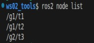

## 简介

有关 launch 文件的介绍，可以参考[上一篇内容](./2025_04_28.md#简介)

## 壹、Python 实现语法

以下介绍在 Python 中 **launch 文件** 的相关语法：

### 1. 节点设置-Node

在 **使用 Python 实现的 launch 文件** 中，被执行的节点需要统一封装为 `launch_ros.actions.Node` 对象，并通过 `LaunchDescription()` 函数创建特定包装对象以进行返回。以下将会针对统一封装的 `Node` 对象内的参数进行说明。

假设该 launch 文件的**文件名**为“py02_node_launch.py”，所在**功能包名**为 “package_for_launch_01”，该 launch 文件可以编写为如下配置：

```python
# py02_node_launch.py
from launch import LaunchDescription
from launch_ros.actions import Node

# 获取功能包下 share 目录路径------
from ament_index_python.packages import get_package_share_directory
import os

def generate_launch_description():
    # 节点配置示例
    turtle1 = Node(

        # 可执行程序
        executable="turtlesim_node",

        # 包名
        package="turtlesim",

        # 设置节点是否会自动重启 (这里设置为True)
        respawn=True,

        # 覆盖节点名称
        name="t1",

        # 设置命名空间
        namespace="/robot1",

        # 进程显示名称（在ps/top中可见）
        exec_name="turtle_sim",
        
        # 参数配置
        parameters=[
            {"background_r": 255, "background_g": 0, "background_b": 0},  # 字典传参
            os.path.join(get_package_share_directory("package_for_launch_01"), "config", "custom_params.yaml" ) # YAML文件传参 (常用，建议采用)
        ],
         
        # 重映射配置
        remappings=[
            ("/turtle1/cmd_vel", "/robot1/cmd_vel"),  # 话题重映射
            ("/turtle1/pose", "/robot1/pose")
        ],
        
        # ROS专用参数
        ros_arguments=[
            "--log-level", "debug",  # 设置日志级别
            "--ros-args", "-p", "use_sim_time:=true"  # 覆盖参数（需显式添加--ros-args）
        ],
        
        # 普通命令行参数
        arguments=[
            "--custom-flag",  # 自定义标志
            "--config", "/path/to/non_ros_config.json"
        ]
    )
    
    return LaunchDescription([turtle1])

```

其中：

- executable：可执行程序
- package：被执行程序所属功能包的名称
- respawn：设置节点是否会自动重启 (针对特殊节点，如需要在出现异常被关闭之后自动重启的节点，可以使用)
- name：设置节点名称，可以用于解决重名问题
- namespace：设置命名空间，可以用于解决重名问题
- exec_name：设置程序运行时命令行左侧所显示的对应标签
- remappings：用于实现话题重映射
- parameters
- ros_arguments
- arguments

::: info "parameters"/"ros_arguments"/"arguments"之间的区别
在上述创建 `Node` 对象的初始函数中，有以下三个名称中包含“参数”意思的参数，它们的意思分别为：

- **parameters**：节点在运行时，**其自身**需要读取的参数，可以理解为类似给 **一般调用函数** 所传入的 “参数”
- **ros_arguments**：节点在运行时，**ROS2底层系统** 需要读取的 ROS 专用参数（例如节点重命名、命名空间、参数文件加载等）。
- **arguments**：节点在运行时，**可执行文件** 需要读取的 *与 ROS 本身无关* 的普通应用级命令行参数（例如自定义配置文件路径、调试标志等）

具体而言，这三个参数实际有以下区别：

- parameters：
  - **节点自身** 需要读取的参数，通常用于给节点传参
  - 其支持直接定义字典（如 `{"key": value}`）或指定 YAML/JSON 文件路径进行传参（更常用）；
  - 其可通过底层自动生成 `--params-file` 参数并触发 ROS 中间件解析；
  - 参数可通过 `ros2 param` 命令或 ROS 服务进行动态修改，且其支持类型推断（例如自动识别整数、浮点数、字符串等）。
- ros_arguments：
  - **ROS2底层系统** 需要读取的 ROS 专用参数，通常亦用于覆盖原本给节点的传参以进行调试
  - 若在命令行中等效执行，该参数内传递值会被包装在 `--ros-args` 标志之后，使 ROS 中间件可以强制解析这些参数；
  - 支持 ROS 参数语法（如 `--log-level`, `__ns`, `--remap` 等）。
- arguments：
  - **可执行文件** 需要读取的普通应用级命令行参数，与 ROS 本身无关
  - 参数会被直接追加到节点命令行的末尾；
  - 不会触发 ROS 参数解析器（`rclcpp::init`）的特殊处理。

列成表格即为如下区别：

| 特性                | parameters          | ros_arguments       | arguments           |
|---------------------|---------------------|---------------------|---------------------|
| **作用域**          | 节点运行时自用参数  | ROS2 底层系统内 ROS 中间件配置     | 外部环境-可执行文件 进程级命令行参数    |
| **一般配置用途**    | 节点运行时自用算法参数、控制参数等      | 重映射话题、命名空间、日志级别     | 指定配置文件、调试模式    |
| **动态可修改性**    | ✅ (通过 ROS 接口)  | ❌ (启动时固定)     | ❌ (启动时固定)     |
| **典型语法**        | `{"key": value}` 或 `params.yaml`    | `["--remap", "old:=new"]`  | `["--config", "my_config.txt"]`           |
| **底层标志**        | `--params-file`     | `--ros-args`        | 无特殊标志          |
| **优先级规则**      | 低于 `ros_arguments`| 较高，低于ROS命令行参数                | 独立作用域          |
| **实际节点传参时优先级**      | 推荐向节点内导入参数数据时最先使用 | 仅在需要覆盖参数时使用         | 无需使用         |

因此在实践中，一般建议：

1. **优先使用 `parameters`** 管理节点运行时配置（类型安全、支持动态调整）；
2. 仅在 **需要覆盖参数时** 使用 `ros_arguments`；
3. **避免在 `arguments` 中传递 ROS 相关参数**（易导致解析失败）。

:::

如上文所述，当使用 `parameters` 进行传参时，如果需要传入的参数数量过多，则使用`{"key": value}`进行的传参方式就会变得十分不妥。

因此在针对使用 `parameters` 进行传参时，我们实际上会更经常使用 `yaml` 文件进行传参。

为了格式统一与代码编译时其自身的可编译性，我们一般会使用以下步骤创建**带特定格式的** `yaml` 文件：(假设bash路径在工作空间根目录下)

1. 先将前文所述节点启动

    ```bash
    . install/setup.bash
    ros2 launch py01_launch py02_node_launch.py
    ```

2. 在同一目录下另开一终端，输入：

    ```bash
        ros2 param dump /robot1/t1 > src/package_for_launch_01/config/custom_params.yaml
    ```

    此时就会在工作空间根目录内的 `src/package_for_launch_01/config` 路径下生成一个 `custom_params.yaml` 文件了，但是这个YAML文件还无法直接使用。

3. 我们需要同之前添加 `launch` 文件一样在 `CMakeLists.txt` 中 `👈` 位置添加以下语句：

    ```txt
    ......
    find_package(rclcpp REQUIRED)

    install(DIRECTORY launch config DESTINATION share/${PROJECT_NAME}) 👈

    if(BUILD_TESTING)
    ......
    ```

4. 进行编译：

    ```bash
    colcon build --pakages-select package_for_launch_01
    ```

5. 最后通过导入 `get_package_share_directory` 函数动态以获取 `install` 目录内 **该功能包名下** `share` 文件夹的路径，最后与 `config` 和 `custom_params.yaml` 相关的路径信息相拼接即可：

    ```python
        # 获取功能包下 share 目录路径------
        from ament_index_python.packages import get_package_share_directory
        import os
        ...

        # 参数配置时动态获取路径
        parameters=[
            os.path.join(get_package_share_directory("package_for_launch_01"), "config", "custom_params.yaml" ) # YAML文件传参 (常用，建议采用)
        ],
    ```

### 2. 执行指令设置-ExecuteProcess

在 **使用 Python 实现的 launch 文件** 中，为了针对 ROS2 命令等外部进程进行封装，以实现部份功能的简化调用执行，需要使用被统一封装为 `launch.actions.ExecuteProcess` 的对象，并通过 `LaunchDescription()` 函数创建特定包装对象以进行返回。

以下将会针对统一封装的 `ExecuteProcess` 对象内的参数进行说明。

假设该 launch 文件的**文件名**为“py03_cmd_launch.py”，所在**功能包名**为 “package_for_launch_01”，该 launch 文件可以编写为如下配置：

```python
from launch import LaunchDescription
from launch_ros.actions import Node

# 封装终端指令相关类------
from launch.actions import ExecuteProcess
from launch.substitutions import FindExecutable

"""
需求： 启动 turtlesim_node 节点，并调用指令带有年乌龟的位姿信息
"""

def generate_launch_description():

    turtle = Node(
        package="turtlesim",
        executable="turtlesim_node",

    )

    # 封装指令
    cmd = ExecuteProcess(
        # 方式1 直接输入指令
        # cmd=["ros2 topic echo /turtle1/pose"],
        # 方式2 分别输入指令（可用）
        # cmd=["ros2 topic", "echo", "/turtle1/pose"],
        # 方式3 使用函数封装指令（推荐）
        cmd=[FindExecutable(name="ros2"),"topic", "echo", "/turtle1/pose"],

        output = "both", # 同时在磁盘文件与终端内输出日志
        shell = True # 将指令作为终端指令执行
    )

    return LaunchDescription([turtle,cmd])
```

::: important 使用 FindExecutable 函数封装指令并非多此一举

在ExecuteProcess的cmd参数中使用上述三种方式实际各有优劣：

- **直接输入指令**会使整个命令作为一个字符串被传输，虽然其简单直观，但是无法在运行时修改参数；
- **分别输入指令**由于参数分离，相对于*直接输入指令*而言更易于修改，但是其假定了环境内的可执行文件位置存在于 `系统PATH环境变量` 中；
- **使用函数封装指令**虽然仅仅只封装了最前面的一段`ros2`代码，但是使用`FindExecutable()`可以让 ros2 在运行时动态查找可执行文件的位置，即使当开发环境、生产环境、容器环境内的可执行文件位置不同，或者同一环境下安装了多个ROS2版本时，该指令依旧可以运行，使其自动适应大部分环境与复杂的部署场景。

:::

### 3. 参数设置-DeclareLaunchArgument&LaunchConfiguration

参数设置主要涉及到参数的 *声明* 与 *调用* 两部分，其中声明被封装为 `launch.actions.DeclareLaunchArgument`，调用则被封装为 `launch.substitutions import LaunchConfiguration`。

假设该 launch 文件的**文件名**为“py04_args_launch.py”，所在**功能包名**为 “package_for_launch_01”，该 launch 文件可以编写为如下配置：

```python
from launch import LaunchDescription
from launch_ros.actions import Node

# 参数声明与获取------
from launch.actions import DeclareLaunchArgument
from launch.substitutions import LaunchConfiguration

"""
需求：在launch文件启动时，动态修改turtlesim_node的背景颜色
实现：
    1. 声明参数（变量）；
    2. 调用参数（变量）；
    3. 执行launch文件时，动态导入参数
"""

def generate_launch_description():
    # 1. 声明参数（变量）；
    decl_bg_r = DeclareLaunchArgument(name="bg_r",default_value="255")
    decl_bg_g = DeclareLaunchArgument(name="bg_g",default_value="25")

    # 2. 调用参数（变量）；
    turtle = Node(
        package="turtlesim",
        executable="turtlesim_node",
        parameters=[{
            "background_r": LaunchConfiguration(variable_name="bg_r"),
            "background_g": LaunchConfiguration(variable_name="bg_g")
        }]
    )
    return LaunchDescription([decl_bg_r,
                              decl_bg_g,
                              turtle])
```

在上述代码中，为了声明参数，我们使用了`DeclareLaunchArgument()` 函数创建了多个对象，其中：

- name：参数名称；
- default_value：默认值。

之后我们在创建 `Node` 对象时向 `parameters` 参数内通过 `LaunchConfiguration()` 函数传入上述 `参数名称`。这样在 `launch` 文件执行时，我们就可以通过 `bash` 动态传入参数了：

```bash
ros2 launch cpp01_launch py04_args_launch.py background_r:=100 background_g:=86
```

当然，如果不传入参数，则文件执行时会使用当时声明参数时所给定的默认值 `default_value` 进行相关解析。

::: info 动态传参所使用的参数名需要做区别
通过 `bash` 动态传入参数时需要注意的是：所传入参数名应与 *所导入的 `Node` 对象* 内所使用的参数名**相同**，而**并非**与 *声明参数（变量）时* 所使用的参数名相同。
:::

### 4.文件包含-IncludeLaunchDescription&PythonLaunchDescriptionSource

文件包含主要指的是将一个 `launch` 文件 包含进另一个 `launch` 文件的操作。其需要使用的 API 为 `launch.actions.IncludeLaunchDescription` & `PythonLaunchDescriptionSource`.

假设该 launch 文件的**文件名**为“py05_include_launch.py”，所在**功能包名**为 “package_for_launch_01”，且希望调用之前[参数设置](#3-参数设置-declarelaunchargumentlaunchconfiguration)里所使用的 `launch` 文件，则该 launch 文件可以编写为如下配置：

```python
from launch import LaunchDescription
from launch_ros.actions import Node
import os
# 文件包含相关------
from launch.actions import IncludeLaunchDescription
from launch.launch_description_sources import PythonLaunchDescriptionSource
# 获取功能包下share目录路径------
from ament_index_python.packages import get_package_share_directory
"""
    需求： 在当前 launch 文件中包含其他 launch 文件

"""
def generate_launch_description():
    include = IncludeLaunchDescription(
        launch_description_source=PythonLaunchDescriptionSource(
            launch_file_path=os.path.join(
                get_package_share_directory("cpp01_launch"),
                "launch",
                "py",
                "py04_args_launch.py"
            )
        )
    )
    return LaunchDescription([include])
```

这样在运行时就可以调用之前的 `launch` 文件了。

当然，这样调用 `launch` 文件时，其使用的参数为原文件内所使用的默认值 `default_value`，如果需要修改参数，则可以在上述代码的基础上修改为：

```python
...
"""
    需求： 在当前 launch 文件中包含其他 launch 文件，并传入特定参数

"""
def generate_launch_description():
    include = IncludeLaunchDescription(
        launch_description_source=PythonLaunchDescriptionSource(
            launch_file_path=os.path.join(
                get_package_share_directory("cpp01_launch"),
                "launch",
                "py",
                "py04_args_launch.py"
            )
        ),launch_arguments=[("bg_r", "80"),("bg_g", "100")] #👈NEW！
    )
    return LaunchDescription([include])
```

::: important 设置参数名时需注意
在 `IncludeLaunchDescription()` 函数内通过 `launch_arguments` 进行参数的定义时，务必使用原来的 `launch` 文件中 `DeclareLaunchArgument()` 函数内所设置的对应 `name`，否则无法识别
:::

### 5. Node分组-GroupAction&PushRosNamespace

在 launch 文件中为了方便节点的管理，我们可以对节点分组。其需要使用的 API 为 `launch.actions.GroupAction` & `launch_ros.actions.PushRosNamespace`。其中：

- GroupAction：分组用的核心 API
- PushRosNamespace：为当前组设置命名空间

假设该 launch 文件的**文件名**为“py06_group_launch.py”，所在**功能包名**为 “package_for_launch_01”，则该 launch 文件可以编写为如下配置：

```python
from launch import LaunchDescription
from launch_ros.actions import Node
# 分组相关------
from launch_ros.actions import PushRosNamespace
from launch.actions import GroupAction

"""
    需求： 创建 3 个 turtlesim_node, 并前两个划分为同一组，第三个单独一组
"""
def generate_launch_description():
    # 创建 3 个 turtlesim_node
    t1 = Node(
        package="turtlesim",
        executable="turtlesim_node",
        name="t1"
    )
    t2 = Node(
        package="turtlesim",
        executable="turtlesim_node",
        name="t2"
    )
    t3 = Node(
        package="turtlesim",
        executable="turtlesim_node",
        name="t3"
    )
    # 分组
    # 设置当前组命名空间，以及包含的节点
    g1 = GroupAction(actions=[PushRosNamespace("g1"), t1, t2])
    g2 = GroupAction(actions=[PushRosNamespace("g2"), t3])
    return LaunchDescription([g1, g2])
```

这样当该 `launch` 文件运行时，只需要另开一终端，并在 `bash` 内输入`ros2 node list`, 即可查看到这几个 `node` 的分组情况了:



::: info 如果在创建 `Node` 对象时使用了 `namespace` 的话...
假设在原来代码的基础上，将 `t1` 修改为了如下配置：

```python
...
t1 = Node(
        package="turtlesim",
        executable="turtlesim_node",
        name="t1",
        namespace="extra1" # 👈NEW!
    )
...

```

则当该 `launch` 文件运行时，`Node` 的分组情况就会变为：


本质上就是在多套了一个命名空间在指定 `Node` 上这样 = =
:::

### 6. 事件触发-RegisterEventHandler&OnProcessStart&OnProcessExit

当使用 `luanch` 文件运行节点时，节点在运行过程中会触发不同的事件。我们可以使用一些 `API` 为其注册一定的处理逻辑。

相关的 API 为：

- launch.actions.RegisterEventHandler 注册事件
- launch.event_handlers.OnProcessStart 当节点被创建时触发
- launch.event_handlers.OnProcessExit 当节点将被销毁时触发

在以下的代码中，我们会结合前文所述的[执行指令设置](#2-执行指令设置-executeprocess)，将其封装进 API 中。

```python
from launch import LaunchDescription
from launch_ros.actions import Node
# 封装终端指令相关类------
from launch.actions import ExecuteProcess
# 事件相关------
from launch.event_handlers import OnProcessStart, OnProcessExit
from launch.actions import RegisterEventHandler, LogInfo
"""
    需求： 为 turtlesim_node 绑定事件
        一： 节点启动时，执行“生成新的小乌龟”程序
        二： 节点关闭时，执行日志输出操作
"""
def generate_launch_description():
    turtle = Node(
        package="turtlesim",
        executable="turtlesim_node"
    )
    # 假设希望封装的代码为：
    # ros2 service call /spawn turtlesim/srv/Spawn "{'x':8.0, 'y':3.0}"
    # 则可以被写为：
    spawn = ExecuteProcess(
        cmd=["ros2 service call /spawn turtlesim/srv/Spawn \"{'x':8.0, 'y':3.0}\""],
        output="both",
        shell=True
    )
    # 注册事件1
    event_start = RegisterEventHandler(
        event_handler=OnProcessStart(
            target_action=turtle,
            on_start=spawn
        )
    )
    # 注册事件2
    event_exit = RegisterEventHandler(
        event_handler=OnProcessExit(
            target_action=turtle,
            on_exit=[LogInfo(msg="turtlesim_node 已退出")]
        )
    )

    return LaunchDescription([turtle, event_start, event_exit])
```

上述代码为 `turtle` 节点注册了启动事件（事件1）和退出事件（事件2），当 `turtle` 节点启动后会执行 `spawn` ，当 `turtle` 节点退出时，会输出日志文本：`“turtlesim_node 已退出”`。其中：

对象 `RegisterEventHandler` 负责注册事件，其参数为：

- `event_handler`：注册的事件对象。

`OnProcessStart` 是启动事件对象，其参数为：

- `target_action`：被注册事件的目标对象；
- `on_start`：事件触发时的执行逻辑。

`OnProcessExit` 是退出事件对象，其参数为：

- `target_action`：被注册事件的目标对象
- `on_exit`：事件触发时的执行逻辑

`LogInfo` 是日志输出对象，其参数为：

- `msg`：被输出的日志信息。

你同时可以参考[**下一篇**](./2026_01_29.md)内容，那里详细的介绍了使用[XML]、[YAML] 两种语言编写 **launch 文件** 时所涉及的相关语法。可以将这一篇的内容与下一篇进行比较。
