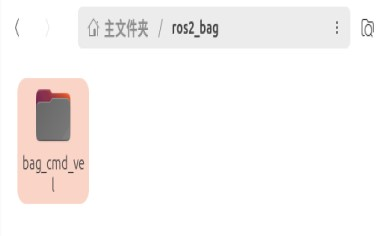
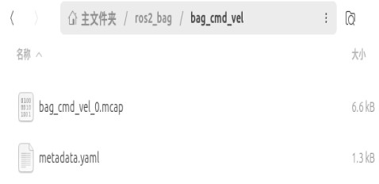
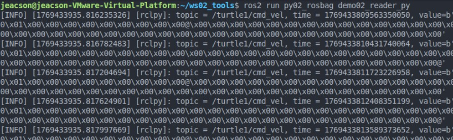

## 简介

假设你有一个机器人：

> - 它在日常运行时没有问题，但是在某一次运行时突然报错了。你希望即刻对此进行排查，但是这个报错只出现了一次，再次运行又没有报错了。
> - 你给他重新设计了一个运动控制节点，但是调不准它的一些特定参数。如果在真实环境中直接运行可能会出现意想不到的情况。
> - 你在某一次运动导航实验中意外的获得了一条导航路径，希望有什么工具把它保存下来，以便之后复现该结果。

针对数据的留存及其读取实现，`ROS2` 提供了专门的工具 —— `rosbag2`

## 概念与作用

`rosbag2` 是用于录制与回放 `ROS2` 系统中节点间通信数据的 **核心工具套件**。简单来说，它类似于一个专门针对机器人系统的“数据记录仪”和“数据播放器”。我们将在虚拟机中进行运用。

## 使用方法

### 0. 前置工作

先创建功能包：

::: tabs#CP

@tab:active C++

```bash
ros2 pkg create cpp02_rosbag --build-type ament_cmake --dependencies rclcpp rosbag2_cpp geometry_msgs --node-name demo01_writer
```

@tab Python

```bash
ros2 pkg create py02_rosbag --build-type ament_python --dependencies rclpy rosbag2_py geometry_msgs --node-name demo01_writer_py
```

:::

### 1.命令行工具的简单使用语法

在终端中，你可以使用 `ros2 bag` 命令工具以实现数据的录制回放工作。其基本使用语法如下：

```txt
burst    精确控制回放过程
convert  给定一个 bag 文件，写出一个新的具有不同配置的 bag 文件；
info     输出 bag 文件的相关信息；
list     输出可用的插件信息；
play     回放 bag 文件数据；
record   录制 bag 文件数据；
reindex  重建 bag 的元数据文件。
```

你可以通过 `--help` 后缀查看其帮助文档，当然以下亦会通过一个案例进行介绍。

#### 案例

假设已在两个独立终端内，分别启动了一个 `turtlesim_node` 节点与一个 `键盘控制` 节点：

```bash 第一个终端A内
ros2 run turtlesim turtlesim_node
```

```bash 第二个终端B内
ros2 run turtlesim turtle_teleop_key
```

要求在运动过程中将键盘经由 `turtle_teleop_key` 所输入的速度、转向指令等通过 `ros2 bag` 工具写入到上述文件夹路径内，使得 `turtlesim_node` 节点可以通过读取该文件夹内特定文件复现移动路径。

#### 操作

##### 1. 先录制

再原有基础上再次新建一个终端C，新建一个文件夹用于存储 `bag`：

```bash
cd
mkdir ros2_bag
```

移动到该文件夹下后，使用 `ros2 bag record` 先开启指令的录制：

```bash
cd ros2_bag/
ros2 bag record /turtle1/cmd_vel -o bag_cmd_vel
```

::: note `record` 的相关语法

在上述代码中：

```bash
ros2 bag record /turtle1/cmd_vel -o bag_cmd_vel
#          ↑          ↑           ↑       ↑
#设置参数为 record     \           \      /
# 设置需要录制的 topic↗           /      \
# 指定输出 （与下配对） ---------↗       /
# 指定输出路径&名字 （与上配对，不写则默认输出带时间戳文件名至 bash 运行路径）
```

你可以通过 `--help` 后缀查看其详细文档，在这里仅对作简单介绍。

:::

在 `终端B` 内可以 **通过键盘** 操控小海龟，此时`ros2 bag` 就会将小海龟此时的运行速率与方向记录下来。


之后你就可以在 `终端C` 内通过 `ctrl+c` 结束录制了。

::: important 一定只使用方向键操控小海龟！
当你希望在 `终端B` 内通过键盘操控小海龟时，会看到下面这一条消息：

```txt
...
Use g|b|v|c|d|e|r|t keys to rotate to absolute orientations.
...
```

她告诉你说可以使用这些 key 对小海龟进行绝对角度旋转。但是请 *注意*，**不要使用** 这些 `key` 直接旋转小海龟！

因为使用 `g|b|v|c|d|e|r|t` 等 `key` 对小海龟进行绝对角度旋转是调用的 `/turtle1/teleport_absolute` **服务** ，除非特殊设置，否则是无法记录小海龟旋转的。

:::

在录制结束后，你会在 `~/ros2_bag` 文件夹下看到生成一新文件夹：



在该文件夹下会生成两个文件：



其中：

- `metadata.yaml` 文件为一个源文件，存储了我们所录制的 `bag` 的一些源信息
- `bag_cmd_vel_0.mcap` 文件是一个为 **机器人数据记录** 而设计的开源二进制容器格式文件，其与原有的使用了 `.db3` 格式的数据库文件相比，在并发和流式处理上更有优势。

    ::: tip 如果依然需要使用 `.db3` 格式的数据库文件

    如果某些下游工具暂不支持 `.mcap`，或在特定场景依然需要 `.db3`，可以通过参数指定：

    ```bash
    ros2 bag record /turtle1/cmd_vel --storage sqlite3
    ```

    :::

之后我们就可以使用这两个文件进行回放了。

##### 2. 后回放

在 `终端A` 内先将原有运行的 `node` 节点关闭，后重启该节点。

在 `终端A` 内节点保持开启的前提下，新建另一终端D，然后输入：

```bash
ros2 bag play bag_cmd_vel
```

::: note `play` 的相关语法

play 代码比较简洁，在上述代码中：

```bash
ros2 bag play bag_cmd_vel
#          ↑          ↑
#设置参数为 play      /
# 指定输入路径&名字 ↗
```

你可以通过 `--help` 后缀查看其详细文档，在这里仅对作简单介绍。

:::

此时`ros2 bag` 指令就会将小海龟当时被记录的运行速率与方向重新发送给小海龟，令其绘制下来：


如果你希望查看特定 `bag` 的相关信息，你可以在 `bag` 的路径下使用以下指令：

```bash
ros2 bag info bag_cmd_vel
```

这样你就可以获取到包括其 *对应版本*、 *录制长度*、*存储大小* 的相关信息了：


### 2. 经由编程使用 rosbag2 的相关语法

在有些情况下，我们也需要以编程的方式使用 `rosbag2` ，以下亦会通过案例对其进行讲解：

假设有一文件夹路径为 `~/ros2_bag` 可用于 `bag` 存储。要求启动一个 `turtlesim_node` 节点与一个 `键盘控制` 节点：

```bash 第一个终端A内
ros2 run turtlesim turtlesim_node
```

```bash 第二个终端B内
ros2 run turtlesim turtle_teleop_key
```

要求在运动过程中将输入的速度、转向指令等通过 `ros2 bag` 写入到上述文件夹路径内，使得重启 `turtlesim_node` 节点后可以通过读取该文件夹内特定文件复现移动路径。

#### ①. 序列化（录制）

序列化，实际上就是录制 `bag` 文件。其核心实现一共有三步骤：

1. 创建写出对象 (指针)
2. 设置写出的目标文件路径
3. 写出消息

::: tabs#CP

@tab:active C++

在创建的 `demo01_writer.cpp` 文件中，写入如下代码：

```cpp
/*
    需求： 录制乌龟运动的速度指令
    步骤：
        1. 包含头文件；
        2. 初始化 ROS2 客户端
        3. 自定义节点类：
           3-1. 创建一个录制对象
           3-2. 设置磁盘文件
           3-3. 写入数据（创建速度订阅方，回调函数中执行写入操作）
        4. 调用spin函数，并传入节点对象指针
        5. 释放资源。
 */

// 1. 包含头文件；
#include "rclcpp/rclcpp.hpp"
#include "geometry_msgs/msg/twist.hpp"
#include "rosbag2_cpp/writer.hpp"

// 3. 自定义节点类：
class SimpleBagRecorder: public rclcpp::Node{
    public:
        SimpleBagRecorder() : Node("simple_bag_recorder_node_cpp"){
            RCLCPP_INFO(this->get_logger(), "消息录制对象已创建");
            // 3-1. 创建一个录制对象
            writer_ = std::make_unique<rosbag2_cpp::Writer>();

            // 3-2. 设置磁盘文件 
            writer_->open("my_bag"); // --该路径是相对路径，是工作空间的直接子级

            // 3-3. 写入数据（创建速度订阅方，回调函数中执行写入操作）
            // writer_->write()
            sub_ = this->create_subscription<geometry_msgs::msg::Twist>("/turtle1/cmd_vel", 10, std::bind(&SimpleBagRecorder::do_write_msg, this, std::placeholders::_1));
        }
    private:
        void do_write_msg(std::shared_ptr<rclcpp::SerializedMessage> msg){
            // write(std::shared_ptr<rclcpp::SerializedMessage> message, // 被写出的消息
            // const std::string &topic_name, // 话题名称
            // const std::string &type_name, // 被写出的消息类型
            // const rclcpp::Time &time) // 时间戳
            RCLCPP_INFO(this->get_logger(), "数据写出中。。。");
            writer_->write(msg, "/turtle1/cmd_vel", "geometry_msgs/msg/Twist", this->now());
        }
        std::unique_ptr<rosbag2_cpp::Writer> writer_;
        // 要求指针只对应一个对象，一旦指针被销毁，对象需要马上被释放。
        // 以避免该“需要操作磁盘文件”对象出现内存泄漏情况

        rclcpp::Subscription<geometry_msgs::msg::Twist>::SharedPtr sub_;

};

int main(int argc, char *argv[])
{
    // 2. 初始化 ROS2 客户端
    rclcpp::init(argc, argv);
    // 4. 调用spin函数，并传入节点对象指针。
    rclcpp::spin(std::make_shared<SimpleBagRecorder>());
    // 5.释放资源;
    rclcpp::shutdown();
    return 0; 
} 

```

@tab Python

在创建的 `demo01_writer_py.py` 文件中，写入如下代码：

```python
"""  
  需求：录制 turtle_teleop_key 节点发布的速度指令。
  步骤：
    1.导包；
    2.初始化 ROS 客户端；
    3.定义节点类；
      3-1.创建写出对象；
      3-2.设置写出的目标文件、话题等参数；
      3-3.写出消息。
    4.调用 spin 函数，并传入对象；
    5.释放资源。

"""
# 1.导包；
import rclpy
from rclpy.node import Node
from rclpy.serialization import serialize_message
from geometry_msgs.msg import Twist
import rosbag2_py
from rclpy.logging import get_logger
# 3.定义节点类；
class SimpleBagRecorder(Node):
    def __init__(self):
        super().__init__('simple_bag_recorder_py')
        # 3-1.创建写出对象；
        self.writer = rosbag2_py.SequentialWriter()
        # 3-2.设置写出的目标文件、话题等参数；
        storage_options = rosbag2_py.StorageOptions(
            uri='my_bag_py',
            storage_id='mcap')
        converter_options = rosbag2_py.ConverterOptions('', '')
        self.writer.open(storage_options, converter_options)

        topic_info = rosbag2_py.TopicMetadata(
            id=0,
            name='/turtle1/cmd_vel',
            type='geometry_msgs/msg/Twist',
            serialization_format='cdr')
        self.writer.create_topic(topic_info)
        self.get_logger().info("bag已创建，建立订阅中。。。")

        self.subscription = self.create_subscription(
            Twist,
            '/turtle1/cmd_vel',
            self.topic_callback,
            10)
        self.subscription

    def topic_callback(self, msg):
        self.get_logger().info("节点消息被接收！")
        # 3-3.写出消息。
        self.writer.write(
            '/turtle1/cmd_vel',
            serialize_message(msg),
            self.get_clock().now().nanoseconds)


def main(args=None):
    # 2.初始化 ROS 客户端；
    rclpy.init(args=args)
    # 4.调用 spin 函数，并传入对象；
    sbr = SimpleBagRecorder()
    rclpy.spin(sbr)
    # 5.释放资源。
    rclpy.shutdown()


if __name__ == '__main__':
    main()
```

:::

#### ②. 反序列化（读取）

反序列化，实际上就是读取 `bag` 文件。其核心实现一共有四步骤：

1. 创建读取对象指针
2. 设置读取的目标文件
3. 读取消息
4. 关闭文件

::: tabs#CP

@tab:active C++

在创建的 `demo02_readter.cpp` 文件中，写入如下代码：

```cpp
/*
    需求： 读取 bag 文件的数据，并将数据输出之终端
    步骤：
        1. 包含头文件；
        2. 初始化 ROS2 客户端
        3. 自定义节点类：
           3.1 创建一个回放对象；
           3.2 设置被读取的文件；
           3.3 读取消息；
           3.4 关闭文件。
        4. 调用spin函数，并传入节点对象指针
        5. 释放资源。
 */

// 1. 包含头文件；
#include "rclcpp/rclcpp.hpp"

#include "rosbag2_cpp/reader.hpp"
#include "geometry_msgs/msg/twist.hpp"

// 3. 自定义节点类：
class SimpleBagPlay: public rclcpp::Node{
    public:
        SimpleBagPlay() : Node("simple_bag_rplay_node_cpp"){
            RCLCPP_INFO(this->get_logger(), "消息回放对象已创建");
            int counter = 0;
            // 3.1 创建一个回放对象；
            reader_ = std::make_unique<rosbag2_cpp::Reader>();
            // 3.2 设置被读取的文件；
            reader_->open("my_bag");

            // 3.3 循环读取消息；
            while (reader_->has_next())
            {
                auto twist = reader_->read_next<geometry_msgs::msg::Twist>();
                RCLCPP_INFO(this->get_logger(), "线速度: %.2f, 角速度: %.2f", twist.linear.x, twist.angular.z);
                counter++;
            }
            
            // 3.4 关闭文件。
            reader_->close();

            RCLCPP_INFO(this->get_logger(), "总消息数量: %d", counter);
        }

    private:
        std::unique_ptr<rosbag2_cpp::Reader> reader_;

};

int main(int argc, char *argv[])
{
    // 2. 初始化 ROS2 客户端
    rclcpp::init(argc, argv);
    // 4. 调用spin函数，并传入节点对象指针。
    rclcpp::spin(std::make_shared<SimpleBagPlay>());
    // 5.释放资源;
    rclcpp::shutdown();
    return 0; 
} 

```

@tab Python

在创建的 `demo02_readter_py.py` 文件中，写入如下代码：

```python
"""  
    需求：读取 bag 文件数据。
    步骤：
        1.导包；
        2.初始化 ROS 客户端；
        3.定义节点类；
            3-1.创建读取对象；
            3-2.设置读取的目标文件、话题等参数；
            3-3.读消息；
            3-4.关闭文件。
        4.调用 spin 函数，并传入对象；
        5.释放资源。

"""
# 1.导包；
import rclpy
from rclpy.node import Node
import rosbag2_py
from rclpy.logging import get_logger
# 3.定义节点类；
class SimpleBagPlayer(Node):
    def __init__(self):
        super().__init__('simple_bag_player_py')
        # 3-1.创建读取对象；
        self.reader = rosbag2_py.SequentialReader()
        # 3-2.设置读取的目标文件、话题等参数；
        storage_options = rosbag2_py.StorageOptions(
                uri="my_bag_py",
                storage_id='mcap')
        converter_options = rosbag2_py.ConverterOptions('', '')
        self.reader.open(storage_options,converter_options)

    def read(self):    
        # 3-3.读消息；
        while self.reader.has_next():
            msg = self.reader.read_next()
            get_logger("rclpy").info("topic = %s, time = %d, value=%s" % (msg[0], msg[2], msg[1]))

def main(args=None):
    # 2.初始化 ROS 客户端；
    rclpy.init(args=args)

    # 4.调用 spin 函数，并传入对象；
    reader = SimpleBagPlayer()
    reader.read()
    rclpy.spin(reader)
    # 5.释放资源。
    rclpy.shutdown()


if __name__ == '__main__':
    main()
```

:::

#### ③. 编辑配置文件

::: tabs#CP

@tab:active C++

修改 `cpp02_rosbag` 包内的 `CMakeLists.txt`:

```txt
...

add_executable(demo01_writer src/demo01_writer.cpp)
add_executable(demo02_reader src/demo02_reader.cpp)

target_include_directories(demo01_writer PUBLIC
  $<BUILD_INTERFACE:${CMAKE_CURRENT_SOURCE_DIR}/include>
  $<INSTALL_INTERFACE:include/${PROJECT_NAME}>)

target_include_directories(demo02_reader PUBLIC
  $<BUILD_INTERFACE:${CMAKE_CURRENT_SOURCE_DIR}/include>
  $<INSTALL_INTERFACE:include/${PROJECT_NAME}>)

target_compile_features(demo01_writer PUBLIC c_std_99 cxx_std_17)  # Require C99 and C++17
target_compile_features(demo02_reader PUBLIC c_std_99 cxx_std_17)  # Require C99 and C++17

ament_target_dependencies(
  demo01_writer
  "rclcpp"
  "rosbag2_cpp"
  "geometry_msgs"
)

ament_target_dependencies(
  demo02_reader
  "rclcpp"
  "rosbag2_cpp"
  "geometry_msgs"
)

install(TARGETS demo01_writer demo02_reader
  DESTINATION lib/${PROJECT_NAME})
...
```

@tab Python

修改 `py02_rosbag` 包内的 `setup.py`:

```python
...
    entry_points={
    'console_scripts': [
        'demo01_writer_py = py02_rosbag.demo01_writer_py:main',
        'demo02_reader_py = py02_rosbag.demo02_reader_py:main'
        ],
    },
```

:::

#### ④. 编译

::: tabs#CP

@tab:active C++

使用 `colcon build --packages-select cpp02_rosbag` 进行编译即可。

@tab Python

使用 `colcon build --packages-select py02_rosbag` 进行编译即可。

:::

#### ⑤. 执行

在 `终端A` 与 `终端B` 内分别启动一个 `turtlesim_node` 节点与一个 `键盘控制` 节点后，运行代码：

::: tabs#CP

@tab:active C++

```bash
ros2 run cpp02_rosbag demo01_writer
```

@tab Python

```bash
ros2 run py02_rosbag demo01_writer_py
```

:::

在 `终端B` 内 **通过键盘** 操控小海龟时，此时`所执行的代码` 就会将小海龟此时的运行速率与方向记录下来。

之后你就可以在 `终端C` 内通过 `ctrl+c` 结束录制了。

")

在 `终端A` 内先将原有运行的 `node` 节点关闭，后重启该节点。

在 `终端A` 内节点保持开启的前提下，新建另一 `终端D`，然后输入：

::: tabs#CP

@tab:active C++

```bash
ros2 run cpp02_rosbag demo02_reader
```

@tab Python

```bash
ros2 run py02_rosbag demo02_reader_py
```

:::

此时 `终端D` 内就会将对应 `bag` 内的相关数据信息按照代码内设计输出至终端。

::: tabs#CP

@tab:active C++


@tab Python



:::

::: tip 若需要记录来自节点自己的的合成数据

上述的代码仅仅对 “创建一个单纯用于保存 topic 数据及其处理结果” 的通常设置做了简单介绍，其关联的信息是通过特定 topic 内部的计时器进行时间戳的记录的。如果你需要在节点中通过 “自己创建计时器” 以使用 rosbag2 的相关 API，你可以参考 **官网提供的** [C++ 实现方法](https://docs.ros.org/en/jazzy/Tutorials/Advanced/Recording-A-Bag-From-Your-Own-Node-CPP.html#record-synthetic-data-from-a-node)  与 [Python 实现方法](https://docs.ros.org/en/jazzy/Tutorials/Advanced/Recording-A-Bag-From-Your-Own-Node-Py.html#record-synthetic-data-from-a-node)。他们 通过 `rclcpp::Node::create_wall_timer()` 和 `rclpy.node.create_timer()` 函数，创建了一个 **可以使用回调函数** 的计时器。
