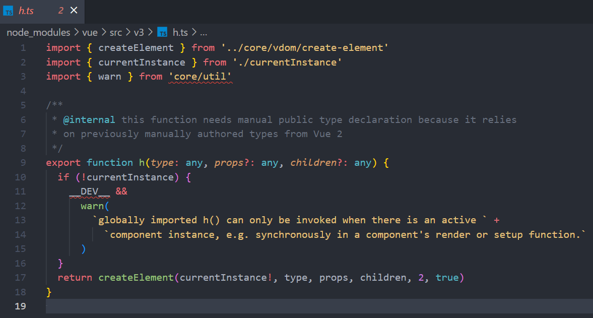

# Vue3 与 Vue2 在渲染函数上的区别

在编写vue代码时，我们一般会首先在template标签中编写html代码。当我们进行代码编译时，VUE首先会<u>根据代码内的各个标签将代码转换为若干个虚拟DOM节点</u>，也就是VNode (VirtualDomNode)，然后它会将多个 Vnode 结合，将其转化为VirtalDOM，最后VDOM才会被渲染成真实的DOM。大部分的情况都会是如此。

但是如果我们可以跳过代码转换节点的过程，直接编写生成vnode的代码，会使得浏览器编译代码的效率更高。此时我们可以在script标签内使用渲染函数render(), 并在其中调用VUE中的函数h()。h函数中调用了createElement函数（Vue3中使用的是createVnode函数） 进行结点的创建，但是只是在这之上进行了传入参数的条件判断，所以我们也可以称其为createElement函数/createVnode函数。

Vue2 源码中对h函数的定义：

Vue3 源码中对h函数的定义：

在Vue2中，h函数的形参一共有以下几个：

- 需要渲染的网页元素类型（types）
- 这个元素的各种参数（以对象作为存储，可以省略）
- 这个元素的子元素（可以为数组）。

在Vue2中，h函数会以参数的形式传入render(), 并且调用h函数时，第二个参数较为冗长：

```javascript
render(h) {
    return h('div', {
        attrs: {
            id: 'test',
        },
        on: {
            click: this.onClick,
        }
    }, 'HelloWorld');
}
``` 

在Vue3中，h函数的形参一共有三个，分别是：

- 需要渲染的网页元素类型（types）
- 这个元素的各种参数（同样 以对象作为存储）
- 这个元素的子元素（可以为数组，但是官方文档中推荐以回调函数的形式进行返回）

在Vue3中，所有的属性都被抽出，使得这个对象更为扁平化：

```javascript
import { h } from 'Vue' // h函数被修改为可以全局引入，这样render函数可以被拆分为多个子函数

render() {
    return h('div', {
    id: 'test',
    onClick: this.onClick,// 以"on"开头的都会被直接认为是需要被监听的属性
    }, 'HelloWorld');
}
```
