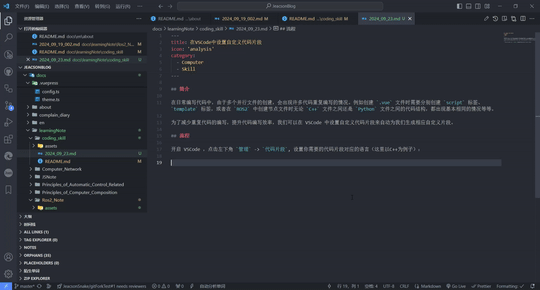
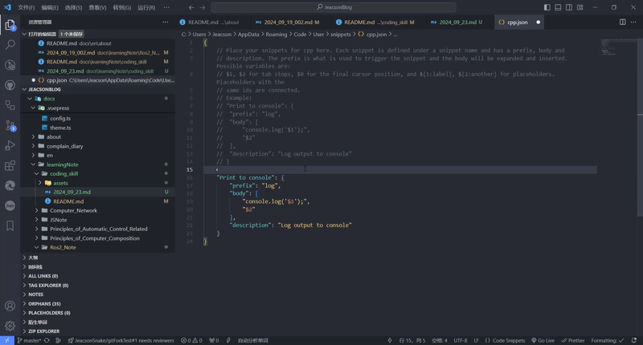
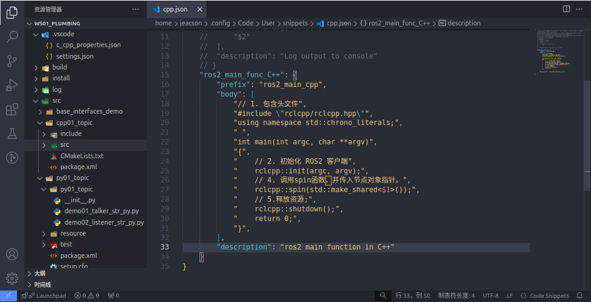
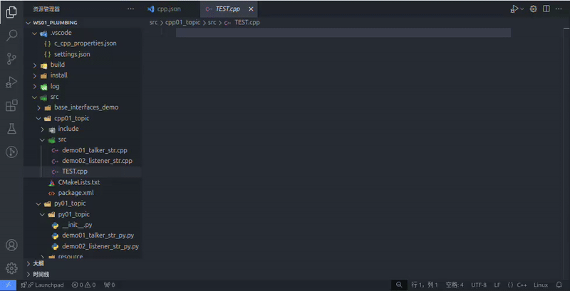

## 简介

在日常编写代码中，由于多个并行文件的创建，会出现许多代码重复编写的情况。例如创建 `.vue` 文件时需要分别创建 `script` 标签、 `template` 标签，或者在 `ROS2` 中创建节点文件时无论 `C++` 文件之间还是 `Python` 文件之间的代码结构，都出现基本相同的情况等等。

为了减少重复代码的编写，提升代码编写效率，我们可以在 VSCode 中设置自定义代码片段来自动为我们生成相应自定义片段。

## 流程

开启 VSCode ，点击左下角 `管理` -> `代码片段`, 设置你需要的代码片段对应的语言（这里以C++为例子）：

将文件中注释后的样例拷贝并粘贴在文件中的大括号内，并取消其注释：

依照其格式修改相关内容即可。

需要使用时，直接输入设置好的指令即可：

