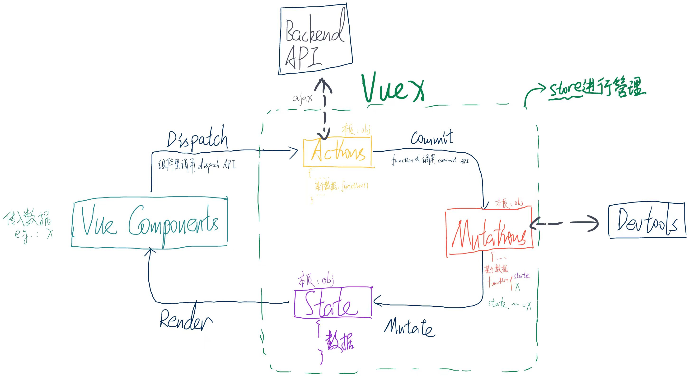

## 简述

这里是当时学习vuex时产出的相关笔记。目前已从图片版本整理为可供阅览的电子格式。

参考官方文档: [click](https://v3.vuex.vuejs.org/zh/guide/)

## VUEX循环图



## 一、VUEX介绍

VueX是专门在vue中实现集中式状态(数据)管理的vue插件。它可以对vue应用中多个组件的共享状态进行集中式的管理(例如读与写)。
它同样可以是一种组件间通信的方式，且适用于任意的组件间通信。

## 二、创建与使用

::: tip
为了能够更方便的进行管理，这里强烈建议将各种配置分为多个文件使用，而不是将所有配置全部写入`main.js`。
:::

::: info
假设使用vue-cli等构建工具实现了vue框架的创建，则会存在src文件夹。
:::

在src文件夹下创建store文件夹以存储相关配置信息，并在其中创建入口文件index.js:

```javascript
    // index.js
    // 引入 vue 与 vuex
    import Vue from 'Vue'
    import Vuex from 'Vuex'

    // 依照使用插件的方式引入vuex
    Vue.use(Vuex)

```

之后就可以使用Vuex.store内的属性对其进行定义了。通常被使用的最多的四个属性为`actions`, `mutations`, `state`, `getters`。

```javascript
    // index.js
    ...
    export default new Vuex.store({
        actions: {
            ...
        },
        mutations: {
            ...
        },
        state: {
            ...
        },
        getters: {
            ...
        }
    })
```

当然你也可以将这四个属性单独进行配置后，再将其引入:

```javascript
    // index.js
    ...
    const actions = {...}

    const mutations = {...}

    const state = {...}

    const getters = {...}

    export default new Vuex.store({
        actions,
        mutations,
        state,
        getters
    })
```

以下将从state开始针对这四个属性进行简单解释：

### 2.1 state

用于存储整个vue程序内各个组件可以共享的数据。一般里面的数据会进行如下定义：

```javascript
    // index.js
    ...
    const state = {
        data1: 1,
        data2: 2,
        data3: 3,
        ...
    }

```

可以使用 `$store.state` 对其内部的参数进行读取。具体例子如下:

```vue
    // in vue component
    ...
    <script>
    export default {

        ...
        computed: {
            data1(value) {
                this.$store.state.data1
            }
            ...
        }

    }
    </script>
```

### 2.2 getters

可以被认为是另一种计算属性，但是在该属性中所传入的参数为state：

```javascript
    // index.js
    ...
    const getters = {
        
        data1Times10(state) {
            return state.data1 * 10
        },
        data2MinusData3(state) {
            return state.data2 - state.data3
        },
        ...
    }
```

可以使用 `$store.getters` 对其内部的参数进行读取。具体例子如下:

```vue
    // in vue component
    ...
    <script>
    export default {

        ...
        computed: {
            increaseData1(value) {
                this.$store.getters.data1Times10
            }
            ...
        }

    }
    </script>
```

### 2.3 mutations

更改 Vuex 的 store 中的数据的唯一方法是使用 mutation 中的函数对其进行提交：

```javascript
    // index.js
    ...
    const mutations = {
        
        increaseData1ByValue(state, value) {
            return state.data1 + value
        },
        decreaseData1ByValue(state, value) {
            return state.data1 - value
        },
        ...
    }
```

当希望调用内部的方法进行数据提交时，需要调用 `$store.commit` 进行提交。具体例子如下:

```vue
    // in vue component
    ...
    <script>
    export default {

        ...
        methods: {
            // ①直接将值进行传输
            increaseData1(value) {
                this.$store.commit('increaseData1ByValue', value)
            },
            // ②将值包裹进对象中，以载荷方式进行传输
            decreaseData1(value) {
                this.$store.commit('decreaseData1ByValue', {
                    value
                })
            },
            // ③以对象方式进行传输
            decreaseData1(value) {
                this.$store.commit({
                    type: 'decreaseData1ByValue'
                    value
                })
            }

            ...
        }

    }
    </script>
```

### 2.4 actions

用于提交数据，**但是 action 提交数据时使用 mutation 作为中介，而不是直接变更状态。** 因此该属性一般用于包含任意异步操作。
Action 函数接受一个与 store 实例具有相同方法和属性的 context 对象，因此你可以调用 context.commit 提交一个 mutation，或者通过 context.state 和 context.getters 来获取 state 和 getters。

::: tip
    因为模块分割的原因，这里的context和store有一些地方不一致，即`context !== store`。
    具体可以参考[官方文档 Vuex 3.x Module](https://v3.vuex.vuejs.org/zh/guide/modules.html)。
:::

```javascript
    // index.js
    // 在这里就可以使用之前所说的三种方法进行传输
    ...
    const actions = {
        incrementData1Async1(context, value) {
            setTimeout(() => {
                context.commit('increaseData1ByValue', value)
            }, 1000)
        },
        // ②将值包裹进对象中，以载荷方式进行传输
        decreaseData1Async2(context, value) {
            context.commit('decreaseData1ByValue', {
                value
            })
        },
        // ③以对象方式进行传输
        decreaseData1Async3(context, value) {
            context.commit({
                type: 'decreaseData1ByValue'
                value
            })
        }
        ...
    }
```

当然如果在需要引用多次commit等情况下可能会出现多次使用context的麻烦情况，因此实践中，我们会经常用到 ES2015 的 **参数解构**，就是 **直接将对象中需要用到的的属性传入，而不将整个对象直接传入** 的方法来简化代码:

```javascript
    // index.js
    ...
    const actions = {
        incrementData1Async ({ commit }) {
            setTimeout(() => {
                commit('increaseData1')
            }, 1000)
        }
        ...
    }
```

当希望调用内部的方法进行数据提交时，需要调用 `$store.dispatch` 进行提交。具体例子如下:

```vue
    // in vue component
    ...
    <script>
    export default {

        ...
        methods: {
            // ①直接将值进行传输
            increaseData1(value) {
                this.$store.dispatch('incrementData1Async1', value)
            },
            // ②将值包裹进对象中进行传输
            decreaseData1(value) {
                this.$store.dispatch('decreaseData1Async2', {
                    value
                })
            },
            // ③以对象方式进行传输
            decreaseData2(value) {
                this.$store.dispatch({
                    type: 'decreaseData1Async3'
                    value
                })
            }

            ...
        }

    }
    </script>
```

### 2.5 map 辅助函数

Vuex提供了多个map辅助函数，使得我们可以用较少的代码量同时引入多个属性。

#### 2.5.1 mapState 辅助函数

当一个组件需要获取多个状态的时候，将这些状态都声明为计算属性会有些重复和冗余。为了解决这个问题，我们可以使用 `mapState` 辅助函数帮助我们生成计算属性:

```javascript
// 在单独构建的版本中辅助函数为 Vuex.mapState
import { mapState } from 'vuex'

export default {
  // ...
  computed: mapState({
    // 箭头函数可使代码更简练
    count: state => state.count,

    // 传字符串参数 'count' 等同于 `state => state.count`
    countAlias: 'count',

    // 为了能够使用 `this` 获取局部状态，必须使用常规函数
    countPlusLocalState (state) {
      return state.count + this.localCount
    }
  })
}

```

当映射的计算属性的名称与 state 的子节点名称相同时，我们也可以给 mapState 传一个字符串数组。

```javascript

computed: mapState([
  // 映射 this.count 为 store.state.count
  'count'
])

```

如果组件原本就有自己的计算属性，需要与store内的属性进行混合使用的话，可以使用对象展开运算符将 mapState 混入 computed 对象中：

```javascript
computed: {
    // 原有的计算属性
    localComputedA () { /* ... */ },
    localComputedB () { /* ... */ },
    
    // 使用对象展开运算符将此对象混入到外部对象中
    ...mapState({
    // ...
  })
}
```

#### 2.5.2 mapGetters 辅助函数

`mapGetters` 辅助函数仅仅是将 store 中的 getter 映射到局部计算属性：

```javascript
import { mapGetters } from 'vuex'

export default {
  // ...
  computed: {
  // 使用对象展开运算符将 getter 混入 computed 对象中
    ...mapGetters([
      'doneTodosCount',
      'anotherGetter',
      // ...
    ])
  }
}
```

如果你想将一个 getter 属性另取一个名字，则可以使用对象形式：

```javascript
...mapGetters({
  // 把 `this.doneCount` 映射为 `this.$store.getters.doneTodosCount`
  doneCount: 'doneTodosCount'
})
```

#### 2.5.3 mapMutations 辅助函数

你可以在组件中使用 `this.$store.commit('xxx')` 提交 mutation，或者使用 `mapMutations` 辅助函数将组件中的 methods 映射为 `store.commit` 调用（需要在根节点注入 store）。

```javascript
import { mapMutations } from 'vuex'

export default {
  // ...
  methods: {
    ...mapMutations([
      'increment', // 将 `this.increment()` 映射为 `this.$store.commit('increment')`

      // `mapMutations` 也支持载荷：
      'incrementBy' // 将 `this.incrementBy(amount)` 映射为 `this.$store.commit('incrementBy', amount)`
    ]),
    ...mapMutations({
      add: 'increment' // 将 `this.add()` 映射为 `this.$store.commit('increment')`
    })
  }
}

```

#### 2.5.4 mapActions 辅助函数

你可以在组件中使用 `this.$store.dispatch('xxx')` 分发 action，或者使用 `mapActions` 辅助函数将组件的 methods 映射为 `store.dispatch` 调用（同样需要先在根节点注入 store）：

```javascript
import { mapActions } from 'vuex'

export default {
  // ...
  methods: {
    ...mapActions([
      'increment', // 将 `this.increment()` 映射为 `this.$store.dispatch('increment')`

      // `mapActions` 也支持载荷：
      'incrementBy' // 将 `this.incrementBy(amount)` 映射为 `this.$store.dispatch('incrementBy', amount)`
    ]),
    ...mapActions({
      add: 'increment' // 将 `this.add()` 映射为 `this.$store.dispatch('increment')`
    })
  }
}

```

### 3.模块化

由于vuex使用[单一状态树](https://v3.vuex.vuejs.org/zh/guide/state.html#%E5%8D%95%E4%B8%80%E7%8A%B6%E6%80%81%E6%A0%91)，使得应用的所有状态会被集中到一个比较大的对象中，因此当应用变得非常复杂时，store 对象就有可能因为数据的大量增长而变得相当臃肿。

为了解决以上问题，Vuex 允许我们将 store 分割成多个模块（module）。每个模块拥有各自的 state、mutation、action、getter、甚至是另外几个嵌套的子模块——从上至下进行同样方式的分割：

```javascript
    const moduleA = {
        state: () => ({ ... }),
        mutations: { ... },
        actions: { ... },
        getters: { ... }
    }

    const moduleB = {
        state: () => ({ ... }),
        mutations: { ... },
        actions: { ... }
    }

    const store = new Vuex.Store({
        modules: {
            a: moduleA,
            b: moduleB
        }
    })

    store.state.a // -> moduleA 的状态
    store.state.b // -> moduleB 的状态
```

::: tip
默认情况下，模块内部的 action、mutation 和 getter 是注册在全局命名空间的——这样使得多个模块能够对同一 mutation 或 action 作出响应。如果希望你的模块具有更高的封装度和复用性，你可以通过添加 `namespaced: true` 的方式使其成为带命名空间的模块:

```javascript
    const moduleC = {
        namespaced: true,
        state: () => ({ ... }),
        mutations: { ... },
        actions: { ... },
        getters: { ... }
    }

    const store = new Vuex.Store({
        modules: {
            c: moduleC
        }
    })

    store.state.a // -> moduleA 的状态
    store.state.b // -> moduleB 的状态
```

当模块被注册后，它的所有 getter、action 及 mutation 都会自动根据模块注册的路径调整命名，一般格式为`'模块名/原有名'`。例如：

```javascript
const store = new Vuex.Store({
  modules: {
    account: {
      namespaced: true,

      // 模块内容（module assets）
      state: () => ({ ... }), // 模块内的状态已是嵌套的，使用 `namespaced` 属性不会对其产生影响
      getters: {
        isAdmin () { ... } // -> getters['account/isAdmin']
      },
      actions: {
        login () { ... } // -> dispatch('account/login')
      },
      mutations: {
        login () { ... } // -> commit('account/login')
      },

      // 嵌套模块
      modules: {
        // 继承父模块的命名空间
        myPage: {
          state: () => ({ ... }),
          getters: {
            profile () { ... } // -> getters['account/profile']
          }
        },

        // 进一步嵌套命名空间
        posts: {
          namespaced: true,

          state: () => ({ ... }),
          getters: {
            popular () { ... } // -> getters['account/posts/popular']
          }
        }
      }
    }
  }
})
```

:::
