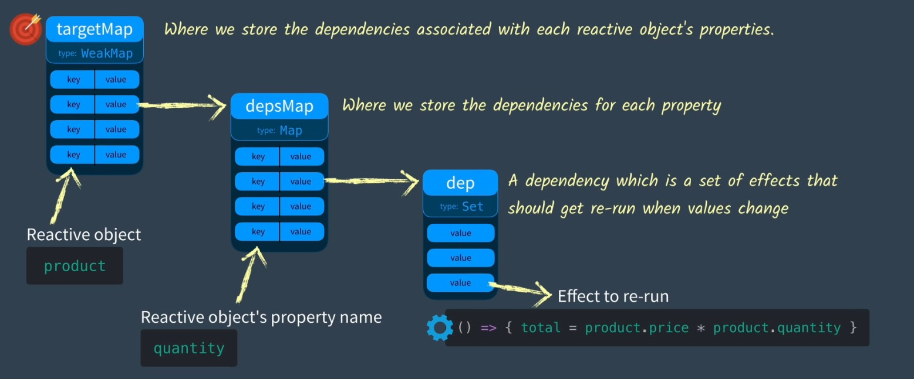

## 简述

这里会从源码实现原理，向你介绍VUE3是如何实现数据响应式的。这里是上篇。

参考: [Vue Mastery-Vue3 Recativity](https://www.vuemastery.com/courses/vue-3-reactivity/)

## 从简单的模板开始讲起

让我们首先创建一个简单的 Vue App 以及一个html模板：

```html
<!DOCTYPE html>
<html lang="en">
<head>
    <meta charset="UTF-8">
    <meta name="viewport" content="width=device-width, initial-scale=1.0">
    <title>Document</title>
</head>
<script src="https://cdn.jsdelivr.net/npm/vue@2.7.14/dist/vue.js"></script>

<body>
    <div id = "app">
        <div>Price: ${{ price }}</div>
        <div>Total: ${{ price * quantity}}</div>
        <div>Taxes: ${{ totalPriceWithTax }}</div>
    </div>
    
</body>


<script>
    let vm = new Vue({
        el: '#app',
        data: {
            price: 5.00,
            quantity: 2
        },
        computed: {
            totalPriceWithTax() {
                return this.price * this.quantity * 1.03
            }
        },

    })
</script>

</html>

```

已知当我们修改`price`为`10.00`时，Vue 可以知道如何更新HTML内的相关模板信息，并且可以修改计算属性中有关其的相关计算属性，并同时更新HTML内的相关模板信息。那么这里有一个问题：
**Vue是如何知道要以什么样的方式对其进行修改的？**

毕竟在原来的JavaScript代码中，假设我们拥有一个片段：

```javascript
let price = 5
let quantity = 2
let total = price * quantity
console.log(`total 的值为：${total}`)
```

很明显，这里的log会输出`total 的值为：10`。
但当我们对 `price` 进行修改时：

```javascript
price = 10
console.log(`total 的值为：${total}`)
```

很明显，这里的log依然会输出`total 的值为：10`。因为在这个片段里，Javascript的代码运行顺序，就是很简单的从上到下。因此即使你对`price` 进行了修改，`total`的值依然不会被受到任何修改。换句话说，在这一段JavaScript代码中，`total`的值并不能得到我们所希望的，**响应式的更新**。
那么为了使这段代码在`price`被修改(更新)后，可以重新计算并更新total的值，我们要使用什么样的方法呢？

## 与响应式相关的三板斧 —— effect、track、trigger 三函数

为了使这段代码在`price`被修改(更新)后，可以重新计算并更新total的值，我们应该尝试着将上述的公式放入某种便于遍历的储存类中，使其成为某种更新用函数，让其可以被多次调用。这样我们就可以在后期通过调用这个函数以实现较为方便的更新了。

并且假设我们所拥有的对象中有许多类似于`total`的变量使用了同一个变量`price`进行计算，而每一个变量有自己的某种储存类，这会使得我们还需要有一个便于遍历的储存类，来存储所有的、每一个的变量自己的储存类，等等等等。

听起来很麻烦，不过让我们一步步来对其进行编写。

首先我们将这个更新用函数命名为`effect`，因为这个函数可以被认为是对`total`做出了某种 *影响* :

```javascript
// 原有的定义
let total = price * quantity
// 修改之后的函数
let total = 0
let effect = function() {
    total = price * quantity
}

```

然后我们需要一个用于保存这个 *更新用函数* 的方法，当我们想要保存时，或者说希望对这个值进行 *跟踪* 时，就调用这个方法。我们将这个跟踪用函数命名为`track`:

```javascript
track()
```

最后我们需要一个用于触发这个 *更新用函数* 的方法，当我们更新了`price`时，就调用这个方法以 *触发* 之前所存储的更新用函数`effect()`。我们将这个触发用函数命名为`trigger`:

```javascript
trigger()
```

我们将这三个函数串联起来的话，大概是像这个样子：

```javascript
let price = 5
let quantity = 2
let total = 0
let effect = function() {
    total = price * quantity
}

// 声明要对total进行跟踪
track()
// 执行一次更新用函数，以获取首次的total值
effect()
...
// 在之后的某一次更新中，假设price 或者 quantity 收到了修改，则调用该函数进行触发
trigger()
```

## 将"更新用函数"存入合适存储区——Set

为了使每个函数在这个便于遍历的储存类中只出现一次，而不出现重复值，我们需要使用*某种哈希结构*进行存储，并且它应该是一组唯一值的**集合**。由此我们会使用`Set`—— **集合对象**对其进行存储。

:::info
**Set** 是 ES6 中新增的一种对象类型,它存储的是**唯一值的集合**。 也就是说,*即使 Set 中存入相同的元素,也只会被保留一个*。
:::

在这里我们一般会做如下定义：

```javascript
...
// 定义 dep 变量为 Set 类下的对象用于存储函数，在此 “dep” 代表依赖关系 “dependency”
dep = new Set() 
let effect = () => { total = price * quantity }// 缩减为箭头函数
...
```

由此，我们就可以将[前文](./VUE3的数据响应式_上.md#响应式的三板斧)所说的 `track` 和 `trigger` 两个函数进行定义：

```javascript
function track() {
    // 函数的功能是将定义好的 effect 添加入 dep
    dep.add(effect) 
}

function trigger() {
    // 函数的功能是遍历 dep 内的所有 effect 并触发运行
    dep.forEach((effect) => {effect()})
}

```

由此，之前的代码变成了：

```javascript
let price = 5
let quantity = 2
let total = 0

dep = new Set() // 代表依赖关系 “dependency”
let effect = () => { total = price * quantity }// 缩减为箭头函数

function track() {
    // 将定义好的 effect 添加入 dep
    dep.add(effect)
}

function trigger() {
    // 遍历 dep 内的所有 effect 并触发运行
    dep.forEach((effect) => {effect()})
}

// 首先声明要对 属性 进行跟踪
track()
// 其次执行一次更新用函数，以获取在属性影响下，首次得到的 total 值
effect()
...

```

于是在这种情况下，假设我们像最开始一样将`price`调整为10，即使我们尝试输出 total 时值依然没有变化，但是——**我们现在可以对其进行手动更新了**。只要在更新`price`之后调用`trigger()`方法，就可以实现手动的更新`total`值了。

## 将所有的Set存储区串成一个Map

通常，我们的对象会有多个属性，而为了对所有的属性进行分别的监听，这些属性都需要自己的独立 **dep**，或者说包含了 *effect* 的 **Set**。那么我们应该如何存储这些属性拥有的独立 **dep**，才能够更为方便的进行管理呢？

举个例子，我们将之前的 price 与 quantity 使用 product 对象将其包裹：

```javascript
let product = {price = 5, quantity = 2}
```

对于 product 对象而言，在它内部的每一个属性都需要自己的独立 **dep**。

那么为了使我们在之后能够更方便的找到他们，我们需要把这些 **dep** 存储在一个共通的、可以快速遍历的地方。因此我们需要创建一个 depMap，它是一个 “Map” 类。这个类当中充满了大量的键值对，我们需要将每个属性的属性名作为*键(key)*，然后将每个属性对应的**独立 dep**，也就是 **Set对象** 作为*值(value)*。

我们来试着编写下 “depMap” 吧：

```javascript
const depMap = new Map()
```

那么我们的`track()`函数就会变成这样:

```javascript
function track(key) {
    // 以传入的属性值作为key，找到对应的dep值
    dep = depMap.get(key)
    // 万一还没有dep，那咱就创一个新的
    if (!dep) {
        depMap.set(key, (dep = new Set()))
    }
    // 将定义好的 effect 添加入 dep
    dep.add(effect)
}

```

`trigger()`函数就会变成这样:

```javascript
function trigger(key) {
    // 以传入的属性值作为key，找到对应的dep值
    dep = depMap.get(key)
    // 如果 dep 存在
    if (dep) {
        // 遍历 dep 内的所有 effect 并触发运行
        dep.forEach((effect) => {effect()})
    }
    // 如果 dep 不存在就不用运行，直接跳过
    
}
```

那么我们原来的代码就需要被修改为这样：

:::info
因为`track()`函数与`trigger()`函数开始变长，因此我们将他们拆出，与depMap放入同一个文件(deepMap.js之类的)。只要知道调用的是同一个函数就行。
:::

```javascript
import {track, trigger} from './deepMap.js'

let product = {price = 5, quantity = 2}
let total = 0

let effect = () => { total = product.price * product.quantity }// 缩减为箭头函数

// 首先声明要对属性进行跟踪，这里以 price 为例
track("price")
// 其次执行一次更新用函数，以获取首次的 total 值
effect()
```

与之前相似，假设我们像最开始一样将`price`调整为10，即使我们尝试输出 total 时值依然没有变化，但是在更新`price`之后调用`trigger("price")`方法，就可以实现手动的更新`total`值了。

## 将所有的map串成weakmap

到此为止，我们对同一个对象中的不同属性有了一种较为规范的跟踪依赖关系方法，但是——如果我们**拥有多个响应式对象**，阁下又该如何处理它们呢？

>“要不再使用一个 Map 类把之前的 depMap 串起来吧？就像 depMap 自身一样，将每个响应式对象的对象名作为*键(key)*，然后将每个对象对应的 **depMap**，也就是 **Map对象** 作为*值(value)*进行映射？”

可以试试。

我们再整一个类似于 **Map** 的存储地，在这里我们使用 **WeakMap** 。**WeakMap** 结构与 **Map** 结构类似，但是 **WeakMap** 有几个优势：

- 只接受*对象*作为键名（ null 除外），不接受其他类型的值作为键名。
- **WeakMap** 的键不属于正式的引用，不会阻止JS执行垃圾回收，但是只要键存在，键/值对就会存在于映射中，并被当作对值的引用，因此被引用的对象就不会被计入垃圾回收机制。(有关垃圾回收机制的具体介绍可以看[这里](https://blog.csdn.net/weixin_41636483/article/details/130831174)) 这个特性与*响应式对象*期望的运用逻辑相似。

我们一般叫他 `targetMap`。至于原因，可以到[后文](./VUE3的数据响应式_下.md)中进行寻找。

我们来试着编写下 “targetMap” 吧：

```javascript
const targetMap = new WeakMap()
    ...
```

那么我们的`track()`函数就会变成这样:

```javascript
    ...
function track(target, key) {

    // 以传入的对象作为 target，找到对应的 depMap 值
    let depMap = targetMap.get(target)
    // 万一还没有 depMap，那咱就创一个新的
    if (!depMap) {
        targetMap.set(target, (depMap = new Map()))
    }

    // 以传入的属性值作为 key，找到对应的 dep 值
    let dep = depMap.get(key)
    // 万一还没有 dep，那咱就创一个新的
    if (!dep) {
        depMap.set(key, (dep = new Set()))
    }
    // 将定义好的 effect 添加入 dep
    dep.add(effect)
}
    ...
```

`trigger()`函数就会变成这样:

```javascript
    ...
function trigger(target, key) {

    // 以传入的对象作为 target，找到对应的 depMap 值
    let depMap = targetMap.get(target)
    // 万一还没有 depMap，那咱就创一个新的
    if (!depMap) {
        // 如果 depMap 不存在就不用运行，直接跳过
        return
    }
    
    // 以传入的属性值作为key，找到对应的dep值
    let dep = depMap.get(key)
    // 如果 dep 存在
    if (dep) {
        // 遍历 dep 内的所有 effect 并触发运行
        dep.forEach((effect) => {effect()})
    }
    // 如果 dep 不存在就不用运行，直接跳过
    ...
}
```

那么我们原来的代码就需要被修改为这样：

:::info
因为`track()`函数与`trigger()`函数已经被拆出，与 targetMap 放入同一个文件(targetMap.js之类的)。因此只要知道调用的是同一个函数就行。
:::

```javascript
import {track, trigger} from './targetMap.js'

let product = {price = 5, quantity = 2}
let total = 0

let effect = () => { total = product.price * product.quantity }// 缩减为箭头函数

// 首先声明要对属性进行跟踪，这里以 price 为例
track(product, "price")
// 其次执行一次更新用函数，以获取首次的 total 值
effect()
```

与之前相似，假设我们像最开始一样将`price`调整为10，即使我们尝试输出 total 时值依然没有变化，但是在更新`price`之后调用`trigger(product, "price")`方法，就可以实现手动的更新`total`值了。

## 小总结

在这一章中，我们一共做了三件事情，来初步搭建了我们自己的响应式引擎：

- [将"更新用函数"存入合适存储区——Set](./VUE3的数据响应式_上.md#将更新用函数存入合适存储区set)
- [将所有的set存储区串成一个map](./VUE3的数据响应式_上.md#将所有的set存储区串成一个map)
- [将所有的map串成weakmap](./VUE3的数据响应式_上.md#将所有的map串成weakmap)

用图片可以表现为：



感觉做了很多工作，但是实际上直到目前为止，我们还是只能使用手动的更新来监测我们希望监测的值，而没有办法使*响应式对象*中*特定属性*的*更新用函数* **Set** 自动地重新运行。没有关系，我们会在下一部分进行讲解。
