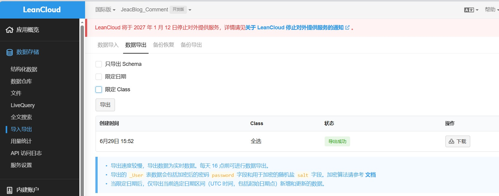
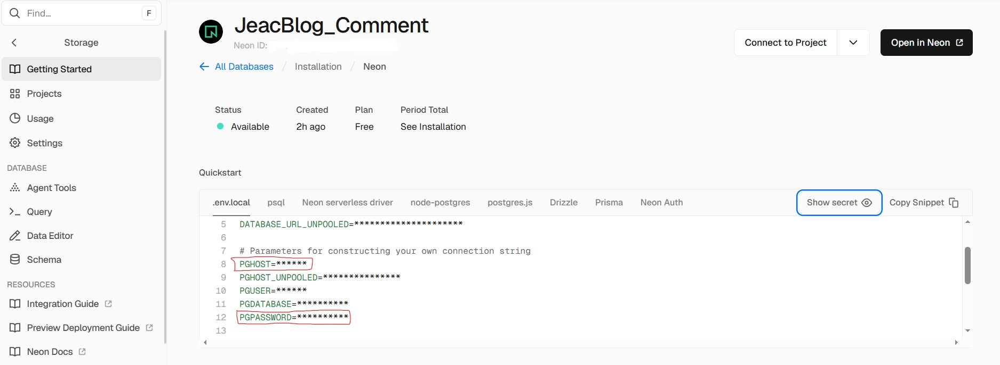
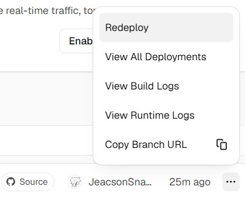

LeanCloud 于 `2026 年 1 月 12 日` 发布公告，说明其将于 `2027 年 1 月 12 日` 正式停止对外服务。因此本博客在 `2026 年 6 月 29 日` 将 `LeanCloud` 中的相关评论数据导出和切换到了 `Neon PostgreSQL` 以进行后续使用。在参考 **更新后** 的[官方文档](https://waline.js.org/guide/get-started/)后，做出以下完整迁移步骤（注：必须按照顺序进行操作）：

## 1. 从 LeanCloud 导出 Waline 数据

登录 `LeanCloud` 控制台，进入到之前定义的用于存储评论的应用中，点击左侧 `数据存储 → 导入导出`，选择 `数据导出` 选项卡，点击 `导出`:



因为本身这边的评论量很少，因此导出的时间并没有那么长。其导出的是一个 `.tar.gz` 文件，在之后需要进行进一步格式转换。

:::note
如果数据量较大，这里的导出可以仅选择：

- 'Comment'
- 'Counter'
- 'Users'

这三项进行导出。

:::

## 2. 在 vercel 中创建 Neon 数据库并链接

在 `vercel` 中，进入用于之前设置的应用中，点击左侧 `Storage`，选择右侧的 `Create Database`。在下方的 provider 中选择 `Neon`:

")

使用 `Github` 账号关联创建 `Neon` 账号之后，可以以默认状态进行创建 （当然我这边修改了命名，还把地区选择为了 `新加坡`，寻思服务器地理位置稍微近一点。不过不修改理论上也没事）。

创建后，点击 `Open in Neon` 跳转到 `Neon`。在 `Neon` 界面左侧选择 `SQL Editor`，将 [waline.pgsql](https://github.com/walinejs/waline/blob/main/assets/waline.pgsql) 中的 `SQL` 语句粘贴进编辑器中，点击 `Run` 执行创建表操作。

## 3. 将之前导出的数据进行格式转换与上传

使用 [waline-data-import-tool](https://github.com/elkan1788/waline-data-import-tool)进行数据的转换（我这里依据系统架构平台选择的是`waline-data-import-tool.exe` 这个 release 项）。下载完该 `.exe` 文件后，在这里需要创建两个文件进行转换：

### 1. waline-neon.ini 文件

导入到 `Neon` 需要将原来数据库中链接至 `LeanCloud` 的相关 `Key` 修改为链接至 `Vercel` 的相关 `Key`，因此需要创建以下文件：

```waline-neon.ini
[neon]
host=ep-xxxx-dew-xxxx-pooler.c-4.us-east-1.aws.neon.tech
port=5432
user=neondb_owner
password=<PASSWORD>
database=neondb
sslmode=require
```

其中 `host` 和 `password` 需要在 `vercel` 进入用于之前设置的应用后，点击左侧 `Storage` 并选定之前创建的 `Neon`，在 `Quickstart` 里的 `.env.local` 中寻找对应键值对进行替换：



修改完之后保存。

### 2. waline.json 文件

将[前文所述从 LeanCloud 中导出的数据库文件](#1-从-leancloud-导出-waline-数据)使用以下 `python` 代码进行数据的转换：

```python
import json
import os
import re

def parse_leancloud_jsonl(filepath):
    """读取 LeanCloud 导出的 JSONL，返回对象列表"""
    items = []
    with open(filepath, 'r', encoding='utf-8') as f:
        for line in f:
            line = line.strip()
            if not line:
                continue
            # 跳过 LeanCloud 的注释头，如 #filetype:JSON-streaming ...
            if line.startswith('#'):
                continue
            obj = json.loads(line)
            
            # 处理 LeanCloud 的 Date 对象格式 {"__type":"Date","iso":"..."}
            for key in ['insertedAt', 'createdAt', 'updatedAt']:
                if key in obj and isinstance(obj[key], dict) and obj[key].get('__type') == 'Date':
                    obj[key] = obj[key]['iso']
            
            # 删除不需要的字段（可选，减少体积）
            for key in ['ACL', '__type']:
                obj.pop(key, None)
                
            items.append(obj)
    return items

def main():
    # 配置：根据你解压后的实际文件名修改
    files = {
        'Comment': 'Comment.0.jsonl',
        'Counter': 'Counter.0.jsonl',
        'Users': 'Users.0.jsonl',
    }
    
    data = {}
    for table, filename in files.items():
        if os.path.exists(filename):
            print(f"正在处理 {filename} ...")
            data[table] = parse_leancloud_jsonl(filename)
        else:
            print(f"警告：未找到 {filename}，将使用空数组")
            data[table] = []
    
    output = {
        "__version": "1.0.0",
        "type": "waline",
        "version": 1,
        "time": 0,
        "tables": ["Comment", "Counter", "Users"],
        "data": data
    }
    
    with open('waline.json', 'w', encoding='utf-8') as f:
        json.dump(output, f, ensure_ascii=False, indent=2)
    
    print("转换完成！已生成 waline.json")

if __name__ == '__main__':
    main()
```

其会在 **相同根文件夹下** 输出 `waline.json` 文件。

### 3.组合

将 `waline-data-import-tool.exe`、`waline-neon.ini` 文件、`waline.json` 文件放在同一文件夹下，在该文件夹目录中使用管理员身份打开 `Powershell`，并执行：

```powershell
.\waline-data-import-tool.exe -f .\waline.json -c .\waline-neon.ini
```

之后数据库中的内容会逐步上传至 `Neon` 中。

## 4. 重部署

在上述工作完成之后，需要在 `vercel` 中点击 `Redeploy`，以使相关设置再重新加载后适用。


