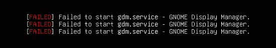
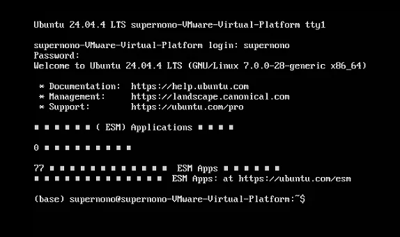
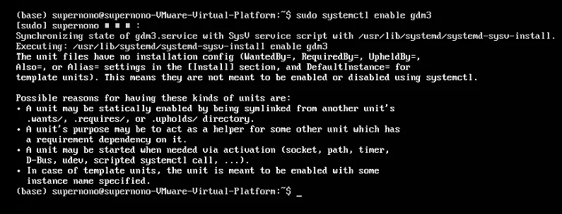
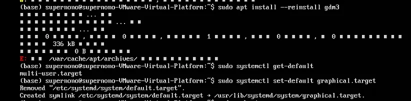
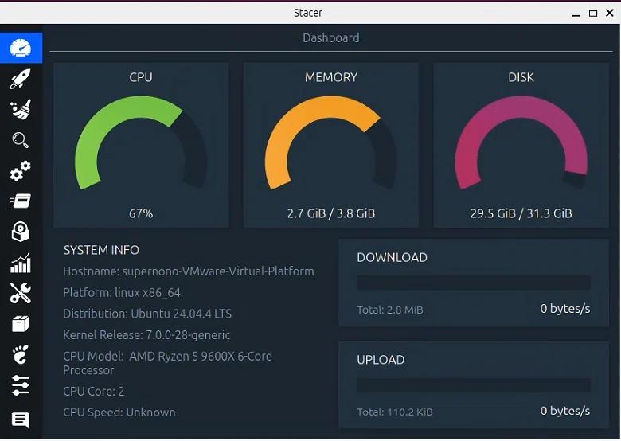
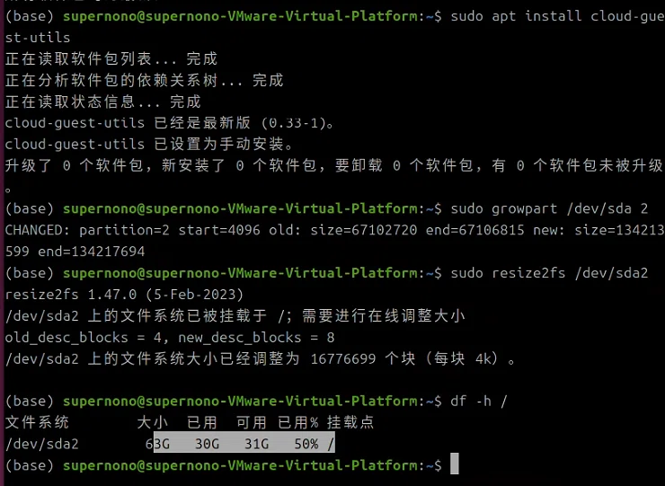

## 背景

用户使用 VMware Workstation Pro 虚拟机创建并运行 Ubuntu 24.04，如是正常的经过了7个月左右。但是在某次重启后，系统未能正常进入图形登录界面，提示 `[FAILED] Failed to start gdm.service - GNOME Display Manager.`

在该页面下，用户尝试使用`Ctrl + Alt + F2`直接进入字符终端（`tty1`），显示 `Ubuntu 24.04.4 LTS ... tty1` 并提示登录。用户能够正常登录，但 `gdm3（GNOME 显示管理器）`未启动，图形界面无法使用。

## 出现的状况

- 系统启动后停留在 `tty1` 命令行，无图形界面。
- 执行 `systemctl status gdm3` 显示服务状态为 `inactive（未运行）`，但无明显错误日志。

- 执行 `sudo systemctl enable gdm3` 时收到警告：“The unit files have no installation config”，提示无法通过 `systemctl enable` 设置开机自启。
- 尝试使用 `sudo apt install --reinstall gdm3` 重装时，出现 `E: /var/cache/apt/archives/` 错误（输出截断），表明 APT 缓存或磁盘空间存在问题。
- 使用 `systemctl get-default` 指令，发现系统默认启动目标为 `multi-user.target`，而非 `graphical.target`，导致开机不自动启动图形界面。

（甚至出现了大部分的字母变成了方块的编码问题）

## 原因分析

经过逐步排查，确定根本原因为： **磁盘空间不足**。

具体而言，虚拟机在初始设置时所被分配的磁盘容量为 `32GB`，通过 **Stacer** 工具确认到：根分区 `/` 使用率达到 95% 以上。

其磁盘空间耗尽导致了如下几个状况出现：

1. `APT` 缓存目录 `/var/cache/apt/archives/` 无法写入，重装 `gdm3` 失败;
2. 系统服务（包括 `gdm3`）可能因无法创建临时文件或日志而启动失败;
3. 系统在启动时自动降级为 `multi-user.target`（命令行模式）以避免图形界面因资源不足而崩溃。

## 执行的操作

### 一、 紧急清理磁盘空间

1. 执行 `sudo apt autoremove` 删除无用依赖包。
2. 执行 `sudo apt autoclean` 清理已下载的旧包缓存。
3. 执行 `sudo journalctl --vacuum-size=100M` 压缩系统日志，释放约 `100MB` 空间。
4. 执行 `sudo rm -rf /var/cache/apt/archives/*` 清空损坏的 `APT` 缓存。
5. 执行 `sudo apt update` 更新软件源。
6. 重新安装 `gdm3`：`sudo apt install --reinstall gdm3`。
7. 将默认启动目标设为 `graphical.target`：`sudo systemctl set-default graphical.target`。
8. 启动 gdm3 服务：`sudo systemctl start gdm3`，图形界面恢复正常。

### 二、从根本上扩容虚拟硬盘

经调研得知，该系统没有使用 `LVM`，而是传统分区（在该系统中，`sda2` 直接挂载为根目录 `/`）。

1. 关闭虚拟机，在 VMware Workstation 中删除所有快照。
2. 在虚拟机设置中，将硬盘容量从 32GB 扩展至 64GB。
3. 启动虚拟机，进入终端，执行以下命令：
4. 安装扩展工具：`sudo apt install cloud-guest-utils`。
5. 扩展分区 `sda2`（根分区）到未分配空间：`sudo growpart /dev/sda 2`。
6. 扩展文件系统（*ext4*）：`sudo resize2fs /dev/sda2`。
7. 验证结果：`df -h /` 显示根分区总容量约 `63GB`，可用空间约 `31GB`，扩容成功。

## 最终结果

系统图形界面完全恢复，`gdm3` 正常启动，登录界面出现。根分区可用空间从不足 2GB 提升至 31GB，从根本上解决了磁盘空间不足的问题。虚拟机整体运行稳定，后续可正常安装软件和进行系统更新。

## 经验总结

磁盘空间不足是导致系统服务（特别是图形界面）异常启动的常见原因，排查时应优先检查 `df -h`。并且对于虚拟机环境，扩容虚拟硬盘并扩展分区才是比单纯清理垃圾更彻底的解决方案。
