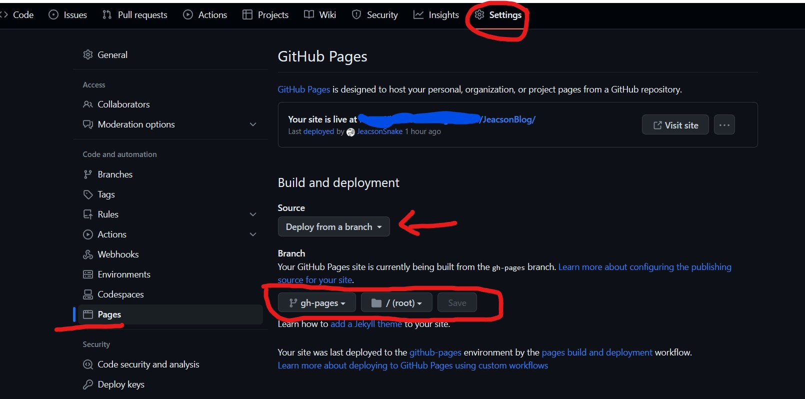

## 简述

一些在部署静态页面时踩坑后的总结向文章。

## 一、使用 Github Actions 将静态资源网页部署到Github Pages

### 1. 关于 GITHUB_TOKEN 权限

前提: 在创建 .github/workflow/docs.yml 文件之后针对内部配置进行了相关修订。

出现问题: 在使用 Github Actions 后 workflow 出现以下报错:

原因: workflow 在部署代码到 gh-pages 分支时需要对默认的 secrets.GITHUB_TOKEN 进行读写操作，但是仓库默认没有给予相关权限。

解决方法: 配置默认 GITHUB_TOKEN 权限。

以下引用自官方文档^[ [为存储库设置 GITHUB_TOKEN 的权限 - GitHub 文档](https://docs.github.com/zh/repositories/managing-your-repositorys-settings-and-features/enabling-features-for-your-repository/managing-github-actions-settings-for-a-repository#setting-the-permissions-of-the-github_token-for-your-repository) ]

> 默认情况下，当你在个人帐户中创建新存储库时，GITHUB_TOKEN 仅对 contents 和 packages 范围具有读取权限。 如果在组织中创建新存储库，则设置继承自组织设置中配置的内容。
>
> 在 GitHub.com 上，导航到存储库的主页。
>
> 在存储库名称下，单击 “设置”。 如果看不到“设置”选项卡，请选择  下拉菜单，然后单击“设置” 。
>
> 存储库标头的屏幕截图，其中显示了选项卡。 “设置”选项卡以深橙色边框突出显示。
>
> 在左侧边栏中，单击 “操作”，然后单击“常规” 。
>
> 在“工作流权限”下，选择是要让 GITHUB_TOKEN 对所有范围具有读写访问权限（允许设置），还是仅对 contents 和 packages 范围具有读取访问权限（受限设置）。
>
> 单击“保存”以应用设置。

### 2. 关于 Github Pages 源路径切换

前提: 经过上述操作后, Github Actions 成功运行。

出现问题: 即使声称已经成功对该网页进行部署，但是实际上并没有在指定的域名下找到对应的网页。

原因: 在使用该 workflow 进行项目打包后, 需要将 Github Pages 源路径切换至被打包的文件所在路径才可以获取到对应信息。

解决方法:

- 首先将项目自身setting中 Code and automation 下的 Pages>Build and deployment选项，修改Source为" Deploy from a branch"

- 然后将路径进行修改，如下图红圈:

