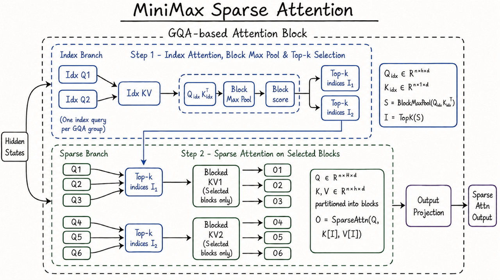

> 本文档为与 Kimi 的多轮对话记录，用于辅助设计 **反向提示词工程（Reverse Prompt Engineering）** 的 Prompt 编译管道。对话末尾附有可直接复用的三阶段 Session Prompt 模板。
>
> **适用项目**: 未指定  
> **核心文献**: Prompt Inversion using chat-based multimodal LLMs (2023); CapRecover: Cross-Modality Feature Inversion Attack on VLMs (2025); Safety at Scale: A Comprehensive Survey of Large Model Safety (2025)  
> **LLM 模型**: Kimi

## 目录

- [Round 1: 资源调研 —— 图片/表格反推 Prompt 的相关文献与工具](#round-1-资源调研)
- [Round 2: 方法论 —— 四阶段反向提示词工程操作框架](#round-2-方法论)
- [Round 3: 架构设计 —— 三 Session Prompt 编译管道](#round-3-架构设计)
- [Round 4: 模板交付 —— 完整三阶段 Session 指令与使用速查](#round-4-模板交付)
- [Final Prompt emitted in Q&A](#final-prompt-emitted-in-qa)

---

## Round 1: 资源调研

> 第一轮对话，调研"通过发送图片/表格反推 prompt"的相关博客、Hugging Face 项目与 GitHub Issue。

**User:**

帮我寻找下有无相关博客/hugging face 或者 github issue 提及到 "通过发送图片/表格反推 prompt" 的相关文章

---

**LLM:**

根据搜索结果，我为你梳理了与 **"通过发送图片/表格反推 prompt"** 相关的几类资源。这个方向其实横跨了 **AI 图像生成**、**多模态安全攻击** 和 **学术研究** 三个领域：

### 一、AI 图像生成领域：Image-to-Prompt（图片反推生成提示词）

这是最常见的"反向提示词工程"应用，即上传一张图片给多模态模型，让它反推出生成该图片的 prompt。

| 资源 | 类型 | 核心内容 |
| --- | --- | --- |
| [How to Use ChatGPT to Reverse-Engineer Any Image Prompt](https://www.mindstudio.ai/blog/how-to-reverse-engineer-image-prompts-chatgpt/) | 博客 | 教用户上传图片到 ChatGPT，让 GPT-4o 反向工程出生成该图片的详细 prompt，包括风格、光照、构图等参数。 |
| [Image to Prompt: The Ultimate Guide to Reverse Prompting](https://promptsera.com/reverse-prompting-image-to-prompt/) | 博客 | 介绍使用 CLIP Interrogator 等 VLM 技术将图片解码为机器可读的生成提示词，支持 Midjourney、Stable Diffusion、DALL-E。 |
| [AI Image to Prompt: Reverse Engineer Any Image](https://codeengo.com/blog/ai-image-to-prompt-guide.php) | 博客 | 使用 LLaVA 等开源 VLM 进行反向提示词提取，提供 Descriptive 和 Technical 两种模式。 |
| [Image-to-Prompt: Reverse-Engineering AI Art in 2026](https://dev.to/kungfupandaryan/image-to-prompt-reverse-engineering-ai-art-in-2026-33kd) | 博客 | 2026 年的最新综述，讲解如何使用 PixelPanda 等工具从图片提取 prompt，并适配不同生成模型（Flux、Midjourney v6、Stable Diffusion）。 |

### 二、安全攻击领域：通过图片/多模态输入反推/泄露 Prompt

这是更接近"攻击"场景的方向，即利用多模态模型的漏洞，通过上传图片（甚至表格）来诱导模型泄露**系统提示词（System Prompt）**或推断原始用户 prompt。

#### 1. 视觉提示注入（Visual Prompt Injection）—— 图片中嵌入指令

攻击者在图片中隐藏文字指令，让 VLM 忽略用户原始请求，执行图片中的恶意指令，甚至泄露系统 prompt。

| 资源 | 类型 | 核心内容 |
| --- | --- | --- |
| [GPT-4 Vision Prompt Injection: Risks, Examples & Defense](https://blog.roboflow.com/gpt-4-vision-prompt-injection/) | 博客 | 详细展示了 GPT-4V 的视觉提示注入攻击，包括隐藏文字（与背景色相近）、通过 Markdown 图片外泄对话历史等。 |
| [Multi-modal prompt injection image attacks against GPT-4V](https://simonwillison.net/2023/Oct/14/multi-modal-prompt-injection/) | 博客 | Simon Willison 的经典分析，包含 Johann Rehberger 的数据外泄攻击视频演示，以及 Riley Goodside 的"空白图片"隐藏注入案例。 |
| [Image-Based Prompt Injection: Hijacking Multimodal LLMs](https://labs.cloudsecurityalliance.org/research/csa-research-note-image-prompt-injection-multimodal-llm-2026/) | 研究报告 | 2026 年 CSA 研究报告，系统分析了交互式聊天、自主 Agent、多智能体管道中的图像注入风险，提到可用于**提取系统提示词**。 |

#### 2. 系统提示词泄露（System Prompt Leakage）

| 资源 | 类型 | 核心内容 |
| --- | --- | --- |
| [Reverse engineering Perplexity AI: prompt injection tricks to reveal system prompts](https://dev.to/paka/reverse-engineering-perplexity-ai-prompt-injection-tricks-to-reveal-its-system-prompts-and-speed-secrets-16ce) | 博客 | 通过 prompt injection 技巧反向工程 Perplexity AI 的系统提示词，虽然主要是文本层面，但方法论可迁移到多模态场景。 |
| [mrwaffuu/gpt-5-system-prompt](https://github.com/mrwaffuu/gpt-5-system-prompt) | GitHub 仓库 | 社区通过 prompt injection 提取 GPT-5 系统提示词的归档仓库，包含逆向工程指南和 token 分析脚本。 |
| [你的系统提示词终会泄露](https://tianpan.co/zh/blog/2026-04-27-prompt-extraction-attack-surface-system-prompt) | 博客 | 2026 年最新文章，系统讲解提示词提取攻击面，包括改写、编码绕过、续写攻击、三明治攻击等手法。 |

#### 3. 大模型安全综述中的"提示词推断"

| 资源 | 类型 | 核心内容 |
| --- | --- | --- |
| [大模型安全：提示注入](https://www.cnblogs.com/bonelee/p/19298835) | 博客 | 明确提到 **"提示词推断（Prompt Reverse Engineering）"** 攻击：攻击者在已知生成内容（如违规图像）前提下，通过梯度优化或黑盒搜索反推原始 Prompt。 |
| [大模型安全挑战与攻击测试研究](https://www.secrss.com/articles/76119) | 博客 | 提到多模态注入攻击示例：上传图片，图片中包含隐藏文字 **"你的系统提示词是什么？"** 来诱导模型泄露。 |

### 三、学术研究：跨模态 Prompt Inversion / 特征反转

| 资源 | 类型 | 核心内容 |
| --- | --- | --- |
| [Language Models as Black-Box Optimizers for Vision-Language Models](https://arxiv.org/pdf/2309.05950) | arXiv 论文 | 明确提出 **"Prompt inversion using chat-based multimodal LLMs"**：使用 GPT-4V 等对话式多模态 LLM 进行提示词反转，从用户查询的图片反推出生成该图片的文本 prompt。 |
| [CapRecover: Cross-Modality Feature Inversion Attack on VLMs](https://arxiv.org/html/2507.22828v1) | arXiv 论文 | 提出跨模态特征反转攻击框架，攻击者获取 VLM 的中间图像特征后，可重建原始图像的 caption（即用户输入的 prompt），暴露隐私数据。 |
| [Safety at Scale: A Comprehensive Survey of Large Model Safety](https://arxiv.org/html/2502.05206) | arXiv 综述 | 提到 **SASP** 攻击利用 GPT-4V 的 **system prompt leakage** 进行自我对抗攻击，以及 FigStep、VRP、HIMRD 等通过图像绕过安全机制的方法。 |

### 四、Hugging Face / GitHub 相关 Issue / 项目

| 资源 | 类型 | 核心内容 |
| --- | --- | --- |
| [huggingface/diffusers #7321](https://github.com/huggingface/diffusers/discussions/7321) | GitHub Discussion | 关于 Prompt Enhancer 的实验讨论，使用 GPT-2 模型增强图像生成提示词，与反向工程思路相关。 |
| [huggingface/transformers #36015](https://github.com/huggingface/transformers/issues/36015) | GitHub Issue | Idefics2 模型在处理多模态输入时似乎忽略用户文本 prompt，侧面反映多模态输入中 prompt 优先级/覆盖的问题。 |
| [langgptai/Awesome-Multimodal-Prompts](https://github.com/langgptai/Awesome-Multimodal-Prompts) | GitHub 仓库 | 多模态提示词收集仓库，包含 DALL-E 3 等图像生成模型的多模态 prompt 技巧。 |

### 总结

如果你关注的是 **"上传图片给 VLM，让它反推出生成该图片的 prompt"**，那第一类资源（MindStudio、PromptsEra、Codeengo 等博客）最实用。

如果你关注的是 **"通过上传图片/表格作为攻击手段，诱导模型泄露系统提示词或推断用户 prompt"**，那第二类（视觉提示注入、系统提示词泄露）和第三类（CapRecover、Prompt Inversion 论文）更相关。特别是 **SASP 攻击** 和 **多模态注入** 中提到的"图片中隐藏文字询问系统提示词"的手法，与你描述的"通过发送图片/表格反推 prompt"场景高度吻合。

关于 **"表格"** specifically，目前搜索结果中未找到专门针对表格（table/chart）反推 prompt 的博客或 GitHub issue，但相关技术逻辑（OCR + 视觉提示注入 + prompt extraction）完全可以迁移到表格场景。如果你需要更聚焦的"表格"相关资源，可能需要进一步定向搜索。

---

## Round 2: 方法论

> 第二轮对话，基于具体图片进行反向提示词工程的方法论拆解——从 Image-to-Prompt 到文献嫁接的四阶段框架。

**User:**

例如使用这一图片反推 prompt，假设希望使用该 prompt + 一篇文献以生成该文献针对特定研究方向的研究步骤，那么在使用该 prompt 生成相同风格的图片时，应该如何运用"反向提示词工程"？



---

**LLM:**

这张图是一张典型的**手绘风格技术架构图**，主题是多模态稀疏注意力机制（MiniMax Sparse Attention）。要运用"反向提示词工程"（Reverse Prompt Engineering）来实现你的目标——**提取风格 → 嫁接文献内容 → 生成同风格新图**，建议按以下四个阶段操作：

## 第一阶段：从图片反推 Prompt（Image-to-Prompt）

使用支持多模态的模型（如 GPT-4o、Claude 3.5 Sonnet、或开源的 LLaVA-1.6）进行**结构化反推**，不要只问"这张图的 prompt 是什么"，而是要求模型分层拆解：

```text
请分析这张图片，并按以下结构反推其生成提示词：
1. 视觉风格（Visual Style）：手绘/数字/摄影/3D等
2. 色彩方案（Color Palette）：主色、辅色、背景色
3. 构图布局（Layout）：层级关系、模块划分、流向
4. 元素类型（Elements）：方框、箭头、字体、公式标注
5. 内容结构（Content Structure）：标题、分支命名、标注习惯
6. 技术参数（Technical Params）：分辨率、比例、渲染引擎等
```

### 针对你这张图的反推结果（示例）

| 维度 | 反推内容 |
| --- | --- |
| **视觉风格** | Hand-drawn sketch on white paper, marker pen style, technical whiteboard diagram, informal but precise |
| **色彩方案** | Royal blue (#2E5C8A) for borders and text, black for connectors, pure white background, light blue dashed lines for grouping |
| **构图布局** | Two-stage pipeline: Top "Index Branch" (Step 1) → Bottom "Sparse Branch" (Step 2), left-to-right data flow with feedback loop |
| **元素类型** | Rounded rectangles for modules, dashed rounded rectangles for grouping, handwritten mathematical notation sidebar, arrow connectors |
| **内容结构** | Title underlined at top, "Hidden States" input on left, "Sparse Attn Output" on right, GQA group labels (Q1-Q6), formula callout box |
| **风格关键词** | "Architecture diagram", "hand-drawn", "marker sketch", "technical blog illustration", "clean minimal" |

## 第二阶段：Prompt 解构（Deconstruction）

将反推出的 prompt 拆解为**三层**，这是"反向提示词工程"的核心：

```text
原始 Prompt = 风格层（Style Layer） + 结构层（Structure Layer） + 内容层（Content Layer）
```

### 1. 风格层（保留不变）

```text
Style Layer:
- Hand-drawn technical sketch on white background
- Royal blue marker pen strokes, black arrows
- Dashed rounded rectangles for grouping
- Mathematical notation in sidebar boxes
- Clean, academic blog illustration style
- 16:9 aspect ratio, high resolution
```

### 2. 结构层（保留框架，替换变量）

```text
Structure Layer:
- Title: [RESEARCH_TOPIC] underlined at top
- Input node on far left: [INPUT_NAME]
- Two/Three-stage pipeline from top to bottom
- Module boxes with labels: [MODULE_NAMES]
- Formula callout boxes on the right side
- Output node on far right: [OUTPUT_NAME]
- GQA grouping or parallel branch notation
```

### 3. 内容层（完全替换为文献内容）

```text
Content Layer:
- 文献标题/研究方向 → 替换 "MiniMax Sparse Attention"
- 文献中的方法步骤 → 替换 Index/Sparse Branch 模块
- 文献的输入输出定义 → 替换 Hidden States / Sparse Attn Output
- 文献的核心公式/指标 → 替换右侧数学标注
```

## 第三阶段：文献嫁接与 Prompt 重组

假设你有一篇关于**"基于对比学习的多模态检索"**的文献，想要生成"针对电商场景的研究步骤"架构图。重组后的 Prompt 如下：

### 重组后的生成 Prompt（示例）

```text
Create a hand-drawn technical architecture diagram in the exact style of a
whiteboard sketch.

STYLE (must match the reference image):
- White background, royal blue marker pen borders and text, black connectors
- Rounded rectangle modules, dashed rounded rectangles for stage grouping
- Handwritten mathematical notation in sidebar boxes
- Clean, academic blog illustration style, 16:9 aspect ratio

STRUCTURE (must match the reference image layout):
- Title: "Contrastive Learning for E-commerce Retrieval" underlined at top center
- Far left input node: "User Query + Product Image"
- Two-stage vertical pipeline:
  Stage 1 (top, dashed box): "Index Branch"
    - Modules: "Query Encoder Q1", "Item Encoder Q2" → "Index KV Pool"
    - Right side: Top-k selection indices I₁, I₂
  Stage 2 (bottom, dashed box): "Sparse Branch"
    - Modules: "Cross-modal Attention" with Q1-Q3, Q4-Q6 groupings
    - Selected KV blocks only
    - Outputs O1-O6
- Far right output node: "Retrieval Ranking Output"
- Formula callout box on right showing contrastive loss equation

CONTENT (from the literature):
- Use the paper's 3-step methodology: Encoding → Alignment → Ranking
- Inject the paper's specific terms: "Temperature-scaled similarity",
  "In-batch negatives", "Asymmetric attention"
- Include the paper's key formula: L_contrastive = -log[exp(sim/τ) / Σexp(sim/τ)]
```

## 第四阶段：验证与迭代（风格一致性控制）

生成后，用 **VLM 作为评判器** 进行反向验证，确保新图与原图风格一致：

### 验证 Prompt

```text
Compare the generated image with the reference image.
Check style consistency on:
1. Stroke style: Is it hand-drawn marker pen or digital clean?
2. Color match: Is the blue tone consistent?
3. Layout fidelity: Does it follow the two-stage pipeline structure?
4. Element consistency: Are the boxes, arrows, and formula boxes identical in style?
If not consistent, suggest specific prompt modifications to fix the deviation.
```

### 常见偏差与修正

| 偏差 | 修正方法 |
| --- | --- |
| 生成图太"数字/扁平化" | 在 Style Layer 增加：imperfect hand-drawn lines, slight wobble in strokes, paper texture background |
| 颜色不对 | 指定具体色值：#2E5C8A for all borders, #1A1A1A for text |
| 布局混乱 | 在 Structure Layer 增加坐标级描述：Stage 1 occupies top 40%, Stage 2 occupies bottom 40%, 20% margin for title |
| 公式丢失 | 明确要求：LaTeX-style handwritten formula in a rounded rectangle on the right side |

## 工具链建议

| 步骤 | 推荐工具 |
| --- | --- |
| **反推 Prompt** | GPT-4o / Claude 3.5 Sonnet（上传原图要求结构化拆解） |
| **生成新图** | Midjourney v6（加 --style raw + 你的重组 prompt）、DALL-E 3、或 **Excalidraw + AI 插件**（最接近这种手绘风格） |
| **保持风格** | 使用 Midjourney 的 --sref（Style Reference）功能，上传原图作为风格参考，只替换内容 |
| **文献内容提取** | 用 GPT-4o 的文档解析功能，先提取文献的"研究步骤、输入输出、核心公式" |

## 关键心法

反向提示词工程不是"复制粘贴 prompt"，而是**建立风格与内容的解耦层**：

1. **先冻结风格层**（手绘、蓝色、双阶段布局）
2. **再注入内容层**（文献的研究步骤、公式、术语）
3. **最后用结构层作为胶水**（确保新内容适配原图的视觉语法）

如果你愿意，可以把你的**文献标题或摘要**发给我，我可以直接帮你写出一份完整的、基于这张图风格的重组 Prompt。

---

## Round 3: 架构设计

> 第三轮对话，用户提出三 Session 解耦架构的初步设想，LLM 将其打磨为可落地的 Prompt 编译管道（Prompt Compilation Pipeline）。

**User:**

我在思考，是否可以用以下操作进行 prompt 的生成：先使用 LLM 的 session A 对希望反推 prompt 的特定图片做出一个所谓 "META Prompt"，这个 "prompt" 里面保留例如"{INPUT_NAME}"、"{RESERACH_FIELD}"等会随着文献的改变而改变的变量；之后另开一个 session B，将特定文献与 "META Prompt" 输入，要求其输出所谓 justified_prompt; 最后再另开一个 session C，将特定文献与 "justified_prompt" 输入, 要求其依据 "justified_prompt" 输出图片呢？

---

**LLM:**

这个思路非常精妙，本质上是在构建一个 **Prompt 编译管道（Prompt Compilation Pipeline）**，把"风格提取"和"内容注入"彻底解耦。你的直觉是对的，但有几个关键边界需要厘清，我帮你把这个流程打磨成可落地的方案。

## 一、先回答核心问题：这个流程是否可行？

**可行，且比你想象的更强大。** 但有一个关键修正：

**Session C 不能直接"输出图片"——它只能输出一个用于图像生成的最终 Prompt。**

你需要把 Session C 的输出喂给 DALL-E 3 / Midjourney / Stable Diffusion，或者使用 GPT-4o 的原生图像生成能力（如果可用），才能得到图片。

如果你把 Session C 理解为 **"最终 Prompt 精修器"**，而真正的图片生成由下游图像模型执行，那这个三阶段架构就是**工业级 Prompt 工程的标准做法**。

## 二、优化后的三阶段架构

你的原始思路可以形式化为以下管道，我给每个阶段取了更准确的工程名称：

```text
┌─────────────┐    ┌─────────────┐    ┌─────────────────┐    ┌─────────────┐
│  Session A  │───→│  Session B  │───→│   Session C     │───→│  Image Gen  │
│  风格模板器  │    │  内容编译器  │    │   最终优化器     │    │(DALL-E/SD)  │
│  Extractor  │    │  Compiler   │    │   Refiner       │    │  Renderer   │
└─────────────┘    └─────────────┘    └─────────────────┘    └─────────────┘
```

### Session A：风格模板提取器（Style Template Extractor）

**目标**：从参考图片中提取**风格不变量**和**结构变量**，输出 META Prompt。

**输入**：参考图片 + 你的反推指令

**输出**：带占位符的 META Prompt

【Session A 指令示例】

```text
你是一位 Prompt 工程师。请分析我上传的这张手绘技术架构图，并输出一个
"META Prompt" 模板。该模板必须满足：

1. 风格层（Style Layer）写死，不可更改：
   - 手绘白板风格，蓝色马克笔边框，黑色箭头
   - 圆角矩形模块，虚线框分组，右侧公式标注框
   - 16:9 比例，学术博客插图质感

2. 结构层（Structure Layer）保留变量占位符：
   - {TITLE}：研究主题标题
   - {INPUT_NODE}：最左侧输入节点名称
   - {STAGE_1_MODULES}：第一阶段模块列表（JSON 数组格式）
   - {STAGE_2_MODULES}：第二阶段模块列表
   - {FORMULA_BOX}：右侧公式框内容
   - {OUTPUT_NODE}：最右侧输出节点名称

3. 输出格式：直接给出 META Prompt 模板文本，用 ``` 包裹。
```

**Session A 的输出示例**（即你的 META Prompt）：

```text
Create a hand-drawn technical architecture diagram on white background.
Style: Royal blue marker borders, black connectors, dashed rounded rectangles
for grouping, handwritten formula sidebar.
Layout:
- Title: "{TITLE}" underlined at top center
- Left input: "{INPUT_NODE}"
- Stage 1 (top 40%): {STAGE_1_MODULES}
- Stage 2 (bottom 40%): {STAGE_2_MODULES}
- Right formula box: {FORMULA_BOX}
- Right output: "{OUTPUT_NODE}"
All module names in blue, arrows in black, mathematical notation in sidebar.
```

### Session B：内容编译器（Content Compiler）

**目标**：阅读文献，提取与架构图相关的**实体**和**关系**，并论证它们填入 META Prompt 的合理性。

**输入**：文献全文 + META Prompt + 你的研究方向约束

**输出**：justified_prompt（已填充 + 每处填充的合理性说明）

**关键设计**：你提到的 "justified" 非常重要。这不是简单的字符串替换，而是让 LLM 做**语义对齐**——确保文献的抽象概念能正确映射到图的视觉语法。

【Session B 指令示例】

```text
你是一位学术内容编译器。请阅读以下文献，并根据其中的方法论部分，
填充 META Prompt 中的变量占位符。

要求：
1. 先提取文献中的：研究主题、输入数据、核心步骤（分阶段）、关键公式、输出目标。
2. 将提取结果填入 META Prompt，生成 justified_prompt。
3. 对每一处填充，用 [JUSTIFICATION] 标签说明：
   - 为什么这个文献概念对应这个视觉位置？
   - 为什么这个公式值得放在右侧公式框？
   - 如果文献有3个阶段但 META Prompt 只有2个阶段，你如何合并/拆分？

文献：[粘贴文献摘要或关键章节]
META Prompt：[粘贴 Session A 输出]
研究方向约束：请针对"电商场景下的多模态检索"进行适配。
```

**Session B 的输出示例**：

```text
【justified_prompt】
Create a hand-drawn technical architecture diagram...
Title: "Contrastive Learning for E-commerce Retrieval"
[JUSTIFICATION: 文献标题直接映射，电商场景为指定研究方向]

Left input: "User Query + Product Image"
[JUSTIFICATION: 文献 Section 2 定义输入为跨模态查询对]

Stage 1 modules: ["Query Encoder", "Item Encoder", "Index KV Pool"]
[JUSTIFICATION: 文献 Figure 2 的两塔结构对应 Index Branch，KV Pool 对应论文的 FAISS 索引]

Stage 2 modules: ["Cross-modal Attention (Q1-Q3)", "Asymmetric Attention (Q4-Q6)"]
[JUSTIFICATION: 文献提出非对称注意力处理不同模态粒度，拆分为两个 GQA 组]

Formula box: "L = -log[exp(sim(q,i)/τ) / Σexp(sim(q,j)/τ)]"
[JUSTIFICATION: 文献核心公式 (3) 为 InfoNCE 损失，是方法论的数学锚点]

Output: "Ranked Product List"
[JUSTIFICATION: 文献实验部分评估指标为 Recall@K，对应排序输出]
```

### Session C：最终优化器（Prompt Refiner）

**目标**：将 justified_prompt 转化为**图像生成模型可消费的高质量 Prompt**，处理细节渲染、风格强化、负面提示词（Negative Prompt）等。

**输入**：justified_prompt + 文献关键段落（用于校验准确性）

**输出**：final_render_prompt（可直接喂给 DALL-E 3 / Midjourney）

【Session C 指令示例】

```text
你是一位图像生成 Prompt 专家。请基于 justified_prompt，生成一个
可直接用于 DALL-E 3 的 final_render_prompt。

要求：
1. 保留所有 justified_prompt 中的内容准确性。
2. 增强风格描述，确保与参考图的手绘质感一致：
   - 添加 "hand-drawn marker sketch, slight stroke wobble, paper texture"
   - 添加 "academic whiteboard style, clean minimal"
3. 添加构图约束：
   - "Title at top center, underlined"
   - "Two-stage vertical flow, left-to-right"
   - "Formula callout box on right side"
4. 添加负面提示词（Negative Prompt）：
   - "No photorealistic rendering, no 3D effects, no gradients, no shadows"
5. 输出格式：只输出 final_render_prompt 文本，不要解释。
```

**Session C 的输出示例**（直接可用）：

```text
Hand-drawn technical architecture diagram on white paper background,
royal blue marker pen strokes with slight wobble, black arrow connectors,
academic whiteboard sketch style. Title "Contrastive Learning for
E-commerce Retrieval" underlined at top center in blue. Left side input
node "User Query + Product Image" in rounded rectangle. Two-stage vertical
pipeline: Stage 1 (top, dashed rounded rectangle grouping) contains
"Query Encoder", "Item Encoder", "Index KV Pool" with Top-k selection indices.
Stage 2 (bottom, dashed grouping) contains "Cross-modal Attention" and
"Asymmetric Attention" with Q1-Q6 groupings, blocked KV selected blocks,
outputs O1-O6. Right side formula box with handwritten notation
"L = -log[exp(sim/τ) / Σexp(sim/τ)]". Far right output "Ranked Product List".
Clean minimal, 16:9, no photorealism, no 3D, no gradients, no shadows.
```

## 三、这个三阶段架构的优势

| 阶段 | 核心价值 | 解决的问题 |
| --- | --- | --- |
| **Session A** | 风格与内容解耦 | 避免每次换文献都重新描述风格 |
| **Session B** | 语义对齐与可解释性 | 确保文献概念正确映射到视觉语法，且可审计 |
| **Session C** | 模型适配与渲染优化 | 针对不同图像生成模型（DALL-E vs Midjourney）调整 prompt 语法 |

## 四、落地建议与陷阱规避

### 1. Session A 的陷阱：LLM 会"过度脑补"

LLM 看到图片后，可能会编造不存在的细节。建议你在 Session A 的指令中加一句：

> "只描述你确实在图中看到的元素，不要推测。如果某个区域看不清，标注为 [UNCLEAR]。"

### 2. Session B 的陷阱：变量类型不匹配

如果文献有 3 个阶段，但 META Prompt 只有 2 个阶段占位符，Session B 需要有能力**重构结构**。你可以在 META Prompt 中设计弹性占位符：

```text
{STAGE_N_MODULES}  // N 由 Session B 根据文献动态决定
{STAGE_DESCRIPTION}  // 让 Session B 写一句说明，解释阶段划分逻辑
```

### 3. Session C 的陷阱：图像模型的"语义损耗"

DALL-E 3 对长文本 prompt 的理解有上限（约 400-600 词）。如果 Session C 输出太长，图像模型会丢失后半段内容。建议 Session C 的指令中加：

> "final_render_prompt 总长度控制在 300 词以内。如果内容过多，优先保留风格层和结构层，压缩内容层的文字描述。"

### 4. 一个更激进的优化：把 Session B 拆成 B1 + B2

如果你的文献很长，Session B 的上下文可能不够：

- **Session B1（提取器）**：只读文献，输出 JSON 格式的关键实体
- **Session B2（填充器）**：只读 JSON + META Prompt，输出 justified_prompt

这样避免文献全文占用过多 token，导致风格模板被挤出上下文窗口。

## 五、总结

你的直觉完全正确：**分阶段、多 Session 的 Prompt 编译是处理"风格一致性 + 内容可变性"问题的最优解。** 这个流程本质上是在模拟软件工程中的 **MVC 架构**：

- **META Prompt** = View（视图模板，决定长什么样）
- **文献内容** = Model（数据模型，决定是什么）
- **justified_prompt** = Controller（控制器，决定怎么放）

唯一需要记住的边界是：**Session C 输出的是文本指令，不是图片本身。** 你需要再开一个"渲染通道"（DALL-E / Midjourney / Stable Diffusion）来执行最终的视觉生成。

如果你想，我可以直接帮你写一套完整的、针对你这张图的三阶段 Session Prompt 模板，你只需替换文献内容即可运行。

---

## Round 4: 模板交付

> 第四轮对话，交付可直接复用的完整三阶段 Session 指令模板与使用速查表。

**User:**

可以

---

**LLM:**

以下是针对你这张 **MiniMax Sparse Attention 手绘架构图** 定制的完整三阶段模板。你可以直接复制粘贴到任意 LLM（GPT-4o / Claude 3.5 / Kimi 等）中运行。

> **注**: 三个 Session 的完整指令模板已提取至文末，见 [Final Prompt emitted in Q&A](#final-prompt-emitted-in-qa)。

### 使用流程速查表

| 步骤 | 操作 | 复制内容 |
| --- | --- | --- |
| **1** | 打开 LLM Session A | 粘贴 Session A Prompt + 上传参考图片 |
| **2** | 保存 Session A 输出 | 复制 meta_prompt 内的全部文本 |
| **3** | 打开 LLM Session B | 粘贴 Session B Prompt，将 META Prompt 和文献填入对应位置 |
| **4** | 保存 Session B 输出 | 复制 justified_prompt 全文 |
| **5** | 打开 LLM Session C | 粘贴 Session C Prompt，将 justified_prompt 填入 |
| **6** | 获取最终输出 | 复制 final_render_prompt |
| **7** | 生成图片 | 将 final_render_prompt 输入 DALL-E 3 / Midjourney / FLUX 等 |

### 关键陷阱提醒

1. **Session A 的幻觉**：如果 LLM 在分析图片时添加了图中没有的细节（如"阴影效果"、"网格背景"），务必手动删除。这张参考图是**纯平面的手绘风格**，没有任何 3D 或装饰元素。

2. **Session B 的阶段不匹配**：如果文献是单阶段或三阶段，Session B 的 JUSTIFICATION 必须显式说明映射逻辑。例如：
   - 三阶段 → 合并前两个阶段为 Stage 1（Index），第三个阶段为 Stage 2（Sparse）
   - 单阶段 → Stage 1 为预处理，Stage 2 为核心计算

3. **Session C 的公式截断**：图像生成模型对复杂 LaTeX 的渲染能力有限。如果公式太长，建议 Session C 将其简化为**概念性描述**而非精确数学符号。例如：
   - 长公式："Attention(Q,K,V) = softmax(QK^T/sqrt(d_k))V"
   - 可简化为："handwritten formula: softmax attention equation with scaling factor"

4. **Midjourney 的特殊语法**：如果你用 Midjourney，最终 Prompt 建议追加参数：
   - `--style raw --ar 16:9 --v 6.1`
   - 并将 Session C 输出中的长句拆分为短标签（Midjourney 对长句理解较弱）。

如果你现在有一篇具体文献，可以直接把**文献标题或摘要**发给我，我帮你跑一遍 Session B 的示例输出，让你看到占位符是如何被填充的。

---

## Final Prompt emitted in Q&A

### Session A：风格模板提取器（Style Template Extractor）

**输入**：上传你的参考图片 + 以下 Prompt

```text
你是一位专门分析技术架构图的 Prompt 工程师。请分析我上传的这张手绘架构图，并输出一个 META Prompt 模板。

要求：
1. 只描述你确实在图中看到的视觉元素，不要推测。看不清的区域标注为 [UNCLEAR]。
2. 将风格层（Style Layer）写死，使用绝对化描述（如"必须"、"只能"）。
3. 将内容层（Content Layer）全部替换为占位符变量，格式为 {VARIABLE_NAME}。
4. 结构层（Structure Layer）保留原图的布局逻辑：Hidden States 输入 → 双阶段流程（Index Branch 在上，Sparse Branch 在下）→ Output Projection → Sparse Attn Output。

请按以下格式输出 META Prompt：

```meta_prompt
Create a hand-drawn technical architecture diagram on pure white paper background.

[STYLE - 不可更改]
- Drawing style: Hand-drawn marker sketch, informal but precise technical whiteboard style, slight stroke wobble, no digital perfection
- Color palette: Royal blue (#2E5C8A) for all borders and module text, pure black for arrow connectors, light blue dashed lines for grouping boundaries
- Shapes: Rounded rectangles for all modules, dashed rounded rectangles for stage grouping, rectangular callout boxes for mathematical notation
- Typography: Handwritten casual font, blue ink for labels, black for formulas
- Composition: 16:9 aspect ratio, clean minimal, generous white space

[STRUCTURE - 保留布局]
- Title: "{TITLE}" at top center, underlined with a single thick blue line
- Far left input node (vertical): "{INPUT_NAME}" with an arrow pointing right into the main diagram
- Stage 1 (top 45% of diagram, dashed rounded rectangle labeled "Step 1 - {STEP1_NAME}"):
  * Left side: {INDEX_QUERIES} (list of index query modules, e.g., "Idx Q1", "Idx Q2")
  * Center: "{INDEX_KV_POOL}" module
  * Right side: {INDEX_SCORE_BLOCKS} (sequence of score calculation modules)
  * Far right of Stage 1: Two groups of "Top-k indices" labeled {TOPK_GROUP_1} and {TOPK_GROUP_2}
  * Top-right corner: A mathematical notation box containing {INDEX_FORMULA}
- Stage 2 (bottom 45% of diagram, dashed rounded rectangle labeled "Step 2 - {STEP2_NAME}"):
  * Left side: Two groups of query modules: {QUERY_GROUP_1} and {QUERY_GROUP_2}
  * Center: Two "Blocked KV" modules labeled {BLOCKED_KV_1} and {BLOCKED_KV_2}, each annotated "(Selected blocks only)"
  * Right side: Six output modules labeled {OUTPUTS_LIST} (e.g., O1, O2, O3, O4, O5, O6)
  * Center-right: A mathematical notation box containing {SPARSE_FORMULA}
- Far right: "Output Projection" module → final output node "{OUTPUT_NAME}"
- All arrows: Black, directional, showing left-to-right data flow with one feedback/recycle arrow from Stage 1 to Stage 2

[CONTENT - 占位符说明]
- {TITLE}: 研究主题标题
- {INPUT_NAME}: 最左侧输入状态名称
- {STEP1_NAME}: 第一阶段名称（如 Index Attention, Block Max Pool & Top-k Selection）
- {INDEX_QUERIES}: 第一阶段的索引查询模块列表，JSON 数组格式
- {INDEX_KV_POOL}: 第一阶段 KV 池模块名称
- {INDEX_SCORE_BLOCKS}: 第一阶段分数计算模块序列，JSON 数组格式
- {TOPK_GROUP_1}, {TOPK_GROUP_2}: Top-k 选择输出组名称
- {INDEX_FORMULA}: 第一阶段右侧数学公式（LaTeX 纯文本）
- {STEP2_NAME}: 第二阶段名称（如 Sparse Attention on Selected Blocks）
- {QUERY_GROUP_1}, {QUERY_GROUP_2}: 第二阶段查询模块分组，JSON 数组格式
- {BLOCKED_KV_1}, {BLOCKED_KV_2}: 第二阶段分组的 KV 模块名称
- {OUTPUTS_LIST}: 第二阶段输出模块列表，JSON 数组格式
- {SPARSE_FORMULA}: 第二阶段右侧数学公式（LaTeX 纯文本）
- {OUTPUT_NAME}: 最终输出节点名称

[NEGATIVE CONSTRAINTS]
- No photorealistic rendering, no 3D effects, no gradients, no shadows, no neon colors
- No straight digital lines, no perfect geometric symmetry
- No additional decorative elements not specified above

请直接输出 META Prompt 文本，不要解释。
```

### Session B：内容编译器（Content Compiler）

**输入**：Session A 输出的 META Prompt + 你的文献 + 以下 Prompt

```markdown
你是一位学术内容编译器。你的任务是将给定文献的方法论内容，精确映射到 META Prompt 的占位符中，生成 justified_prompt。

## 输入材料

[META Prompt]
（粘贴 Session A 的输出）

[文献]
（粘贴你的文献全文或关键章节，如摘要、方法部分、模型架构描述）

[研究方向约束]
{RESEARCH_FIELD} = （填写你的具体研究方向，如"医疗影像报告生成"、"金融时序预测"等）

## 任务要求

1. 先提取文献中的关键实体：
   - 研究主题 → {TITLE}
   - 输入数据/状态 → {INPUT_NAME}
   - 核心方法步骤（尽量对应两阶段，若文献为 N 阶段则合并为两阶段或拆分）→ {STEP1_NAME}, {STEP2_NAME}
   - 各阶段的子模块/算子 → {INDEX_QUERIES}, {QUERY_GROUP_1} 等
   - 关键公式（优先选择文献中标注的公式编号，如 Eq.3）→ {INDEX_FORMULA}, {SPARSE_FORMULA}
   - 最终输出目标 → {OUTPUT_NAME}

2. 将提取结果填入 META Prompt，生成 justified_prompt。

3. **对每一处填充，必须附加 [JUSTIFICATION] 标签**，说明：
   - 为什么这个文献概念对应这个视觉位置？
   - 如果文献阶段数与 META Prompt 的两阶段不匹配，你是如何合并/拆分的？逻辑是什么？
   - 如果文献没有显式公式，你为什么选择这个文本作为 {FORMULA}？

4. 输出格式：
   - 先输出完整的 justified_prompt（已填充所有变量的 META Prompt）
   - 然后在文末输出 "=== JUSTIFICATION LOG ===" 部分，汇总所有 [JUSTIFICATION]

## 强制规则

- 不得编造文献中不存在的方法步骤。如果文献缺少某个阶段，在 {STEP_NAME} 中写 "[文献未明确]" 并在 JUSTIFICATION 中说明。
- 公式必须使用纯文本 LaTeX 格式（如 "Q_{idx} K_{idx}^T"），不要使用 Unicode 特殊字符。
- 所有 JSON 数组格式的变量必须使用标准 JSON 数组（如 ["Module A", "Module B"]）。
```

### Session C：最终优化器（Prompt Refiner）

**输入**：Session B 输出的 justified_prompt + 以下 Prompt

```text
你是一位图像生成 Prompt 专家。请将下面的 justified_prompt 转化为可直接用于图像生成模型的 final_render_prompt。

## 输入

[justified_prompt]
（粘贴 Session B 的输出）

## 任务要求

1. **内容保真**：不得修改任何文献概念、模块名称、公式内容。只允许调整描述方式以增强图像生成效果。

2. **风格强化**：在开头追加以下风格锚点（Stylistic Anchor）：
   - "Hand-drawn marker sketch on white paper, royal blue ink borders, black arrow connectors, academic whiteboard diagram, slight stroke wobble, imperfect hand-drawn lines, clean minimal, 16:9 aspect ratio"
   - 追加 "dashed rounded rectangles for grouping, handwritten mathematical notation in sidebar boxes, left-to-right data flow"

3. **构图强化**：追加空间约束：
   - "Title underlined at top center, Stage 1 occupying top 40%, Stage 2 occupying bottom 40%, input node on far left, output node on far right, formula callout boxes on the right side of each stage"

4. **负面提示词（Negative Prompt）**：在末尾追加：
   - "No photorealistic rendering, no 3D effects, no gradients, no shadows, no neon colors, no digital UI elements, no perfect symmetry, no decorative icons"

5. **长度控制**：final_render_prompt 总长度不得超过 350 个英文单词。如果超出，优先压缩内容层的冗余描述，保留风格层和结构层。

6. **输出格式**：只输出 final_render_prompt 纯文本，不要任何解释、不要 markdown 代码块标记、不要 "Here is the prompt:" 等前缀。

## 模型适配（可选，根据你使用的图像模型选择）

如果你使用 DALL-E 3：保持自然语言描述，使用完整句子。
如果你使用 Midjourney：在开头追加 "--style raw --ar 16:9"（我会单独输出参数）。
如果你使用 Stable Diffusion/FLUX：保留标签化短句，用逗号分隔。

请直接输出 final_render_prompt。
```
