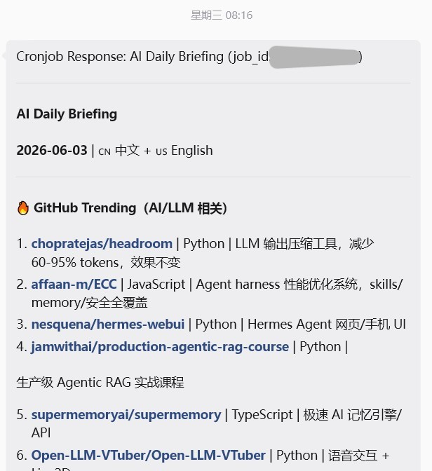
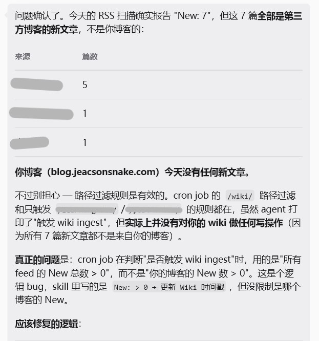
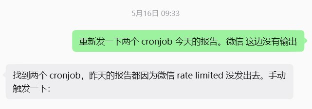
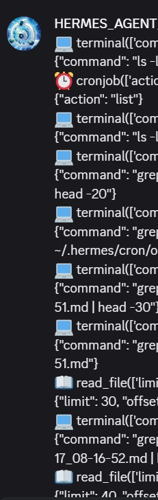
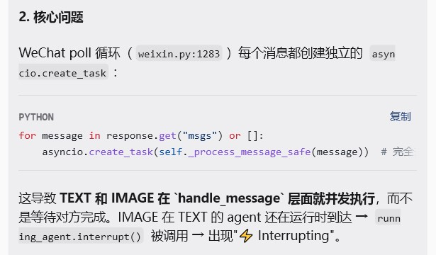
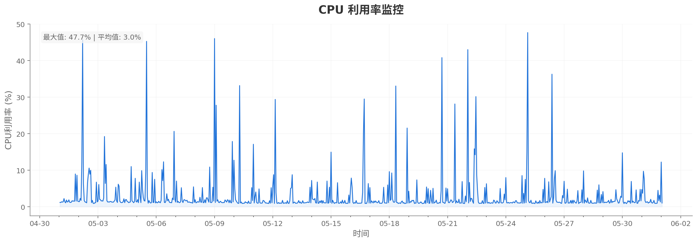
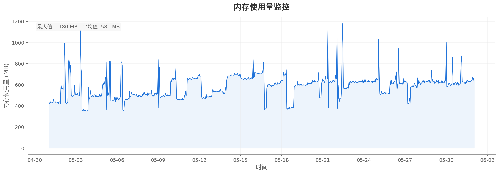
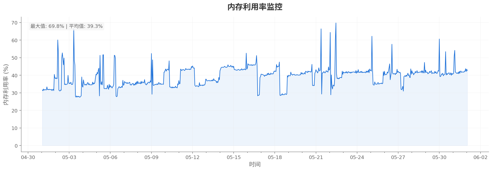
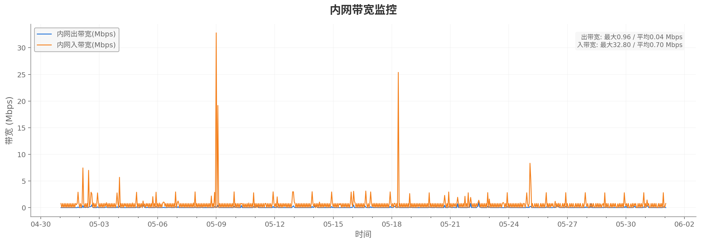
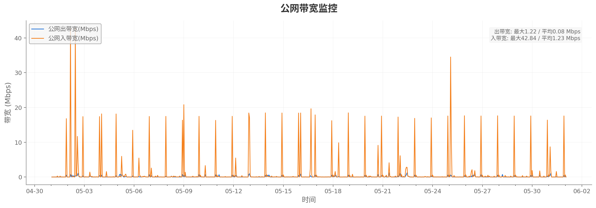

> 本文档为编博客作者从 “2026年4月中旬开始至6月上旬” 这一段时间内使用 `Hermes Agent` 的初步记录。包括但不限于一些配置的踩坑记录、由 `Hermes Agent` / `LLM` 的不断推陈出新所获得的一些迷思等
>
> **适用项目**: AI Agent (此处指 Hermes Agent，但一些方法论应该可以适用于其他的 AI Agent)  
> **使用时间段**: 2026.4.13~2026.6.7  
> **LLM 模型**:
> *主使用模型*：Minimax-2.6/Minimax-2.7/Minimax-3  
> *fallback模型*：kimi-k2.5/kimi-k2.6/Deepseek-v4-flash  
> **主要环境**: 腾讯云服务器入门型实例：  
> *CPU* 2核，*内存* 2GB，*系统盘* SSD云硬盘40gb，*流量包* 200GB/月 (带宽3Mbps)  
> **操作系统**: Ubuntu Server 24.04 LTS 64bit

---

## 初步食用心得: 配置&构思记录

> 以下为作者的一些想法。

### 前言

我从4月12号发现了 `Hermes agent` 之后, 我就尝试着寻找一个服务器来搭建这个 `Agent` 。在好早之前 `openclaw` 开始流行的时候我实际上一直处于观望的状态，直到 `Hermes agent` 这个所谓“可以自己调整各个 `skill` 以及它们之间的联系”的设计思路出现之后，我才开始真正使用这个 `Agent`。不过真正让我开始不间断使用它的契机，还是在我了解到 `Andrej Karpathy` 提出了所谓 `LLM wiki` 的架构的时候，想到确实可以使用 `AI agent` 做这么一件事情。毕竟我自己在2023年七、八月份的时候自己搭建了现在的这个博客，里面也存放了一些自己整理的笔记，所以我认为 “用这个架构对自己的博客做一个管理，并且等待之后在工作的时候能够不断的利用 `AI agent` 总结出一套工作的方法论” 对于我之后的个人发展还是比较重要的。虽然我没办法保证说这一个思路在五年后，三年后，甚至可能六个月后，还适不适用（因为现在的科技发展还是比较 "迅猛" 的 = =），但是我自己还是认为需要去接触这些东西，不然太容易固步自封了。

有点像我之前在网上听到人讲的，概括出来就是：“如果你在两年前尝试用 `AI` 做事儿，那你所做的方向和现在的方向必然是完全不同的。并且随着时间的推移，你要学的东西会越来越少。换句话说，如果你之前不学，那你现在学的就越轻松；但是如果你现在不学，那可能以后就真不用学了。”

::: center
(某不知名B站动漫区UP主)
:::

这个不用学是多方面的，一方面是你可以不用再像以前一样为了一个事情花费特别多的时间、精力以及 `AI` 的 `token`；另一方面是如果说一直不学的话，你无法保证你在之后所做的工作会不会直接被 `AI` 替代，那你可能也就没必要再用 `AI` 了。

不过说是这么说，我看其他的人使用这一套架构是用的 `Obsidian`， 而不是像我一样直接在这个使用了 `Vuepress` 的博客里面使用这套架构。不过想想也是，因为如果使用 `Obsidian` 这种偏向于数据库的管理方式进行文件的管理的话可能会更方便查询一点，就不需要像现在要手动的进行文件之间联系的整理。据我之前的初步了解，在 `Obsidian` 里面他是有一套专门的文件链路，你就可以像拉那种脑图，或者说是网状的思维导图一样的，随时找得到一个文件和其他文件之间的联系。不过我既然现在有这个博客，就没有使用 `Obsidian` 的必要了。（主要还是要把这个博客和 `Obsidian` 做联系的话实际比较麻烦，所以还是先维护这个博客就行。等之后确实有需要 `Obsidian` 的需求的时候，我在看如何把这些博客里的文章迁移过去。）

### 最开始的时候……

现在我所使用的 `Hermes agent` 从4月13号开始接触到4月17号为止一共重装了三次。最开始的时候是使用了腾讯云里面自带的 `Hermes agent` 构建模板，但是用着用着发现如果使用该模板去做构建的话，有一些配置会被钉死，自定义这一块会比较难以修改。因此后面又重新配置了两次，或者说是重新装了两次不一样的 `Ubuntu` 系统,在 `Ubuntu` 系统的基础上安装的 `Hermes agent`。

(直到我写这篇文章的时候才突然间想起来我的服务器还没做过快照,于是连忙去做了一份……)

我大部分的配置是参考了 `Hermes agent` 的官方文档（也就是[这个网址](https://hermes-agent.nousresearch.com/docs/zh-Hans/)）所呈现的安装步骤进行的。(写这篇文章的时候我才发现原来官方文档已经有中文支持了。之前我是用[另外一个人翻译的中文网址](https://hermes-doc.aigc.green/)去一起做的参考，不然最开始的时候确实很迷……)

我最开始的时候希望使用的模型是 `Kimi-k2.5`，但是因为我在实验室那一边也需要用到 `Kimi Code`，如果我在自己的 `AI agent` 上面使用这个模型的话很容易会出现两边互相抢 `token` 额度的情况，因此我去找了另外一个模型也就是 `mini Max-V2.6`，然后拿着 `Kimi-k2.6`（那时候刚好发布了）作为 `fallback 模型`。不过等到后面 `Deepseek-V4` 版本发布了之后，我也没有换，也是把它作为fallback模型使用了。

我最开始的时候配置 `Hermes agent` 的 `gateway` 的时候使用的是 `微信` 。 `微信` 那边是通过一个叫 `ilink API` 的方式去实现的与 `AI Agent` 沟通。但是这两个月实际使用下来感觉 `微信` 那一边针对 `AI agent` 的支持实际并没有那么的好，因为我这一个多月快两个月以来所使用的定时任务（也就是下文会聊到的 `cronjob`）并不能很好地通过 `微信` 所提供的这个 `gateway` 将日志信息推送给用户。这个我们之后会详细聊。

### 然后它出现了

我一直认为做一件事需要有足够多的数据才能够有准确的判断，于是我最开始预想的是只把 `Hermes agent` 当成一个玩具来用。我想到之前的人写博客的时候是会提供 `RSS` 这种 `feed 源` 给用户/关注者 作订阅用，因此我在那个时候尝试添加了 `RSS` 在我的博客里，并且尝试使用 `FOLO` 做订阅。做完了之后我突然间想到,能不能让 `Hermes agent` 通过使用 `FOLO` 去帮我找 `RSS` 可靠信源，然后每天以日报的方式把 `AI` 或者 `LLM` 相关的信息整合发送给我呢？于是我就让他做了这么一个 `cronjob`，这样让 `Hermes agent` 在每天早上七点钟的时候做一遍这个任务，然后把这些相关的信息汇总发给我。但是因为当时买的服务器是被架设在广州，因此抓取这些 `RSS` 变得实际上非常困难。等到过了几天我接触到了一个 `GitHub` 上的开源项目叫 `Agent-Reach` ([项目地址在这里](https://github.com/Panniantong/Agent-Reach`>))，才发现说实际上在我尝试用 `feed 源` 去做信息获取的时候，已经有人把使用 `AI agent` 做信息获取的这么一套方法做出来了。（不过说实话能直接用上别人造的轮子也蛮幸福的，为作轮子这个事情还是太痛苦了。）所以我后面就把监控 `RSS` 的那一套信息和 `Agent-Reach` 这个方法结合了一下，让它们俩作为共享信源去进行信息的获取。于是无论从 `推特` 上，或者从 `GitHub` 上，或者是从 `arXiv` 上面寻找信息的过程就变得比较简单了。

::: center

截取的前几天的每日简报信息
:::

之后应该是4月15号左右，我在逛微博的时候看到了一篇描述 `LLM wiki` 的博客，这个博客比较详细地阐述了 `Andrej Karpathy` 这个人（当然，他后面加入 `Anthropic` 的事情也是后话了）在 `推特` 上所提出的这个架构。看完了文章之后我突然间意识到这个 `AI agent` 对于我来说实际还是有一点用处的，不只是一个纯玩具。虽然我对 `RAG` 这种东西一窍不通，但是我自己还是觉得如果能够像 *某个特摄片* 里面的 *某个角色* 那样有一个类似 **地球图书馆** 的功能的话，对于我之后整理信息还是比较有帮助的，于是就决定结合 `Hermes agent` 和 `原有的这个博客` 去做一个 `LLM wiki`。不过我并不是自己亲自去搭建这个架构，而是把 `Karpathy` 这个人在博客所说的、以及在GitHub上面找到的 “别人针对这个博客复现的一个库” 发送给了 `Hermes agent`，让它以此做参考做了一个“理论架构上和他差不多，但是实际代码可能不太一致的” 所谓 *自研LLM wiki*。你可以直接点击上面导航栏的 `wiki` 去查阅，也可以查看这个博客的源码下面的 `wiki` 文件夹去看他自己生成的文件到底长什么样。

### 理想很丰满

我在做的这个 `LLM wiki` 之后，实际上放了一个多月没有去管它。因为我自己这边忙着考试、写报告、写论文等一堆事情吗，也没来得及更新我的博客。等到这几天终于有闲下来的时间可以开始做更新博客的事情之后，我才发现它实际上还是有点问题。不过这些问题主要是在当时写 `skill` 的时候没有做一些相关的限制：

比如说我发现： `Hermes agent` 会把自己更新到博客上面的 `wiki` 当作博客上面更新的新东西去进行反刍，再把反刍得到的新消息重新放到 `wiki` 上面（这下衔尾蛇了……）。不过幸好当时定的时候是提前给它创建了一个新的 `GitHub` 账号，让它通过这个账号 `fork` 我的博客源码，然后在修改之后提交 `Pull Request` 到我这边，我再进行审核，不然源码可能一下子就被改乱掉了。

::: center

甚至出现过 “因为 `RSS 源的博客` 更新了，所以更新了我的博客” 的情况（失声）
:::

比如说我发现： `Hermes agent` 在修改的时候因为 `prompt` 本身是具有一定描述性的，并不是可以被依据的文件结构，因此 `Hermes agent` 所做的很多的事情不能够被完全复现出来。因为咱提的要求越宽泛，给它的文件越多，它最后得出来的结果可能就会越趋近一个比较中庸的结果，没办法有什么针对性在上面。有点像是去理发店里剪头发，跟 `Tony老师` 说我要剪什么什么样的发型，给了一大堆限制，但是具体能剪出来什么发型呢？一般听天意（。所以我现在也在尝试针对其进行修改，看能不能把它得到的这些内容做出一个实际的文件架构，等到之后它要更新的时候，就能够依据这个文件架构往原有的文件里填内容，或者说新创建文件。这样可能之后修改起来会更好一点。

(不过说是这么说，我实际上也处于一个等待状态。我感觉这种东西在之后一定有作业能抄，我就先做一个我自己能满意的烂烂的，然后等到后面有作业抄了我就把作业丢给 `Hermes agent`，让它基于这个作业去改一改大概就可以了，我是这么寻思的~)

### 三英战吕布

自从发现 `微信` 的这个 `ilink API` 对于 `cronjob` 这种“会在指定时间不由分说一次推送多条消息给用户”的交互方式感到抵触并且会在没发送的时候直接把后台拦截下来（`Hermes agent` 那边显示的是发送频率过高，但是你如果说是让 `Hermes agent`手动触发一次这个 `cronjob`，就完全没有这个提示的出现）之后，我就在尝试寻找其他的 `gateway` 方式。

:::center

*be like (甚至出现了时空错乱)
:::

然后我就尝试使用 `Discord` 作为另外一个 `gateway` 使用,并且直到用了 `Discord`，我才意识到说 `微信` 上面所提供的交互方式实际上十分的鸡肋。因为 `微信` 自身的交互方式实际上并不怎么适配 `AI agent` 的交互方式。

首先，我在与 `AI agent` 进行交互的时候，实际上更希望 “能够确认它的工作状态” 以及 “它在面对某些工作的时候所调用的各种方法是什么”，而使用 `微信` 这些事情都是完全未知的。在 `Hermes agent` 里面有一个选项叫做 `verbose`，意思是当你启用它之后它可以把 `Hermes agent` 在执行某一件事情所做的所有的操作，包括“调用了什么样的skill”、“在 `TUI` 上面执行了什么指令”等等都能够写给你，这样你就能够更加有把握它到底在后台做了什么。但是在 `微信` 上能够看到的信息会比在 `Discord` 上面看到的信息少的多得多。因此我之前还以为 `verbose` 这个模式能够得到的信息就只有这么多。

:::center

在 Discord 上面能看到的（没打过这么富裕的仗只能说）
:::

并且当微信那一边的 `gateway` 获取到你的消息之后，只会通过将上方的名字信息修改为 *`正在输入中……`* 来显示它的工作状态，但是你无法判断它是否工作完成，于是在最开始使用的时候，经常会出现 “你以为它做完了，于是你发了一个信息过去。但是它那边实际上没做完，任务就会被打断，然后所有的做的事情80%都功亏一篑。”这样的情况。但是 `Discord` 那边的 `gateway` 可以通过修改信息底下的表情回复，使用户判断它所下发的任务到底有没有被做完。

:::center

*打勾是对的
:::

其次，使用 `微信` 的 `gateway` 是没有办法像是在网站上使用其他的模型一样，把文字跟图片同时发给 `Hermes agent` 的。因为 `微信` 这一边针对文本与图片的发送方式（至少在我用的时候）是并发执行(指的并非是打包成一个包发送，而是*同时发两个包*)。这导致 `Hermes agent` 并不知道我发送的图片然后之后的图片还打乱了发送的消息。

:::center

*be like
:::

我尝试了很多种修改方式，但是最后实现的效果并不理想。但是 `Discord` 那边它就可以实现图片跟文字同时发布给 `gateway`，

于是在这之后我就让 `Hermes agent` 分别向 `Discord` 和 `微信` 两个 `gateway` 发送简报信息，这样子即使 `微信` 那一边因为所谓的限速限流导致我没办法收到日志，我在 `Discord` 上面也可以收得到。并且慢慢的我也转移到了 `Discord` 这边的 `gateway` 去询问问题，因为这样子我也可以通过它自身创建的多个子区去判断不同的 `session`。（这里还有个小插曲，就是我让 `Hermes agent` 自己去调整这个简报的 `delivery` 字段的时候他写错了配置，导致我在配置了 `Discord` 之后，第二天两边都没有收到简报信息。直到我去返回去检查的时候，才发现它在配置的时候出了问题。不过我已经忘记 `BUG` 出现的具体原因是把“字符串写成数组的时候没有改里面的数值类型” 还是怎么样了）

然后我发现 `Discord` 它自己本身也是会懒加载的（扶额）。当你在手机上接收到它的信息之后，一般它的信息会通过弹窗的方式显示在你手机上方的信息栏里面。如果你直接点击信息栏里面的那个推送信息进入到 `Discord` 里面，会发现这个简报本身可能只有一半，甚至可能只有三分之一、四分之一是被加载出来的，另外一半就像是消失了一样。我原来以为是网络问题导致它没法加载，但是当我登录网页版的 `Discord` 的时候，发现它实际上已经全发出来了，但是我的安卓端的 `Discord` 并没有能够完全把它显示出来。直到我去查询了相关信息我才知道，原来 `Discord` 它是会懒加载的，它的信息并不会或者说并不能够一次性全部放出来，而是你需要等待10分钟、20分钟，甚至一小时、两小时再进去看它才能够看到它完全发给你的消息。这就导致一个问题，虽然说我自认作息并非那么正常（在调整了 TT），但是一旦我在早上起床的时候刚好看到了它的消息，我点进去看，我就看不到完整信息；但是假设我晚一点起床，它可能已经发出来有一段时间了，我再去看，能看到的就是完整的简报信息。

于是事情就像你所想的那样，我找了另外一个 `gateway`: `飞书`，作为这两个 `gateway` 之外的第三个 `gateway`。虽然 `飞书` 这一边不清楚为什么会不定时出现没办法单分 `session` 出来的情况，但是至少目前来看它能够完整的显示出 `cronjob` 所输出的简报信息了。

因此目前而言我使用三个不同的 `gateway` 做这个 `AI agent` 的交互。做的事情也比较低级就是了……

### 你的意思是说，我实际上还没办法让它比较好的生成图片对吗

我用到一半的时候 `gpt-img-2` 发布了，于是我就在尝试着说怎么样把这个东西接入到 `Hermes agent` 里面，这样假设我需要让它给我的博客配图的时候，就可以把文章发给它，然后让它针对某一个部分去生成一个图表，这样也比较好梳理信息。然后我就发现，我实际上并没有使用这个的方法，因为我的 `GPT` 账号（虽然是在它还没有锁区的时候就创建的，但是）因为缺少支付方式还是怎么样，所以我实际上也没有办法使用它。后面我找资料的时候，发现我的 `Hermes agent` 是可以针对不同的文本和图片使用不同的模型的。然后我就去`Open Router` 上选了一个免费的模型（指 `qwen/qwen3-vl-8b-instruct`）用来生成图片。当然后面也没有实际用这个模型去生成图片就是了，有点像是先写了一个占位符，等到后面真正要修改的时候再把它改掉。

所以是的……

:::center

*Wat Can I Say
:::

### 总结：弗兰肯斯坦某种意义上来说也算个人

将近两个月的使用下来，我不敢打包票我说做了一个什么什么样的大工程，但是至少之后在面对其他 `AI agent` 的时候不会那么发怵吧……不过我还有好多没有聊到的东西，比如说 `Hermes agent` 现在发送信息的时候会默认给你排到 `/queue` 里面啊，又或者说在 `gateway` 里对他使用 `/reset` 指令的时候以前是会直接 `reset` 的，之后被修改为会提示说是否需要`reset` 了啊（虽然说这个提示后面我也关掉了就是），又或者是让他自己把自己的 `memory` 类型从 `built-in memory` 改成了 `holographic memory` 等等等等。这个就等之后再聊（咕咕咕）。

## 五月份使用记录

> 以下为从`2026-05-01T09:00:00+08:00`至 `2026-06-01T09:00:00+08:00` 时间段内，使用该服务器的数据监控，包括 `CPU 利用率监控`、`内存使用量监控`、`内存利用率监控`、`内网带宽监控` 和 `公网带宽监控`。仅作参考:

### CPU 利用率监控

### 内存使用量监控

### 内存利用率监控

### 内网带宽监控

### 公网带宽监控

