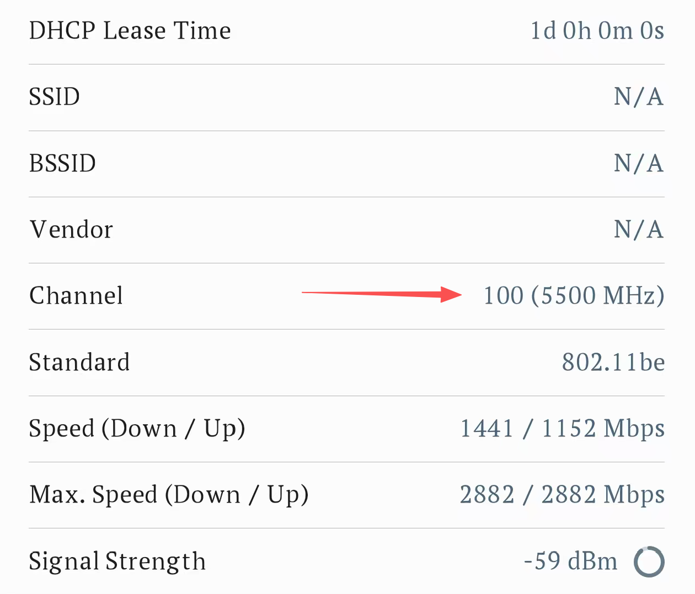
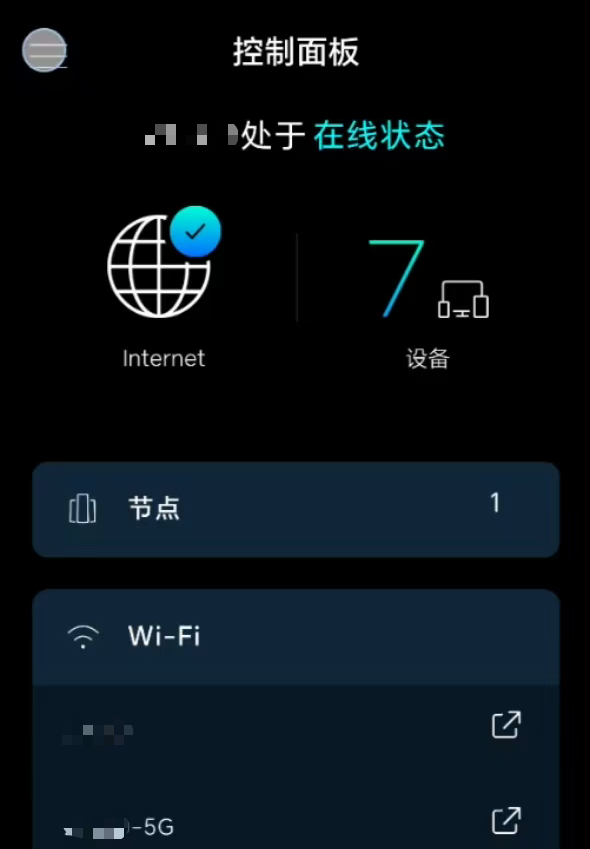
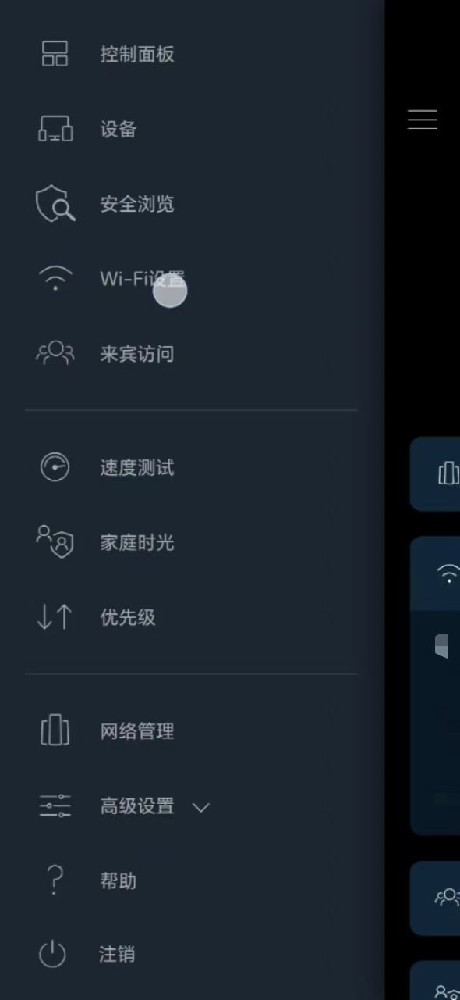
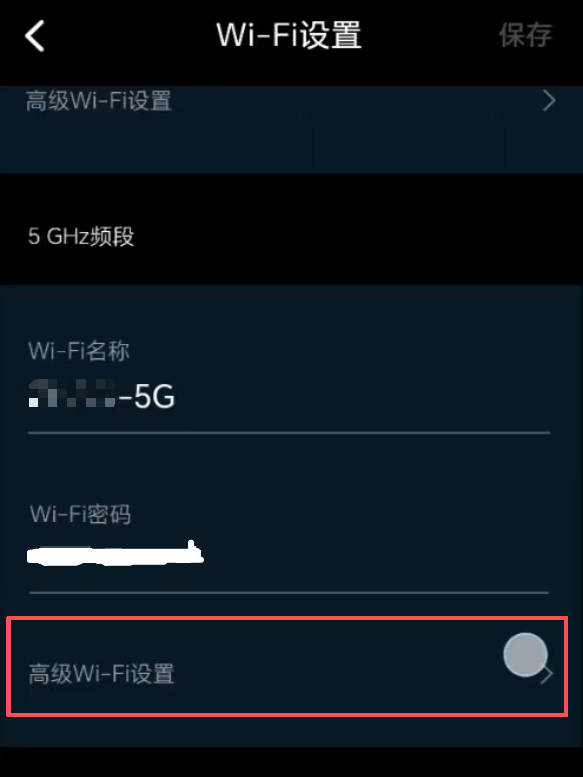
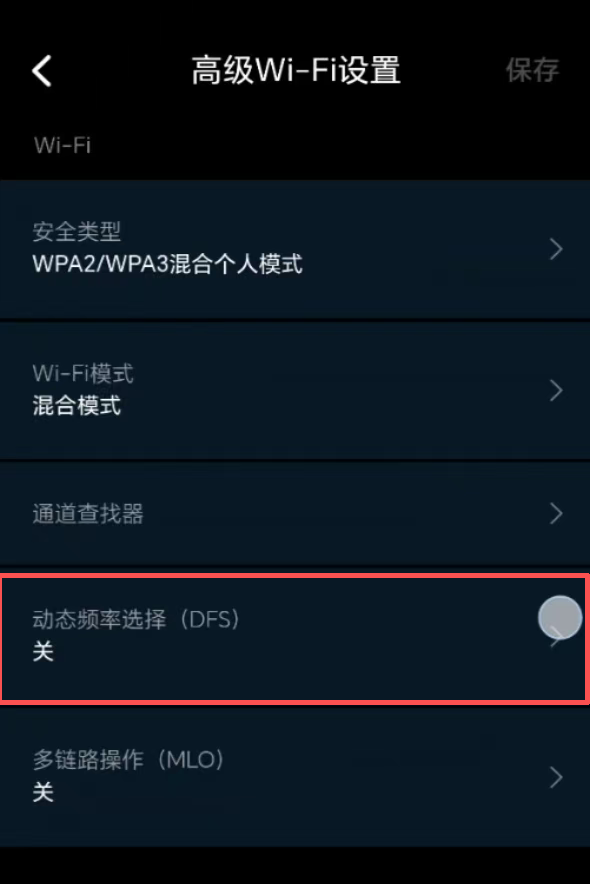
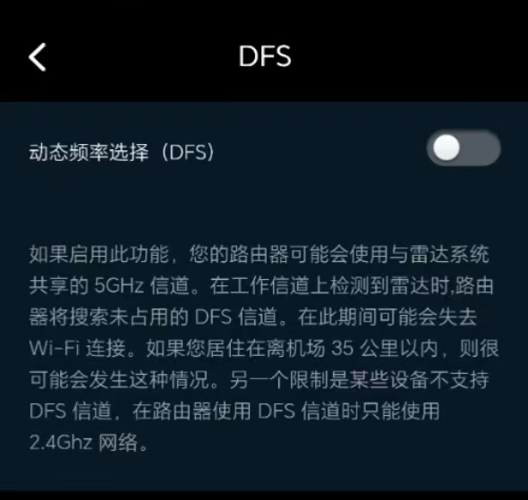
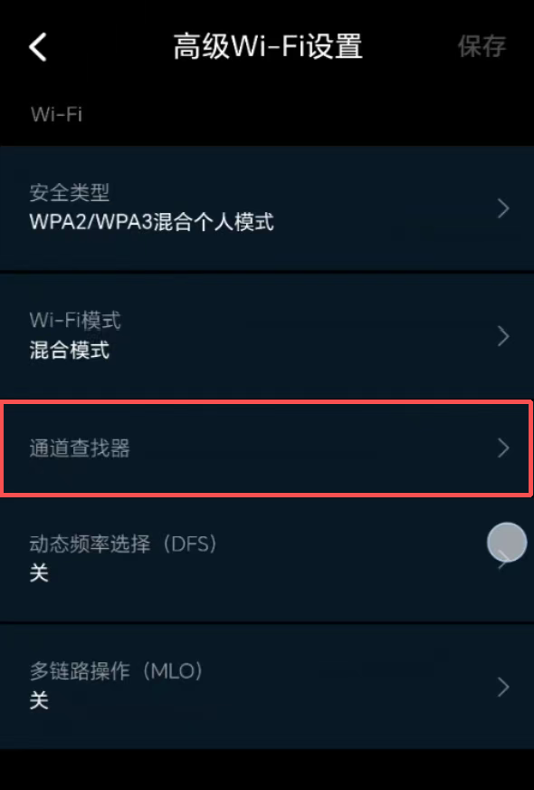

## 背景

我在香港和人合租的家中 WiFi 同时提供 2.4GHz 与 5GHz 两个频段（路由器型号是 Linksys Velop Pro 7），在浏览社交平台时（例如X, 微博等），我的手机会 *不定时* 出现图片加载缓慢症状。即便是尝试在路由器内设置了让自己手机优先的规则下依然存在该问题，于是在调回原设置之后想着改一下。

## 问题现象

我的手机默认连接的是 5GHz 频段，在浏览社交平台时（例如X, 微博等），我的手机会 *不定时* 出现图片加载缓慢症状，具体表现为：

- 视频可正常播放，仅图片加载慢（缩略图慢 / 点击大图长时加载）
- 用户头像疑似"不被缓存"，反复浏览同一用户也需重新加载

但是只要**手动切换频段**（2.4G ↔ 5G），问题就立即消失。

## 排查过程

在连接 5GHz 频段的前提下，我使用了 **Network Analyzer Lite** 进行分层测试：

| 测试项                                                                      | 结果                                          |
| ------------------------------------------------------------------------ | ------------------------------------------- |
| ping 网关 192.168.1.1                                                      | 0 丢包，延迟 14~32ms（有抖动，略偏高）                    |
| ping [www.weibo.com（36.51.224.123）](http://www.weibo.com（36.51.224.123）) | 正常，8~60ms                                   |
| ping ww1.sinaimg.cn（139.177.246.196）                                     | 正常，8~51ms                                   |
| ping [www.x.com（172.66.0.227）](http://www.x.com（172.66.0.227）)           | 正常，10~67ms                                  |
| WiFi 参数                                                                  | 802.11be，信号 -58/-59 dBm，协商速率 1441/1152 Mbps |
| DNS                                                                      | 192.168.1.1（路由器代理），无公网 IPv6                 |

通过尝试 `ping` 网关以判断局域网/信号质量，并通过 `ping` 公网 IP 以及解析并 `ping` 图片 CDN 域名以判断 DNS 与 CDN 路由及其外网连通性（以排除 DNS 因素）。

做了这一套操作之后，发现网络健康一切正常，DNS、链路、CDN 均无可疑点，但在 Info 页发现 5GHz 频段所使用的信道为 100（5500 MHz），查询发现该信道处于 DFS 信道。

## 根因定位

在当前环境下，5GHz 频段所使用的信道 100 （5500 MHz）属于**DFS 信道**，触发了雷达避让机制。

具体而言，5GHz 的 52~140 信道为 DFS 频段，法规要求 AP 检测到雷达信号时必须静默并切换信道，期间客户端传输会被挂起，就造成了不定时、无规律的卡顿。视频与图片的加载本身就是大量小请求，这些请求对链路抖动十分敏感，虽然视频在加载时有缓冲可掩盖抖动，但是图片仅会在点击大图时才会进行加载。这也就解释了为什么我会观测到"视频正常、图片卡"。而我通过切换频段使其强制重连（2.4G 为非 DFS 信道），这便是"切一下频段就好"的原因。

## 解决方案：关闭 DFS

该 Velop 系列的路由器不支持**手动**指定具体信道，因此在寻找之后决定直接"关闭 DFS"，具体操作如下：

Linksys App → 菜单 ☰

→ Wi-Fi 设置

→ 在高级 Wi-Fi 设置

→ 关闭 DFS

关闭后路由器只使用非 DFS 信道（36~48 / 149~165），这样就可以避免出现雷达避让的情况。

之后运行了一次 Channel Finder，使其在非 DFS 范围内自动选择干扰最小的信道：

最后其落地信道为 161（5805 MHz）

## 结论

问题本质是由于在当前环境下，5GHz 频段所使用的信道 100 （5500 MHz）属于**DFS 信道**，触发了雷达避让机制，导致了图片加载缓慢。
